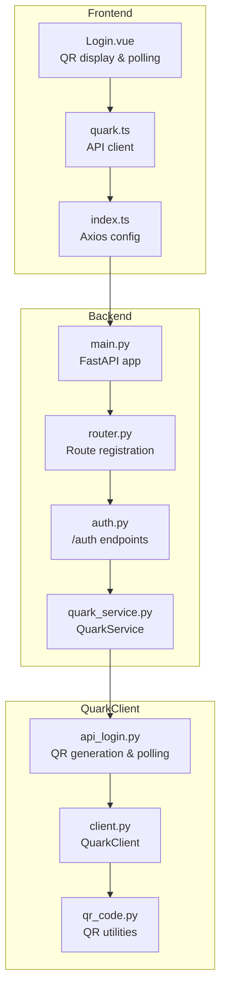
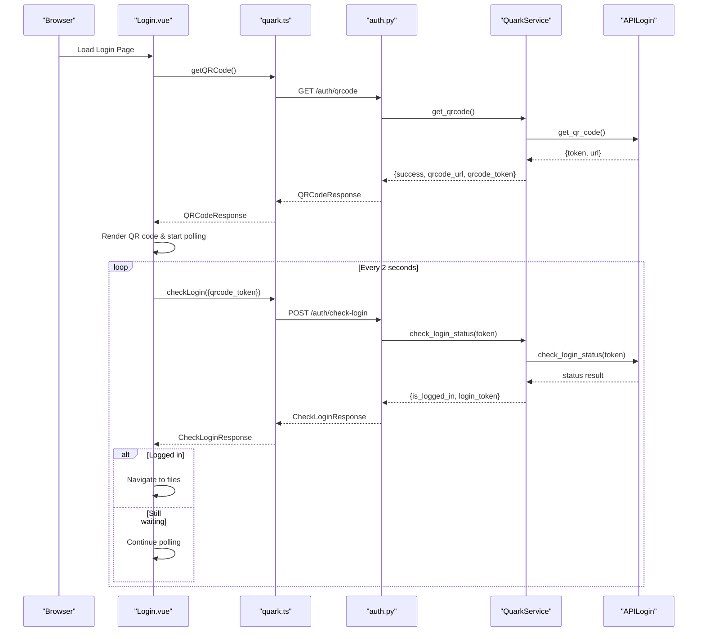
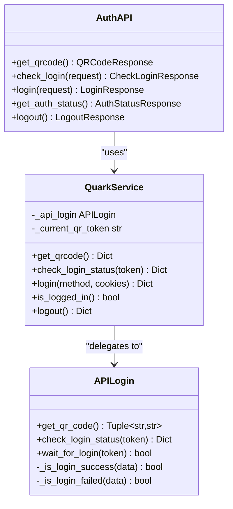
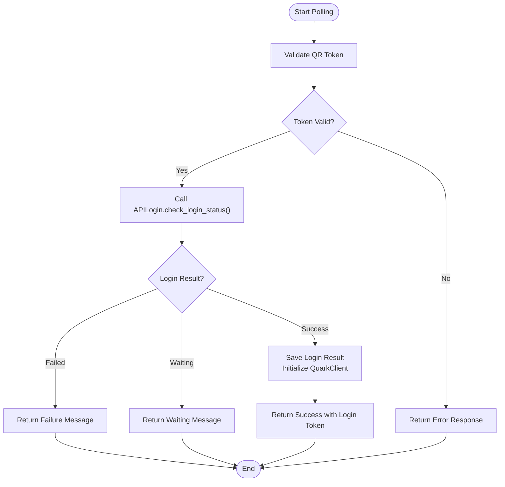
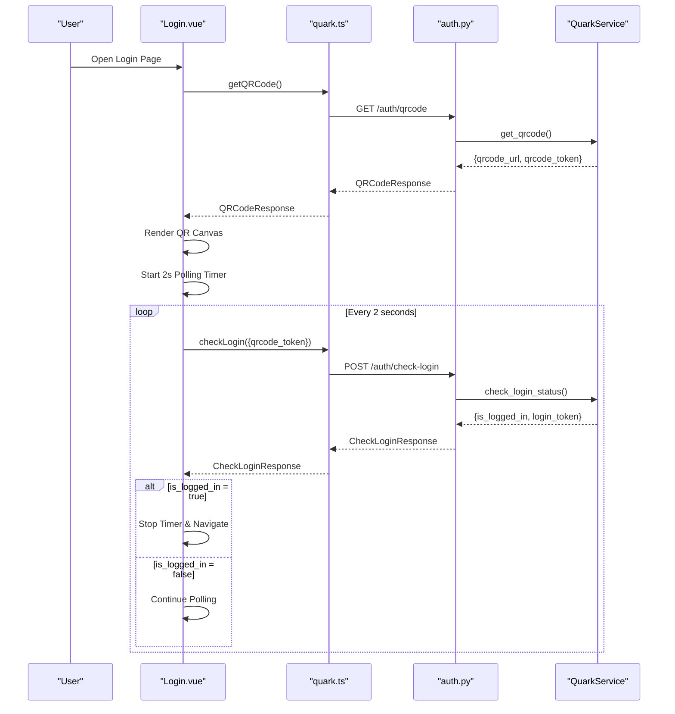
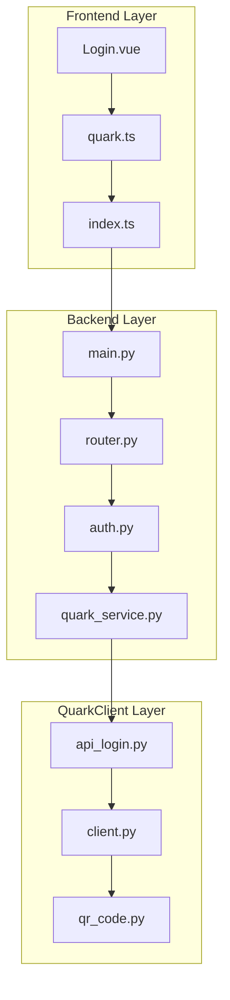

# QR Code Authentication

<cite>
**Referenced Files in This Document**
- [auth.py](file://backend/app/api/v1/auth.py)
- [quark_service.py](file://backend/app/services/quark_service.py)
- [auth.py](file://backend/app/schemas/auth.py)
- [router.py](file://backend/app/api/v1/router.py)
- [main.py](file://backend/app/main.py)
- [config.py](file://backend/app/core/config.py)
- [Login.vue](file://frontend/src/views/Login.vue)
- [quark.ts](file://frontend/src/api/quark.ts)
- [index.ts](file://frontend/src/api/index.ts)
- [api_login.py](file://quark_client/auth/api_login.py)
- [client.py](file://quark_client/client.py)
- [qr_code.py](file://quark_client/utils/qr_code.py)
- [test_qr.html](file://test_qr.html)
</cite>

## Table of Contents
1. [Introduction](#introduction)
2. [Project Structure](#project-structure)
3. [Core Components](#core-components)
4. [Architecture Overview](#architecture-overview)
5. [Detailed Component Analysis](#detailed-component-analysis)
6. [Dependency Analysis](#dependency-analysis)
7. [Performance Considerations](#performance-considerations)
8. [Troubleshooting Guide](#troubleshooting-guide)
9. [Security Considerations](#security-considerations)
10. [Conclusion](#conclusion)

## Introduction
This document provides comprehensive technical documentation for the QR code authentication implementation in the QuarkManager project. It covers the complete QR code login workflow, including QR generation, token-based polling, real-time status checking, frontend display, and backend service layer. It also details the QuarkClient API integration, error handling scenarios, and security considerations.

## Project Structure
The QR code authentication spans three main areas:
- Backend API endpoints for QR generation and status polling
- Backend service layer managing QR tokens and authentication flow
- Frontend Vue component rendering QR codes and polling for login status
- QuarkClient library integrating with the Quark Cloud APIs

**Diagram sources**
- [main.py:12-28](file://backend/app/main.py#L12-L28)
- [router.py:22-23](file://backend/app/api/v1/router.py#L22-L23)
- [auth.py:18-52](file://backend/app/api/v1/auth.py#L18-L52)
- [quark_service.py:54-159](file://backend/app/services/quark_service.py#L54-L159)
- [api_login.py:94-171](file://quark_client/auth/api_login.py#L94-L171)

**Section sources**
- [main.py:12-28](file://backend/app/main.py#L12-L28)
- [router.py:22-23](file://backend/app/api/v1/router.py#L22-L23)
- [auth.py:18-52](file://backend/app/api/v1/auth.py#L18-L52)
- [quark_service.py:54-159](file://backend/app/services/quark_service.py#L54-L159)
- [api_login.py:94-171](file://quark_client/auth/api_login.py#L94-L171)

## Core Components
The QR code authentication implementation consists of:
- Backend endpoints: `/auth/qrcode` for QR generation and `/auth/check-login` for status polling
- Service layer: QuarkService orchestrating QR token lifecycle and status checks
- Frontend component: Login.vue rendering QR codes and managing polling intervals
- QuarkClient integration: APILogin handling real API calls for QR generation and status verification

Key responsibilities:
- QR generation: Backend generates QR token and URL, returns both to frontend
- Polling mechanism: Frontend polls backend every 2 seconds until login completes or expires
- Status checking: Backend queries QuarkClient for login status and returns appropriate responses
- Session establishment: Successful authentication returns login token for subsequent requests

**Section sources**
- [auth.py:18-52](file://backend/app/api/v1/auth.py#L18-L52)
- [quark_service.py:54-159](file://backend/app/services/quark_service.py#L54-L159)
- [Login.vue:84-176](file://frontend/src/views/Login.vue#L84-L176)
- [api_login.py:255-307](file://quark_client/auth/api_login.py#L255-L307)

## Architecture Overview
The QR code authentication follows a token-based polling pattern:
1. Frontend requests QR code from backend
2. Backend generates QR token and URL via QuarkClient
3. Frontend renders QR code and starts polling
4. Frontend periodically calls backend status endpoint
5. Backend checks QuarkClient for login completion
6. On success, backend returns login token and sets up session

**Diagram sources**
- [auth.py:18-52](file://backend/app/api/v1/auth.py#L18-L52)
- [quark_service.py:54-159](file://backend/app/services/quark_service.py#L54-L159)
- [Login.vue:84-176](file://frontend/src/views/Login.vue#L84-L176)
- [api_login.py:255-307](file://quark_client/auth/api_login.py#L255-L307)

## Detailed Component Analysis

### Backend API Endpoints
The backend exposes two primary endpoints for QR code authentication:

#### QR Generation Endpoint (`/auth/qrcode`)
- Method: GET
- Purpose: Generate QR code and return token for polling
- Response: QRCodeResponse containing success flag, message, QR URL, and QR token
- Implementation: Calls QuarkService.get_qrcode() which delegates to APILogin.get_qr_code()

#### Status Checking Endpoint (`/auth/check-login`)
- Method: POST
- Purpose: Poll for login completion using QR token
- Request: CheckLoginRequest with qrcode_token
- Response: CheckLoginResponse with success flag, message, is_logged_in, and optional login_token
- Implementation: Calls QuarkService.check_login_status() which queries APILogin.check_login_status()

**Diagram sources**
- [auth.py:18-107](file://backend/app/api/v1/auth.py#L18-L107)
- [quark_service.py:23-388](file://backend/app/services/quark_service.py#L23-L388)
- [api_login.py:20-521](file://quark_client/auth/api_login.py#L20-L521)

**Section sources**
- [auth.py:18-52](file://backend/app/api/v1/auth.py#L18-L52)
- [auth.py:38-52](file://backend/app/api/v1/auth.py#L38-L52)
- [auth.py:78-96](file://backend/app/api/v1/auth.py#L78-L96)

### Service Layer Implementation
The QuarkService manages the complete QR authentication lifecycle:

#### QR Token Management
- Generates unique QR tokens using APILogin.get_qr_code()
- Stores current token for subsequent status checks
- Returns both token and URL to frontend for rendering and polling

#### Status Polling Logic
- Delegates to APILogin.check_login_status() for real API queries
- Handles three states: waiting, success, failure
- On success, extracts login token and initializes QuarkClient
- On failure, returns appropriate error messages

#### Session Establishment
- On successful authentication, saves login result
- Initializes QuarkClient with extracted cookies
- Sets internal logged-in state for subsequent operations

**Diagram sources**
- [quark_service.py:85-159](file://backend/app/services/quark_service.py#L85-L159)
- [api_login.py:255-307](file://quark_client/auth/api_login.py#L255-L307)

**Section sources**
- [quark_service.py:54-159](file://backend/app/services/quark_service.py#L54-L159)

### Frontend Implementation
The Login.vue component handles the complete user experience:

#### QR Display Component
- Uses qrcode library to render QR codes directly in canvas
- Supports loading states, error states, and success states
- Automatically generates QR code on component mount

#### Polling Interval Configuration
- Polls every 2 seconds using setInterval
- Stops polling on successful login or error
- Implements 5-minute timeout for QR expiration
- Clears timers on component unmount

#### User Feedback Mechanisms
- Loading indicators during QR generation
- Error messages for failures and timeouts
- Success notifications and automatic navigation
- Refresh button for regenerating QR codes

**Diagram sources**
- [Login.vue:84-176](file://frontend/src/views/Login.vue#L84-L176)
- [quark.ts:56-75](file://frontend/src/api/quark.ts#L56-L75)
- [auth.py:38-52](file://backend/app/api/v1/auth.py#L38-L52)

**Section sources**
- [Login.vue:84-176](file://frontend/src/views/Login.vue#L84-L176)
- [quark.ts:56-75](file://frontend/src/api/quark.ts#L56-L75)

### QuarkClient API Integration
The APILogin class provides the bridge to Quark Cloud APIs:

#### QR Generation
- Calls https://uop.quark.cn/cas/ajax/getTokenForQrcodeLogin
- Constructs QR URL with token, client_id, and other parameters
- Returns both token and URL for frontend consumption

#### Status Checking
- Polls https://uop.quark.cn/cas/ajax/getServiceTicketByQrcodeToken
- Checks response status codes and messages
- Determines login success/failure states
- Implements timeout handling

#### Real-time Features
- Provides countdown timer display for QR expiration
- Handles various failure scenarios (expired, invalid, timeout)
- Extracts service tickets and user information on success

**Section sources**
- [api_login.py:94-171](file://quark_client/auth/api_login.py#L94-L171)
- [api_login.py:255-307](file://quark_client/auth/api_login.py#L255-L307)
- [api_login.py:347-406](file://quark_client/auth/api_login.py#L347-L406)

## Dependency Analysis
The authentication system has clear layered dependencies:

**Diagram sources**
- [main.py:12-28](file://backend/app/main.py#L12-L28)
- [router.py:22-23](file://backend/app/api/v1/router.py#L22-L23)
- [auth.py:18-107](file://backend/app/api/v1/auth.py#L18-L107)
- [quark_service.py:23-388](file://backend/app/services/quark_service.py#L23-L388)
- [api_login.py:20-521](file://quark_client/auth/api_login.py#L20-L521)

**Section sources**
- [main.py:12-28](file://backend/app/main.py#L12-L28)
- [router.py:22-23](file://backend/app/api/v1/router.py#L22-L23)
- [auth.py:18-107](file://backend/app/api/v1/auth.py#L18-L107)
- [quark_service.py:23-388](file://backend/app/services/quark_service.py#L23-L388)
- [api_login.py:20-521](file://quark_client/auth/api_login.py#L20-L521)

## Performance Considerations
- Polling frequency: 2-second intervals balance responsiveness with server load
- Timeout handling: 5-minute QR expiration prevents resource leaks
- Caching: QR tokens are short-lived by design; no persistent caching needed
- Network efficiency: Minimal payload in polling requests reduces bandwidth usage
- Frontend cleanup: Proper timer cleanup prevents memory leaks

## Troubleshooting Guide

### Common Error Scenarios

#### QR Generation Failures
- Backend returns HTTP 400 with error message
- Frontend displays error state and provides retry button
- Check backend logs for specific error details

#### Polling Timeout
- After 5 minutes, polling automatically stops
- Frontend shows "QR expired" message
- User needs to refresh QR code

#### Authentication Failure
- Quark API returns failure status
- Frontend displays appropriate error message
- User should retry authentication

#### Network Issues
- Frontend shows connection error messages
- Backend health checks help diagnose connectivity problems

**Section sources**
- [Login.vue:134-176](file://frontend/src/views/Login.vue#L134-L176)
- [quark_service.py:79-83](file://backend/app/services/quark_service.py#L79-L83)
- [quark_service.py:154-159](file://backend/app/services/quark_service.py#L154-L159)

## Security Considerations

### QR Token Security
- Tokens are short-lived (5 minutes) to minimize exposure
- Tokens are transmitted only via HTTPS
- No sensitive data stored in tokens
- Frontend clears tokens on logout

### Polling Security
- Polling requests contain only QR token
- Backend validates token against active sessions
- Rate limiting should be considered for production deployments

### Session Management
- Successful authentication returns login token
- Frontend should store tokens securely (localStorage/sessionStorage)
- Backend should implement proper session validation
- Consider implementing CSRF protection for API endpoints

### API Integration Security
- QuarkClient uses secure HTTPS connections
- API keys and tokens are handled securely
- Response validation prevents injection attacks

## Conclusion
The QR code authentication implementation provides a robust, user-friendly authentication flow with clear separation of concerns between frontend, backend, and external API integrations. The token-based polling mechanism ensures reliable status checking while maintaining good performance characteristics. The modular design allows for easy maintenance and potential enhancements such as rate limiting, improved error handling, and additional security measures.