# CLI Interface System

<cite>
**Referenced Files in This Document**
- [__main__.py](file://quark_client/cli/__main__.py)
- [main.py](file://quark_client/cli/main.py)
- [interactive.py](file://quark_client/cli/interactive.py)
- [utils.py](file://quark_client/cli/utils.py)
- [client.py](file://quark_client/client.py)
- [auth.py](file://quark_client/cli/commands/auth.py)
- [basic_fileops.py](file://quark_client/cli/commands/basic_fileops.py)
- [search.py](file://quark_client/cli/commands/search.py)
- [share_commands.py](file://quark_client/cli/commands/share_commands.py)
- [batch_share_commands.py](file://quark_client/cli/commands/batch_share_commands.py)
- [download.py](file://quark_client/cli/commands/download.py)
- [move_commands.py](file://quark_client/cli/commands/move_commands.py)
- [config.py](file://quark_client/config.py)
- [logger.py](file://quark_client/utils/logger.py)
- [qr_code.py](file://quark_client/utils/qr_code.py)
</cite>

## Table of Contents
1. [Introduction](#introduction)
2. [Project Structure](#project-structure)
3. [Core Components](#core-components)
4. [Architecture Overview](#architecture-overview)
5. [Detailed Component Analysis](#detailed-component-analysis)
6. [Dependency Analysis](#dependency-analysis)
7. [Performance Considerations](#performance-considerations)
8. [Troubleshooting Guide](#troubleshooting-guide)
9. [Conclusion](#conclusion)
10. [Appendices](#appendices)

## Introduction
This document describes the CLI interface system for QuarkManager, focusing on the standalone command-line client and interactive shell. It explains the CLI architecture, command structure, argument parsing, configuration management, interactive shell functionality, available commands, batch processing capabilities, and utility functions for logging, progress reporting, and error handling. It also covers integration patterns between CLI commands, QuarkClient services, and backend API interactions, along with practical examples and guidance for advanced users.

## Project Structure
The CLI system is organized around a Typer-based main application with modular subcommands and an interactive shell. Supporting utilities provide client instantiation, formatting, error handling, and configuration defaults.

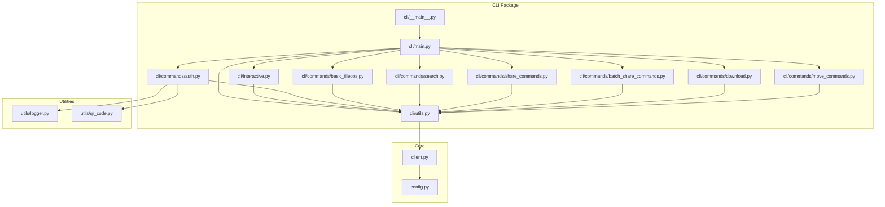

**Diagram sources**
- [__main__.py:1-10](file://quark_client/cli/__main__.py#L1-L10)
- [main.py:1-609](file://quark_client/cli/main.py#L1-L609)
- [interactive.py:1-1030](file://quark_client/cli/interactive.py#L1-L1030)
- [utils.py:1-273](file://quark_client/cli/utils.py#L1-L273)
- [client.py:1-405](file://quark_client/client.py#L1-L405)
- [auth.py:1-188](file://quark_client/cli/commands/auth.py#L1-L188)
- [basic_fileops.py:1-406](file://quark_client/cli/commands/basic_fileops.py#L1-L406)
- [search.py:1-214](file://quark_client/cli/commands/search.py#L1-L214)
- [share_commands.py:1-537](file://quark_client/cli/commands/share_commands.py#L1-L537)
- [batch_share_commands.py:1-275](file://quark_client/cli/commands/batch_share_commands.py#L1-L275)
- [download.py:1-262](file://quark_client/cli/commands/download.py#L1-L262)
- [move_commands.py:1-169](file://quark_client/cli/commands/move_commands.py#L1-L169)
- [config.py:1-63](file://quark_client/config.py#L1-L63)
- [logger.py:1-73](file://quark_client/utils/logger.py#L1-L73)
- [qr_code.py:1-46](file://quark_client/utils/qr_code.py#L1-L46)

**Section sources**
- [__main__.py:1-10](file://quark_client/cli/__main__.py#L1-L10)
- [main.py:1-609](file://quark_client/cli/main.py#L1-L609)

## Core Components
- Main CLI application: Typer-based application with subcommands and callbacks.
- Command modules: Modularized commands for authentication, file operations, search, sharing, downloads, and moving.
- Interactive shell: Rich-text driven interactive mode with command mapping and navigation.
- Utilities: Client creation, formatting helpers, error handling, and configuration defaults.
- Core client: QuarkClient orchestrating services for files, uploads, downloads, shares, and batch operations.

Key responsibilities:
- Argument parsing and validation via Typer decorators.
- Rich terminal output using Rich for tables, prompts, and progress bars.
- Integration with QuarkClient services for backend API interactions.
- Context management for client lifecycle and session handling.

**Section sources**
- [main.py:37-67](file://quark_client/cli/main.py#L37-L67)
- [interactive.py:23-72](file://quark_client/cli/interactive.py#L23-L72)
- [utils.py:17-273](file://quark_client/cli/utils.py#L17-L273)
- [client.py:18-405](file://quark_client/client.py#L18-L405)

## Architecture Overview
The CLI architecture follows a layered design:
- Presentation layer: Typer commands and interactive shell.
- Utility layer: Formatting, logging, configuration, and client helpers.
- Service layer: QuarkClient delegating to specialized services (files, upload, download, share, batch).
- Backend integration: QuarkAPIClient and service orchestration.

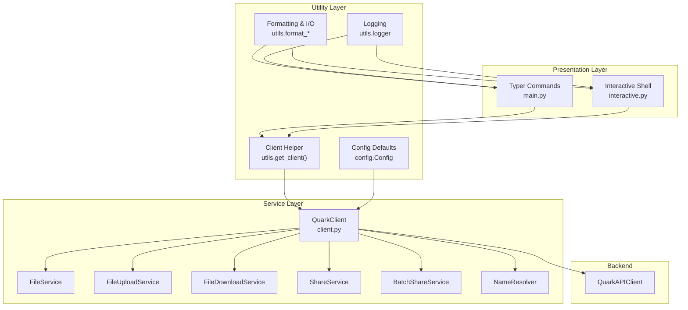

**Diagram sources**
- [main.py:1-609](file://quark_client/cli/main.py#L1-L609)
- [interactive.py:1-1030](file://quark_client/cli/interactive.py#L1-L1030)
- [utils.py:1-273](file://quark_client/cli/utils.py#L1-L273)
- [client.py:1-405](file://quark_client/client.py#L1-L405)
- [config.py:34-63](file://quark_client/config.py#L34-L63)

## Detailed Component Analysis

### CLI Application and Command Structure
- Entry point supports module invocation and direct execution.
- Main Typer app defines top-level commands and sub-applications (auth, search, download).
- Callback triggers interactive mode when no subcommand is provided.
- Rich markup and colored output enhance UX.

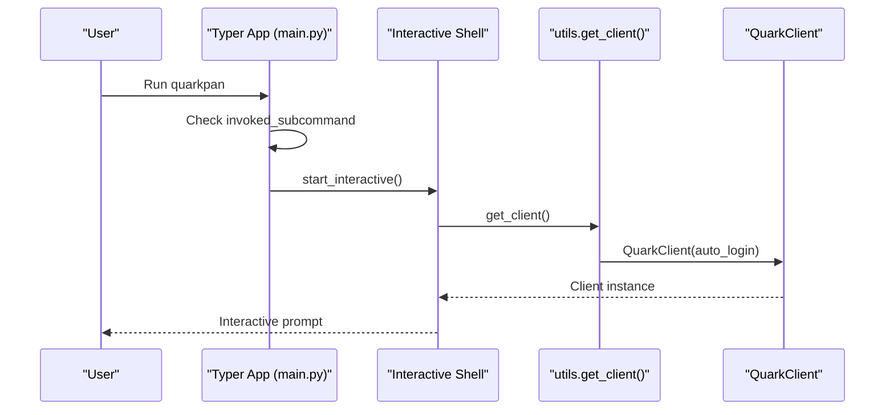

**Diagram sources**
- [__main__.py:1-10](file://quark_client/cli/__main__.py#L1-L10)
- [main.py:55-67](file://quark_client/cli/main.py#L55-L67)
- [interactive.py:74-146](file://quark_client/cli/interactive.py#L74-L146)
- [utils.py:17-24](file://quark_client/cli/utils.py#L17-L24)
- [client.py:21-42](file://quark_client/client.py#L21-L42)

**Section sources**
- [__main__.py:1-10](file://quark_client/cli/__main__.py#L1-L10)
- [main.py:37-67](file://quark_client/cli/main.py#L37-L67)

### Authentication Commands
- Sub-application under "auth" provides login, logout, status, and info.
- Supports multiple login methods and handles errors gracefully.
- Uses QR code utilities for login flow.

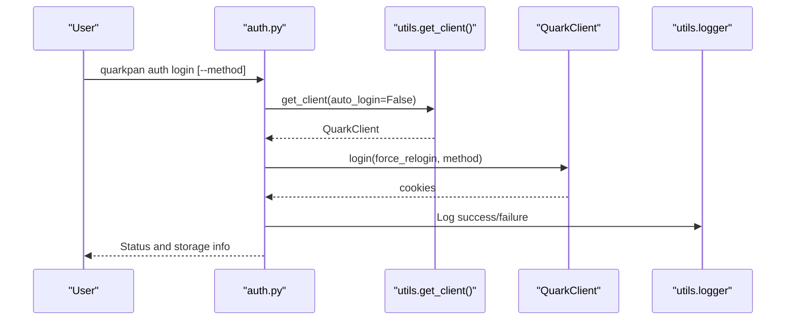

**Diagram sources**
- [auth.py:13-92](file://quark_client/cli/commands/auth.py#L13-L92)
- [utils.py:17-24](file://quark_client/cli/utils.py#L17-L24)
- [client.py:50-74](file://quark_client/client.py#L50-L74)
- [logger.py:12-73](file://quark_client/utils/logger.py#L12-L73)
- [qr_code.py:40-46](file://quark_client/utils/qr_code.py#L40-L46)

**Section sources**
- [auth.py:10-188](file://quark_client/cli/commands/auth.py#L10-L188)

### File Operations Commands
- Includes mkdir, rm, rename, fileinfo, browse, goto, upload, move, mv, move_to, ls, cd, status, version, info.
- Integrates with QuarkClient services for listing, resolving paths, uploading, moving, and getting file info.
- Rich output with tables and icons for better readability.

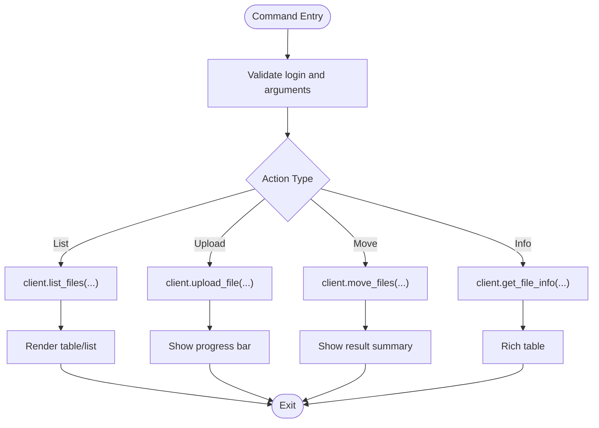

**Diagram sources**
- [main.py:75-282](file://quark_client/cli/main.py#L75-L282)
- [basic_fileops.py:14-406](file://quark_client/cli/commands/basic_fileops.py#L14-L406)
- [move_commands.py:13-169](file://quark_client/cli/commands/move_commands.py#L13-L169)

**Section sources**
- [main.py:75-282](file://quark_client/cli/main.py#L75-L282)
- [basic_fileops.py:14-406](file://quark_client/cli/commands/basic_fileops.py#L14-L406)
- [move_commands.py:13-169](file://quark_client/cli/commands/move_commands.py#L13-L169)

### Search Functionality
- Sub-application under "search" supports keyword search with optional filters (extensions, min/max size).
- Advanced search uses extended filters; otherwise falls back to basic search.
- Results rendered in rich tables with pagination support.

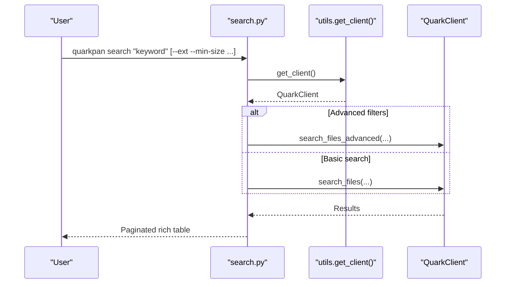

**Diagram sources**
- [search.py:20-178](file://quark_client/cli/commands/search.py#L20-L178)
- [utils.py:17-24](file://quark_client/cli/utils.py#L17-L24)
- [client.py:84-157](file://quark_client/client.py#L84-L157)

**Section sources**
- [search.py:16-214](file://quark_client/cli/commands/search.py#L16-L214)

### Download Commands
- Sub-application under "download" supports single file, multiple files, and folder downloads.
- Progress reporting via callbacks; rich output for completion and statistics.

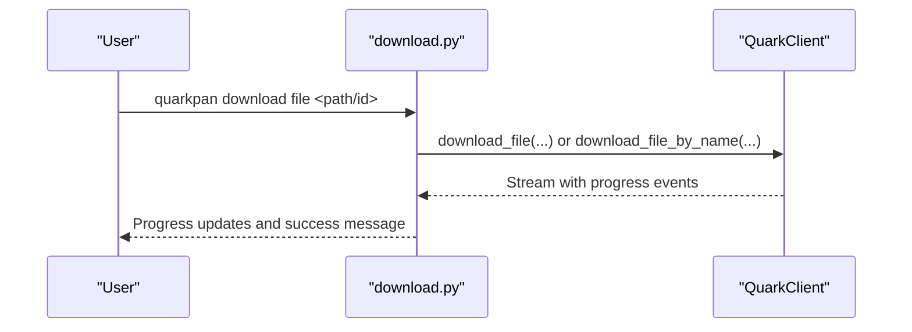

**Diagram sources**
- [download.py:26-82](file://quark_client/cli/commands/download.py#L26-L82)
- [client.py:96-144](file://quark_client/client.py#L96-L144)

**Section sources**
- [download.py:23-262](file://quark_client/cli/commands/download.py#L23-L262)

### Share Management Commands
- Commands for creating shares, listing my shares, saving shares, and batch-saving shares.
- Robust link extraction, deduplication, and validation utilities.
- Smart batch creation with progress callbacks and result summaries.

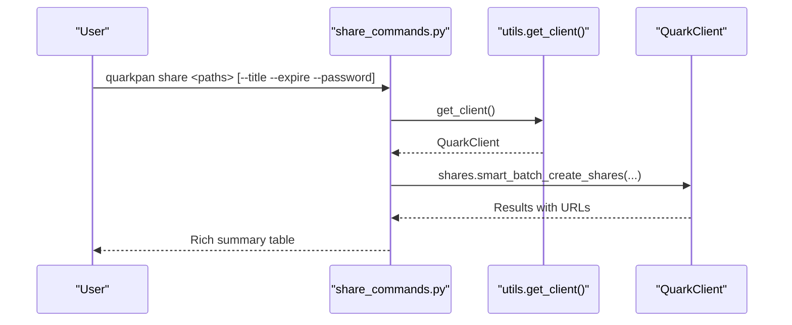

**Diagram sources**
- [share_commands.py:121-242](file://quark_client/cli/commands/share_commands.py#L121-L242)
- [utils.py:17-24](file://quark_client/cli/utils.py#L17-L24)
- [client.py:294-326](file://quark_client/client.py#L294-L326)

**Section sources**
- [share_commands.py:1-537](file://quark_client/cli/commands/share_commands.py#L1-L537)

### Batch Share Commands
- Collects target directories, optionally scans recursively, and creates share links.
- Exports results to CSV and provides previews.

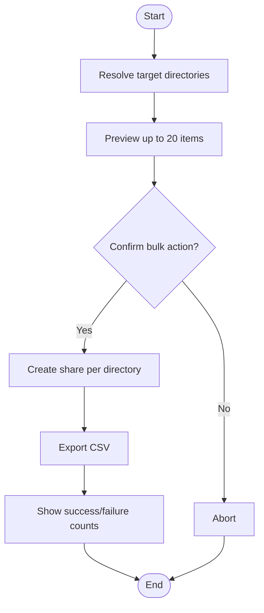

**Diagram sources**
- [batch_share_commands.py:15-221](file://quark_client/cli/commands/batch_share_commands.py#L15-L221)

**Section sources**
- [batch_share_commands.py:1-275](file://quark_client/cli/commands/batch_share_commands.py#L1-L275)

### Interactive Shell
- Rich-text driven shell with command mapping, directory stack, and path resolution.
- Provides help, navigation, search, upload, share, move, and status commands.
- Uses NameResolver for path-to-ID resolution and progress callbacks for long-running operations.

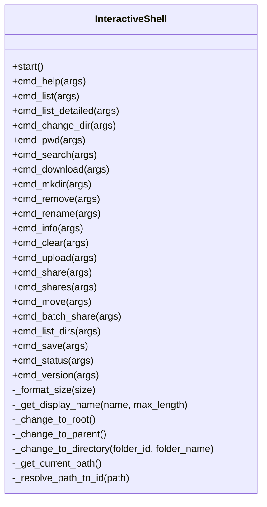

**Diagram sources**
- [interactive.py:23-1030](file://quark_client/cli/interactive.py#L23-L1030)

**Section sources**
- [interactive.py:23-1030](file://quark_client/cli/interactive.py#L23-L1030)

### Configuration Options
- Default HTTP headers and base URLs for API endpoints.
- Request timeouts, retry settings, pagination sizes, and download chunk sizes.
- Config directory resolution via environment variable or current working directory.

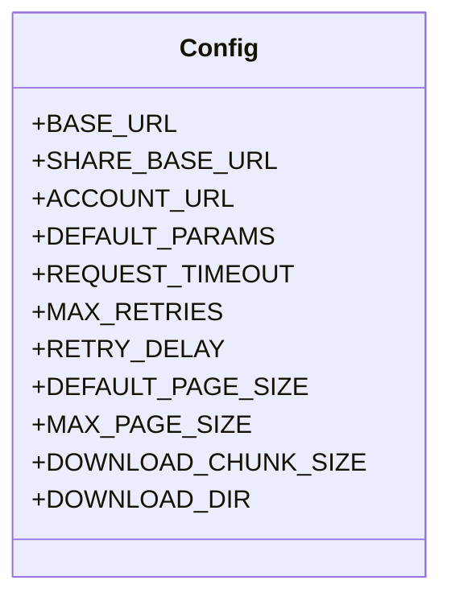

**Diagram sources**
- [config.py:34-63](file://quark_client/config.py#L34-L63)

**Section sources**
- [config.py:1-63](file://quark_client/config.py#L1-L63)

### CLI Utility Functions
- Client creation with automatic login option.
- Formatting helpers for file sizes, timestamps, and file type icons.
- Confirmation prompts and standardized output functions (success, warning, error, info).
- Error handling tailored to API responses (auth, network, capacity, share validity).
- Validation utilities for file IDs and text truncation.
- Folder navigation helpers for breadcrumb and path stack.

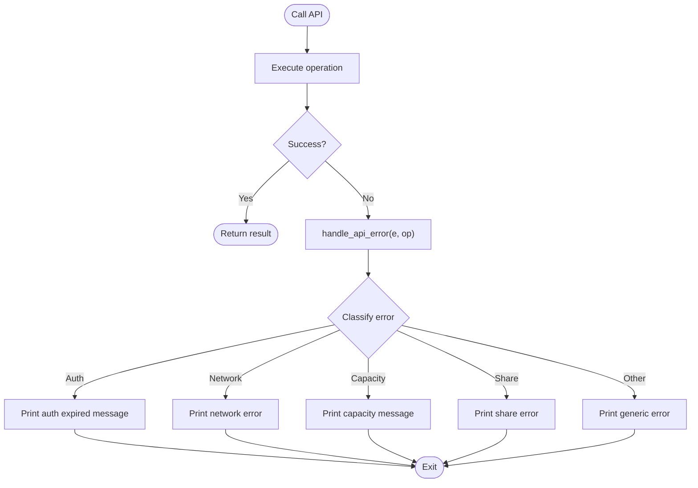

**Diagram sources**
- [utils.py:87-126](file://quark_client/cli/utils.py#L87-L126)

**Section sources**
- [utils.py:1-273](file://quark_client/cli/utils.py#L1-L273)

## Dependency Analysis
- CLI main depends on command modules and interactive shell.
- Commands depend on utilities for client creation and formatting.
- Interactive shell depends on command modules for delegated operations.
- QuarkClient aggregates services and integrates with QuarkAPIClient.
- Logging and QR utilities support authentication flows.

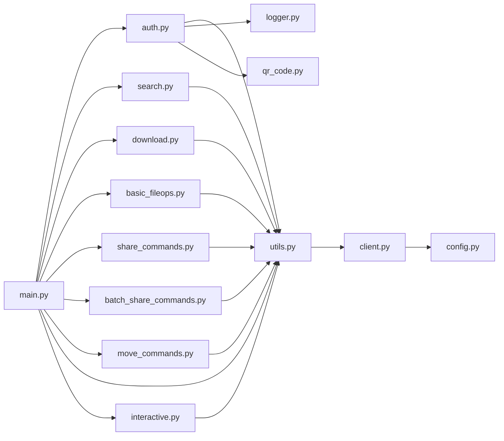

**Diagram sources**
- [main.py:1-609](file://quark_client/cli/main.py#L1-L609)
- [interactive.py:1-1030](file://quark_client/cli/interactive.py#L1-L1030)
- [utils.py:1-273](file://quark_client/cli/utils.py#L1-L273)
- [client.py:1-405](file://quark_client/client.py#L1-L405)
- [config.py:1-63](file://quark_client/config.py#L1-L63)
- [logger.py:1-73](file://quark_client/utils/logger.py#L1-L73)
- [qr_code.py:1-46](file://quark_client/utils/qr_code.py#L1-L46)

**Section sources**
- [main.py:1-609](file://quark_client/cli/main.py#L1-L609)
- [client.py:1-405](file://quark_client/client.py#L1-L405)

## Performance Considerations
- Use pagination for listing and search operations to avoid large payloads.
- Prefer batch operations where supported (e.g., batch share creation, batch save shares) to reduce API round trips.
- Enable progress reporting for long-running operations to improve perceived performance.
- Limit concurrent operations to avoid overwhelming the backend or local resources.
- Cache frequently accessed file names via NameResolver to minimize repeated lookups.

## Troubleshooting Guide
Common issues and resolutions:
- Authentication failures: Re-login using the auth subcommands; verify network connectivity.
- File not found or invalid path: Ensure correct path or use file IDs; verify permissions.
- Capacity exceeded: Free up space or upgrade storage; check quota via status.
- Share expired or invalid: Recreate share or update expiration; verify link format.
- Network errors: Retry after checking connection stability.

Diagnostic steps:
- Use status command to verify login and storage usage.
- Enable verbose logs if needed and review error messages.
- Validate file IDs and paths before executing destructive operations.

**Section sources**
- [utils.py:87-126](file://quark_client/cli/utils.py#L87-L126)
- [main.py:292-345](file://quark_client/cli/main.py#L292-L345)

## Conclusion
The QuarkManager CLI provides a comprehensive, user-friendly interface for interacting with the Quark Cloud Drive. Its modular design, rich UX, robust error handling, and integration with QuarkClient services enable efficient file management, search, sharing, and batch operations. The interactive shell further enhances usability for exploratory workflows, while utilities ensure consistent formatting, logging, and configuration.

## Appendices

### Practical Examples
- Login and status checks:
  - quarkpan auth login
  - quarkpan status
- Listing and navigating:
  - quarkpan ls --details
  - quarkpan cd <folder_id>
- File operations:
  - quarkpan mkdir "New Folder"
  - quarkpan rename "Old Name" "New Name"
  - quarkpan rm "file.txt" --force
- Upload and download:
  - quarkpan upload "document.pdf" --parent "folder_id"
  - quarkpan download file "<file_id>" --output "./downloads"
- Search:
  - quarkpan search "project" --ext pdf --min-size 1MB
- Share management:
  - quarkpan share "folder/" --title "Project" --expire 7
  - quarkpan shares --page 1 --size 20
  - quarkpan save "<share_url>"
- Batch operations:
  - quarkpan batch-share --target-dir "/Archive" --depth 2 --share-level both
  - quarkpan batch-save "<url1>" "<url2>" --folder "/Saved" --wait

### Automation Scripts
- Scripting workflows:
  - Chain commands in shell scripts for nightly backups or periodic cleanup.
  - Use batch-share to generate share links for shared directories.
  - Use batch-save to consolidate shared content into personal folders.
- Scheduled operations:
  - Combine with cron or task schedulers to automate recurring tasks.
  - Validate status and handle errors in scripts for reliability.

### Extending CLI Functionality
- Add new commands by creating modules under cli/commands and registering them in main.py.
- Integrate new QuarkClient methods by adding service wrappers and exposing them as commands.
- Enhance interactive shell by adding new commands in interactive.py and mapping them in the command dictionary.
- Improve error handling and logging by leveraging existing utilities in utils.py and logger.py.