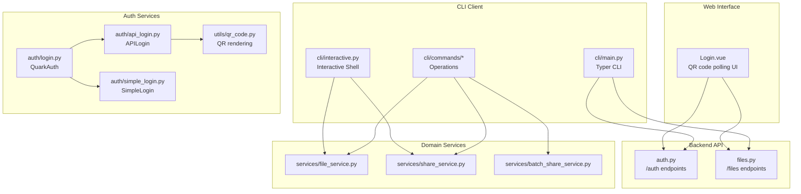
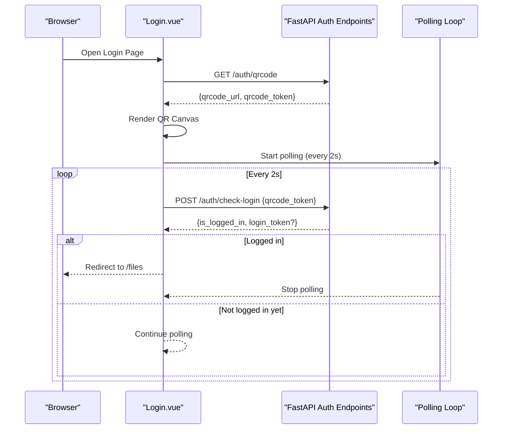
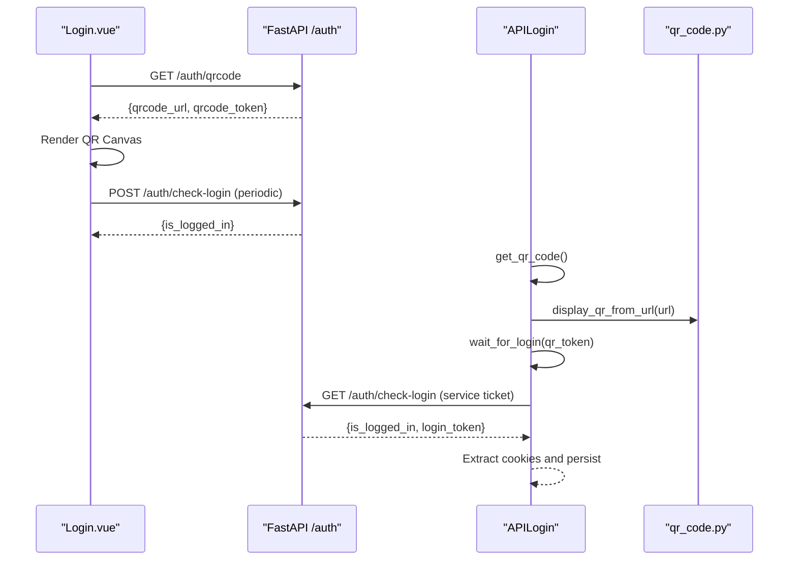
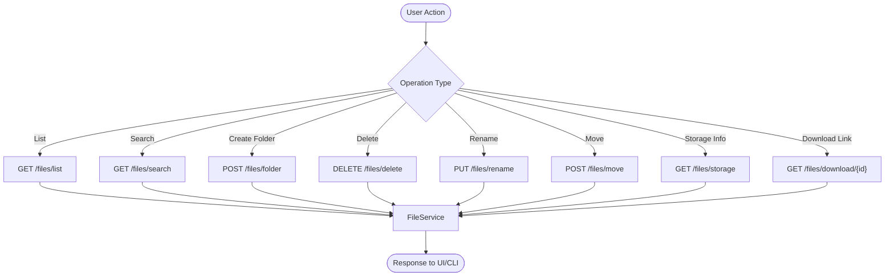
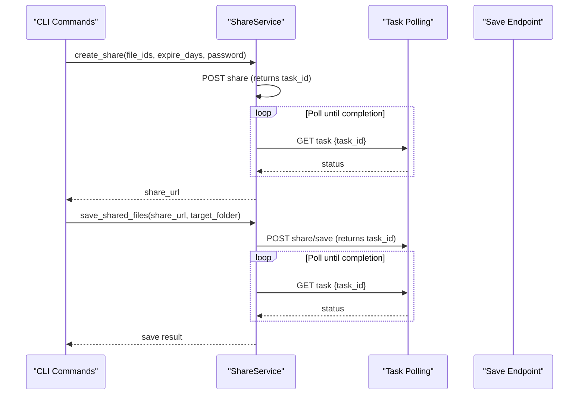
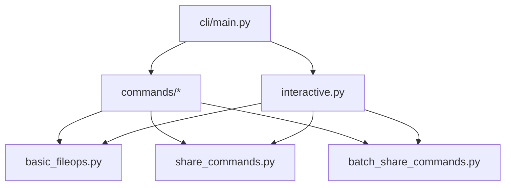
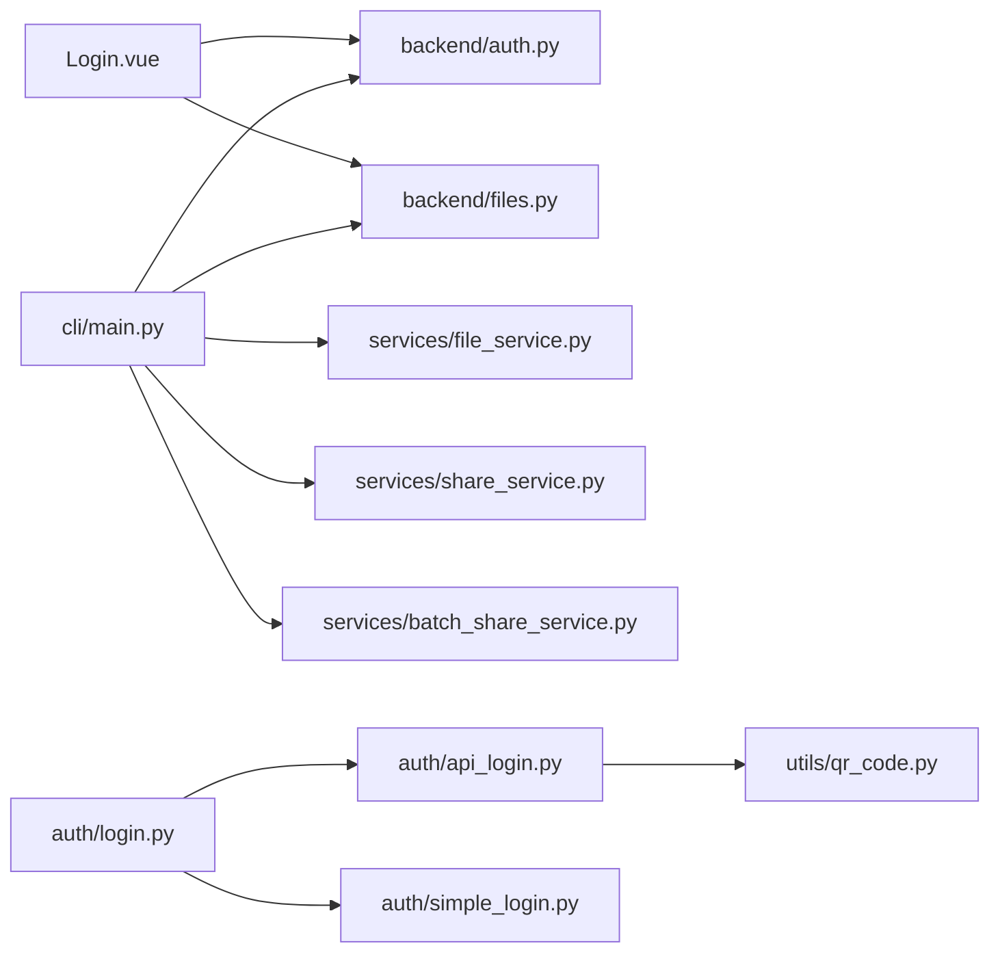

# Core Features

<cite>
**Referenced Files in This Document**
- [backend/app/api/v1/auth.py](file://backend/app/api/v1/auth.py)
- [backend/app/api/v1/files.py](file://backend/app/api/v1/files.py)
- [frontend/src/views/Login.vue](file://frontend/src/views/Login.vue)
- [quark_client/auth/login.py](file://quark_client/auth/login.py)
- [quark_client/auth/api_login.py](file://quark_client/auth/api_login.py)
- [quark_client/auth/simple_login.py](file://quark_client/auth/simple_login.py)
- [quark_client/utils/qr_code.py](file://quark_client/utils/qr_code.py)
- [quark_client/services/file_service.py](file://quark_client/services/file_service.py)
- [quark_client/services/share_service.py](file://quark_client/services/share_service.py)
- [quark_client/services/batch_share_service.py](file://quark_client/services/batch_share_service.py)
- [quark_client/cli/main.py](file://quark_client/cli/main.py)
- [quark_client/cli/commands/basic_fileops.py](file://quark_client/cli/commands/basic_fileops.py)
- [quark_client/cli/commands/share_commands.py](file://quark_client/cli/commands/share_commands.py)
- [quark_client/cli/commands/batch_share_commands.py](file://quark_client/cli/commands/batch_share_commands.py)
- [quark_client/cli/interactive.py](file://quark_client/cli/interactive.py)
</cite>

## Table of Contents
1. [Introduction](#introduction)
2. [Project Structure](#project-structure)
3. [Core Components](#core-components)
4. [Architecture Overview](#architecture-overview)
5. [Detailed Component Analysis](#detailed-component-analysis)
6. [Dependency Analysis](#dependency-analysis)
7. [Performance Considerations](#performance-considerations)
8. [Troubleshooting Guide](#troubleshooting-guide)
9. [Conclusion](#conclusion)
10. [Appendices](#appendices)

## Introduction
This document describes the core features of QuarkManager, focusing on the complete feature set and user workflows. It covers:
- Authentication system: QR code login with real-time polling, cookie-based authentication, and session management
- File management: browsing, CRUD operations, bulk operations, search/filtering, and storage information
- Share management: creating share links, expiration/password controls, batch processing, and saving shared content to personal storage
- CLI interface: command-line operations, interactive shell, and batch processing
- Integration patterns among the web interface, CLI client, and backend services
- Practical workflow examples and feature limitations/performance considerations

## Project Structure
QuarkManager is organized into three primary layers:
- Backend (FastAPI): exposes REST APIs for authentication, file management, and share operations
- Frontend (Vue + Element Plus): provides a browser-based login and file management UI
- CLI client (Python): offers command-line and interactive modes for automation and scripting

**Diagram sources**
- [frontend/src/views/Login.vue:1-290](file://frontend/src/views/Login.vue#L1-L290)
- [backend/app/api/v1/auth.py:1-107](file://backend/app/api/v1/auth.py#L1-L107)
- [backend/app/api/v1/files.py:1-150](file://backend/app/api/v1/files.py#L1-L150)
- [quark_client/cli/main.py:1-609](file://quark_client/cli/main.py#L1-L609)
- [quark_client/cli/interactive.py:1-800](file://quark_client/cli/interactive.py#L1-L800)
- [quark_client/auth/login.py:1-301](file://quark_client/auth/login.py#L1-L301)
- [quark_client/auth/api_login.py:1-521](file://quark_client/auth/api_login.py#L1-L521)
- [quark_client/auth/simple_login.py:1-249](file://quark_client/auth/simple_login.py#L1-L249)
- [quark_client/utils/qr_code.py:1-46](file://quark_client/utils/qr_code.py#L1-L46)
- [quark_client/services/file_service.py:1-893](file://quark_client/services/file_service.py#L1-L893)
- [quark_client/services/share_service.py:1-742](file://quark_client/services/share_service.py#L1-L742)
- [quark_client/services/batch_share_service.py:1-572](file://quark_client/services/batch_share_service.py#L1-L572)

**Section sources**
- [backend/app/api/v1/auth.py:1-107](file://backend/app/api/v1/auth.py#L1-L107)
- [backend/app/api/v1/files.py:1-150](file://backend/app/api/v1/files.py#L1-L150)
- [frontend/src/views/Login.vue:1-290](file://frontend/src/views/Login.vue#L1-L290)
- [quark_client/auth/login.py:1-301](file://quark_client/auth/login.py#L1-L301)
- [quark_client/auth/api_login.py:1-521](file://quark_client/auth/api_login.py#L1-L521)
- [quark_client/auth/simple_login.py:1-249](file://quark_client/auth/simple_login.py#L1-L249)
- [quark_client/utils/qr_code.py:1-46](file://quark_client/utils/qr_code.py#L1-L46)
- [quark_client/services/file_service.py:1-893](file://quark_client/services/file_service.py#L1-L893)
- [quark_client/services/share_service.py:1-742](file://quark_client/services/share_service.py#L1-L742)
- [quark_client/services/batch_share_service.py:1-572](file://quark_client/services/batch_share_service.py#L1-L572)
- [quark_client/cli/main.py:1-609](file://quark_client/cli/main.py#L1-L609)
- [quark_client/cli/commands/basic_fileops.py:1-406](file://quark_client/cli/commands/basic_fileops.py#L1-L406)
- [quark_client/cli/commands/share_commands.py:1-537](file://quark_client/cli/commands/share_commands.py#L1-L537)
- [quark_client/cli/commands/batch_share_commands.py:1-275](file://quark_client/cli/commands/batch_share_commands.py#L1-L275)
- [quark_client/cli/interactive.py:1-800](file://quark_client/cli/interactive.py#L1-L800)

## Core Components
- Authentication subsystem: QR code generation and polling, cookie-based login, and session persistence
- File management domain: listing, search, CRUD, move/rename/delete, and storage info
- Share management domain: create share links, manage expiration/password, batch share, and save shared content
- CLI subsystem: command-line commands, interactive shell, and batch processing orchestration
- Integration: frontend Vue components call backend REST endpoints; CLI client invokes backend APIs and domain services

**Section sources**
- [backend/app/api/v1/auth.py:1-107](file://backend/app/api/v1/auth.py#L1-L107)
- [backend/app/api/v1/files.py:1-150](file://backend/app/api/v1/files.py#L1-L150)
- [frontend/src/views/Login.vue:1-290](file://frontend/src/views/Login.vue#L1-L290)
- [quark_client/auth/login.py:1-301](file://quark_client/auth/login.py#L1-L301)
- [quark_client/services/file_service.py:1-893](file://quark_client/services/file_service.py#L1-L893)
- [quark_client/services/share_service.py:1-742](file://quark_client/services/share_service.py#L1-L742)
- [quark_client/cli/main.py:1-609](file://quark_client/cli/main.py#L1-L609)

## Architecture Overview
The system integrates a Vue frontend, a FastAPI backend, and a Python CLI client. The frontend authenticates via QR code polling against backend endpoints, while the CLI supports both QR and cookie-based login flows backed by domain services.

**Diagram sources**
- [frontend/src/views/Login.vue:84-176](file://frontend/src/views/Login.vue#L84-L176)
- [backend/app/api/v1/auth.py:18-52](file://backend/app/api/v1/auth.py#L18-L52)

**Section sources**
- [frontend/src/views/Login.vue:1-290](file://frontend/src/views/Login.vue#L1-L290)
- [backend/app/api/v1/auth.py:1-107](file://backend/app/api/v1/auth.py#L1-L107)

## Detailed Component Analysis

### Authentication System
- QR code login (web)
  - Frontend requests QR code and token from backend
  - Renders QR canvas and starts polling to check login status
  - Stops polling upon success or expiry
- QR code login (CLI)
  - CLI obtains QR token and URL, displays ASCII QR, waits for service ticket, extracts cookies
- Cookie-based login (CLI)
  - Manual cookie input flow with validation and persistence
- Session management
  - Cookies persisted locally and validated before reuse
  - Backend exposes status and logout endpoints

**Diagram sources**
- [frontend/src/views/Login.vue:84-176](file://frontend/src/views/Login.vue#L84-L176)
- [backend/app/api/v1/auth.py:18-52](file://backend/app/api/v1/auth.py#L18-L52)
- [quark_client/auth/api_login.py:94-521](file://quark_client/auth/api_login.py#L94-L521)
- [quark_client/utils/qr_code.py:40-46](file://quark_client/utils/qr_code.py#L40-L46)
- [quark_client/auth/login.py:107-294](file://quark_client/auth/login.py#L107-L294)
- [quark_client/auth/simple_login.py:1-249](file://quark_client/auth/simple_login.py#L1-L249)

**Section sources**
- [frontend/src/views/Login.vue:1-290](file://frontend/src/views/Login.vue#L1-L290)
- [backend/app/api/v1/auth.py:1-107](file://backend/app/api/v1/auth.py#L1-L107)
- [quark_client/auth/api_login.py:1-521](file://quark_client/auth/api_login.py#L1-L521)
- [quark_client/auth/login.py:1-301](file://quark_client/auth/login.py#L1-L301)
- [quark_client/auth/simple_login.py:1-249](file://quark_client/auth/simple_login.py#L1-L249)
- [quark_client/utils/qr_code.py:1-46](file://quark_client/utils/qr_code.py#L1-L46)

### File Management
- Backend endpoints
  - List files, create folder, delete, rename, move, search, storage info, download URL
- CLI operations
  - Create folder, delete by path or ID, rename, get file info, upload, list, search, download link
- Domain service
  - FileService encapsulates API calls, pagination, filtering, path resolution, and download helpers

**Diagram sources**
- [backend/app/api/v1/files.py:1-150](file://backend/app/api/v1/files.py#L1-L150)
- [quark_client/services/file_service.py:1-893](file://quark_client/services/file_service.py#L1-L893)
- [quark_client/cli/commands/basic_fileops.py:1-406](file://quark_client/cli/commands/basic_fileops.py#L1-L406)

**Section sources**
- [backend/app/api/v1/files.py:1-150](file://backend/app/api/v1/files.py#L1-L150)
- [quark_client/services/file_service.py:1-893](file://quark_client/services/file_service.py#L1-L893)
- [quark_client/cli/commands/basic_fileops.py:1-406](file://quark_client/cli/commands/basic_fileops.py#L1-L406)

### Share Management
- Backend endpoints
  - Share creation, list my shares, delete share, task polling
- CLI operations
  - Create share, list shares, save share, batch save
- Domain service
  - ShareService orchestrates share creation, parsing URLs, token acquisition, fetching share info, saving shared files, and batch operations
- Batch share service
  - Scans directories, collects targets, creates shares, exports CSV

**Diagram sources**
- [quark_client/services/share_service.py:75-153](file://quark_client/services/share_service.py#L75-L153)
- [quark_client/services/share_service.py:313-376](file://quark_client/services/share_service.py#L313-L376)
- [quark_client/cli/commands/share_commands.py:121-242](file://quark_client/cli/commands/share_commands.py#L121-L242)
- [quark_client/cli/commands/share_commands.py:342-418](file://quark_client/cli/commands/share_commands.py#L342-L418)

**Section sources**
- [quark_client/services/share_service.py:1-742](file://quark_client/services/share_service.py#L1-L742)
- [quark_client/cli/commands/share_commands.py:1-537](file://quark_client/cli/commands/share_commands.py#L1-L537)
- [quark_client/services/batch_share_service.py:1-572](file://quark_client/services/batch_share_service.py#L1-L572)
- [quark_client/cli/commands/batch_share_commands.py:1-275](file://quark_client/cli/commands/batch_share_commands.py#L1-L275)

### CLI Interface
- Command structure
  - Typer-based CLI with subcommands for auth, search, download, file ops, shares, batch share, move, and status
- Interactive shell
  - Rich TUI with commands for listing, searching, uploading, downloading, sharing, moving, and batch operations
- Batch processing
  - Batch share scanning, CSV export, and batch save with progress callbacks

**Diagram sources**
- [quark_client/cli/main.py:1-609](file://quark_client/cli/main.py#L1-L609)
- [quark_client/cli/commands/basic_fileops.py:1-406](file://quark_client/cli/commands/basic_fileops.py#L1-L406)
- [quark_client/cli/commands/share_commands.py:1-537](file://quark_client/cli/commands/share_commands.py#L1-L537)
- [quark_client/cli/commands/batch_share_commands.py:1-275](file://quark_client/cli/commands/batch_share_commands.py#L1-L275)
- [quark_client/cli/interactive.py:1-800](file://quark_client/cli/interactive.py#L1-L800)

**Section sources**
- [quark_client/cli/main.py:1-609](file://quark_client/cli/main.py#L1-L609)
- [quark_client/cli/commands/basic_fileops.py:1-406](file://quark_client/cli/commands/basic_fileops.py#L1-L406)
- [quark_client/cli/commands/share_commands.py:1-537](file://quark_client/cli/commands/share_commands.py#L1-L537)
- [quark_client/cli/commands/batch_share_commands.py:1-275](file://quark_client/cli/commands/batch_share_commands.py#L1-L275)
- [quark_client/cli/interactive.py:1-800](file://quark_client/cli/interactive.py#L1-L800)

## Dependency Analysis
- Frontend depends on backend REST endpoints for authentication and file operations
- CLI client depends on domain services and backend endpoints
- Authentication services depend on QR utilities and backend auth endpoints
- File and share services encapsulate backend API calls and task polling

**Diagram sources**
- [frontend/src/views/Login.vue:1-290](file://frontend/src/views/Login.vue#L1-L290)
- [backend/app/api/v1/auth.py:1-107](file://backend/app/api/v1/auth.py#L1-L107)
- [backend/app/api/v1/files.py:1-150](file://backend/app/api/v1/files.py#L1-L150)
- [quark_client/cli/main.py:1-609](file://quark_client/cli/main.py#L1-L609)
- [quark_client/auth/login.py:1-301](file://quark_client/auth/login.py#L1-L301)
- [quark_client/auth/api_login.py:1-521](file://quark_client/auth/api_login.py#L1-L521)
- [quark_client/auth/simple_login.py:1-249](file://quark_client/auth/simple_login.py#L1-L249)
- [quark_client/utils/qr_code.py:1-46](file://quark_client/utils/qr_code.py#L1-L46)
- [quark_client/services/file_service.py:1-893](file://quark_client/services/file_service.py#L1-L893)
- [quark_client/services/share_service.py:1-742](file://quark_client/services/share_service.py#L1-L742)
- [quark_client/services/batch_share_service.py:1-572](file://quark_client/services/batch_share_service.py#L1-L572)

**Section sources**
- [frontend/src/views/Login.vue:1-290](file://frontend/src/views/Login.vue#L1-L290)
- [backend/app/api/v1/auth.py:1-107](file://backend/app/api/v1/auth.py#L1-L107)
- [backend/app/api/v1/files.py:1-150](file://backend/app/api/v1/files.py#L1-L150)
- [quark_client/cli/main.py:1-609](file://quark_client/cli/main.py#L1-L609)
- [quark_client/auth/login.py:1-301](file://quark_client/auth/login.py#L1-L301)
- [quark_client/auth/api_login.py:1-521](file://quark_client/auth/api_login.py#L1-L521)
- [quark_client/auth/simple_login.py:1-249](file://quark_client/auth/simple_login.py#L1-L249)
- [quark_client/utils/qr_code.py:1-46](file://quark_client/utils/qr_code.py#L1-L46)
- [quark_client/services/file_service.py:1-893](file://quark_client/services/file_service.py#L1-L893)
- [quark_client/services/share_service.py:1-742](file://quark_client/services/share_service.py#L1-L742)
- [quark_client/services/batch_share_service.py:1-572](file://quark_client/services/batch_share_service.py#L1-L572)

## Performance Considerations
- Real-time polling
  - Frontend polls every 2 seconds; backend returns immediate status or continues waiting
  - Consider adjusting polling interval and adding exponential backoff for failures
- Task-based operations
  - Share creation and save operations use task polling; tune intervals and timeouts per workload
- Pagination and search
  - Backend enforces page size limits; clients should respect bounds and implement efficient pagination
- Download streaming
  - File downloads should stream to avoid memory pressure; progress callbacks improve UX

[No sources needed since this section provides general guidance]

## Troubleshooting Guide
- Authentication
  - QR code expired: regenerate QR and restart polling
  - Cookie login fails: ensure required cookie fields are present and not expired
  - Session invalid: clear local cookies and re-authenticate
- File operations
  - Path resolution errors: verify paths and permissions; use ID-based operations when path parsing fails
  - Move operations: check target folder exists and task completion status
- Share operations
  - Duplicate shares: use smart batch logic to reuse existing shares
  - Capacity issues: monitor storage capacity during batch saves
- CLI
  - Unhandled exceptions: use verbose logging and handle APIError subclasses
  - Interactive shell: ensure proper initialization and exit handlers

**Section sources**
- [frontend/src/views/Login.vue:142-176](file://frontend/src/views/Login.vue#L142-L176)
- [quark_client/auth/api_login.py:347-406](file://quark_client/auth/api_login.py#L347-L406)
- [quark_client/auth/simple_login.py:179-235](file://quark_client/auth/simple_login.py#L179-L235)
- [quark_client/services/file_service.py:428-473](file://quark_client/services/file_service.py#L428-L473)
- [quark_client/services/share_service.py:377-454](file://quark_client/services/share_service.py#L377-L454)
- [quark_client/cli/commands/share_commands.py:420-525](file://quark_client/cli/commands/share_commands.py#L420-L525)

## Conclusion
QuarkManager provides a cohesive set of features spanning authentication, file management, and share operations across web and CLI interfaces. The backend exposes robust REST endpoints, while the CLI and frontend integrate seamlessly with domain services and authentication flows. Users can leverage QR code login, cookie-based sessions, file CRUD and search, and comprehensive share management with batch capabilities.

[No sources needed since this section summarizes without analyzing specific files]

## Appendices

### Workflow Examples

- Upload a file via CLI
  - Steps: login, select target folder, upload with progress, verify success
  - References: [quark_client/cli/commands/basic_fileops.py:335-406](file://quark_client/cli/commands/basic_fileops.py#L335-L406), [quark_client/cli/main.py:131-139](file://quark_client/cli/main.py#L131-L139)

- Create and distribute a share link
  - Steps: create share (with optional password/expiry), copy link, optionally save to personal storage
  - References: [quark_client/services/share_service.py:75-153](file://quark_client/services/share_service.py#L75-L153), [quark_client/cli/commands/share_commands.py:121-242](file://quark_client/cli/commands/share_commands.py#L121-L242)

- Batch share directories and export results
  - Steps: scan directories, create shares, export CSV
  - References: [quark_client/services/batch_share_service.py:405-479](file://quark_client/services/batch_share_service.py#L405-L479), [quark_client/cli/commands/batch_share_commands.py:15-221](file://quark_client/cli/commands/batch_share_commands.py#L15-L221)

- Interactive shell navigation and operations
  - Steps: enter interactive mode, navigate, list, upload, share, move
  - References: [quark_client/cli/interactive.py:74-146](file://quark_client/cli/interactive.py#L74-L146), [quark_client/cli/commands/basic_fileops.py:200-238](file://quark_client/cli/commands/basic_fileops.py#L200-L238)

### Feature Limitations and Future Enhancements
- Feature limitations
  - Search API does not support folder-scoped queries in FileService
  - Some advanced filters require client-side post-processing
  - Batch save may encounter capacity constraints
- Future enhancements
  - Add concurrency for uploads/downloads
  - Introduce configurable polling backoff
  - Expand interactive shell with richer navigation and editing
  - Add file tagging and advanced filtering

[No sources needed since this section provides general guidance]