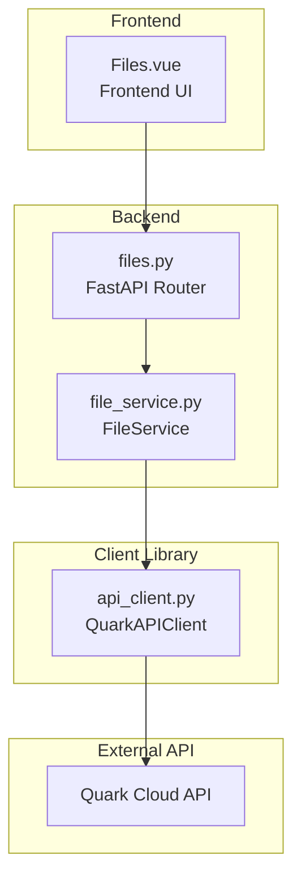
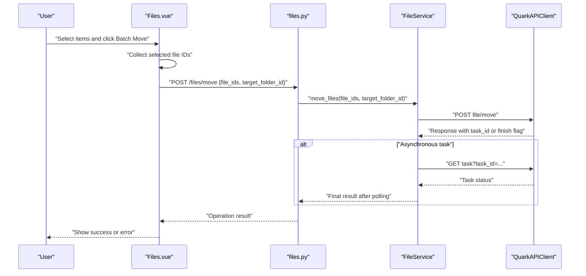
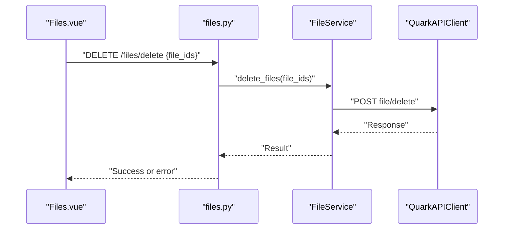
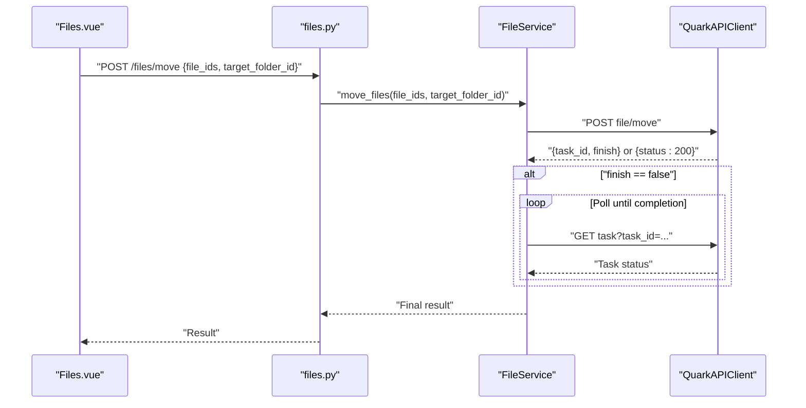
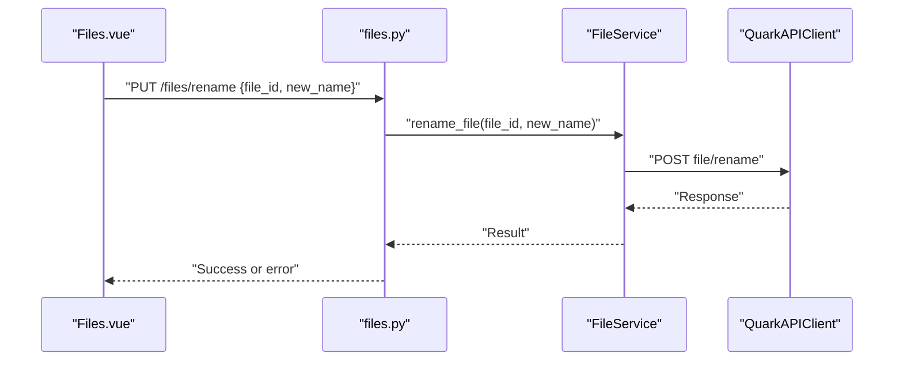
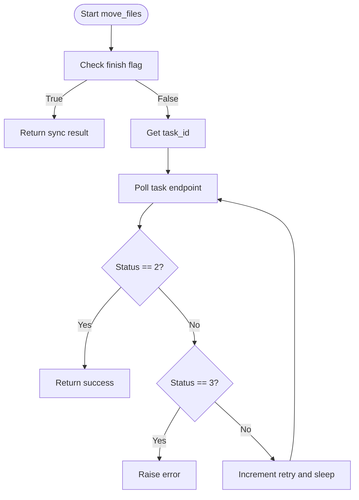
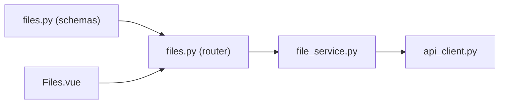

# Bulk Operations

<cite>
**Referenced Files in This Document**
- [files.py](file://backend/app/api/v1/files.py)
- [files.py](file://backend/app/schemas/files.py)
- [Files.vue](file://frontend/src/views/Files.vue)
- [file_service.py](file://quark_client/services/file_service.py)
- [api_client.py](file://quark_client/core/api_client.py)
- [move_commands.py](file://quark_client/cli/commands/move_commands.py)
- [batch_share_commands.py](file://quark_client/cli/commands/batch_share_commands.py)
</cite>

## Table of Contents
1. [Introduction](#introduction)
2. [Project Structure](#project-structure)
3. [Core Components](#core-components)
4. [Architecture Overview](#architecture-overview)
5. [Detailed Component Analysis](#detailed-component-analysis)
6. [Dependency Analysis](#dependency-analysis)
7. [Performance Considerations](#performance-considerations)
8. [Troubleshooting Guide](#troubleshooting-guide)
9. [Conclusion](#conclusion)

## Introduction
This document explains the bulk file operations functionality implemented in the project. It covers multi-selection mechanisms in the frontend, batch processing workflows exposed by the backend APIs, and the underlying client-side service that supports asynchronous task handling. It also documents supported bulk operations (batch delete, batch move, and batch rename), progress monitoring approaches, and practical guidance for handling partial failures and long-running operations.

## Project Structure
The bulk operations span three layers:
- Backend API: Defines endpoints for listing, moving, deleting, renaming, and searching files.
- Frontend UI: Provides multi-selection controls and batch actions triggered by the user.
- Client library: Implements the underlying service that executes operations and handles asynchronous tasks.

**Diagram sources**
- [files.py:19-104](file://backend/app/api/v1/files.py#L19-L104)
- [Files.vue:64-70](file://frontend/src/views/Files.vue#L64-L70)
- [file_service.py:386-472](file://quark_client/services/file_service.py#L386-L472)
- [api_client.py:80-183](file://quark_client/core/api_client.py#L80-L183)

**Section sources**
- [files.py:19-104](file://backend/app/api/v1/files.py#L19-L104)
- [Files.vue:64-70](file://frontend/src/views/Files.vue#L64-L70)
- [file_service.py:386-472](file://quark_client/services/file_service.py#L386-L472)
- [api_client.py:80-183](file://quark_client/core/api_client.py#L80-L183)

## Core Components
- Backend API endpoints for bulk operations:
  - Delete files: DELETE /files/delete with a list of file IDs.
  - Move files: POST /files/move with a list of file IDs and a target folder ID.
  - Rename file: PUT /files/rename with a single file ID and new name.
  - List files: GET /files/list for browsing and pagination.
  - Search files: GET /files/search for filtering.
  - Storage info: GET /files/storage for quota visualization.
- Frontend batch toolbar and selection:
  - Selection change handler tracks selected rows.
  - Batch actions: Download, Move, Delete, and Clear selection.
- Client-side service:
  - move_files supports synchronous or asynchronous task completion via polling.
  - delete_files sends a batch delete request.
  - rename_file updates a single file’s name.
  - API client encapsulates HTTP requests and error handling.

**Section sources**
- [files.py:56-104](file://backend/app/api/v1/files.py#L56-L104)
- [files.py:25-40](file://backend/app/schemas/files.py#L25-L40)
- [Files.vue:64-70](file://frontend/src/views/Files.vue#L64-L70)
- [Files.vue:501-554](file://frontend/src/views/Files.vue#L501-L554)
- [file_service.py:131-155](file://quark_client/services/file_service.py#L131-L155)
- [file_service.py:386-472](file://quark_client/services/file_service.py#L386-L472)
- [api_client.py:80-183](file://quark_client/core/api_client.py#L80-L183)

## Architecture Overview
The bulk operation flow follows a consistent pattern:
- The frontend selects multiple items and triggers a batch action.
- The frontend calls the backend endpoint with a payload containing the selected file IDs.
- The backend delegates to the service layer, which may trigger asynchronous tasks.
- The client library polls task status until completion or failure.

**Diagram sources**
- [Files.vue:501-531](file://frontend/src/views/Files.vue#L501-L531)
- [files.py:89-104](file://backend/app/api/v1/files.py#L89-L104)
- [file_service.py:386-472](file://quark_client/services/file_service.py#L386-L472)
- [api_client.py:184-190](file://quark_client/core/api_client.py#L184-L190)

## Detailed Component Analysis

### Multi-Selection Mechanisms
- Checkbox-based selection:
  - The table uses an internal selection mechanism to track selected rows.
  - The selection change callback updates the selected items array.
- Click-to-select and Shift-click range selection:
  - The frontend uses the element-plus table selection column, which supports standard selection behaviors including range selection via keyboard modifiers.
- Batch toolbar:
  - When items are selected, a toolbar appears with Batch Move, Batch Delete, and other actions.

Practical usage:
- Select multiple rows using Ctrl/Cmd or Shift to choose a range.
- Use the toolbar buttons to apply batch operations.

**Section sources**
- [Files.vue:73-80](file://frontend/src/views/Files.vue#L73-L80)
- [Files.vue:300-303](file://frontend/src/views/Files.vue#L300-L303)
- [Files.vue:64-70](file://frontend/src/views/Files.vue#L64-L70)

### Batch Delete Workflow
- Frontend:
  - Collects selected file IDs and calls the backend delete endpoint.
- Backend:
  - Validates the request schema and forwards to the service.
- Service:
  - Sends a batch delete request with the provided file IDs.
- Outcome:
  - On success, returns a success flag and optional data; on failure, raises an HTTP error.

**Diagram sources**
- [Files.vue:534-554](file://frontend/src/views/Files.vue#L534-L554)
- [files.py:56-68](file://backend/app/api/v1/files.py#L56-L68)
- [files.py:25-28](file://backend/app/schemas/files.py#L25-L28)
- [file_service.py:131-155](file://quark_client/services/file_service.py#L131-L155)
- [api_client.py:184-190](file://quark_client/core/api_client.py#L184-L190)

**Section sources**
- [Files.vue:534-554](file://frontend/src/views/Files.vue#L534-L554)
- [files.py:56-68](file://backend/app/api/v1/files.py#L56-L68)
- [files.py:25-28](file://backend/app/schemas/files.py#L25-L28)
- [file_service.py:131-155](file://quark_client/services/file_service.py#L131-L155)

### Batch Move Workflow
- Frontend:
  - Opens a move dialog, selects a destination folder, and collects selected file IDs.
- Backend:
  - Validates the request schema and calls the service.
- Service:
  - Sends a batch move request with file IDs and target folder ID.
  - If the response indicates an asynchronous task, polls the task endpoint until completion or failure.
- Outcome:
  - Returns success/failure and optionally a task identifier.

**Diagram sources**
- [Files.vue:501-531](file://frontend/src/views/Files.vue#L501-L531)
- [files.py:89-104](file://backend/app/api/v1/files.py#L89-L104)
- [files.py:36-40](file://backend/app/schemas/files.py#L36-L40)
- [file_service.py:386-472](file://quark_client/services/file_service.py#L386-L472)
- [api_client.py:184-190](file://quark_client/core/api_client.py#L184-L190)

**Section sources**
- [Files.vue:501-531](file://frontend/src/views/Files.vue#L501-L531)
- [files.py:89-104](file://backend/app/api/v1/files.py#L89-L104)
- [files.py:36-40](file://backend/app/schemas/files.py#L36-L40)
- [file_service.py:386-472](file://quark_client/services/file_service.py#L386-L472)

### Batch Rename Workflow
- Frontend:
  - Uses a prompt to collect a new name and calls the rename endpoint with a single file ID.
- Backend:
  - Validates the request schema and calls the service.
- Service:
  - Sends a rename request with the file ID and new name.
- Outcome:
  - Returns success or error.

**Diagram sources**
- [Files.vue:448-468](file://frontend/src/views/Files.vue#L448-L468)
- [files.py:71-86](file://backend/app/api/v1/files.py#L71-L86)
- [files.py:30-34](file://backend/app/schemas/files.py#L30-L34)
- [file_service.py:157-181](file://quark_client/services/file_service.py#L157-L181)
- [api_client.py:184-190](file://quark_client/core/api_client.py#L184-L190)

**Section sources**
- [Files.vue:448-468](file://frontend/src/views/Files.vue#L448-L468)
- [files.py:71-86](file://backend/app/api/v1/files.py#L71-L86)
- [files.py:30-34](file://backend/app/schemas/files.py#L30-L34)
- [file_service.py:157-181](file://quark_client/services/file_service.py#L157-L181)

### Progress Monitoring and Asynchronous Tasks
- Asynchronous task polling:
  - The service detects whether the operation completes synchronously or returns a task ID.
  - If asynchronous, it polls the task endpoint with a bounded retry count and interval.
- Frontend progress:
  - The current UI does not implement real-time progress bars for bulk operations.
  - The client library demonstrates progress callbacks for downloads, which can serve as a reference for integrating progress in future enhancements.

**Diagram sources**
- [file_service.py:428-472](file://quark_client/services/file_service.py#L428-L472)

**Section sources**
- [file_service.py:428-472](file://quark_client/services/file_service.py#L428-L472)
- [Files.vue:64-70](file://frontend/src/views/Files.vue#L64-L70)

### Practical Examples and Partial Failures
- Batch move:
  - The frontend collects selected IDs and calls the backend endpoint.
  - The service may return a task; the UI should surface completion or failure and allow retry/cancel.
- Batch delete:
  - The frontend confirms deletion and proceeds with the selected IDs.
  - The backend returns success or error; the UI should reflect the outcome and allow clearing selection.
- Partial failures:
  - The backend endpoints operate on lists; partial failures can occur per item on the provider side.
  - The UI should present granular feedback per item and allow retrying failed items.

**Section sources**
- [Files.vue:501-554](file://frontend/src/views/Files.vue#L501-L554)
- [files.py:56-104](file://backend/app/api/v1/files.py#L56-L104)

## Dependency Analysis
- Backend API depends on schemas for request/response validation.
- Frontend depends on the API endpoints for bulk operations.
- Client library depends on the API client for HTTP transport and error handling.
- Move operations depend on asynchronous task polling to ensure eventual consistency.

**Diagram sources**
- [files.py:5-54](file://backend/app/schemas/files.py#L5-L54)
- [files.py:1-16](file://backend/app/api/v1/files.py#L1-L16)
- [file_service.py:16-24](file://quark_client/services/file_service.py#L16-L24)
- [api_client.py:16-38](file://quark_client/core/api_client.py#L16-L38)
- [Files.vue](file://frontend/src/views/Files.vue#L189)

**Section sources**
- [files.py:5-54](file://backend/app/schemas/files.py#L5-L54)
- [files.py:1-16](file://backend/app/api/v1/files.py#L1-L16)
- [file_service.py:16-24](file://quark_client/services/file_service.py#L16-L24)
- [api_client.py:16-38](file://quark_client/core/api_client.py#L16-L38)
- [Files.vue](file://frontend/src/views/Files.vue#L189)

## Performance Considerations
- Pagination and batching:
  - Use pagination to avoid large payloads and improve responsiveness.
- Asynchronous tasks:
  - Prefer asynchronous operations for heavy workloads and poll with backoff to reduce load.
- Payload size:
  - Limit batch sizes to reasonable limits to prevent timeouts and excessive memory usage.
- UI responsiveness:
  - Debounce selection changes and avoid frequent re-renders during large selections.
- Network efficiency:
  - Reuse connections and minimize redundant requests.

## Troubleshooting Guide
- Authentication errors:
  - HTTP 401/403 indicate invalid or expired credentials; refresh or re-authenticate.
- Operation failures:
  - Inspect the returned message and status; handle per-item failures gracefully.
- Task timeouts:
  - The service enforces a maximum retry count; consider reducing batch size or increasing intervals.
- Frontend UX:
  - Provide clear feedback for partial failures and enable retry actions.

**Section sources**
- [api_client.py:146-182](file://quark_client/core/api_client.py#L146-L182)
- [file_service.py:428-472](file://quark_client/services/file_service.py#L428-L472)

## Conclusion
The project provides a solid foundation for bulk file operations with clear separation of concerns across the frontend, backend, and client libraries. The backend exposes endpoints for batch delete and move, with support for asynchronous task completion handled by the client library. The frontend offers multi-selection and batch actions, ready for integration with progress reporting and improved error handling. Extending the UI to show per-item status and progress would further enhance the user experience for large-scale operations.