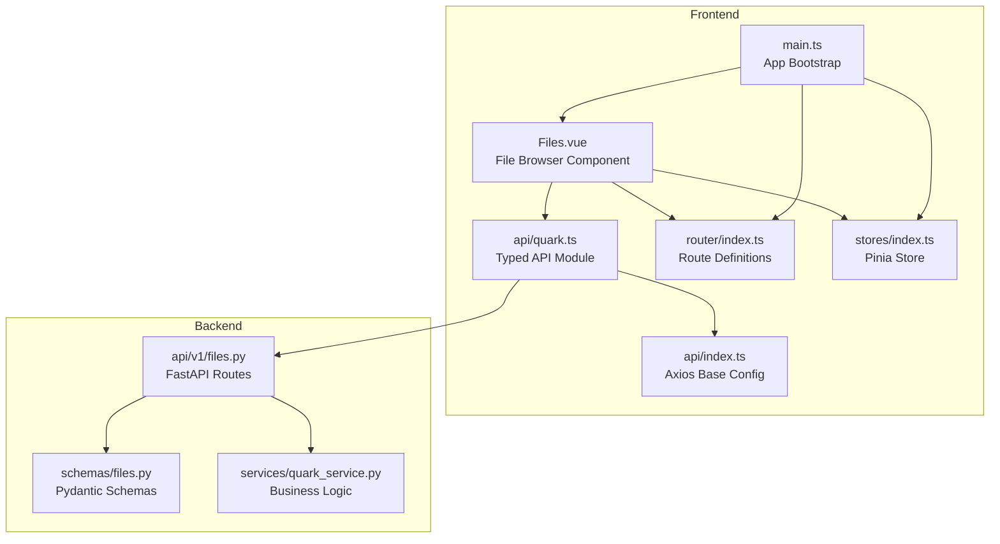
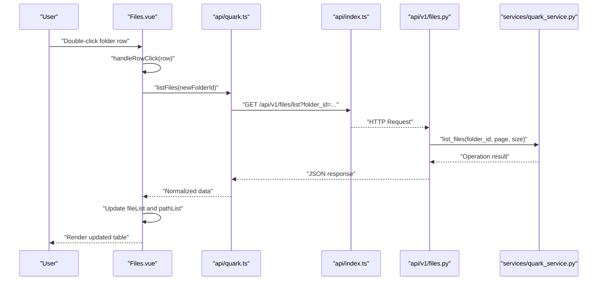
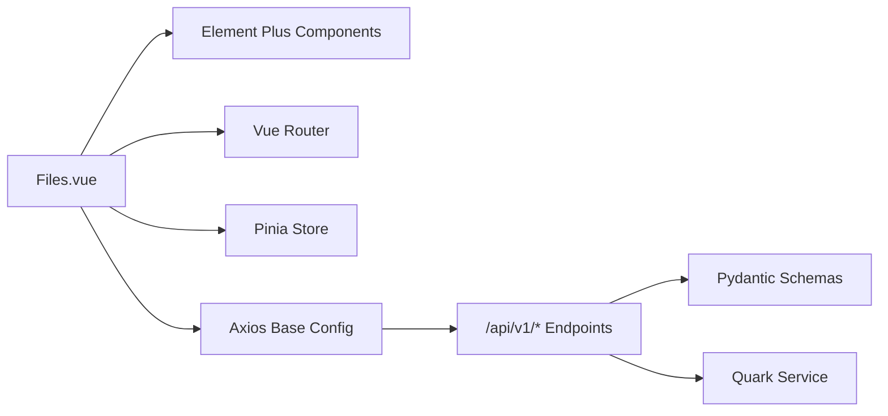

# File Browser Interface

<cite>
**Referenced Files in This Document**
- [Files.vue](file://frontend/src/views/Files.vue)
- [quark.ts](file://frontend/src/api/quark.ts)
- [index.ts](file://frontend/src/api/index.ts)
- [router/index.ts](file://frontend/src/router/index.ts)
- [stores/index.ts](file://frontend/src/stores/index.ts)
- [main.ts](file://frontend/src/main.ts)
- [files.py](file://backend/app/api/v1/files.py)
- [schemas/files.py](file://backend/app/schemas/files.py)
- [quark_service.py](file://backend/app/services/quark_service.py)
</cite>

## Table of Contents
1. [Introduction](#introduction)
2. [Project Structure](#project-structure)
3. [Core Components](#core-components)
4. [Architecture Overview](#architecture-overview)
5. [Detailed Component Analysis](#detailed-component-analysis)
6. [Dependency Analysis](#dependency-analysis)
7. [Performance Considerations](#performance-considerations)
8. [Troubleshooting Guide](#troubleshooting-guide)
9. [Conclusion](#conclusion)
10. [Appendices](#appendices)

## Introduction
This document describes the file browser interface component built with Vue.js and integrated with a FastAPI backend. It covers directory navigation, file listing display, hierarchical structure visualization, state management, props handling, event propagation, file rendering logic (icons, metadata, sorting), path resolution, breadcrumbs, and practical usage examples. Accessibility and performance considerations for large directory listings are also addressed.

## Project Structure
The file browser is implemented as a single-file Vue component and integrates with a typed API module and backend endpoints. The frontend uses Element Plus for UI components, Pinia for state, and Vue Router for navigation. The backend exposes REST endpoints for file operations and storage information.

**Diagram sources**
- [Files.vue:1-698](file://frontend/src/views/Files.vue#L1-L698)
- [quark.ts:1-125](file://frontend/src/api/quark.ts#L1-L125)
- [index.ts:1-30](file://frontend/src/api/index.ts#L1-L30)
- [router/index.ts:1-35](file://frontend/src/router/index.ts#L1-L35)
- [stores/index.ts:1-23](file://frontend/src/stores/index.ts#L1-L23)
- [main.ts:1-23](file://frontend/src/main.ts#L1-L23)
- [files.py:1-150](file://backend/app/api/v1/files.py#L1-L150)
- [schemas/files.py:1-54](file://backend/app/schemas/files.py#L1-L54)
- [quark_service.py:1-388](file://backend/app/services/quark_service.py#L1-L388)

**Section sources**
- [Files.vue:1-698](file://frontend/src/views/Files.vue#L1-L698)
- [quark.ts:1-125](file://frontend/src/api/quark.ts#L1-L125)
- [index.ts:1-30](file://frontend/src/api/index.ts#L1-L30)
- [router/index.ts:1-35](file://frontend/src/router/index.ts#L1-L35)
- [stores/index.ts:1-23](file://frontend/src/stores/index.ts#L1-L23)
- [main.ts:1-23](file://frontend/src/main.ts#L1-L23)
- [files.py:1-150](file://backend/app/api/v1/files.py#L1-L150)
- [schemas/files.py:1-54](file://backend/app/schemas/files.py#L1-L54)
- [quark_service.py:1-388](file://backend/app/services/quark_service.py#L1-L388)

## Core Components
- File Browser Component (Files.vue)
  - Renders header with breadcrumbs, toolbar, file table, footer with storage usage, and dialogs for storage and move operations.
  - Manages local reactive state for current folder, path list, selection, loading, and dialog visibility.
  - Integrates with typed API module for backend operations.
- Typed API Module (api/quark.ts)
  - Exposes functions for listing files, searching, storage info, renaming, moving, deleting, creating folders, and downloading.
  - Uses Axios base configuration for request/response handling.
- Backend API (api/v1/files.py)
  - Defines REST endpoints for file listing, folder creation, deletion, renaming, moving, search, storage info, and download URL retrieval.
- Business Logic (services/quark_service.py)
  - Implements file operations using a Quark client abstraction with fallback mock data when the client is unavailable.
- Router (router/index.ts)
  - Declares route for the file browser component.
- Store (stores/index.ts)
  - Provides a simple Pinia store for user login status and info.

**Section sources**
- [Files.vue:180-571](file://frontend/src/views/Files.vue#L180-L571)
- [quark.ts:77-124](file://frontend/src/api/quark.ts#L77-L124)
- [files.py:19-149](file://backend/app/api/v1/files.py#L19-L149)
- [quark_service.py:225-383](file://backend/app/services/quark_service.py#L225-L383)
- [router/index.ts:16-21](file://frontend/src/router/index.ts#L16-L21)
- [stores/index.ts:4-22](file://frontend/src/stores/index.ts#L4-L22)

## Architecture Overview
The file browser follows a unidirectional data flow:
- UI triggers actions via events (button clicks, row double-clicks, breadcrumb clicks).
- Component calls typed API functions to fetch or mutate data.
- API module sends HTTP requests to backend endpoints.
- Backend validates and executes operations via service layer.
- Responses update component state, re-rendering the UI.

**Diagram sources**
- [Files.vue:290-298](file://frontend/src/views/Files.vue#L290-L298)
- [quark.ts:77-82](file://frontend/src/api/quark.ts#L77-L82)
- [index.ts:3-9](file://frontend/src/api/index.ts#L3-L9)
- [files.py:19-35](file://backend/app/api/v1/files.py#L19-L35)
- [quark_service.py:225-253](file://backend/app/services/quark_service.py#L225-L253)

## Detailed Component Analysis

### Template and Layout
- Header: Contains back button, breadcrumb navigation, search input, upload, create folder, refresh, and dropdown menu.
- Toolbar: Appears when items are selected, offering batch actions (download, move, delete) and clear selection.
- File Table: Displays file name (with dynamic icon and color), size (folder vs file), modified time, and action buttons per row.
- Footer: Shows total items and storage usage with progress bar.
- Dialogs: Storage info dashboard and move-to-folder tree dialog.

Key rendering logic highlights:
- Dynamic icon selection based on file type and extension.
- Conditional size display for folders vs files.
- Date/time formatting for human-readable timestamps.

**Section sources**
- [Files.vue:1-178](file://frontend/src/views/Files.vue#L1-L178)
- [Files.vue:322-352](file://frontend/src/views/Files.vue#L322-L352)
- [Files.vue:354-397](file://frontend/src/views/Files.vue#L354-L397)

### State Management
- Reactive state:
  - Loading flag for network operations.
  - Current folder identifier and path list for navigation.
  - Selected files array for multi-select operations.
  - Storage info and percentage for quota visualization.
  - Dialog visibility flags.
- Computed properties:
  - Back navigation enabled state based on breadcrumb length.
  - Storage percentage derived from used/total.

State updates occur in response to user actions and API callbacks.

**Section sources**
- [Files.vue:193-214](file://frontend/src/views/Files.vue#L193-L214)
- [Files.vue:203-205](file://frontend/src/views/Files.vue#L203-L205)
- [Files.vue:209](file://frontend/src/views/Files.vue#L209)
- [Files.vue:211-214](file://frontend/src/views/Files.vue#L211-L214)

### Props Handling and Event Propagation
- Props are not explicitly declared in the component; all data is internal reactive state.
- Event propagation patterns:
  - Row double-click navigates into a folder.
  - Selection change updates the selected files array.
  - Button clicks trigger actions (download, rename, delete, batch operations).
  - Breadcrumb item click navigates to a specific ancestor path.
  - Dropdown command dispatches to storage or logout handlers.

These patterns ensure predictable UI updates and clear separation of concerns.

**Section sources**
- [Files.vue:76-78](file://frontend/src/views/Files.vue#L76-L78)
- [Files.vue:12-14](file://frontend/src/views/Files.vue#L12-L14)
- [Files.vue:290-298](file://frontend/src/views/Files.vue#L290-L298)
- [Files.vue:301-303](file://frontend/src/views/Files.vue#L301-L303)
- [Files.vue:311-320](file://frontend/src/views/Files.vue#L311-L320)

### File Rendering Logic
- Icon display:
  - Folders use a dedicated folder icon.
  - Files mapped by extension to appropriate icons (video, audio, image, document).
  - Icon color varies by extension category.
- Metadata presentation:
  - Size: folders show aggregated size; files show raw byte size formatted to human-readable units.
  - Modified time: formatted to locale-specific date-time string.
- Sorting:
  - The backend endpoint accepts pagination parameters; sorting is not exposed in the current frontend implementation.

Practical implications:
- Extend icon/color maps to support additional extensions.
- Consider adding client-side sort controls if needed.

**Section sources**
- [Files.vue:354-397](file://frontend/src/views/Files.vue#L354-L397)
- [Files.vue:322-352](file://frontend/src/views/Files.vue#L322-L352)
- [files.py:20-23](file://backend/app/api/v1/files.py#L20-L23)

### Path Resolution and Breadcrumb Navigation
- Path list maintains breadcrumb segments with id and name.
- Navigation behaviors:
  - Double-click on a folder pushes a new segment and loads its contents.
  - Back button pops the last segment and reloads the parent directory.
  - Clicking a breadcrumb segment slices the path up to that index and navigates accordingly.
- Search mode:
  - Search results replace the path list with a synthetic segment indicating the search term.

This ensures intuitive hierarchical navigation and preserves user context.

**Section sources**
- [Files.vue:203-205](file://frontend/src/views/Files.vue#L203-L205)
- [Files.vue:268-288](file://frontend/src/views/Files.vue#L268-L288)
- [Files.vue:290-298](file://frontend/src/views/Files.vue#L290-L298)
- [Files.vue:258-260](file://frontend/src/views/Files.vue#L258-L260)

### API Integration and Backend Endpoints
Frontend API module functions and backend endpoints:
- List files: GET /files/list with folder_id, page, size.
- Create folder: POST /files/folder with folder_name and parent_id.
- Delete files: DELETE /files/delete with file_ids array.
- Rename file: PUT /files/rename with file_id and new_name.
- Move files: POST /files/move with file_ids and target_folder_id.
- Search files: GET /files/search with keyword, page, size.
- Storage info: GET /files/storage.
- Download URL: GET /files/download/{file_id}.

The backend validates inputs, delegates to the service layer, and returns structured responses.

**Section sources**
- [quark.ts:77-124](file://frontend/src/api/quark.ts#L77-L124)
- [files.py:19-149](file://backend/app/api/v1/files.py#L19-L149)
- [schemas/files.py:5-53](file://backend/app/schemas/files.py#L5-L53)

### Practical Usage Examples
- Navigating directories:
  - Double-click a folder row to enter it; breadcrumbs update automatically.
  - Use the back button or breadcrumb items to return to ancestors.
- Searching:
  - Enter a keyword in the search box and press Enter; results replace the current view.
- Managing files:
  - Select multiple rows and use batch actions (download, move, delete).
  - Use individual row action buttons for single-file operations.
- Storage monitoring:
  - Open the storage dialog from the dropdown to view quota usage and progress.

Integration tips:
- Ensure baseURL is correctly configured in the Axios instance.
- Handle API errors gracefully using the existing message/error patterns.

**Section sources**
- [Files.vue:246-266](file://frontend/src/views/Files.vue#L246-L266)
- [Files.vue:407-431](file://frontend/src/views/Files.vue#L407-L431)
- [Files.vue:433-445](file://frontend/src/views/Files.vue#L433-L445)
- [Files.vue:447-468](file://frontend/src/views/Files.vue#L447-L468)
- [Files.vue:469-489](file://frontend/src/views/Files.vue#L469-L489)
- [Files.vue:491-500](file://frontend/src/views/Files.vue#L491-L500)
- [Files.vue:501-531](file://frontend/src/views/Files.vue#L501-L531)
- [Files.vue:533-554](file://frontend/src/views/Files.vue#L533-L554)
- [index.ts:3-9](file://frontend/src/api/index.ts#L3-L9)

### Accessibility Features
- Keyboard-friendly interactions via Element Plus components.
- Clear focus states and visible hover/click areas.
- Descriptive labels for buttons and dropdown menus.
- Progress indicators for long-running operations.

Recommendations:
- Add ARIA attributes for screen readers where appropriate.
- Ensure sufficient color contrast for icon colors and progress bars.

**Section sources**
- [Files.vue:11-15](file://frontend/src/views/Files.vue#L11-L15)
- [Files.vue:132-137](file://frontend/src/views/Files.vue#L132-L137)

### Responsive Design Considerations
- Flexible container layout with flexbox and percentage widths.
- Scrollable main content area for large tables.
- Adaptive spacing and typography scales with Element Plus defaults.

Recommendations:
- Test on various viewport sizes and adjust paddings/gaps as needed.
- Consider virtualized lists for very large datasets.

**Section sources**
- [Files.vue:573-697](file://frontend/src/views/Files.vue#L573-L697)

## Dependency Analysis
The component depends on:
- Element Plus for UI primitives (table, breadcrumb, buttons, dialogs, progress).
- Axios base configuration for HTTP requests.
- Vue Router for navigation.
- Pinia store for user state.

Backend dependencies:
- FastAPI router exposing file management endpoints.
- Pydantic schemas for request/response validation.
- Service layer implementing business logic with optional client fallback.

**Diagram sources**
- [Files.vue:180-571](file://frontend/src/views/Files.vue#L180-L571)
- [index.ts:3-9](file://frontend/src/api/index.ts#L3-L9)
- [files.py:19-149](file://backend/app/api/v1/files.py#L19-L149)
- [schemas/files.py:5-53](file://backend/app/schemas/files.py#L5-L53)
- [quark_service.py:225-383](file://backend/app/services/quark_service.py#L225-L383)

**Section sources**
- [Files.vue:180-571](file://frontend/src/views/Files.vue#L180-L571)
- [index.ts:3-9](file://frontend/src/api/index.ts#L3-L9)
- [files.py:19-149](file://backend/app/api/v1/files.py#L19-L149)
- [schemas/files.py:5-53](file://backend/app/schemas/files.py#L5-L53)
- [quark_service.py:225-383](file://backend/app/services/quark_service.py#L225-L383)

## Performance Considerations
- Pagination: Backend supports page and size parameters; consider increasing size for fewer round trips while balancing payload size.
- Virtualization: For large lists, consider a virtualized table to reduce DOM nodes.
- Debouncing: Debounce search input to avoid excessive requests during typing.
- Caching: Cache recent directory listings keyed by folder_id to minimize redundant loads.
- Lazy loading: Load storage info and folder trees only when dialogs are opened.
- Icons: Preload commonly used icons to avoid runtime switching overhead.

[No sources needed since this section provides general guidance]

## Troubleshooting Guide
Common issues and resolutions:
- Empty file list after navigation:
  - Verify current folder ID and that the backend returns data for the requested folder.
  - Check network tab for failed requests and error messages.
- Search not working:
  - Confirm keyword is not empty and endpoint returns results.
  - Inspect path list reset behavior on search.
- Download failures:
  - Ensure the download URL endpoint returns a valid URL and the component opens it in a new tab.
- Batch operations:
  - Verify selection array is populated and API receives the correct IDs.
- Storage dialog:
  - Confirm storage info is loaded and percentage calculation does not divide by zero.

**Section sources**
- [Files.vue:216-232](file://frontend/src/views/Files.vue#L216-L232)
- [Files.vue:246-266](file://frontend/src/views/Files.vue#L246-L266)
- [Files.vue:433-445](file://frontend/src/views/Files.vue#L433-L445)
- [Files.vue:501-531](file://frontend/src/views/Files.vue#L501-L531)
- [Files.vue:234-244](file://frontend/src/views/Files.vue#L234-L244)

## Conclusion
The file browser component provides a robust foundation for directory navigation and file management with clear separation between UI, state, and backend integration. Its modular design enables straightforward enhancements such as sorting, filtering, and advanced selection patterns. By following the recommended performance and accessibility practices, the component can scale effectively for large datasets and diverse user needs.

## Appendices

### API Reference Summary
- List files: GET /api/v1/files/list?folder_id={id}&page={n}&size={n}
- Create folder: POST /api/v1/files/folder
- Delete files: DELETE /api/v1/files/delete
- Rename file: PUT /api/v1/files/rename
- Move files: POST /api/v1/files/move
- Search files: GET /api/v1/files/search?keyword={text}&page={n}&size={n}
- Storage info: GET /api/v1/files/storage
- Download URL: GET /api/v1/files/download/{file_id}

**Section sources**
- [quark.ts:77-124](file://frontend/src/api/quark.ts#L77-L124)
- [files.py:19-149](file://backend/app/api/v1/files.py#L19-L149)