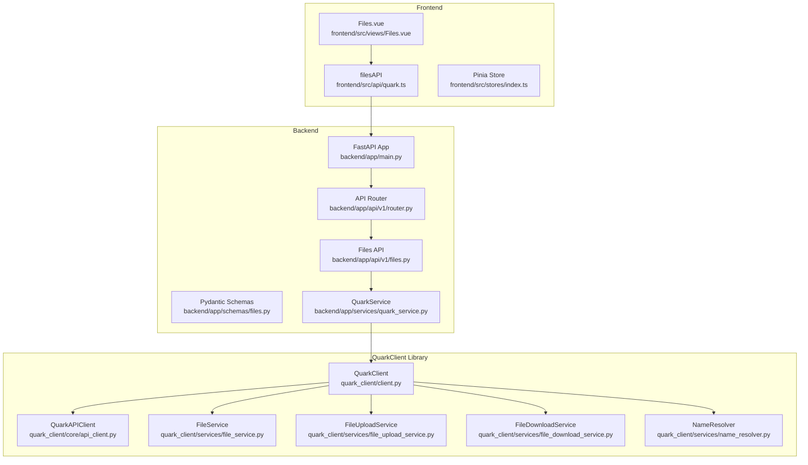
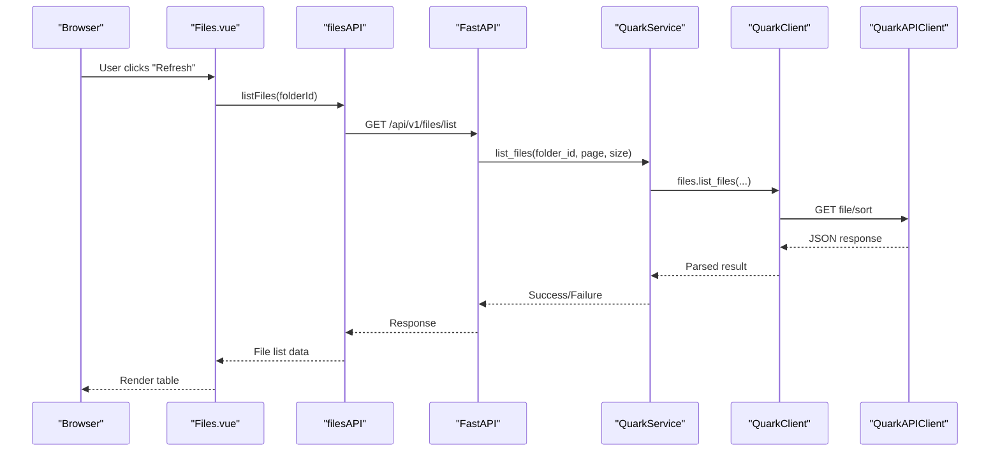
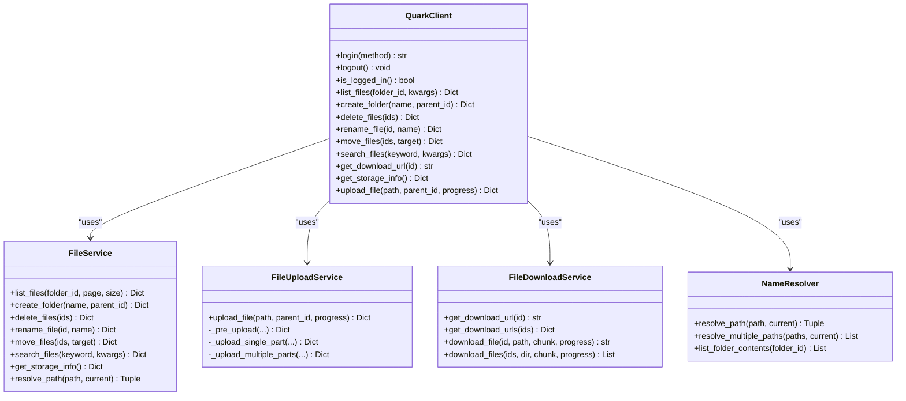
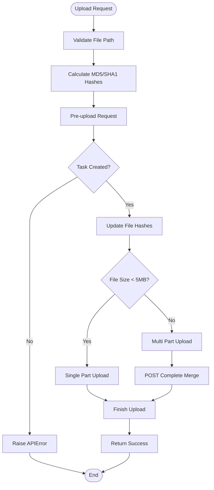
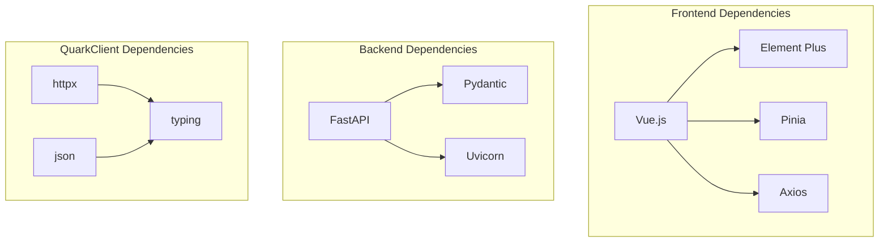

# File Management System

<cite>
**Referenced Files in This Document**
- [backend/app/main.py](file://backend/app/main.py)
- [backend/app/api/v1/router.py](file://backend/app/api/v1/router.py)
- [backend/app/api/v1/files.py](file://backend/app/api/v1/files.py)
- [backend/app/schemas/files.py](file://backend/app/schemas/files.py)
- [backend/app/services/quark_service.py](file://backend/app/services/quark_service.py)
- [frontend/src/views/Files.vue](file://frontend/src/views/Files.vue)
- [frontend/src/api/quark.ts](file://frontend/src/api/quark.ts)
- [frontend/src/stores/index.ts](file://frontend/src/stores/index.ts)
- [quark_client/client.py](file://quark_client/client.py)
- [quark_client/core/api_client.py](file://quark_client/core/api_client.py)
- [quark_client/services/file_service.py](file://quark_client/services/file_service.py)
- [quark_client/services/file_upload_service.py](file://quark_client/services/file_upload_service.py)
- [quark_client/services/file_download_service.py](file://quark_client/services/file_download_service.py)
- [quark_client/services/name_resolver.py](file://quark_client/services/name_resolver.py)
</cite>

## Table of Contents
1. [Introduction](#introduction)
2. [Project Structure](#project-structure)
3. [Core Components](#core-components)
4. [Architecture Overview](#architecture-overview)
5. [Detailed Component Analysis](#detailed-component-analysis)
6. [Dependency Analysis](#dependency-analysis)
7. [Performance Considerations](#performance-considerations)
8. [Troubleshooting Guide](#troubleshooting-guide)
9. [Conclusion](#conclusion)

## Introduction
This document provides comprehensive documentation for the QuarkManager file management system. It covers the complete file operations pipeline from the backend API to the frontend user interface, including directory navigation, file listing, path resolution, CRUD operations (create, read, update, delete), upload/download mechanisms, move/rename/delete functionality, search and filtering, storage information display, and integration patterns between frontend components, backend services, and QuarkClient file operations.

## Project Structure
The system follows a layered architecture:
- Backend API built with FastAPI, exposing REST endpoints for file management
- Frontend Vue.js application with Element Plus UI components
- QuarkClient Python library providing native integration with the Quark Cloud Drive API
- Shared schemas and services bridging the frontend and backend

**Diagram sources**
- [backend/app/main.py:12-28](file://backend/app/main.py#L12-L28)
- [backend/app/api/v1/router.py:6-24](file://backend/app/api/v1/router.py#L6-L24)
- [backend/app/api/v1/files.py:16-149](file://backend/app/api/v1/files.py#L16-L149)
- [backend/app/services/quark_service.py:23-387](file://backend/app/services/quark_service.py#L23-L387)
- [frontend/src/api/quark.ts:77-124](file://frontend/src/api/quark.ts#L77-L124)
- [frontend/src/views/Files.vue:89-104](file://frontend/src/views/Files.vue#L89-L104)
- [quark_client/client.py:18-39](file://quark_client/client.py#L18-L39)
- [quark_client/core/api_client.py:16-209](file://quark_client/core/api_client.py#L16-L209)

**Section sources**
- [backend/app/main.py:12-28](file://backend/app/main.py#L12-L28)
- [backend/app/api/v1/router.py:6-24](file://backend/app/api/v1/router.py#L6-L24)
- [frontend/src/api/quark.ts:77-124](file://frontend/src/api/quark.ts#L77-L124)
- [quark_client/client.py:18-39](file://quark_client/client.py#L18-L39)

## Core Components
This section outlines the primary building blocks of the file management system.

- Backend API Layer
  - FastAPI application with CORS middleware and modular routing
  - Files API endpoints for listing, creating, deleting, renaming, moving, searching, and retrieving storage information
  - Pydantic schemas for request/response validation
  - QuarkService orchestrating QuarkClient operations with authentication and error handling

- Frontend Interface Layer
  - Files.vue component implementing file browser with breadcrumb navigation, table listing, and action buttons
  - filesAPI module providing typed API wrappers for backend endpoints
  - Pinia store for user authentication state management

- QuarkClient Library
  - QuarkClient as the main facade coordinating FileService, UploadService, DownloadService, and NameResolver
  - QuarkAPIClient handling HTTP requests, authentication, and error propagation
  - Specialized services for file operations, uploads, downloads, and path resolution

**Section sources**
- [backend/app/api/v1/files.py:19-149](file://backend/app/api/v1/files.py#L19-L149)
- [backend/app/schemas/files.py:5-54](file://backend/app/schemas/files.py#L5-L54)
- [backend/app/services/quark_service.py:225-384](file://backend/app/services/quark_service.py#L225-L384)
- [frontend/src/views/Files.vue:1-264](file://frontend/src/views/Files.vue#L1-L264)
- [frontend/src/api/quark.ts:77-124](file://frontend/src/api/quark.ts#L77-L124)
- [frontend/src/stores/index.ts:4-22](file://frontend/src/stores/index.ts#L4-L22)
- [quark_client/client.py:18-39](file://quark_client/client.py#L18-L39)
- [quark_client/core/api_client.py:16-209](file://quark_client/core/api_client.py#L16-L209)

## Architecture Overview
The system implements a clean separation of concerns:
- Frontend communicates with backend via REST APIs
- Backend validates requests and delegates to QuarkService
- QuarkService manages QuarkClient instances and handles authentication
- QuarkClient coordinates specialized services for file operations
- Error handling is centralized with meaningful messages and status codes

**Diagram sources**
- [frontend/src/views/Files.vue:89-104](file://frontend/src/views/Files.vue#L89-L104)
- [frontend/src/api/quark.ts:77-82](file://frontend/src/api/quark.ts#L77-L82)
- [backend/app/api/v1/files.py:19-35](file://backend/app/api/v1/files.py#L19-L35)
- [backend/app/services/quark_service.py:225-253](file://backend/app/services/quark_service.py#L225-L253)
- [quark_client/client.py:76-78](file://quark_client/client.py#L76-L78)
- [quark_client/core/api_client.py:184-190](file://quark_client/core/api_client.py#L184-L190)

## Detailed Component Analysis

### Backend API Endpoints
The backend exposes a comprehensive set of endpoints for file management operations:

- File Listing: GET `/files/list` with pagination support
- Folder Creation: POST `/files/folder` for creating new directories
- File Deletion: DELETE `/files/delete` for removing files and folders
- File Renaming: PUT `/files/rename` for updating file/folder names
- File Movement: POST `/files/move` for relocating items
- File Search: GET `/files/search` with keyword-based queries
- Storage Information: GET `/files/storage` for capacity monitoring
- Download URLs: GET `/files/download/{file_id}` for obtaining direct download links

Each endpoint validates input parameters, delegates to QuarkService, and returns standardized responses with success flags and error messages.

**Section sources**
- [backend/app/api/v1/files.py:19-149](file://backend/app/api/v1/files.py#L19-L149)
- [backend/app/schemas/files.py:5-54](file://backend/app/schemas/files.py#L5-L54)

### Frontend File Browser Interface
The Files.vue component implements a responsive file browser with:
- Breadcrumb navigation showing current path hierarchy
- Table-based file listing with icons for folders and files
- Action buttons for download, sharing, and deletion
- Loading states and error messaging
- Size formatting utilities

Key interactions include:
- Double-clicking folders to navigate deeper
- Clicking breadcrumb items to jump to specific locations
- Using the refresh button to reload current directory contents

**Section sources**
- [frontend/src/views/Files.vue:1-264](file://frontend/src/views/Files.vue#L1-L264)

### QuarkClient File Operations
The QuarkClient provides a unified interface to the Quark Cloud Drive API:

- FileService: Core file operations including listing, creation, deletion, renaming, moving, search, and storage info retrieval
- FileUploadService: Multi-strategy upload handling with single-part and multipart upload support
- FileDownloadService: Download URL acquisition and file downloading with progress callbacks
- NameResolver: Path-to-ID resolution with caching for improved performance

**Diagram sources**
- [quark_client/client.py:18-39](file://quark_client/client.py#L18-L39)
- [quark_client/services/file_service.py:13-800](file://quark_client/services/file_service.py#L13-L800)
- [quark_client/services/file_upload_service.py:16-800](file://quark_client/services/file_upload_service.py#L16-L800)
- [quark_client/services/file_download_service.py:13-301](file://quark_client/services/file_download_service.py#L13-L301)
- [quark_client/services/name_resolver.py:10-198](file://quark_client/services/name_resolver.py#L10-L198)

### Upload Implementation Flow
The upload process follows a sophisticated workflow:

**Diagram sources**
- [quark_client/services/file_upload_service.py:28-148](file://quark_client/services/file_upload_service.py#L28-L148)
- [quark_client/services/file_upload_service.py:174-212](file://quark_client/services/file_upload_service.py#L174-L212)
- [quark_client/services/file_upload_service.py:214-469](file://quark_client/services/file_upload_service.py#L214-L469)

### Path Resolution and Navigation
The NameResolver service enables robust path resolution:
- Supports absolute and relative paths
- Handles trailing slashes to distinguish folders from files
- Implements caching for improved performance
- Provides real-time cache refresh to ensure data consistency

**Section sources**
- [quark_client/services/name_resolver.py:19-73](file://quark_client/services/name_resolver.py#L19-L73)
- [quark_client/services/name_resolver.py:106-118](file://quark_client/services/name_resolver.py#L106-L118)

### Search and Filtering Capabilities
The system provides flexible search functionality:
- Basic keyword search across files
- Advanced filtering on the client-side for extensions and size ranges
- Pagination support for large result sets
- Highlighting of matched terms in search results

**Section sources**
- [quark_client/services/file_service.py:183-219](file://quark_client/services/file_service.py#L183-L219)
- [quark_client/services/file_service.py:295-366](file://quark_client/services/file_service.py#L295-L366)

### Storage Information Display
The storage monitoring system provides:
- Total capacity and used space reporting
- Real-time updates through API calls
- Integration with the frontend storage display

**Section sources**
- [backend/app/api/v1/files.py:126-138](file://backend/app/api/v1/files.py#L126-L138)
- [quark_client/services/file_service.py:240-248](file://quark_client/services/file_service.py#L240-L248)

## Dependency Analysis
The system exhibits strong modularity with clear dependency boundaries:

**Diagram sources**
- [frontend/src/views/Files.vue:70-74](file://frontend/src/views/Files.vue#L70-L74)
- [backend/app/api/v1/files.py:1-14](file://backend/app/api/v1/files.py#L1-L14)
- [quark_client/core/api_client.py:9-13](file://quark_client/core/api_client.py#L9-L13)

**Section sources**
- [frontend/src/views/Files.vue:70-74](file://frontend/src/views/Files.vue#L70-L74)
- [backend/app/api/v1/files.py:1-14](file://backend/app/api/v1/files.py#L1-L14)
- [quark_client/core/api_client.py:9-13](file://quark_client/core/api_client.py#L9-L13)

## Performance Considerations
- Caching Strategy: NameResolver caches file listings to reduce API calls during navigation
- Pagination: Backend enforces reasonable page sizes (1-200 items) to prevent large payloads
- Upload Optimization: Multi-part upload automatically switches based on file size thresholds
- Progress Tracking: Both upload and download services support progress callbacks for better UX
- Error Handling: Centralized error handling prevents cascading failures and provides meaningful feedback

## Troubleshooting Guide
Common issues and resolutions:

- Authentication Failures
  - Symptom: "未登录" or 401 errors
  - Solution: Use the QR code login flow and ensure cookies are properly maintained

- Upload Failures
  - Symptom: Upload stuck at 5MB boundary
  - Solution: Verify network connectivity and retry; the system automatically switches to multi-part upload for larger files

- Download Issues
  - Symptom: 403 Forbidden errors
  - Solution: The download service attempts fallback methods; ensure cookies are valid

- Path Resolution Errors
  - Symptom: "路径不存在" or "文件夹不存在"
  - Solution: Verify the path format and ensure the current directory ID is correct

**Section sources**
- [backend/app/services/quark_service.py:85-159](file://backend/app/services/quark_service.py#L85-L159)
- [quark_client/services/file_upload_service.py:354-398](file://quark_client/services/file_upload_service.py#L354-L398)
- [quark_client/services/file_download_service.py:208-255](file://quark_client/services/file_download_service.py#L208-L255)
- [quark_client/services/name_resolver.py:106-118](file://quark_client/services/name_resolver.py#L106-L118)

## Conclusion
The QuarkManager file management system provides a robust, scalable solution for interacting with Quark Cloud Drive. Its layered architecture ensures maintainability, while the comprehensive API coverage supports all essential file operations. The integration between frontend, backend, and QuarkClient creates a seamless user experience with proper error handling and performance optimizations.