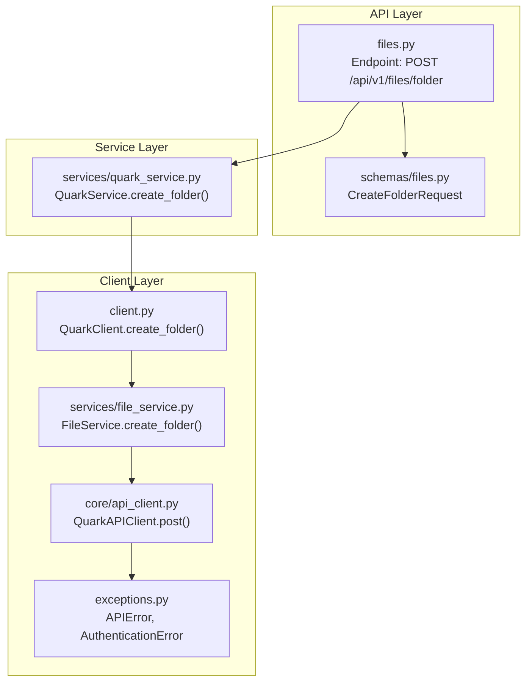
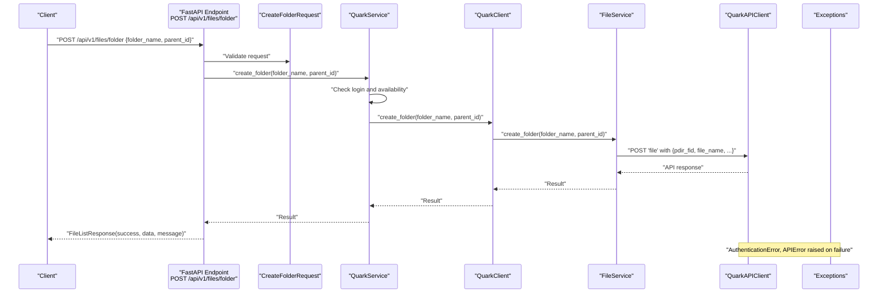
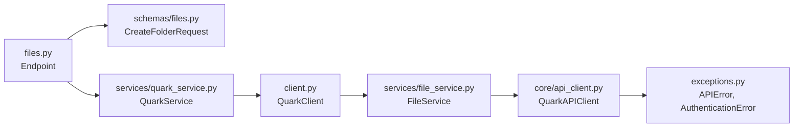

# Create Folder Operation

<cite>
**Referenced Files in This Document**
- [files.py](file://backend/app/api/v1/files.py)
- [files.py](file://backend/app/schemas/files.py)
- [quark_service.py](file://backend/app/services/quark_service.py)
- [file_service.py](file://quark_client/services/file_service.py)
- [client.py](file://quark_client/client.py)
- [api_client.py](file://quark_client/core/api_client.py)
- [exceptions.py](file://quark_client/exceptions.py)
- [router.py](file://backend/app/api/v1/router.py)
- [main.py](file://backend/app/main.py)
</cite>

## Table of Contents
1. [Introduction](#introduction)
2. [Project Structure](#project-structure)
3. [Core Components](#core-components)
4. [Architecture Overview](#architecture-overview)
5. [Detailed Component Analysis](#detailed-component-analysis)
6. [Dependency Analysis](#dependency-analysis)
7. [Performance Considerations](#performance-considerations)
8. [Troubleshooting Guide](#troubleshooting-guide)
9. [Conclusion](#conclusion)

## Introduction
This document provides a comprehensive guide to the create folder operation implemented in the backend API. It focuses on the POST /api/v1/files/folder endpoint, detailing request validation, parent directory handling, and integration with the underlying QuarkClient. It also covers error handling scenarios, including invalid parent IDs, duplicate folder names, and permission restrictions, along with practical examples and edge cases such as special characters and maximum name length limits.

## Project Structure
The create folder feature spans three layers:
- API Layer: Defines the endpoint and request/response models.
- Service Layer: Orchestrates authentication and delegates to the QuarkClient.
- Client Layer: Interacts with the Quark Cloud Drive API.

**Diagram sources**
- [files.py:38-53](file://backend/app/api/v1/files.py#L38-L53)
- [files.py:19-22](file://backend/app/schemas/files.py#L19-L22)
- [quark_service.py:255-269](file://backend/app/services/quark_service.py#L255-L269)
- [client.py:158-160](file://quark_client/client.py#L158-L160)
- [file_service.py:103-129](file://quark_client/services/file_service.py#L103-L129)
- [api_client.py:184-190](file://quark_client/core/api_client.py#L184-L190)
- [exceptions.py:23-29](file://quark_client/exceptions.py#L23-L29)

**Section sources**
- [files.py:1-150](file://backend/app/api/v1/files.py#L1-L150)
- [files.py:1-54](file://backend/app/schemas/files.py#L1-L54)
- [quark_service.py:1-388](file://backend/app/services/quark_service.py#L1-L388)
- [client.py:1-405](file://quark_client/client.py#L1-L405)
- [file_service.py:1-800](file://quark_client/services/file_service.py#L1-L800)
- [api_client.py:1-209](file://quark_client/core/api_client.py#L1-L209)
- [exceptions.py:1-50](file://quark_client/exceptions.py#L1-L50)
- [router.py:1-24](file://backend/app/api/v1/router.py#L1-L24)
- [main.py:1-46](file://backend/app/main.py#L1-L46)

## Core Components
- Endpoint Definition: The POST /api/v1/files/folder endpoint accepts a CreateFolderRequest payload and returns a standardized FileListResponse.
- Request Validation: The CreateFolderRequest schema enforces presence of folder_name and provides a default parent_id of "0".
- Service Integration: The endpoint delegates to QuarkService.create_folder(), which ensures authentication and invokes the QuarkClient.
- Client Integration: QuarkClient.create_folder() calls FileService.create_folder(), which posts to the Quark API with required parameters.

Key implementation references:
- Endpoint handler: [files.py:38-53](file://backend/app/api/v1/files.py#L38-L53)
- Request model: [files.py:19-22](file://backend/app/schemas/files.py#L19-L22)
- Service method: [quark_service.py:255-269](file://backend/app/services/quark_service.py#L255-L269)
- Client method: [client.py:158-160](file://quark_client/client.py#L158-L160)
- File service method: [file_service.py:103-129](file://quark_client/services/file_service.py#L103-L129)

**Section sources**
- [files.py:38-53](file://backend/app/api/v1/files.py#L38-L53)
- [files.py:19-22](file://backend/app/schemas/files.py#L19-L22)
- [quark_service.py:255-269](file://backend/app/services/quark_service.py#L255-L269)
- [client.py:158-160](file://quark_client/client.py#L158-L160)
- [file_service.py:103-129](file://quark_client/services/file_service.py#L103-L129)

## Architecture Overview
The create folder flow follows a layered architecture with clear separation of concerns:

**Diagram sources**
- [files.py:38-53](file://backend/app/api/v1/files.py#L38-L53)
- [files.py:19-22](file://backend/app/schemas/files.py#L19-L22)
- [quark_service.py:255-269](file://backend/app/services/quark_service.py#L255-L269)
- [client.py:158-160](file://quark_client/client.py#L158-L160)
- [file_service.py:103-129](file://quark_client/services/file_service.py#L103-L129)
- [api_client.py:184-190](file://quark_client/core/api_client.py#L184-L190)
- [exceptions.py:13-29](file://quark_client/exceptions.py#L13-L29)

## Detailed Component Analysis

### Endpoint Handler: POST /api/v1/files/folder
- Purpose: Validates incoming request and delegates to the service layer.
- Validation: Relies on Pydantic schema for field presence and defaults.
- Error Handling: Converts service-layer failures into HTTP 400 responses.

Implementation references:
- Handler definition: [files.py:38-53](file://backend/app/api/v1/files.py#L38-L53)
- Response model: [files.py:12-17](file://backend/app/schemas/files.py#L12-L17)

**Section sources**
- [files.py:38-53](file://backend/app/api/v1/files.py#L38-L53)
- [files.py:12-17](file://backend/app/schemas/files.py#L12-L17)

### Request Model: CreateFolderRequest
- Structure:
  - folder_name: Required string representing the new folder’s name.
  - parent_id: Optional string with default "0" indicating root directory.
- Validation Rules:
  - folder_name is required (non-empty).
  - parent_id defaults to "0" if omitted.

Implementation references:
- Model definition: [files.py:19-22](file://backend/app/schemas/files.py#L19-L22)

**Section sources**
- [files.py:19-22](file://backend/app/schemas/files.py#L19-L22)

### Service Layer: QuarkService.create_folder
- Responsibilities:
  - Authentication checks and availability fallbacks.
  - Delegation to QuarkClient.create_folder.
  - Wrapping results into a standardized dictionary format.
- Behavior:
  - Returns {"success": false, "message": "..."} on authentication or initialization failures.
  - On success, returns {"success": true, "data": result}.

Implementation references:
- Method signature and logic: [quark_service.py:255-269](file://backend/app/services/quark_service.py#L255-L269)

**Section sources**
- [quark_service.py:255-269](file://backend/app/services/quark_service.py#L255-L269)

### Client Layer: QuarkClient.create_folder
- Delegation: Calls FileService.create_folder with the same parameters.
- Purpose: Provides a unified interface for higher-level operations.

Implementation references:
- Method signature and delegation: [client.py:158-160](file://quark_client/client.py#L158-L160)

**Section sources**
- [client.py:158-160](file://quark_client/client.py#L158-L160)

### File Service: FileService.create_folder
- Purpose: Posts to the Quark API to create a folder.
- Parameters:
  - pdir_fid: parent_id passed from the request.
  - file_name: folder_name passed from the request.
  - Additional parameters are set internally for API compatibility.
- Response: Returns the raw API response dictionary.

Implementation references:
- Method signature and request construction: [file_service.py:103-129](file://quark_client/services/file_service.py#L103-L129)

**Section sources**
- [file_service.py:103-129](file://quark_client/services/file_service.py#L103-L129)

### API Client: QuarkAPIClient.post
- Purpose: Sends HTTP requests to the Quark API.
- Error Handling:
  - Raises AuthenticationError for 401/403 responses.
  - Raises APIError for other HTTP errors or non-JSON responses.
- Response Parsing: Validates JSON and checks status/code/message fields.

Implementation references:
- POST method and error handling: [api_client.py:184-190](file://quark_client/core/api_client.py#L184-L190)
- Error classes: [exceptions.py:13-29](file://quark_client/exceptions.py#L13-L29)

**Section sources**
- [api_client.py:184-190](file://quark_client/core/api_client.py#L184-L190)
- [exceptions.py:13-29](file://quark_client/exceptions.py#L13-L29)

### Error Handling Matrix
- Invalid Parent ID:
  - Symptom: Service returns {"success": false, "message": "..."}.
  - Cause: Backend service or API rejects invalid parent_id.
  - Reference: [quark_service.py:255-269](file://backend/app/services/quark_service.py#L255-L269)
- Duplicate Folder Name:
  - Symptom: API returns an error indicating duplicate name.
  - Cause: Attempting to create a folder with an existing name under the same parent.
  - Reference: [api_client.py:164-177](file://quark_client/core/api_client.py#L164-L177)
- Permission Restrictions:
  - Symptom: AuthenticationError or HTTP 403.
  - Cause: Expired or missing credentials.
  - Reference: [api_client.py:146-149](file://quark_client/core/api_client.py#L146-L149)
- Authentication Failures:
  - Symptom: AuthenticationError raised during request processing.
  - Cause: Invalid or expired cookies.
  - Reference: [api_client.py:146-149](file://quark_client/core/api_client.py#L146-L149)

**Section sources**
- [quark_service.py:255-269](file://backend/app/services/quark_service.py#L255-L269)
- [api_client.py:146-177](file://quark_client/core/api_client.py#L146-L177)
- [exceptions.py:13-29](file://quark_client/exceptions.py#L13-L29)

### Practical Examples

#### Successful Folder Creation
- Request:
  - Method: POST
  - URL: /api/v1/files/folder
  - Body: { "folder_name": "Project Alpha", "parent_id": "0" }
- Response:
  - Status: 200 OK
  - Body: { "success": true, "data": { ... }, "message": null }

References:
- Endpoint handler: [files.py:38-53](file://backend/app/api/v1/files.py#L38-L53)
- Service method: [quark_service.py:255-269](file://backend/app/services/quark_service.py#L255-L269)
- File service method: [file_service.py:103-129](file://quark_client/services/file_service.py#L103-L129)

#### Validation Error: Missing folder_name
- Request:
  - Body: { "parent_id": "0" }
- Response:
  - Status: 422 Unprocessable Entity (Pydantic validation fails)
  - Body: Validation error details

References:
- Request model: [files.py:19-22](file://backend/app/schemas/files.py#L19-L22)

#### Authentication Failure
- Request:
  - Body: { "folder_name": "Test", "parent_id": "0" }
- Response:
  - Status: 401 Unauthorized or 403 Forbidden
  - Body: { "success": false, "message": "认证失败，请重新登录" }

References:
- API client error handling: [api_client.py:146-149](file://quark_client/core/api_client.py#L146-L149)

#### Duplicate Folder Name
- Request:
  - Body: { "folder_name": "ExistingFolder", "parent_id": "0" }
- Response:
  - Status: 400 Bad Request
  - Body: { "success": false, "message": "API error indicating duplicate name" }

References:
- API client error parsing: [api_client.py:164-177](file://quark_client/core/api_client.py#L164-L177)

### Edge Cases and Constraints
- Special Characters in Folder Names:
  - Behavior: Allowed by the API; however, the API may reject names that violate platform rules.
  - Recommendation: Test with the API to confirm accepted characters.
- Maximum Name Length:
  - Behavior: Not enforced by the backend; the API determines limits.
  - Recommendation: Validate against API constraints and handle errors gracefully.
- Root vs Subfolder Creation:
  - parent_id "0" creates at root; any other value requires a valid folder ID.

References:
- Default parent_id: [files.py:21-22](file://backend/app/schemas/files.py#L21-L22)
- Service fallback behavior: [quark_service.py:257-260](file://backend/app/services/quark_service.py#L257-L260)

## Dependency Analysis
The create folder operation exhibits clean layering with minimal coupling:

**Diagram sources**
- [files.py:38-53](file://backend/app/api/v1/files.py#L38-L53)
- [files.py:19-22](file://backend/app/schemas/files.py#L19-L22)
- [quark_service.py:255-269](file://backend/app/services/quark_service.py#L255-L269)
- [client.py:158-160](file://quark_client/client.py#L158-L160)
- [file_service.py:103-129](file://quark_client/services/file_service.py#L103-L129)
- [api_client.py:184-190](file://quark_client/core/api_client.py#L184-L190)
- [exceptions.py:13-29](file://quark_client/exceptions.py#L13-L29)

**Section sources**
- [files.py:38-53](file://backend/app/api/v1/files.py#L38-L53)
- [files.py:19-22](file://backend/app/schemas/files.py#L19-L22)
- [quark_service.py:255-269](file://backend/app/services/quark_service.py#L255-L269)
- [client.py:158-160](file://quark_client/client.py#L158-L160)
- [file_service.py:103-129](file://quark_client/services/file_service.py#L103-L129)
- [api_client.py:184-190](file://quark_client/core/api_client.py#L184-L190)
- [exceptions.py:13-29](file://quark_client/exceptions.py#L13-L29)

## Performance Considerations
- Network Latency: The operation depends on external API latency; consider adding timeouts and retries at the client level.
- Payload Size: Minimal payload increases throughput; keep request bodies small.
- Error Propagation: Early validation reduces unnecessary network calls.

[No sources needed since this section provides general guidance]

## Troubleshooting Guide
Common issues and resolutions:
- Authentication Errors:
  - Symptoms: 401/403 responses or AuthenticationError exceptions.
  - Actions: Re-authenticate using the login flow and ensure cookies are valid.
  - References: [api_client.py:146-149](file://quark_client/core/api_client.py#L146-L149)
- API Errors:
  - Symptoms: Non-JSON responses or API-reported errors.
  - Actions: Inspect response data and adjust parameters accordingly.
  - References: [api_client.py:159-177](file://quark_client/core/api_client.py#L159-L177)
- Service Initialization Failures:
  - Symptoms: {"success": false, "message": "未登录"} or similar.
  - Actions: Initialize the client and log in before invoking create_folder.
  - References: [quark_service.py:257-260](file://backend/app/services/quark_service.py#L257-L260)

**Section sources**
- [api_client.py:146-177](file://quark_client/core/api_client.py#L146-L177)
- [quark_service.py:257-260](file://backend/app/services/quark_service.py#L257-L260)

## Conclusion
The create folder operation is implemented with a clear, layered architecture. The endpoint validates requests using Pydantic, delegates to a service layer that manages authentication, and finally calls the QuarkClient to perform the actual API operation. Error handling is robust, covering authentication failures, API errors, and service initialization issues. By following the guidelines and examples provided, developers can reliably integrate and troubleshoot folder creation across environments.