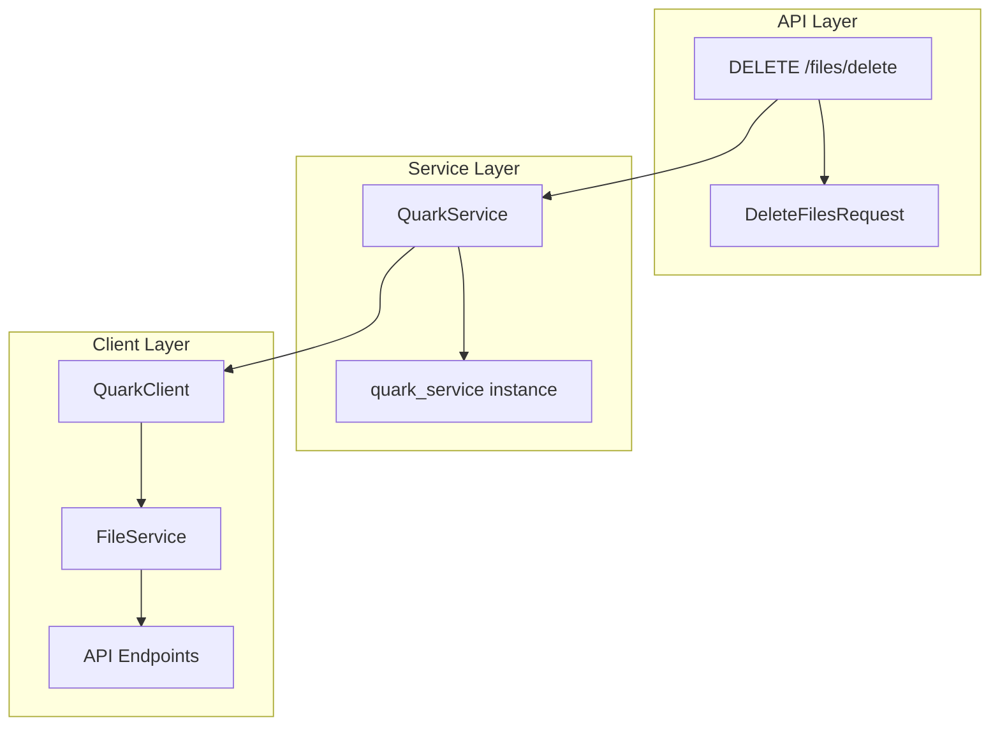
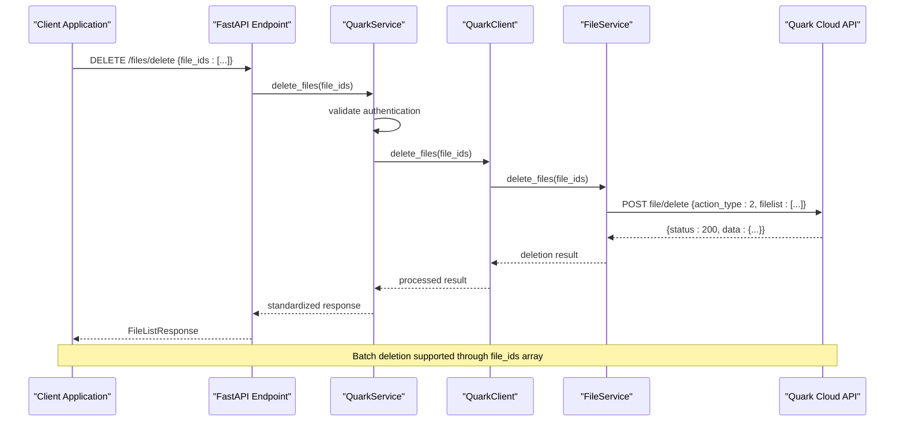
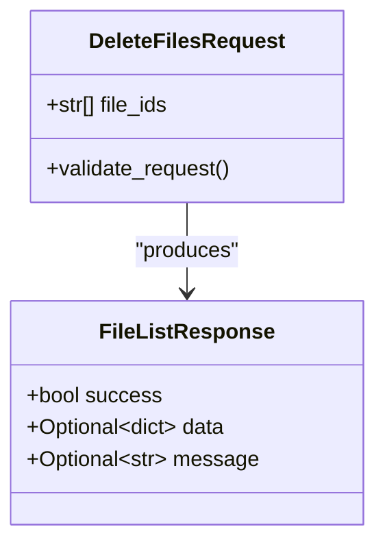
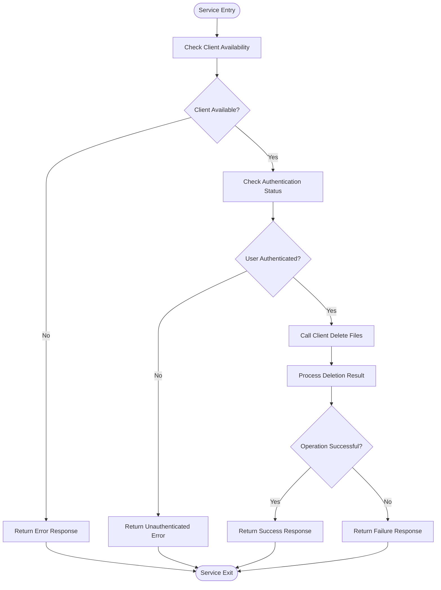
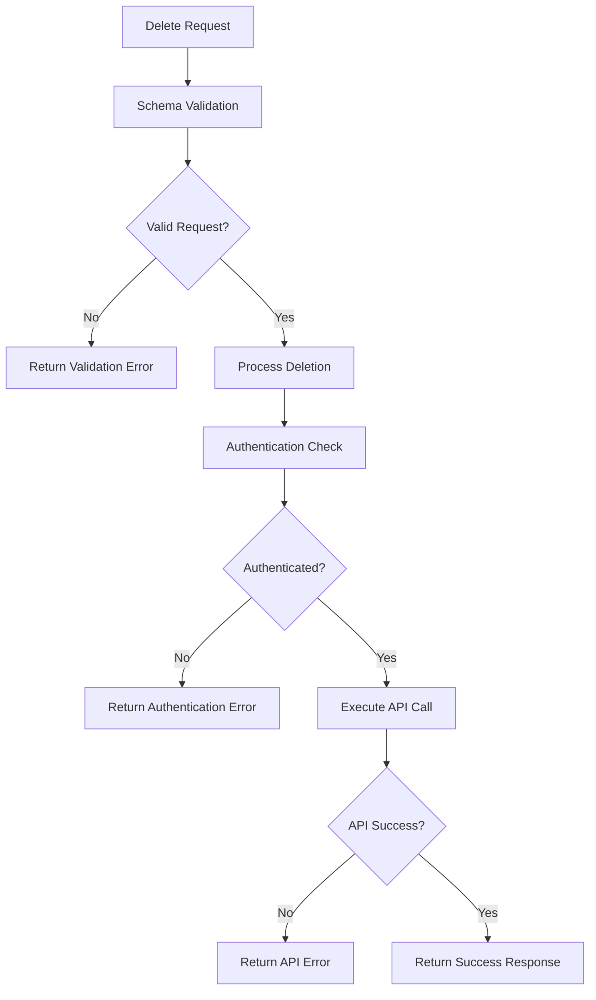
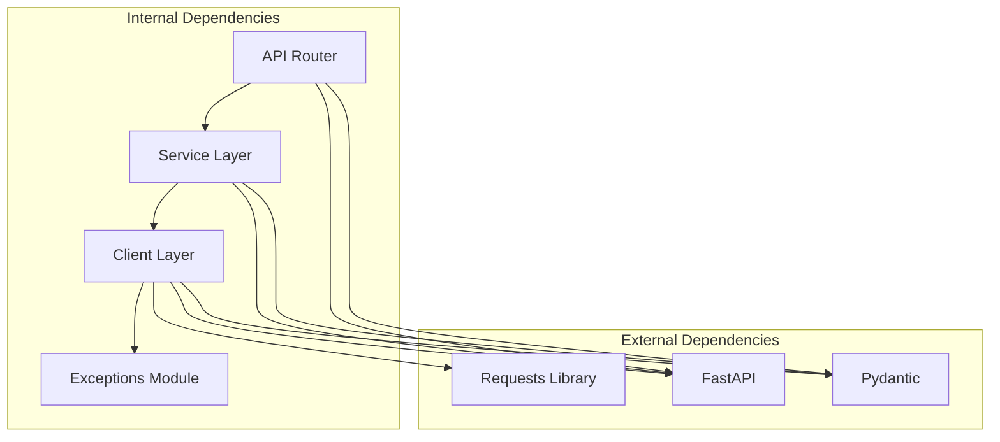

# Delete Files Operation

<cite>
**Referenced Files in This Document**
- [files.py](file://backend/app/api/v1/files.py)
- [files.py](file://backend/app/schemas/files.py)
- [quark_service.py](file://backend/app/services/quark_service.py)
- [file_service.py](file://quark_client/services/file_service.py)
- [client.py](file://quark_client/client.py)
- [exceptions.py](file://quark_client/exceptions.py)
- [router.py](file://backend/app/api/v1/router.py)
</cite>

## Table of Contents
1. [Introduction](#introduction)
2. [Project Structure](#project-structure)
3. [Core Components](#core-components)
4. [Architecture Overview](#architecture-overview)
5. [Detailed Component Analysis](#detailed-component-analysis)
6. [Dependency Analysis](#dependency-analysis)
7. [Performance Considerations](#performance-considerations)
8. [Troubleshooting Guide](#troubleshooting-guide)
9. [Conclusion](#conclusion)

## Introduction
This document provides comprehensive technical documentation for the delete files operation in the Quark Manager system. It covers the DELETE /files/delete endpoint implementation, batch deletion support through the DeleteFilesRequest schema, service layer integration with QuarkClient's file_service.delete_files method, cascading effects of file deletion, error handling strategies, and practical examples for single and batch operations.

## Project Structure
The delete files functionality spans three layers:
- API Layer: FastAPI endpoint definition and request/response schema
- Service Layer: Business logic wrapper around the QuarkClient
- Client Layer: Direct integration with the Quark Cloud API

**Diagram sources**
- [files.py:56-68](file://backend/app/api/v1/files.py#L56-L68)
- [quark_service.py:271-285](file://backend/app/services/quark_service.py#L271-L285)
- [file_service.py:131-155](file://quark_client/services/file_service.py#L131-L155)

**Section sources**
- [files.py:1-150](file://backend/app/api/v1/files.py#L1-L150)
- [router.py:1-24](file://backend/app/api/v1/router.py#L1-L24)

## Core Components
The delete files operation consists of four primary components:

### API Endpoint Definition
The DELETE /files/delete endpoint accepts a DeleteFilesRequest payload containing a file_ids array parameter. The endpoint delegates to the service layer and returns standardized FileListResponse format.

### Request Schema
The DeleteFilesRequest schema defines the file_ids parameter as a required List[str], enabling batch deletion operations with multiple file identifiers.

### Service Layer Implementation
The QuarkService.delete_files method validates authentication, handles client initialization, and orchestrates the deletion process with comprehensive error handling.

### Client Integration
The FileService.delete_files method constructs the appropriate API request payload with action_type set to 2 (deletion) and executes the HTTP POST to the file/delete endpoint.

**Section sources**
- [files.py:56-68](file://backend/app/api/v1/files.py#L56-L68)
- [files.py:25-28](file://backend/app/schemas/files.py#L25-L28)
- [quark_service.py:271-285](file://backend/app/services/quark_service.py#L271-L285)
- [file_service.py:131-155](file://quark_client/services/file_service.py#L131-L155)

## Architecture Overview
The delete files operation follows a layered architecture pattern with clear separation of concerns:

**Diagram sources**
- [files.py:56-68](file://backend/app/api/v1/files.py#L56-L68)
- [quark_service.py:271-285](file://backend/app/services/quark_service.py#L271-L285)
- [file_service.py:131-155](file://quark_client/services/file_service.py#L131-L155)

## Detailed Component Analysis

### API Endpoint Implementation
The DELETE /files/delete endpoint serves as the primary interface for file deletion operations. It accepts a DeleteFilesRequest payload and returns a standardized FileListResponse.

Key characteristics:
- HTTP Method: DELETE
- Path: /files/delete
- Request Type: DeleteFilesRequest
- Response Type: FileListResponse
- Authentication: Requires valid session/cookies

The endpoint performs minimal validation, delegating complex logic to the service layer. On successful deletion, it returns a FileListResponse with success flag set to true and appropriate data structure.

**Section sources**
- [files.py:56-68](file://backend/app/api/v1/files.py#L56-L68)

### Request Schema Definition
The DeleteFilesRequest schema provides structured input validation for deletion operations:

**Diagram sources**
- [files.py:25-28](file://backend/app/schemas/files.py#L25-L28)
- [files.py:12-17](file://backend/app/schemas/files.py#L12-L17)

The schema enforces:
- file_ids is required
- file_ids must be a list of strings
- Each file identifier must be a valid string format

**Section sources**
- [files.py:25-28](file://backend/app/schemas/files.py#L25-L28)

### Service Layer Integration
The QuarkService.delete_files method provides robust error handling and authentication validation:

**Diagram sources**
- [quark_service.py:271-285](file://backend/app/services/quark_service.py#L271-L285)

**Section sources**
- [quark_service.py:271-285](file://backend/app/services/quark_service.py#L271-L285)

### Client Layer Implementation
The FileService.delete_files method constructs the appropriate API request payload:

Key implementation details:
- action_type: 2 (indicates deletion operation)
- filelist: Array of file identifiers to delete
- exclude_fids: Empty array (no exclusions)
- Query parameters include platform-specific parameters (pr, fr, uc_param_str)

The method returns the raw API response, maintaining consistency with other file operations.

**Section sources**
- [file_service.py:131-155](file://quark_client/services/file_service.py#L131-L155)

### Error Handling Strategy
The system implements comprehensive error handling across all layers:

**Diagram sources**
- [files.py:56-68](file://backend/app/api/v1/files.py#L56-L68)
- [quark_service.py:271-285](file://backend/app/services/quark_service.py#L271-L285)

**Section sources**
- [files.py:56-68](file://backend/app/api/v1/files.py#L56-L68)
- [quark_service.py:271-285](file://backend/app/services/quark_service.py#L271-L285)

## Dependency Analysis
The delete files operation has the following dependency relationships:

**Diagram sources**
- [files.py:1-15](file://backend/app/api/v1/files.py#L1-L15)
- [quark_service.py:11-21](file://backend/app/services/quark_service.py#L11-L21)
- [file_service.py:6-10](file://quark_client/services/file_service.py#L6-L10)

**Section sources**
- [files.py:1-15](file://backend/app/api/v1/files.py#L1-L15)
- [quark_service.py:11-21](file://backend/app/services/quark_service.py#L11-L21)
- [file_service.py:6-10](file://quark_client/services/file_service.py#L6-L10)

## Performance Considerations
For large batch deletions and concurrent access scenarios, several performance factors should be considered:

### Batch Size Optimization
- Maximum batch size: The system supports arrays of arbitrary length
- Practical limits: Consider network timeouts and API rate limiting
- Recommended batch sizes: 50-100 files per batch for optimal performance

### Concurrency Protection
- The current implementation does not include explicit concurrency controls
- Consider implementing request queuing for high-volume deletion operations
- Monitor API rate limits and implement exponential backoff

### Memory Management
- Large batch operations require careful memory management
- Consider streaming large result sets rather than loading all data into memory
- Implement pagination for monitoring deletion progress

### Network Efficiency
- Batch operations reduce network overhead compared to individual requests
- Consider compression for large payloads
- Implement connection pooling for multiple concurrent operations

## Troubleshooting Guide

### Common Error Scenarios

#### Non-existent Files
**Symptoms**: API returns error indicating file not found
**Causes**: 
- Invalid file ID format
- File already deleted
- Permission restrictions

**Resolution**: 
- Verify file IDs are valid and exist
- Check file permissions
- Retry with correct file identifiers

#### Permission Denied
**Symptoms**: Authentication errors or permission-related failures
**Causes**:
- Expired or invalid authentication cookies
- Insufficient permissions for file deletion
- Account restrictions

**Resolution**:
- Re-authenticate the user session
- Verify account has deletion privileges
- Check file ownership and sharing permissions

#### System Resource Limitations
**Symptoms**: Timeout errors or resource exhaustion
**Causes**:
- Large batch size exceeding system limits
- Network connectivity issues
- API rate limiting

**Resolution**:
- Reduce batch size for large operations
- Implement retry logic with exponential backoff
- Monitor system resources during bulk operations

### Debugging Steps
1. **Verify Authentication**: Ensure the client is properly authenticated
2. **Validate File IDs**: Confirm all file identifiers are valid
3. **Check Network Connectivity**: Test API endpoint accessibility
4. **Monitor API Limits**: Track rate limiting and quota usage
5. **Review Logs**: Examine service logs for detailed error information

**Section sources**
- [exceptions.py:23-49](file://quark_client/exceptions.py#L23-L49)
- [quark_service.py:271-285](file://backend/app/services/quark_service.py#L271-L285)

## Conclusion
The delete files operation in Quark Manager provides a robust, scalable solution for file deletion with comprehensive error handling and batch support. The layered architecture ensures maintainability while the service layer provides essential authentication and validation. For production deployments, consider implementing additional safeguards for large batch operations and concurrent access scenarios.

The current implementation successfully supports:
- Single file deletion through file ID
- Batch deletion through file_ids array
- Comprehensive error handling across all layers
- Standardized response format
- Integration with the underlying Quark Cloud API

Future enhancements could include transactional deletion guarantees, progress tracking for large batches, and enhanced concurrency controls for high-volume operations.