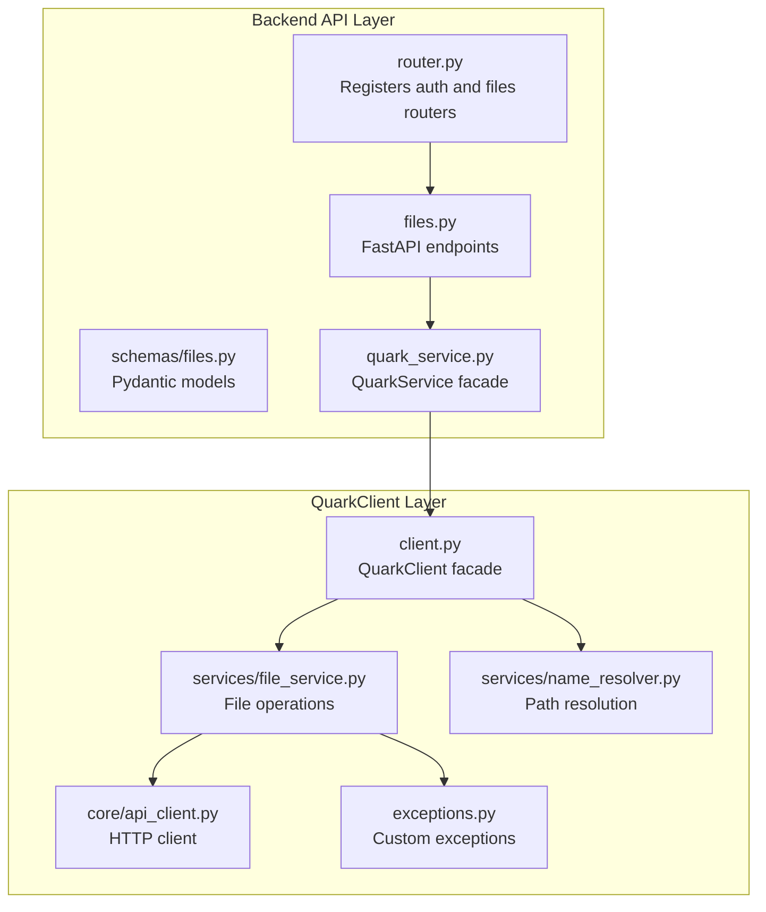
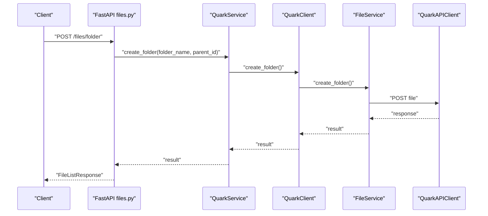
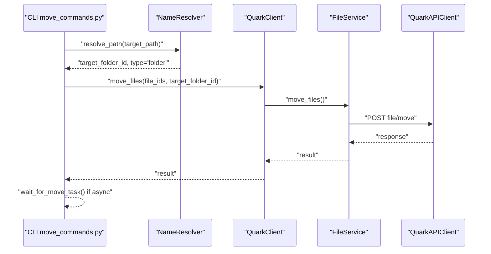
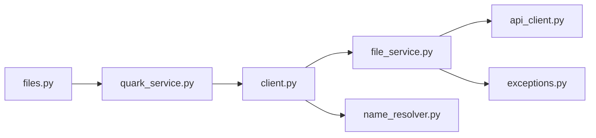

# File Operations

<cite>
**Referenced Files in This Document**
- [files.py](file://backend/app/api/v1/files.py)
- [files.py](file://backend/app/schemas/files.py)
- [quark_service.py](file://backend/app/services/quark_service.py)
- [router.py](file://backend/app/api/v1/router.py)
- [file_service.py](file://quark_client/services/file_service.py)
- [client.py](file://quark_client/client.py)
- [api_client.py](file://quark_client/core/api_client.py)
- [name_resolver.py](file://quark_client/services/name_resolver.py)
- [basic_fileops.py](file://quark_client/cli/commands/basic_fileops.py)
- [move_commands.py](file://quark_client/cli/commands/move_commands.py)
- [exceptions.py](file://quark_client/exceptions.py)
</cite>

## Table of Contents
1. [Introduction](#introduction)
2. [Project Structure](#project-structure)
3. [Core Components](#core-components)
4. [Architecture Overview](#architecture-overview)
5. [Detailed Component Analysis](#detailed-component-analysis)
6. [Dependency Analysis](#dependency-analysis)
7. [Performance Considerations](#performance-considerations)
8. [Troubleshooting Guide](#troubleshooting-guide)
9. [Conclusion](#conclusion)

## Introduction
This document provides comprehensive documentation for file operations covering CRUD functionality in the QuarkManager project. It focuses on:
- Create folder operation: request validation, parent directory handling, and error scenarios
- Delete file operation: batch deletion support, confirmation mechanisms, and cascade effects
- Rename operation: name validation, conflict resolution, and atomic transaction handling
- Move operation: cross-directory moving, permission checks, and destination validation

It also explains integration with the QuarkClient service layer, practical examples, error handling patterns, and performance considerations for large-scale operations and concurrent access.

## Project Structure
The file operations are implemented across two primary layers:
- Backend FastAPI routes and services that expose REST endpoints and delegate to the QuarkClient
- QuarkClient service layer that communicates with the Quark Cloud API

**Diagram sources**
- [router.py:1-24](file://backend/app/api/v1/router.py#L1-L24)
- [files.py:1-150](file://backend/app/api/v1/files.py#L1-L150)
- [files.py:1-54](file://backend/app/schemas/files.py#L1-L54)
- [quark_service.py:1-388](file://backend/app/services/quark_service.py#L1-L388)
- [client.py:1-405](file://quark_client/client.py#L1-L405)
- [file_service.py:1-893](file://quark_client/services/file_service.py#L1-L893)
- [name_resolver.py:1-198](file://quark_client/services/name_resolver.py#L1-L198)
- [api_client.py:1-209](file://quark_client/core/api_client.py#L1-L209)
- [exceptions.py:1-50](file://quark_client/exceptions.py#L1-L50)

**Section sources**
- [router.py:1-24](file://backend/app/api/v1/router.py#L1-L24)
- [files.py:1-150](file://backend/app/api/v1/files.py#L1-L150)
- [files.py:1-54](file://backend/app/schemas/files.py#L1-L54)
- [quark_service.py:1-388](file://backend/app/services/quark_service.py#L1-L388)
- [client.py:1-405](file://quark_client/client.py#L1-L405)
- [file_service.py:1-893](file://quark_client/services/file_service.py#L1-L893)
- [name_resolver.py:1-198](file://quark_client/services/name_resolver.py#L1-L198)
- [api_client.py:1-209](file://quark_client/core/api_client.py#L1-L209)
- [exceptions.py:1-50](file://quark_client/exceptions.py#L1-L50)

## Core Components
- Backend FastAPI endpoints define the REST interface for file operations and validate requests using Pydantic models.
- QuarkService acts as a facade, initializing and delegating to QuarkClient for actual cloud operations.
- QuarkClient orchestrates FileService, NameResolver, and API client to perform operations and handle errors.
- FileService encapsulates HTTP calls to the Quark Cloud API for list, create, delete, rename, move, search, and storage operations.
- NameResolver resolves human-readable paths to file/folder IDs and caches directory listings for performance.
- API client handles HTTP transport, authentication, timeouts, and error mapping.

**Section sources**
- [files.py:1-150](file://backend/app/api/v1/files.py#L1-L150)
- [files.py:1-54](file://backend/app/schemas/files.py#L1-L54)
- [quark_service.py:23-388](file://backend/app/services/quark_service.py#L23-L388)
- [client.py:18-405](file://quark_client/client.py#L18-L405)
- [file_service.py:13-893](file://quark_client/services/file_service.py#L13-L893)
- [name_resolver.py:10-198](file://quark_client/services/name_resolver.py#L10-L198)
- [api_client.py:16-209](file://quark_client/core/api_client.py#L16-L209)

## Architecture Overview
The system follows a layered architecture:
- Presentation: FastAPI routes accept requests and return standardized responses
- Application: QuarkService validates session state and delegates to QuarkClient
- Domain Services: QuarkClient coordinates FileService and NameResolver
- Infrastructure: API client performs HTTP requests and maps errors

**Diagram sources**
- [files.py:38-53](file://backend/app/api/v1/files.py#L38-L53)
- [quark_service.py:255-269](file://backend/app/services/quark_service.py#L255-L269)
- [client.py:158-160](file://quark_client/client.py#L158-L160)
- [file_service.py:103-129](file://quark_client/services/file_service.py#L103-L129)
- [api_client.py:184-190](file://quark_client/core/api_client.py#L184-L190)

## Detailed Component Analysis

### Create Folder Operation
- Request validation: The endpoint expects a CreateFolderRequest model with folder_name and parent_id.
- Parent directory handling: parent_id defaults to "0" (root), enabling creation under the root or a specific folder.
- Error scenarios:
  - Unauthorized or invalid session handled by QuarkService
  - API errors mapped to HTTP 400 with detailed messages
  - QuarkClient exceptions raised as APIError

Practical example:
- Using the CLI command to create a folder under the root:
  - Command: create a folder named "NewFolder" under root
  - Internally resolves to FileService.create_folder with parent_id="0"

Integration flow:
- FastAPI endpoint -> QuarkService -> QuarkClient -> FileService -> QuarkAPIClient -> Cloud API

**Section sources**
- [files.py:19-53](file://backend/app/api/v1/files.py#L19-L53)
- [files.py:19-23](file://backend/app/schemas/files.py#L19-L23)
- [quark_service.py:255-269](file://backend/app/services/quark_service.py#L255-L269)
- [client.py:158-160](file://quark_client/client.py#L158-L160)
- [file_service.py:103-129](file://quark_client/services/file_service.py#L103-L129)
- [api_client.py:184-190](file://quark_client/core/api_client.py#L184-L190)

### Delete File Operation
- Batch deletion support: Accepts a list of file IDs to delete in a single request.
- Confirmation mechanisms: The CLI provides interactive confirmation before deletion.
- Cascade effects: Deletion removes files and folders; cascading behavior depends on cloud API semantics.

Practical example:
- Using the CLI command to delete multiple items by ID or path with confirmation prompts
- Internally resolves paths to IDs and calls FileService.delete_files

Integration flow:
- FastAPI endpoint -> QuarkService -> QuarkClient -> FileService -> QuarkAPIClient -> Cloud API

**Section sources**
- [files.py:56-68](file://backend/app/api/v1/files.py#L56-L68)
- [files.py:25-28](file://backend/app/schemas/files.py#L25-L28)
- [quark_service.py:271-285](file://backend/app/services/quark_service.py#L271-L285)
- [client.py:162-164](file://quark_client/client.py#L162-L164)
- [file_service.py:131-155](file://quark_client/services/file_service.py#L131-L155)
- [basic_fileops.py:45-108](file://quark_client/cli/commands/basic_fileops.py#L45-L108)

### Rename Operation
- Name validation: The request requires a valid file_id and new_name.
- Conflict resolution: The underlying API determines whether conflicts are allowed; the service does not implement additional conflict detection.
- Atomic transaction handling: The rename operation is executed as a single API call; asynchronous completion is not applicable.

Practical example:
- Using the CLI command to rename a file by ID or path, with confirmation prompts

Integration flow:
- FastAPI endpoint -> QuarkService -> QuarkClient -> FileService -> QuarkAPIClient -> Cloud API

**Section sources**
- [files.py:71-86](file://backend/app/api/v1/files.py#L71-L86)
- [files.py:30-34](file://backend/app/schemas/files.py#L30-L34)
- [quark_service.py:287-301](file://backend/app/services/quark_service.py#L287-L301)
- [client.py:166-168](file://quark_client/client.py#L166-L168)
- [file_service.py:157-181](file://quark_client/services/file_service.py#L157-L181)
- [basic_fileops.py:111-158](file://quark_client/cli/commands/basic_fileops.py#L111-L158)

### Move Operation
- Cross-directory moving: Supports moving multiple files to a target folder by ID.
- Permission checks: Enforced by the cloud API; failures are surfaced as errors.
- Destination validation: The CLI validates that the target path resolves to a folder before attempting the move.

Practical example:
- Using the CLI command to move files by path or ID to a target folder, with automatic folder creation option

Integration flow:
- FastAPI endpoint -> QuarkService -> QuarkClient -> FileService -> QuarkAPIClient -> Cloud API

**Diagram sources**
- [move_commands.py:13-96](file://quark_client/cli/commands/move_commands.py#L13-L96)
- [name_resolver.py:19-73](file://quark_client/services/name_resolver.py#L19-L73)
- [client.py:370-387](file://quark_client/client.py#L370-L387)
- [file_service.py:386-472](file://quark_client/services/file_service.py#L386-L472)
- [api_client.py:184-190](file://quark_client/core/api_client.py#L184-L190)

**Section sources**
- [files.py:89-104](file://backend/app/api/v1/files.py#L89-L104)
- [files.py:36-39](file://backend/app/schemas/files.py#L36-L39)
- [quark_service.py:303-317](file://backend/app/services/quark_service.py#L303-L317)
- [client.py:370-387](file://quark_client/client.py#L370-L387)
- [file_service.py:386-472](file://quark_client/services/file_service.py#L386-L472)
- [move_commands.py:13-168](file://quark_client/cli/commands/move_commands.py#L13-L168)

## Dependency Analysis
Key dependencies and relationships:
- FastAPI files.py depends on Pydantic models and QuarkService
- QuarkService depends on QuarkClient and manages authentication state
- QuarkClient composes FileService, NameResolver, and QuarkAPIClient
- FileService depends on QuarkAPIClient and raises APIError on failures
- NameResolver caches directory listings and resolves paths to IDs
- API client handles HTTP transport and maps errors to custom exceptions

**Diagram sources**
- [files.py:1-150](file://backend/app/api/v1/files.py#L1-L150)
- [quark_service.py:1-388](file://backend/app/services/quark_service.py#L1-L388)
- [client.py:1-405](file://quark_client/client.py#L1-L405)
- [file_service.py:1-893](file://quark_client/services/file_service.py#L1-L893)
- [name_resolver.py:1-198](file://quark_client/services/name_resolver.py#L1-L198)
- [api_client.py:1-209](file://quark_client/core/api_client.py#L1-L209)
- [exceptions.py:1-50](file://quark_client/exceptions.py#L1-L50)

**Section sources**
- [files.py:1-150](file://backend/app/api/v1/files.py#L1-L150)
- [quark_service.py:1-388](file://backend/app/services/quark_service.py#L1-L388)
- [client.py:1-405](file://quark_client/client.py#L1-L405)
- [file_service.py:1-893](file://quark_client/services/file_service.py#L1-L893)
- [name_resolver.py:1-198](file://quark_client/services/name_resolver.py#L1-L198)
- [api_client.py:1-209](file://quark_client/core/api_client.py#L1-L209)
- [exceptions.py:1-50](file://quark_client/exceptions.py#L1-L50)

## Performance Considerations
- Path resolution caching: NameResolver caches directory listings to reduce repeated API calls during batch operations.
- Asynchronous task handling: Move operations may return an asynchronous task; FileService polls task completion with configurable intervals and retries.
- Pagination and filtering: FileService supports pagination and advanced filtering to limit payload sizes and improve responsiveness.
- Concurrency: The API client uses HTTPX with timeouts; ensure callers implement rate limiting and backoff strategies when performing bulk operations.
- Large-scale operations: Prefer batch APIs where available (e.g., delete_files accepts a list) to minimize round trips.

[No sources needed since this section provides general guidance]

## Troubleshooting Guide
Common error handling patterns:
- Authentication errors: API client maps HTTP 401/403 to AuthenticationError; re-login or refresh cookies.
- Network errors: API client maps timeouts and request errors to NetworkError; retry with exponential backoff.
- API errors: API client checks response status and raises APIError with message and optional status code.
- File not found: NameResolver and FileService raise FileNotFoundError when paths or IDs are invalid.
- CLI confirmation: The CLI prompts for confirmation before destructive operations (delete, rename) to prevent accidental data loss.

**Section sources**
- [api_client.py:146-182](file://quark_client/core/api_client.py#L146-L182)
- [exceptions.py:13-49](file://quark_client/exceptions.py#L13-L49)
- [basic_fileops.py:87-90](file://quark_client/cli/commands/basic_fileops.py#L87-L90)
- [file_service.py:56-59](file://quark_client/services/file_service.py#L56-L59)
- [file_service.py:98-101](file://quark_client/services/file_service.py#L98-L101)

## Conclusion
The file operations are implemented through a clean separation of concerns:
- FastAPI routes define the contract and validation
- QuarkService manages session state and delegates to QuarkClient
- QuarkClient coordinates FileService and NameResolver for robust, efficient operations
- API client encapsulates HTTP transport and error mapping

This design enables reliable CRUD operations with strong error handling, path resolution, and asynchronous task management suitable for both small-scale and large-scale usage.