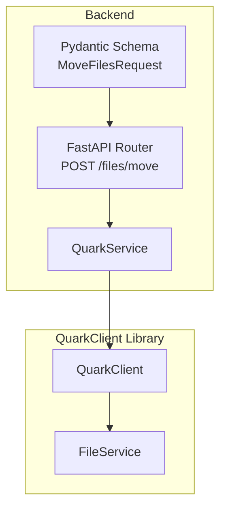
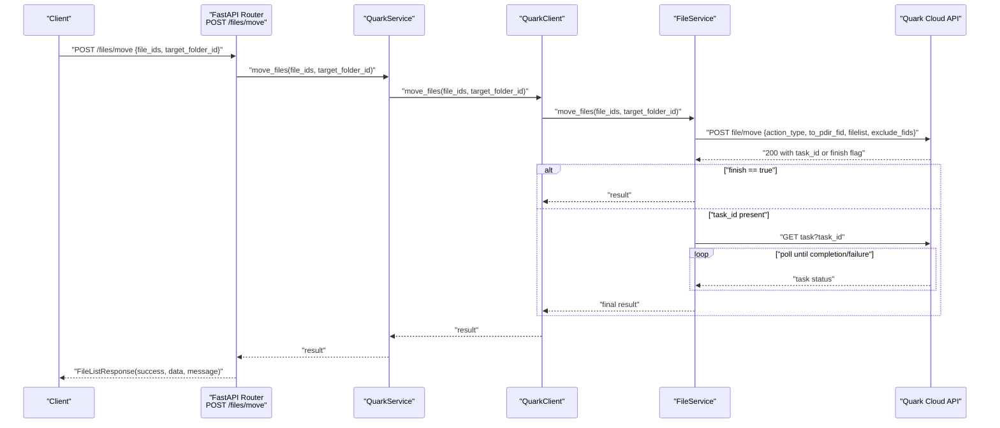
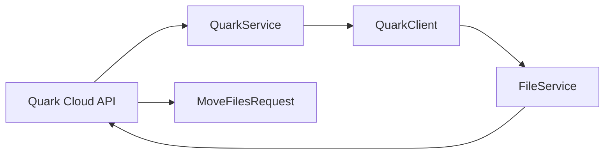

# Move Files Operation

<cite>
**Referenced Files in This Document**
- [files.py](file://backend/app/api/v1/files.py)
- [files.py](file://backend/app/schemas/files.py)
- [quark_service.py](file://backend/app/services/quark_service.py)
- [file_service.py](file://quark_client/services/file_service.py)
- [client.py](file://quark_client/client.py)
- [exceptions.py](file://quark_client/exceptions.py)
- [move_commands.py](file://quark_client/cli/commands/move_commands.py)
</cite>

## Table of Contents
1. [Introduction](#introduction)
2. [Project Structure](#project-structure)
3. [Core Components](#core-components)
4. [Architecture Overview](#architecture-overview)
5. [Detailed Component Analysis](#detailed-component-analysis)
6. [Dependency Analysis](#dependency-analysis)
7. [Performance Considerations](#performance-considerations)
8. [Troubleshooting Guide](#troubleshooting-guide)
9. [Conclusion](#conclusion)

## Introduction
This document explains the move files operation implemented in the system. It covers the HTTP endpoint POST /files/move, the request schema, the service layer integration with the QuarkClient’s file_service.move_files method, cross-directory moving logic, permission and space validation, atomicity considerations, error handling, and practical usage examples. It also addresses performance optimization and concurrency safeguards for large-scale and concurrent operations.

## Project Structure
The move files operation spans the backend FastAPI router, Pydantic request schema, backend service wrapper, and the QuarkClient library that communicates with the Quark Cloud API.

**Diagram sources**
- [files.py:89-104](file://backend/app/api/v1/files.py#L89-L104)
- [quark_service.py:303-317](file://backend/app/services/quark_service.py#L303-L317)
- [client.py:369-387](file://quark_client/client.py#L369-L387)
- [file_service.py:386-427](file://quark_client/services/file_service.py#L386-L427)
- [files.py:36-40](file://backend/app/schemas/files.py#L36-L40)

**Section sources**
- [files.py:1-150](file://backend/app/api/v1/files.py#L1-L150)
- [files.py:1-54](file://backend/app/schemas/files.py#L1-L54)
- [quark_service.py:1-388](file://backend/app/services/quark_service.py#L1-L388)
- [client.py:1-405](file://quark_client/client.py#L1-L405)
- [file_service.py:1-893](file://quark_client/services/file_service.py#L1-L893)

## Core Components
- Endpoint: POST /files/move
- Request schema: MoveFilesRequest with file_ids array and target_folder_id
- Backend service: QuarkService.move_files
- Client integration: QuarkClient.move_files -> FileService.move_files
- Task handling: Asynchronous move task polling with completion or failure detection

Key behaviors:
- Validates presence of file_ids and target_folder_id
- Delegates to QuarkClient for execution
- Handles synchronous vs asynchronous task completion
- Returns structured success/error responses

**Section sources**
- [files.py:89-104](file://backend/app/api/v1/files.py#L89-L104)
- [files.py:36-40](file://backend/app/schemas/files.py#L36-L40)
- [quark_service.py:303-317](file://backend/app/services/quark_service.py#L303-L317)
- [client.py:369-387](file://quark_client/client.py#L369-L387)
- [file_service.py:386-472](file://quark_client/services/file_service.py#L386-L472)

## Architecture Overview
The move operation follows a layered architecture:
- API layer validates and forwards request to service layer
- Service layer authenticates and delegates to QuarkClient
- QuarkClient invokes FileService to call the Quark Cloud API
- FileService handles task creation and optional polling

**Diagram sources**
- [files.py:89-104](file://backend/app/api/v1/files.py#L89-L104)
- [quark_service.py:303-317](file://backend/app/services/quark_service.py#L303-L317)
- [client.py:369-387](file://quark_client/client.py#L369-L387)
- [file_service.py:386-472](file://quark_client/services/file_service.py#L386-L472)

## Detailed Component Analysis

### Endpoint Definition and Request Schema
- Endpoint: POST /files/move
- Request body: MoveFilesRequest
  - file_ids: array of string IDs
  - target_folder_id: string ID of destination folder
- Response: FileListResponse with success, data, message

Validation and behavior:
- The schema enforces presence of both fields
- The API layer forwards the request to the service layer
- On failure, raises HTTP 400 with message from service

**Section sources**
- [files.py:89-104](file://backend/app/api/v1/files.py#L89-L104)
- [files.py:36-40](file://backend/app/schemas/files.py#L36-L40)

### Service Layer Integration
- QuarkService.move_files validates authentication and delegates to QuarkClient
- Returns structured success/error response suitable for HTTP handlers

**Section sources**
- [quark_service.py:303-317](file://backend/app/services/quark_service.py#L303-L317)

### Client Integration and Task Handling
- QuarkClient.move_files delegates to FileService.move_files
- FileService.move_files constructs the payload and calls the Quark Cloud API
- If the API indicates asynchronous task execution, FileService polls the task until completion or failure

Asynchronous task flow:
- If finish is true, return immediately
- Else if task_id is present, poll task status with bounded retries and interval
- On task status 3, raise an API error indicating failure
- On timeout, raise an API error

**Section sources**
- [client.py:369-387](file://quark_client/client.py#L369-L387)
- [file_service.py:386-472](file://quark_client/services/file_service.py#L386-L472)

### Cross-Directory Moving Logic
- Source validation: The underlying API expects valid file IDs; invalid IDs will surface as errors during the move operation
- Destination validation: The target_folder_id must be a valid folder ID; invalid IDs will surface as errors
- Space validation: The API does not expose explicit space checks in the move endpoint; space-related failures would appear as API errors during task execution
- Atomicity: The move operation is executed server-side by the Quark Cloud API; the client does not implement application-level transactions

Practical notes:
- The CLI commands demonstrate parsing paths to IDs and verifying the target is a folder before invoking the move
- The service layer does not implement additional permission checks beyond authentication

**Section sources**
- [move_commands.py:44-71](file://quark_client/cli/commands/move_commands.py#L44-L71)
- [file_service.py:428-472](file://quark_client/services/file_service.py#L428-L472)

### Error Handling
Common error categories and handling:
- Invalid file IDs: surfaced as API errors from the Quark Cloud API
- Destination validation failures: surfaced as API errors when target_folder_id is invalid
- Insufficient storage space: surfaced as API errors during task execution
- Task polling failures: raised as API errors if polling fails or times out
- Authentication failures: handled by service layer returning “not logged in” messages

Exceptions used:
- APIError for API-related failures
- FileNotFoundError for path resolution issues in CLI commands

**Section sources**
- [file_service.py:412-426](file://quark_client/services/file_service.py#L412-L426)
- [file_service.py:460-472](file://quark_client/services/file_service.py#L460-L472)
- [exceptions.py:23-29](file://quark_client/exceptions.py#L23-L29)
- [move_commands.py:52-60](file://quark_client/cli/commands/move_commands.py#L52-L60)

### Practical Examples

- Single file move
  - Request: POST /files/move with file_ids containing one ID and target_folder_id pointing to the destination folder
  - Behavior: Moves the file synchronously or asynchronously depending on API response

- Batch moves
  - Request: POST /files/move with file_ids containing multiple IDs and target_folder_id
  - Behavior: Moves all files to the destination folder; individual failures are reported by the API

- Cross-folder transfers
  - Request: POST /files/move with file_ids and target_folder_id set to a different folder
  - Behavior: Moves files across folders; destination must be a valid folder ID

- Error scenarios
  - Invalid file IDs: API error propagated to the caller
  - Invalid target_folder_id: API error propagated to the caller
  - Insufficient storage space: API error during task execution
  - Task timeout: API error raised by the client

Note: The CLI demonstrates path-to-ID resolution and target verification prior to invoking the move operation.

**Section sources**
- [files.py:89-104](file://backend/app/api/v1/files.py#L89-L104)
- [move_commands.py:13-96](file://quark_client/cli/commands/move_commands.py#L13-L96)

## Dependency Analysis
The move operation depends on:
- API router for request routing and response wrapping
- Pydantic schema for request validation
- Service layer for authentication and delegation
- Client layer for API invocation
- FileService for task orchestration

**Diagram sources**
- [files.py:89-104](file://backend/app/api/v1/files.py#L89-L104)
- [quark_service.py:303-317](file://backend/app/services/quark_service.py#L303-L317)
- [client.py:369-387](file://quark_client/client.py#L369-L387)
- [file_service.py:386-472](file://quark_client/services/file_service.py#L386-L472)
- [files.py:36-40](file://backend/app/schemas/files.py#L36-L40)

**Section sources**
- [files.py:1-150](file://backend/app/api/v1/files.py#L1-L150)
- [quark_service.py:1-388](file://backend/app/services/quark_service.py#L1-L388)
- [client.py:1-405](file://quark_client/client.py#L1-L405)
- [file_service.py:1-893](file://quark_client/services/file_service.py#L1-L893)
- [files.py:1-54](file://backend/app/schemas/files.py#L1-L54)

## Performance Considerations
- Asynchronous task handling: The client polls task status with bounded retries and a fixed interval, preventing indefinite blocking
- Batching: Multiple file IDs can be moved in a single request to reduce overhead
- Concurrency: The API does not expose explicit concurrency controls; clients should serialize conflicting moves to the same destination to avoid race conditions
- Network efficiency: Reuse connections via the shared API client; avoid frequent re-authentication

[No sources needed since this section provides general guidance]

## Troubleshooting Guide
- Symptom: HTTP 400 with message
  - Cause: Service layer or API layer detected invalid input or encountered an error
  - Action: Verify file_ids and target_folder_id; ensure the user is logged in

- Symptom: Task polling timeout
  - Cause: The Quark Cloud API did not complete the move task within the allowed time window
  - Action: Retry the operation; check network connectivity and API availability

- Symptom: API error during move
  - Cause: Invalid file IDs, invalid target folder ID, or insufficient storage space
  - Action: Validate IDs and target folder; confirm available space; retry after resolving the issue

- Symptom: Path resolution failure in CLI
  - Cause: Target path does not resolve to a folder or source path is invalid
  - Action: Confirm paths and ensure the target is a folder; use explicit IDs if necessary

**Section sources**
- [quark_service.py:303-317](file://backend/app/services/quark_service.py#L303-L317)
- [file_service.py:412-426](file://quark_client/services/file_service.py#L412-L426)
- [file_service.py:460-472](file://quark_client/services/file_service.py#L460-L472)
- [move_commands.py:52-60](file://quark_client/cli/commands/move_commands.py#L52-L60)

## Conclusion
The move files operation is implemented as a straightforward pipeline from the FastAPI endpoint to the QuarkClient and FileService. It supports single and batch moves across directories, handles asynchronous task completion, and surfaces errors from the underlying API. For production use, ensure proper validation of IDs and targets, monitor task completion, and apply client-side serialization to avoid conflicts when moving many items concurrently.