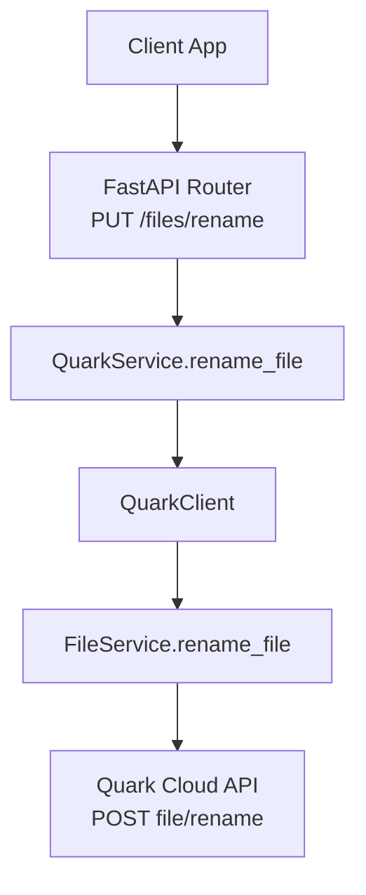
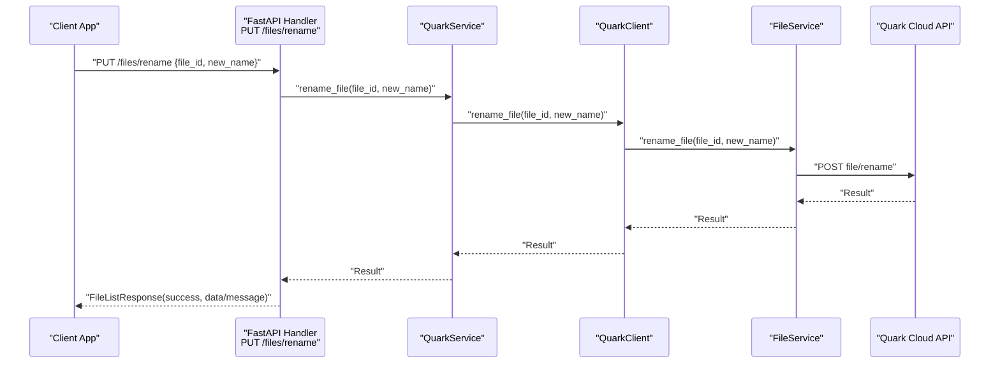
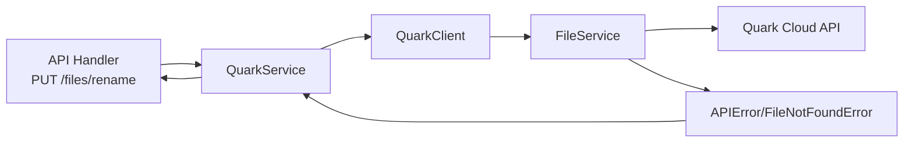

# Rename File Operation

<cite>
**Referenced Files in This Document**
- [files.py](file://backend/app/api/v1/files.py)
- [files.py](file://backend/app/schemas/files.py)
- [quark_service.py](file://backend/app/services/quark_service.py)
- [file_service.py](file://quark_client/services/file_service.py)
- [client.py](file://quark_client/client.py)
- [exceptions.py](file://quark_client/exceptions.py)
- [database.py](file://backend/app/core/database.py)
</cite>

## Table of Contents
1. [Introduction](#introduction)
2. [Project Structure](#project-structure)
3. [Core Components](#core-components)
4. [Architecture Overview](#architecture-overview)
5. [Detailed Component Analysis](#detailed-component-analysis)
6. [Dependency Analysis](#dependency-analysis)
7. [Performance Considerations](#performance-considerations)
8. [Troubleshooting Guide](#troubleshooting-guide)
9. [Conclusion](#conclusion)

## Introduction
This document explains the rename file operation in the system, focusing on the PUT /files/rename endpoint. It covers the request schema, backend API handler, service layer integration with the QuarkClient, and how errors are handled. It also provides practical examples for successful renames, conflict scenarios, and error conditions, along with concurrency and thread-safety considerations.

## Project Structure
The rename operation spans three layers:
- API layer: FastAPI router exposing the PUT /files/rename endpoint
- Service layer: Backend QuarkService orchestrating the rename via the QuarkClient
- Client layer: QuarkClient and FileService interacting with the Quark Cloud API

**Diagram sources**
- [files.py:71-86](file://backend/app/api/v1/files.py#L71-L86)
- [quark_service.py:287-301](file://backend/app/services/quark_service.py#L287-L301)
- [client.py:166-168](file://quark_client/client.py#L166-L168)
- [file_service.py:157-181](file://quark_client/services/file_service.py#L157-L181)

**Section sources**
- [files.py:71-86](file://backend/app/api/v1/files.py#L71-L86)
- [quark_service.py:287-301](file://backend/app/services/quark_service.py#L287-L301)
- [client.py:166-168](file://quark_client/client.py#L166-L168)
- [file_service.py:157-181](file://quark_client/services/file_service.py#L157-L181)

## Core Components
- Endpoint: PUT /files/rename
- Request schema: RenameFileRequest with file_id and new_name
- Service integration: QuarkService.rename_file delegates to QuarkClient.rename_file
- Client integration: QuarkClient uses FileService.rename_file to call the Quark Cloud API

Key behaviors:
- Validation occurs at the API boundary via Pydantic models
- The service layer checks authentication and wraps client-side exceptions
- The client layer performs the actual API call to rename a file

**Section sources**
- [files.py:71-86](file://backend/app/api/v1/files.py#L71-L86)
- [files.py:30-34](file://backend/app/schemas/files.py#L30-L34)
- [quark_service.py:287-301](file://backend/app/services/quark_service.py#L287-L301)
- [file_service.py:157-181](file://quark_client/services/file_service.py#L157-L181)

## Architecture Overview
The rename flow is a thin API wrapper around the QuarkClient. The backend validates inputs and delegates to the client, which interacts with the cloud API.

**Diagram sources**
- [files.py:71-86](file://backend/app/api/v1/files.py#L71-L86)
- [quark_service.py:287-301](file://backend/app/services/quark_service.py#L287-L301)
- [client.py:166-168](file://quark_client/client.py#L166-L168)
- [file_service.py:157-181](file://quark_client/services/file_service.py#L157-L181)

## Detailed Component Analysis

### Endpoint Definition and Request Schema
- Endpoint: PUT /files/rename
- Handler: async def rename_file(request: RenameFileRequest)
- Request model: RenameFileRequest with:
  - file_id: str
  - new_name: str

Behavior:
- The handler forwards the request to the service layer
- On failure, raises HTTPException with status 400 and the returned message

**Section sources**
- [files.py:71-86](file://backend/app/api/v1/files.py#L71-L86)
- [files.py:30-34](file://backend/app/schemas/files.py#L30-L34)

### Service Layer Integration
- QuarkService.rename_file validates authentication and delegates to the client
- Returns a structured result with success flag and message/data
- Wraps exceptions into user-friendly messages

Concurrency note:
- The service is a singleton-like class with a single shared instance; however, the rename operation itself is a single API call and does not introduce explicit locking or transactions in the backend

**Section sources**
- [quark_service.py:287-301](file://backend/app/services/quark_service.py#L287-L301)

### Client Layer Integration
- QuarkClient exposes rename_file(file_id, new_name)
- FileService.rename_file constructs the payload and calls the Quark Cloud API endpoint for renaming
- The client layer handles network and API-specific errors via exceptions

Conflict resolution:
- The client layer does not implement automatic suffix addition for conflicting names
- Conflicts are handled by the upstream API; the backend receives whatever result the API returns

Thread safety:
- The client is not designed as a thread-safe singleton; concurrent callers should coordinate externally if needed

**Section sources**
- [client.py:166-168](file://quark_client/client.py#L166-L168)
- [file_service.py:157-181](file://quark_client/services/file_service.py#L157-L181)
- [exceptions.py:23-29](file://quark_client/exceptions.py#L23-L29)

### Atomic Transaction Handling
- The rename operation is a single HTTP request to the Quark Cloud API
- There is no explicit backend-level transaction management for renames
- The backend relies on the upstream API’s atomicity guarantees

Implications:
- No rollback semantics are implemented in the backend
- If the upstream API fails mid-operation, the backend cannot reconcile state

**Section sources**
- [file_service.py:157-181](file://quark_client/services/file_service.py#L157-L181)
- [database.py:1-29](file://backend/app/core/database.py#L1-L29)

### Error Handling
Common error categories:
- Invalid file ID: The client raises a FileNotFoundError when resolving or accessing file info
- Name validation failures: The upstream API determines validity; the backend surfaces the API message
- Permission restrictions: The upstream API enforces permissions; the backend surfaces the API message
- Authentication errors: QuarkService checks login status and returns appropriate messages

HTTP status mapping:
- The API handler raises HTTPException with status 400 when the service result indicates failure

**Section sources**
- [file_service.py:61-101](file://quark_client/services/file_service.py#L61-L101)
- [quark_service.py:287-301](file://backend/app/services/quark_service.py#L287-L301)
- [files.py:79-80](file://backend/app/api/v1/files.py#L79-L80)

### Practical Examples

#### Successful Rename
- Request: PUT /files/rename with file_id and new_name
- Expected outcome: success true, data containing renamed file metadata, message optional
- Behavior: The API handler forwards to the service, which calls the client and returns the upstream result

#### Conflict Scenario (Name Already Exists)
- Request: PUT /files/rename with a new_name that conflicts with an existing sibling item
- Outcome: The upstream API rejects the rename; the backend surfaces the API message
- Automatic suffix addition: Not implemented in the client; the caller should choose a different name

#### Error Conditions
- Invalid file ID: The client raises a FileNotFoundError; the backend surfaces the error
- Unauthenticated: QuarkService returns a message indicating not logged in
- Upstream API error: The service wraps the error and returns a failure result; the API handler converts it to HTTP 400

Note: The client layer does not implement automatic suffix addition for conflicts; conflicts are resolved by the upstream API.

**Section sources**
- [file_service.py:61-101](file://quark_client/services/file_service.py#L61-L101)
- [quark_service.py:287-301](file://backend/app/services/quark_service.py#L287-L301)
- [files.py:79-80](file://backend/app/api/v1/files.py#L79-L80)

### Concurrency and Thread Safety
- The rename operation is a single API call; there is no backend-managed transaction
- The client is not designed as a thread-safe singleton; concurrent callers should avoid simultaneous renames of the same resource
- If strict consistency is required, external coordination (e.g., application-level locks) should be implemented by the caller

**Section sources**
- [quark_service.py:23-36](file://backend/app/services/quark_service.py#L23-L36)
- [file_service.py:157-181](file://quark_client/services/file_service.py#L157-L181)

## Dependency Analysis
The rename flow depends on the following relationships:
- API handler depends on the service layer
- Service layer depends on the QuarkClient
- Client layer depends on FileService and the Quark Cloud API
- Exceptions propagate up from the client to the API layer

**Diagram sources**
- [files.py:71-86](file://backend/app/api/v1/files.py#L71-L86)
- [quark_service.py:287-301](file://backend/app/services/quark_service.py#L287-L301)
- [client.py:166-168](file://quark_client/client.py#L166-L168)
- [file_service.py:157-181](file://quark_client/services/file_service.py#L157-L181)
- [exceptions.py:23-29](file://quark_client/exceptions.py#L23-L29)

**Section sources**
- [files.py:71-86](file://backend/app/api/v1/files.py#L71-L86)
- [quark_service.py:287-301](file://backend/app/services/quark_service.py#L287-L301)
- [client.py:166-168](file://quark_client/client.py#L166-L168)
- [file_service.py:157-181](file://quark_client/services/file_service.py#L157-L181)
- [exceptions.py:23-29](file://quark_client/exceptions.py#L23-L29)

## Performance Considerations
- The rename operation is a single HTTP request; latency is dominated by network and upstream API response time
- There is no batching or caching of rename operations in the backend
- For high-throughput scenarios, consider rate-limiting at the client and coordinating concurrent operations externally

## Troubleshooting Guide
Common issues and resolutions:
- HTTP 400 Bad Request after PUT /files/rename:
  - Indicates the service returned failure; inspect the returned message for details
- FileNotFoundError during rename:
  - The file_id may be invalid or inaccessible; verify the ID and permissions
- Authentication errors:
  - Ensure the client is logged in; re-authenticate if needed
- Upstream API failures:
  - Retry after verifying network connectivity and API availability

**Section sources**
- [files.py:79-80](file://backend/app/api/v1/files.py#L79-L80)
- [file_service.py:61-101](file://quark_client/services/file_service.py#L61-L101)
- [quark_service.py:287-301](file://backend/app/services/quark_service.py#L287-L301)

## Conclusion
The rename file operation is implemented as a straightforward API endpoint backed by a service and client layer. It validates inputs at the API boundary, delegates to the QuarkClient, and surfaces upstream API results. There is no backend-level transaction or automatic conflict resolution; conflicts are handled by the upstream API. For robust deployments under concurrency, external coordination is recommended.