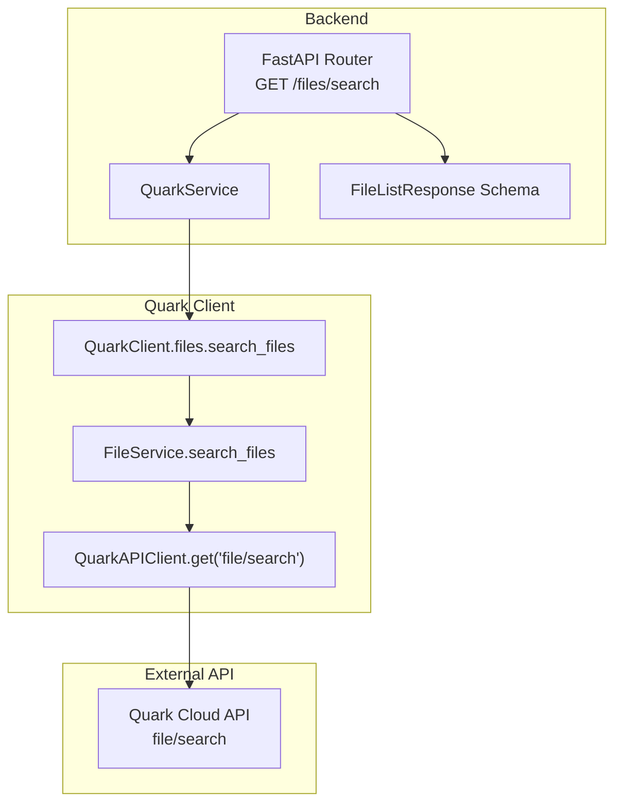
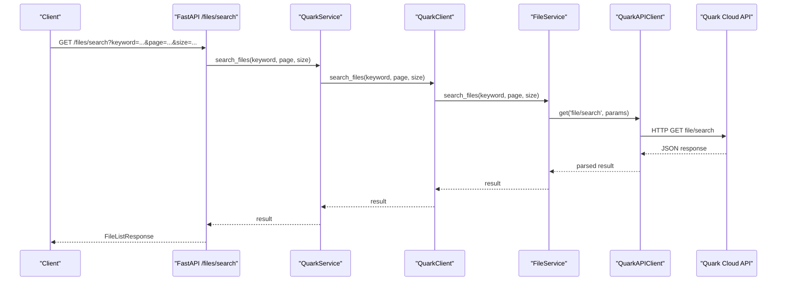
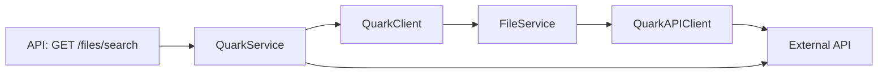

# Search Operation

<cite>
**Referenced Files in This Document**
- [files.py](file://backend/app/api/v1/files.py)
- [files.py](file://backend/app/schemas/files.py)
- [quark_service.py](file://backend/app/services/quark_service.py)
- [file_service.py](file://quark_client/services/file_service.py)
- [client.py](file://quark_client/client.py)
- [api_client.py](file://quark_client/core/api_client.py)
- [exceptions.py](file://quark_client/exceptions.py)
- [search.py](file://quark_client/cli/commands/search.py)
</cite>

## Table of Contents
1. [Introduction](#introduction)
2. [Project Structure](#project-structure)
3. [Core Components](#core-components)
4. [Architecture Overview](#architecture-overview)
5. [Detailed Component Analysis](#detailed-component-analysis)
6. [Dependency Analysis](#dependency-analysis)
7. [Performance Considerations](#performance-considerations)
8. [Troubleshooting Guide](#troubleshooting-guide)
9. [Conclusion](#conclusion)

## Introduction
This document provides comprehensive coverage of the search operation implemented in the project, focusing on the GET /files/search endpoint. It explains the SearchFilesRequest schema, the service layer integration with QuarkClient’s file_service.search_files method, and the underlying search algorithms and filtering criteria. It also documents pagination handling, practical examples of keyword searches, wildcard matching, and result ranking, along with performance considerations, indexing strategies, caching, and error handling for invalid keywords, empty results, and rate-limiting scenarios.

## Project Structure
The search operation spans both the backend FastAPI application and the Quark client library:
- Backend API layer defines the GET /files/search endpoint and validates pagination parameters.
- Service layer integrates with the Quark client to call the underlying search API.
- Quark client encapsulates HTTP communication and exposes a high-level search_files method.
- CLI provides an advanced search with client-side filtering and pagination.

**Diagram sources**
- [files.py:107-123](file://backend/app/api/v1/files.py#L107-L123)
- [quark_service.py:319-340](file://backend/app/services/quark_service.py#L319-L340)
- [client.py:84-86](file://quark_client/client.py#L84-L86)
- [file_service.py:183-219](file://quark_client/services/file_service.py#L183-L219)
- [api_client.py:184-186](file://quark_client/core/api_client.py#L184-L186)

**Section sources**
- [files.py:107-123](file://backend/app/api/v1/files.py#L107-L123)
- [quark_service.py:319-340](file://backend/app/services/quark_service.py#L319-L340)
- [client.py:84-86](file://quark_client/client.py#L84-L86)
- [file_service.py:183-219](file://quark_client/services/file_service.py#L183-L219)
- [api_client.py:184-186](file://quark_client/core/api_client.py#L184-L186)

## Core Components
- Search endpoint definition and request validation:
  - Endpoint: GET /files/search
  - Query parameters: keyword (required), page (default 1, ge 1), size (default 50, ge 1, le 200)
  - Response model: FileListResponse
- Search request schema:
  - SearchFilesRequest: keyword (required), page (default 1), size (default 50)
- Service integration:
  - QuarkService.search_files delegates to QuarkClient.search_files
  - QuarkClient.search_files delegates to FileService.search_files
  - FileService.search_files constructs query parameters and calls QuarkAPIClient.get('file/search')

**Section sources**
- [files.py:107-123](file://backend/app/api/v1/files.py#L107-L123)
- [files.py:42-46](file://backend/app/schemas/files.py#L42-L46)
- [quark_service.py:319-340](file://backend/app/services/quark_service.py#L319-L340)
- [client.py:84-86](file://quark_client/client.py#L84-L86)
- [file_service.py:183-219](file://quark_client/services/file_service.py#L183-L219)

## Architecture Overview
The search flow follows a layered architecture:
- API layer validates inputs and forwards to the service layer.
- Service layer manages authentication and delegates to the Quark client.
- Quark client builds and executes HTTP requests to the external API.
- Results are returned through the same chain to the client.

**Diagram sources**
- [files.py:107-123](file://backend/app/api/v1/files.py#L107-L123)
- [quark_service.py:319-340](file://backend/app/services/quark_service.py#L319-L340)
- [client.py:84-86](file://quark_client/client.py#L84-L86)
- [file_service.py:183-219](file://quark_client/services/file_service.py#L183-L219)
- [api_client.py:184-186](file://quark_client/core/api_client.py#L184-L186)

## Detailed Component Analysis

### Search Endpoint and Request Validation
- Endpoint: GET /files/search
- Query parameters:
  - keyword: required string
  - page: integer, default 1, minimum 1
  - size: integer, default 50, minimum 1, maximum 200
- Response:
  - Uses FileListResponse with success flag, optional data, and optional message
  - On failure, raises HTTPException with 400 status and message

**Section sources**
- [files.py:107-123](file://backend/app/api/v1/files.py#L107-L123)
- [files.py:12-16](file://backend/app/schemas/files.py#L12-L16)

### Search Request Schema
- SearchFilesRequest:
  - keyword: required string
  - page: integer, default 1, ge 1
  - size: integer, default 50, ge 1, le 200

**Section sources**
- [files.py:42-46](file://backend/app/schemas/files.py#L42-L46)

### Service Layer Integration
- QuarkService.search_files:
  - Validates availability and login state
  - Delegates to QuarkClient.search_files
  - Wraps results in a success/data/message structure
- QuarkClient.search_files:
  - Exposes FileService.search_files via a convenience method
- FileService.search_files:
  - Constructs query parameters including q, _page, _size, _fetch_total, _sort, and _is_hl
  - Calls QuarkAPIClient.get('file/search')
  - Note: folder_id parameter is accepted but not used in the current implementation

**Section sources**
- [quark_service.py:319-340](file://backend/app/services/quark_service.py#L319-L340)
- [client.py:84-86](file://quark_client/client.py#L84-L86)
- [file_service.py:183-219](file://quark_client/services/file_service.py#L183-L219)

### Search Algorithm and Filtering Criteria
- Keyword-based search:
  - The search uses the q parameter to pass the keyword to the external API.
- Pagination:
  - _page and _size control pagination.
  - The API returns metadata with _total indicating the total count.
- Sorting:
  - _sort is set to a combination of sort_field:sort_order and updated_at:desc.
  - The implementation sets default sort_field and sort_order in FileService.search_files.
- Highlighting:
  - _is_hl is enabled to highlight matched terms in results.
- Folder scope:
  - folder_id is accepted but not used; the implementation comments indicate the external API does not support folder-scoped search.

**Section sources**
- [file_service.py:183-219](file://quark_client/services/file_service.py#L183-L219)

### Advanced Filtering and Wildcard Matching
- Advanced search (client-side filtering):
  - FileService.search_files_advanced supports:
    - file_extensions: filter by file extension
    - min_size/max_size: filter by file size (bytes)
  - Strategy:
    - Fetches more results than requested (search_size = max(size * 3, 100)) to improve client-side filtering quality.
    - Applies filters on the client side and paginates the filtered results.
- Wildcard matching:
  - The CLI provides a pattern-based search utility (find_files_by_pattern) using fnmatch for shell-style wildcards.
  - This is separate from the main search endpoint but demonstrates wildcard capability.

**Section sources**
- [file_service.py:295-366](file://quark_client/services/file_service.py#L295-L366)
- [search.py:54-87](file://quark_client/cli/commands/search.py#L54-L87)

### Practical Examples
- Basic keyword search:
  - GET /files/search?keyword=report&page=1&size=50
- Boolean operators:
  - The external API does not expose explicit boolean operators in the current implementation; use multiple keywords or advanced filtering for approximate boolean-like behavior.
- Wildcard matching:
  - Use the CLI pattern search utility for fnmatch-style patterns.
- Pagination handling:
  - Use page and size parameters; the CLI displays total pages and next-page hints.

**Section sources**
- [files.py:107-123](file://backend/app/api/v1/files.py#L107-L123)
- [search.py:169-173](file://quark_client/cli/commands/search.py#L169-L173)

### Result Ranking
- The external API applies its own ranking; the client sets _sort to prioritize certain fields and updated_at:desc.
- The service layer does not implement custom ranking logic.

**Section sources**
- [file_service.py:183-219](file://quark_client/services/file_service.py#L183-L219)

## Dependency Analysis
The search operation depends on the following relationships:
- API layer depends on service layer for business logic.
- Service layer depends on Quark client for external API calls.
- Quark client depends on HTTP client for network requests.
- HTTP client depends on configuration and exception handling.

**Diagram sources**
- [files.py:107-123](file://backend/app/api/v1/files.py#L107-L123)
- [quark_service.py:319-340](file://backend/app/services/quark_service.py#L319-L340)
- [client.py:84-86](file://quark_client/client.py#L84-L86)
- [file_service.py:183-219](file://quark_client/services/file_service.py#L183-L219)
- [api_client.py:184-186](file://quark_client/core/api_client.py#L184-L186)

**Section sources**
- [files.py:107-123](file://backend/app/api/v1/files.py#L107-L123)
- [quark_service.py:319-340](file://backend/app/services/quark_service.py#L319-L340)
- [client.py:84-86](file://quark_client/client.py#L84-L86)
- [file_service.py:183-219](file://quark_client/services/file_service.py#L183-L219)
- [api_client.py:184-186](file://quark_client/core/api_client.py#L184-L186)

## Performance Considerations
- Pagination:
  - Use reasonable size limits (up to 200) to balance responsiveness and payload size.
  - The external API returns metadata with _total; leverage it for UI pagination controls.
- Client-side filtering:
  - For advanced filtering (extensions, sizes), increase fetched results (search_size = max(size * 3, 100)) to reduce repeated network calls.
- Sorting:
  - The default sort includes updated_at:desc; consider adjusting sort_field and sort_order based on user preferences.
- Caching:
  - No built-in caching is present in the current implementation. Consider caching recent search results keyed by keyword, page, and size for frequently accessed queries.
- Indexing:
  - The external API performs indexing; the client does not implement custom indexing.
- Rate limiting:
  - The code does not implement explicit rate limiting. If encountering throttling, consider adding exponential backoff and retry logic around HTTP requests.

[No sources needed since this section provides general guidance]

## Troubleshooting Guide
Common issues and resolutions:
- Invalid keyword:
  - The endpoint requires keyword; ensure it is provided.
- Empty search results:
  - The API may return an empty list; the CLI prints a warning and exits gracefully.
- API errors:
  - HTTP 401/403 are handled by the HTTP client and raised as AuthenticationError; re-login or refresh credentials.
  - Other HTTP errors are raised as APIError with status code and message.
- Rate limiting:
  - The code does not implement rate limiting; if throttled, add retries with backoff.
- Pagination inconsistencies:
  - Verify page and size parameters meet constraints (page >= 1, size between 1 and 200).

**Section sources**
- [files.py:107-123](file://backend/app/api/v1/files.py#L107-L123)
- [api_client.py:145-177](file://quark_client/core/api_client.py#L145-L177)
- [exceptions.py:23-29](file://quark_client/exceptions.py#L23-L29)
- [search.py:101-103](file://quark_client/cli/commands/search.py#L101-L103)

## Conclusion
The search operation is implemented as a thin API wrapper around the Quark client’s search_files method. It supports keyword-based search with pagination and integrates with the external API’s sorting and highlighting features. Advanced filtering is available client-side, and wildcard matching is supported via the CLI. Performance can be improved with client-side caching and judicious use of pagination and sorting. Error handling covers authentication failures and general API errors, with room for adding rate-limiting resilience.