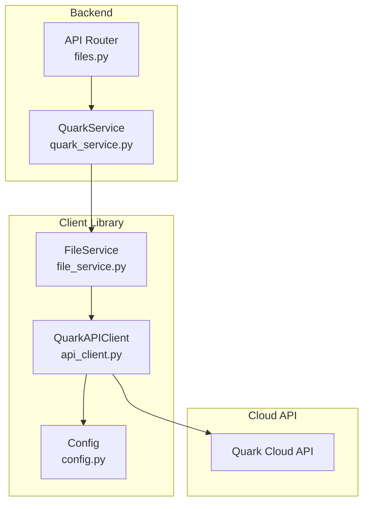
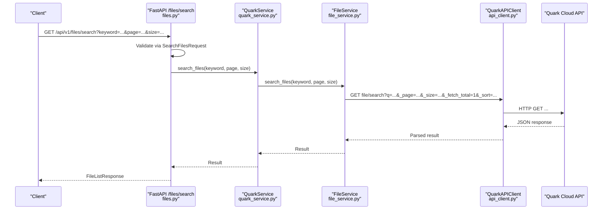
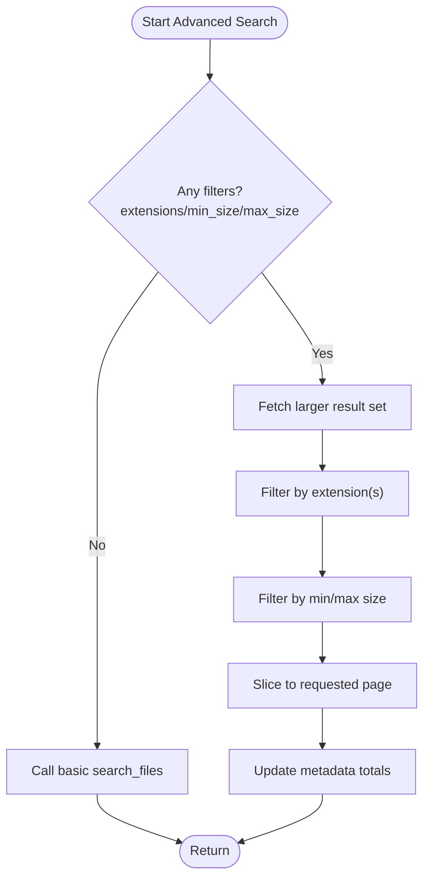
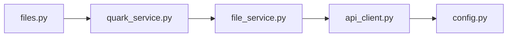

# Search and Filtering

<cite>
**Referenced Files in This Document**
- [files.py](file://backend/app/api/v1/files.py)
- [router.py](file://backend/app/api/v1/router.py)
- [files.py](file://backend/app/schemas/files.py)
- [quark_service.py](file://backend/app/services/quark_service.py)
- [file_service.py](file://quark_client/services/file_service.py)
- [search.py](file://quark_client/cli/commands/search.py)
- [api_client.py](file://quark_client/core/api_client.py)
- [config.py](file://quark_client/config.py)
- [PROJECT_SUMMARY.md](file://PROJECT_SUMMARY.md)
</cite>

## Table of Contents
1. [Introduction](#introduction)
2. [Project Structure](#project-structure)
3. [Core Components](#core-components)
4. [Architecture Overview](#architecture-overview)
5. [Detailed Component Analysis](#detailed-component-analysis)
6. [Dependency Analysis](#dependency-analysis)
7. [Performance Considerations](#performance-considerations)
8. [Troubleshooting Guide](#troubleshooting-guide)
9. [Conclusion](#conclusion)

## Introduction
This document explains the file search and filtering capabilities implemented in the project. It covers the search endpoint, keyword matching behavior, pagination, result presentation, and filtering options currently supported by the client-side implementation. It also documents the request schemas, validation patterns, and outlines advanced search features that are not yet implemented but can be integrated. Practical examples and performance optimization techniques are included for large file collections.

## Project Structure
The search and filtering functionality spans three layers:
- Backend API: exposes a GET /files/search endpoint that delegates to the service layer.
- Service layer: orchestrates authentication and calls the Quark client library.
- Quark client: performs actual search against the cloud storage API and applies client-side filtering when needed.

**Diagram sources**
- [files.py:107-123](file://backend/app/api/v1/files.py#L107-L123)
- [quark_service.py:319-340](file://backend/app/services/quark_service.py#L319-L340)
- [file_service.py:183-219](file://quark_client/services/file_service.py#L183-L219)
- [api_client.py:80-183](file://quark_client/core/api_client.py#L80-L183)
- [config.py:34-63](file://quark_client/config.py#L34-L63)

**Section sources**
- [PROJECT_SUMMARY.md:42-50](file://PROJECT_SUMMARY.md#L42-L50)
- [files.py:107-123](file://backend/app/api/v1/files.py#L107-L123)
- [router.py:22-23](file://backend/app/api/v1/router.py#L22-L23)

## Core Components
- Search endpoint: GET /api/v1/files/search with keyword, page, size query parameters.
- Request schema: SearchFilesRequest defines keyword, page, size with validation constraints.
- Service delegation: Backend routes search to QuarkService.search_files, which calls FileService.search_files.
- Client-side filtering: FileService.search_files_advanced supports extension and size filters by fetching more results and applying client-side filters.

Key validations and defaults:
- keyword is required.
- page defaults to 1 and must be ≥ 1.
- size defaults to 50 and is bounded between 1 and 200 in the backend schema.

**Section sources**
- [files.py:107-123](file://backend/app/api/v1/files.py#L107-L123)
- [files.py:42-46](file://backend/app/schemas/files.py#L42-L46)
- [quark_service.py:319-340](file://backend/app/services/quark_service.py#L319-L340)
- [file_service.py:183-219](file://quark_client/services/file_service.py#L183-L219)
- [file_service.py:295-366](file://quark_client/services/file_service.py#L295-L366)

## Architecture Overview
The search flow is straightforward: the API receives a request, validates it via Pydantic, and forwards it to the service layer. The service layer authenticates and invokes the client library, which calls the cloud API. For advanced filtering, the client library fetches a larger result set and filters locally.

**Diagram sources**
- [files.py:107-123](file://backend/app/api/v1/files.py#L107-L123)
- [quark_service.py:319-340](file://backend/app/services/quark_service.py#L319-L340)
- [file_service.py:183-219](file://quark_client/services/file_service.py#L183-L219)
- [api_client.py:184-190](file://quark_client/core/api_client.py#L184-L190)

## Detailed Component Analysis

### Search Endpoint Implementation
- Endpoint: GET /api/v1/files/search
- Query parameters:
  - keyword (required): passed to the search function.
  - page (default 1, ≥ 1): pagination page.
  - size (default 50, 1..200): items per page.
- Response model: FileListResponse wraps success flag, optional data, and optional message.
- Validation: Pydantic SearchFilesRequest enforces field constraints.

Behavior:
- Delegates to QuarkService.search_files.
- On failure, raises HTTP 400 with message.

**Section sources**
- [files.py:107-123](file://backend/app/api/v1/files.py#L107-L123)
- [files.py:42-46](file://backend/app/schemas/files.py#L42-L46)

### Keyword Matching and Ranking
- The client library passes the keyword to the cloud API and enables highlighting.
- Sorting order includes file_type and updated_at; the backend does not expose explicit ranking controls.
- The cloud API’s internal ranking is not exposed by the client; therefore, ranking customization is not available in this implementation.

Practical implications:
- Use keyword specificity to improve relevance.
- Combine with filters to narrow results.

**Section sources**
- [file_service.py:206-213](file://quark_client/services/file_service.py#L206-L213)
- [files.py:107-123](file://backend/app/api/v1/files.py#L107-L123)

### Pagination Support
- Backend enforces page ≥ 1 and size in [1, 200].
- The client library requests _fetch_total=1 and sets _count in metadata for client-side pagination.
- The CLI prints total count and pages when results exceed size.

Notes:
- The backend response model uses a generic data dictionary; metadata fields like _total and _count are populated by the client library.

**Section sources**
- [files.py:8-9](file://backend/app/schemas/files.py#L8-L9)
- [file_service.py:206-213](file://quark_client/services/file_service.py#L206-L213)
- [search.py:168-174](file://quark_client/cli/commands/search.py#L168-L174)

### Filtering Options
Supported filters in the client library:
- File type filters: client-side extension filtering by file extension.
- Size-based filtering: minimum and maximum size in bytes.
- Folder scope: the client library notes that the underlying cloud API does not support folder-scoped search; folder_id is accepted but not used.

Filtering behavior:
- When filters are present, the client fetches more results (at least 3× requested size or 100) to increase hit rate after filtering.
- Applies extension and size checks client-side, then slices to the requested page.

**Diagram sources**
- [file_service.py:295-366](file://quark_client/services/file_service.py#L295-L366)

**Section sources**
- [file_service.py:295-366](file://quark_client/services/file_service.py#L295-L366)
- [search.py:69-87](file://quark_client/cli/commands/search.py#L69-L87)

### Search Schema Definitions and Request Validation
- SearchFilesRequest:
  - keyword: required
  - page: default 1, ≥ 1
  - size: default 50, 1..200

Validation occurs automatically via FastAPI and Pydantic when invoking the endpoint.

**Section sources**
- [files.py:42-46](file://backend/app/schemas/files.py#L42-L46)

### Advanced Search Features (Not Implemented)
The following advanced features are not currently implemented but can be integrated:
- Wildcard support: translate user wildcards to cloud API patterns or apply client-side fnmatch filtering.
- Boolean operators: AND/OR grouping via parentheses; requires parsing and mapping to cloud API query syntax.
- Fuzzy matching: Levenshtein distance or phonetic matching; would require client-side scoring and ranking.
- Date range filters: filter by created/modified timestamps; requires metadata fields and server-side support.
- Metadata-based queries: tag, owner, or custom metadata filters; depends on cloud API capabilities.

Integration approach:
- Extend FileService.search_files_advanced to accept additional filter parameters.
- Map filters to query parameters or client-side logic.
- Maintain pagination and metadata consistency.

[No sources needed since this section proposes future enhancements]

### Practical Examples
- Basic search:
  - GET /api/v1/files/search?keyword=document&page=1&size=50
- Advanced search with filters:
  - GET /api/v1/files/search?keyword=presentation&page=1&size=20
  - Then apply client-side filters for extensions and sizes as implemented.

CLI usage examples:
- quarkpan search "budget" --ext pdf,xlsx --min-size 1MB --max-size 10MB
- quarkpan search "notes" --page 2 --size 30

**Section sources**
- [files.py:107-123](file://backend/app/api/v1/files.py#L107-L123)
- [search.py:20-42](file://quark_client/cli/commands/search.py#L20-L42)
- [search.py:69-87](file://quark_client/cli/commands/search.py#L69-L87)

## Dependency Analysis
- API layer depends on schemas for validation and on QuarkService for orchestration.
- QuarkService depends on FileService for client interactions.
- FileService depends on QuarkAPIClient and configuration constants.
- QuarkAPIClient encapsulates HTTP transport, headers, timeouts, and error handling.

**Diagram sources**
- [files.py:1-15](file://backend/app/api/v1/files.py#L1-L15)
- [quark_service.py:11-20](file://backend/app/services/quark_service.py#L11-L20)
- [file_service.py:9-23](file://quark_client/services/file_service.py#L9-L23)
- [api_client.py:16-38](file://quark_client/core/api_client.py#L16-L38)
- [config.py:34-63](file://quark_client/config.py#L34-L63)

**Section sources**
- [files.py:1-15](file://backend/app/api/v1/files.py#L1-L15)
- [quark_service.py:11-20](file://backend/app/services/quark_service.py#L11-L20)
- [file_service.py:9-23](file://quark_client/services/file_service.py#L9-L23)
- [api_client.py:16-38](file://quark_client/core/api_client.py#L16-L38)
- [config.py:34-63](file://quark_client/config.py#L34-L63)

## Performance Considerations
- Client-side filtering increases network usage because larger result sets are fetched. To mitigate:
  - Increase size moderately (e.g., 3×) to reduce round trips.
  - Apply filters early to minimize post-processing cost.
- Pagination:
  - Use reasonable size values (e.g., 50–100) to balance latency and payload.
  - Track metadata _total and _count to compute total pages.
- Network and timeouts:
  - Adjust request timeout and retry policies in the client configuration for large collections.
- Sorting:
  - The client sorts by file_type and updated_at; avoid unnecessary sorting fields to reduce overhead.

[No sources needed since this section provides general guidance]

## Troubleshooting Guide
Common issues and resolutions:
- Authentication failures:
  - Ensure the client is logged in; the service checks login status before calling the cloud API.
- HTTP errors:
  - The client maps 401/403 to authentication errors; refresh or re-authenticate.
  - Non-JSON responses are handled gracefully with descriptive messages.
- Empty results:
  - Verify keyword specificity; try broader terms or add filters.
  - Confirm that folder_id is not restricting scope unintentionally (cloud API does not support folder-scoped search).
- Pagination inconsistencies:
  - The client updates metadata totals; ensure you read metadata._total and metadata._count for accurate counts.

**Section sources**
- [quark_service.py:333-340](file://backend/app/services/quark_service.py#L333-L340)
- [api_client.py:145-162](file://quark_client/core/api_client.py#L145-L162)
- [file_service.py:206-213](file://quark_client/services/file_service.py#L206-L213)

## Conclusion
The current implementation provides a clean search endpoint with robust pagination and client-side filtering for extensions and sizes. While the cloud API does not expose advanced features like folder-scoped search, boolean operators, or fuzzy matching, the client library’s design allows these features to be integrated incrementally. By leveraging client-side filtering, careful pagination, and appropriate timeouts, the system remains responsive for large file collections.