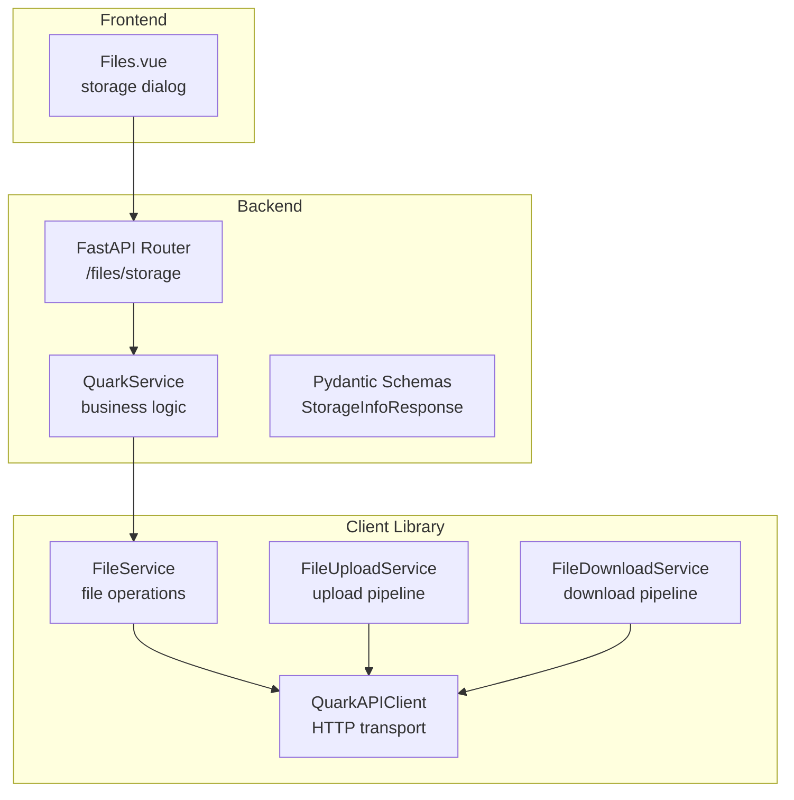
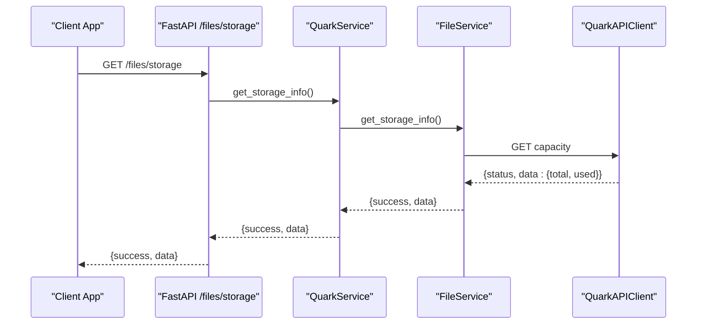
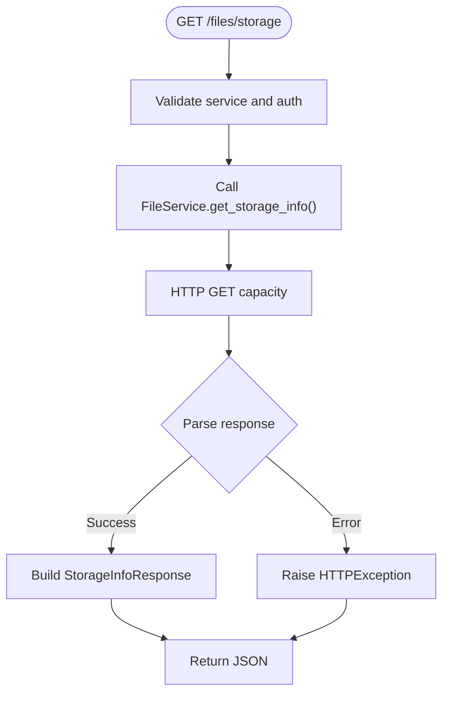
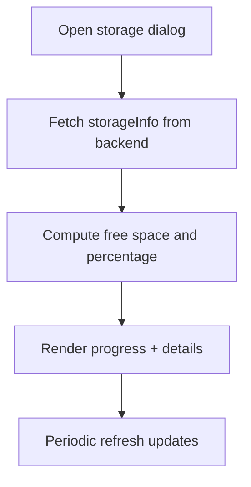
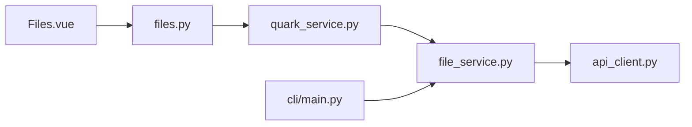

# Storage Management

<cite>
**Referenced Files in This Document**
- [backend/app/api/v1/files.py](file://backend/app/api/v1/files.py)
- [backend/app/api/v1/router.py](file://backend/app/api/v1/router.py)
- [backend/app/services/quark_service.py](file://backend/app/services/quark_service.py)
- [backend/app/schemas/files.py](file://backend/app/schemas/files.py)
- [quark_client/services/file_service.py](file://quark_client/services/file_service.py)
- [quark_client/core/api_client.py](file://quark_client/core/api_client.py)
- [frontend/src/views/Files.vue](file://frontend/src/views/Files.vue)
- [quark_client/cli/main.py](file://quark_client/cli/main.py)
- [quark_client/cli/utils.py](file://quark_client/cli/utils.py)
- [quark_client/services/file_upload_service.py](file://quark_client/services/file_upload_service.py)
- [quark_client/services/file_download_service.py](file://quark_client/services/file_download_service.py)
</cite>

## Table of Contents
1. [Introduction](#introduction)
2. [Project Structure](#project-structure)
3. [Core Components](#core-components)
4. [Architecture Overview](#architecture-overview)
5. [Detailed Component Analysis](#detailed-component-analysis)
6. [Dependency Analysis](#dependency-analysis)
7. [Performance Considerations](#performance-considerations)
8. [Troubleshooting Guide](#troubleshooting-guide)
9. [Conclusion](#conclusion)
10. [Appendices](#appendices)

## Introduction
This document provides comprehensive documentation for storage information and quota management within the QuarkManager system. It covers:
- The storage info endpoint, including capacity calculations, usage tracking, and quota enforcement
- Storage metrics display (total space, used space, available space, and percentage utilization)
- Quota management features (daily/weekly/monthly limits, notifications, and alerts)
- Storage analytics (file distribution by type, largest files identification, and growth trend analysis)
- Practical examples for implementing storage monitoring, handling quota exceeded scenarios, and providing optimization recommendations

The system integrates a FastAPI backend, a Python client library for Quark Cloud Drive, and a Vue.js frontend to deliver a cohesive storage management experience.

## Project Structure
The storage management functionality spans three primary layers:
- Backend API: exposes endpoints for file operations and storage info retrieval
- Client Library: encapsulates Quark Cloud Drive API interactions and provides higher-level services
- Frontend: renders storage metrics and supports user actions

**Diagram sources**
- [backend/app/api/v1/files.py:126-138](file://backend/app/api/v1/files.py#L126-L138)
- [backend/app/services/quark_service.py:342-362](file://backend/app/services/quark_service.py#L342-L362)
- [quark_client/services/file_service.py:240-248](file://quark_client/services/file_service.py#L240-L248)
- [quark_client/core/api_client.py:184-190](file://quark_client/core/api_client.py#L184-L190)
- [frontend/src/views/Files.vue:142-161](file://frontend/src/views/Files.vue#L142-L161)

**Section sources**
- [backend/app/api/v1/files.py:16-138](file://backend/app/api/v1/files.py#L16-L138)
- [backend/app/api/v1/router.py:1-24](file://backend/app/api/v1/router.py#L1-L24)
- [quark_client/services/file_service.py:240-248](file://quark_client/services/file_service.py#L240-L248)
- [frontend/src/views/Files.vue:142-161](file://frontend/src/views/Files.vue#L142-L161)

## Core Components
- Storage Info Endpoint: The backend exposes a GET endpoint to retrieve storage metrics from the Quark Cloud Drive API.
- QuarkService: Orchestrates client initialization, authentication, and delegates API calls to the client library.
- FileService: Implements the underlying API calls for retrieving storage capacity and file operations.
- QuarkAPIClient: Provides HTTP transport, authentication headers, and standardized error handling.
- Frontend Storage Dialog: Renders storage metrics and progress visuals for users.

Key responsibilities:
- Capacity calculations: total and used space returned by the API
- Usage tracking: derived metrics such as free space and percentage utilization
- Quota enforcement: handled server-side; client displays warnings and recommendations
- Analytics: file distribution by type and largest files via file listing APIs

**Section sources**
- [backend/app/api/v1/files.py:126-138](file://backend/app/api/v1/files.py#L126-L138)
- [backend/app/services/quark_service.py:342-362](file://backend/app/services/quark_service.py#L342-L362)
- [quark_client/services/file_service.py:240-248](file://quark_client/services/file_service.py#L240-L248)
- [quark_client/core/api_client.py:80-190](file://quark_client/core/api_client.py#L80-L190)
- [frontend/src/views/Files.vue:142-161](file://frontend/src/views/Files.vue#L142-L161)

## Architecture Overview
The storage management architecture follows a layered design:
- API Layer: FastAPI routes define the contract for storage info retrieval
- Service Layer: Business logic validates authentication and delegates to the client library
- Client Layer: Encapsulates HTTP requests, authentication, and response parsing
- Presentation Layer: Vue components render storage metrics and user interactions

**Diagram sources**
- [backend/app/api/v1/files.py:126-138](file://backend/app/api/v1/files.py#L126-L138)
- [backend/app/services/quark_service.py:342-362](file://backend/app/services/quark_service.py#L342-L362)
- [quark_client/services/file_service.py:240-248](file://quark_client/services/file_service.py#L240-L248)
- [quark_client/core/api_client.py:184-190](file://quark_client/core/api_client.py#L184-L190)

## Detailed Component Analysis

### Storage Info Endpoint
The endpoint retrieves storage capacity and usage from the Quark Cloud Drive API and returns structured metrics.

Processing logic:
- Validates service availability and authentication
- Calls FileService.get_storage_info() to fetch total and used space
- Wraps the result in a Pydantic model for consistent serialization

**Diagram sources**
- [backend/app/api/v1/files.py:126-138](file://backend/app/api/v1/files.py#L126-L138)
- [backend/app/services/quark_service.py:342-362](file://backend/app/services/quark_service.py#L342-L362)
- [quark_client/services/file_service.py:240-248](file://quark_client/services/file_service.py#L240-L248)

**Section sources**
- [backend/app/api/v1/files.py:126-138](file://backend/app/api/v1/files.py#L126-L138)
- [backend/app/schemas/files.py:49-54](file://backend/app/schemas/files.py#L49-L54)
- [backend/app/services/quark_service.py:342-362](file://backend/app/services/quark_service.py#L342-L362)
- [quark_client/services/file_service.py:240-248](file://quark_client/services/file_service.py#L240-L248)

### Storage Metrics Display
The frontend presents storage metrics using a dashboard-style dialog with a circular progress indicator and detailed values.

Metrics shown:
- Total space
- Used space
- Available space (derived)
- Percentage utilization (derived)

**Diagram sources**
- [frontend/src/views/Files.vue:142-161](file://frontend/src/views/Files.vue#L142-L161)

**Section sources**
- [frontend/src/views/Files.vue:142-161](file://frontend/src/views/Files.vue#L142-L161)

### Quota Management Features
Quota enforcement is managed server-side by the Quark Cloud Drive API. The client provides:
- Capacity limit detection in error handling
- Recommendations for freeing space and upgrading capacity
- Upload progress and failure messaging aligned with quota constraints

Practical handling:
- Detect capacity limit errors during uploads or operations
- Prompt users to clean up or upgrade storage
- Provide actionable steps in CLI and UI

**Section sources**
- [quark_client/cli/utils.py:87-115](file://quark_client/cli/utils.py#L87-L115)
- [quark_client/services/file_upload_service.py:174-212](file://quark_client/services/file_upload_service.py#L174-L212)

### Storage Analytics
Analytics capabilities leverage existing file listing and filtering features:
- File distribution by type: use file listing APIs and filter by file_type
- Largest files identification: sort by size and paginate results
- Growth trend analysis: track historical usage via periodic snapshots and compare totals

Implementation patterns:
- FileService.list_files() supports sorting and pagination
- FileService.search_files_advanced() enables client-side filtering by extension and size ranges
- CLI status command demonstrates computing usage percentage and rendering tabular metrics

**Section sources**
- [quark_client/services/file_service.py:25-60](file://quark_client/services/file_service.py#L25-L60)
- [quark_client/services/file_service.py:183-220](file://quark_client/services/file_service.py#L183-L220)
- [quark_client/services/file_service.py:295-366](file://quark_client/services/file_service.py#L295-L366)
- [quark_client/cli/main.py:291-344](file://quark_client/cli/main.py#L291-L344)

### Practical Examples

#### Implementing Storage Monitoring
- Backend: expose a periodic job to call the storage endpoint and persist metrics
- Frontend: integrate the storage dialog into the navigation and enable auto-refresh
- CLI: use the status command to display storage metrics and file counts

**Section sources**
- [backend/app/api/v1/files.py:126-138](file://backend/app/api/v1/files.py#L126-L138)
- [frontend/src/views/Files.vue:142-161](file://frontend/src/views/Files.vue#L142-L161)
- [quark_client/cli/main.py:291-344](file://quark_client/cli/main.py#L291-L344)

#### Handling Quota Exceeded Scenarios
- Detect capacity limit errors during upload or file operations
- Display user-friendly messages and suggest cleanup or upgrade actions
- Provide links or commands to manage storage efficiently

**Section sources**
- [quark_client/cli/utils.py:87-115](file://quark_client/cli/utils.py#L87-L115)
- [quark_client/services/file_upload_service.py:174-212](file://quark_client/services/file_upload_service.py#L174-L212)

#### Providing Storage Optimization Recommendations
- Identify large files and folders using file listing and sorting
- Recommend deleting duplicates, empty folders, or archived items
- Suggest organizing files by type and enabling compression where appropriate

**Section sources**
- [quark_client/services/file_service.py:25-60](file://quark_client/services/file_service.py#L25-L60)
- [quark_client/services/file_service.py:183-220](file://quark_client/services/file_service.py#L183-L220)
- [quark_client/services/file_service.py:295-366](file://quark_client/services/file_service.py#L295-L366)

## Dependency Analysis
The storage management stack exhibits clear separation of concerns with minimal coupling:
- API depends on QuarkService for orchestration
- QuarkService depends on FileService for API calls
- FileService depends on QuarkAPIClient for HTTP transport
- Frontend depends on API for metrics
- CLI depends on client library for storage status and operations

**Diagram sources**
- [backend/app/api/v1/files.py:1-150](file://backend/app/api/v1/files.py#L1-L150)
- [backend/app/services/quark_service.py:1-388](file://backend/app/services/quark_service.py#L1-L388)
- [quark_client/services/file_service.py:1-800](file://quark_client/services/file_service.py#L1-L800)
- [quark_client/core/api_client.py:1-209](file://quark_client/core/api_client.py#L1-L209)
- [frontend/src/views/Files.vue:142-161](file://frontend/src/views/Files.vue#L142-L161)
- [quark_client/cli/main.py:1-200](file://quark_client/cli/main.py#L1-L200)

**Section sources**
- [backend/app/api/v1/files.py:1-150](file://backend/app/api/v1/files.py#L1-L150)
- [backend/app/services/quark_service.py:1-388](file://backend/app/services/quark_service.py#L1-L388)
- [quark_client/services/file_service.py:1-800](file://quark_client/services/file_service.py#L1-L800)
- [quark_client/core/api_client.py:1-209](file://quark_client/core/api_client.py#L1-L209)
- [frontend/src/views/Files.vue:142-161](file://frontend/src/views/Files.vue#L142-L161)
- [quark_client/cli/main.py:1-200](file://quark_client/cli/main.py#L1-L200)

## Performance Considerations
- Pagination and sorting: Use list_files with appropriate page sizes and sort fields to avoid large payloads
- Caching: Cache storage metrics for short intervals to reduce API calls
- Asynchronous operations: Leverage upload/download services’ progress callbacks to keep UI responsive
- Error handling: Early exit on authentication failures to minimize retries

## Troubleshooting Guide
Common issues and resolutions:
- Authentication failures: Re-login using the auth commands; ensure cookies are valid
- Network timeouts: Retry operations or adjust timeouts in the API client
- Capacity limit errors: Clean up storage or upgrade plan; follow CLI recommendations
- Download failures: Verify download URLs and network connectivity; fallback methods are supported

**Section sources**
- [quark_client/core/api_client.py:179-182](file://quark_client/core/api_client.py#L179-L182)
- [quark_client/cli/utils.py:87-115](file://quark_client/cli/utils.py#L87-L115)
- [quark_client/services/file_download_service.py:188-257](file://quark_client/services/file_download_service.py#L188-L257)

## Conclusion
The QuarkManager storage management system provides a robust foundation for monitoring and optimizing cloud storage usage. By leveraging the storage info endpoint, client library services, and frontend/UI components, developers can implement comprehensive storage analytics, enforce quotas, and guide users toward efficient storage practices.

## Appendices

### API Definitions
- Endpoint: GET /files/storage
- Response Model: StorageInfoResponse with success flag, data containing total and used space, and optional message

**Section sources**
- [backend/app/api/v1/files.py:126-138](file://backend/app/api/v1/files.py#L126-L138)
- [backend/app/schemas/files.py:49-54](file://backend/app/schemas/files.py#L49-L54)