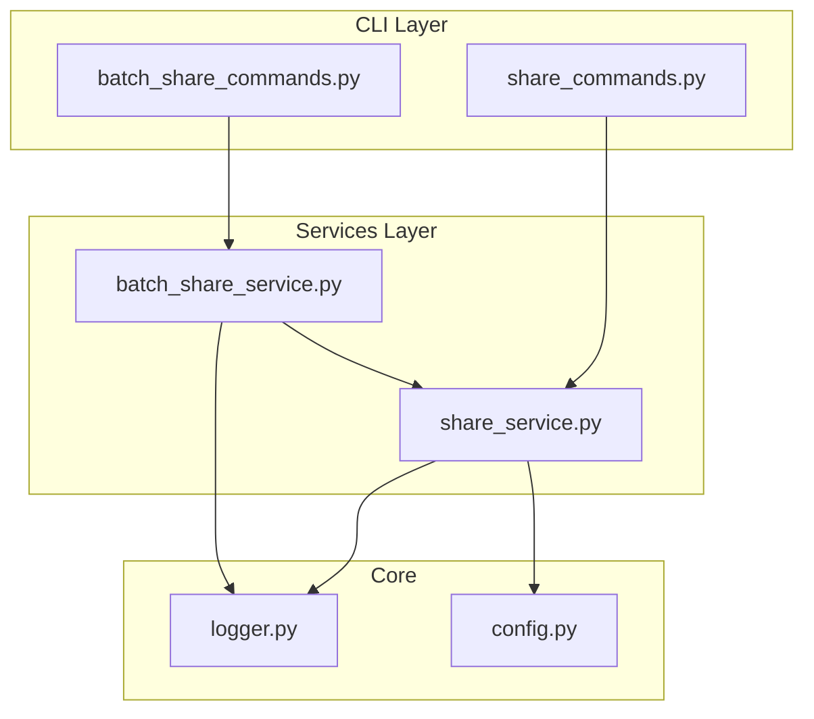
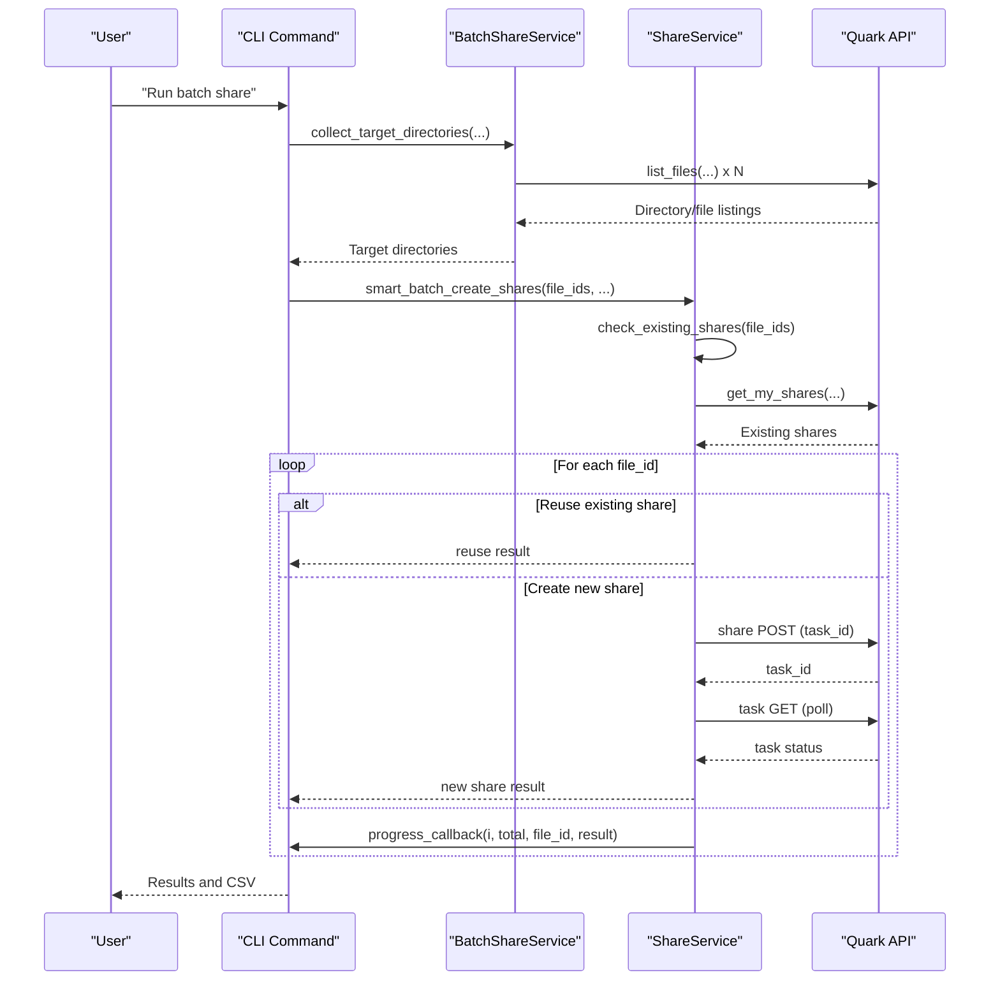
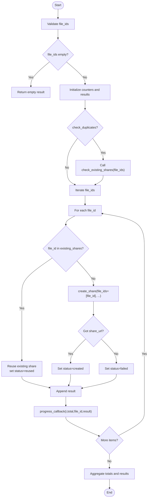
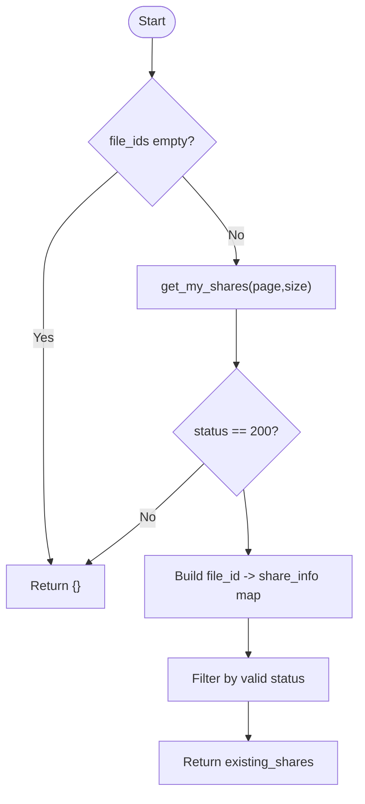
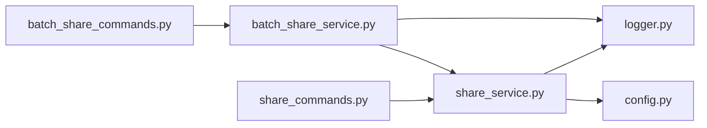

# Batch Share Processing

<cite>
**Referenced Files in This Document**
- [batch_share_service.py](file://quark_client/services/batch_share_service.py)
- [share_service.py](file://quark_client/services/share_service.py)
- [batch_share_commands.py](file://quark_client/cli/commands/batch_share_commands.py)
- [share_commands.py](file://quark_client/cli/commands/share_commands.py)
- [config.py](file://quark_client/config.py)
- [logger.py](file://quark_client/utils/logger.py)
</cite>

## Table of Contents
1. [Introduction](#introduction)
2. [Project Structure](#project-structure)
3. [Core Components](#core-components)
4. [Architecture Overview](#architecture-overview)
5. [Detailed Component Analysis](#detailed-component-analysis)
6. [Dependency Analysis](#dependency-analysis)
7. [Performance Considerations](#performance-considerations)
8. [Troubleshooting Guide](#troubleshooting-guide)
9. [Conclusion](#conclusion)
10. [Appendices](#appendices)

## Introduction
This document explains the batch share processing capabilities of the Quark Cloud Drive client. It focuses on the smart batch creation workflow, including duplicate detection, intelligent reuse of existing shares, and progress monitoring. It documents the implementation of the smart_batch_create_shares method, including progress callbacks, error handling per item, and result aggregation. It also covers duplicate share checking via check_existing_shares, the logic for reusing versus creating new shares, and batch processing parameters such as file ID lists, title templates, expiration settings, and password configurations. Practical examples demonstrate bulk file sharing, selective file processing, progress monitoring, and error recovery strategies. Finally, it addresses performance considerations for large batch operations, memory management, and API rate limiting, along with guidance on batch size optimization, retry mechanisms, and monitoring completion status.

## Project Structure
The batch share functionality spans service-layer logic and CLI commands:
- Services: batch_share_service.py orchestrates collection of target directories and batch creation; share_service.py provides share creation and duplicate detection.
- CLI: batch_share_commands.py handles directory scanning and batch creation with progress; share_commands.py provides the smart_batch_create_shares command with progress callbacks and result reporting.

**Diagram sources**
- [batch_share_service.py:16-572](file://quark_client/services/batch_share_service.py#L16-L572)
- [share_service.py:13-742](file://quark_client/services/share_service.py#L13-L742)
- [batch_share_commands.py:15-275](file://quark_client/cli/commands/batch_share_commands.py#L15-L275)
- [share_commands.py:121-242](file://quark_client/cli/commands/share_commands.py#L121-L242)
- [config.py:34-63](file://quark_client/config.py#L34-L63)
- [logger.py:12-73](file://quark_client/utils/logger.py#L12-L73)

**Section sources**
- [batch_share_service.py:16-572](file://quark_client/services/batch_share_service.py#L16-L572)
- [share_service.py:13-742](file://quark_client/services/share_service.py#L13-L742)
- [batch_share_commands.py:15-275](file://quark_client/cli/commands/batch_share_commands.py#L15-L275)
- [share_commands.py:121-242](file://quark_client/cli/commands/share_commands.py#L121-L242)
- [config.py:34-63](file://quark_client/config.py#L34-L63)
- [logger.py:12-73](file://quark_client/utils/logger.py#L12-L73)

## Core Components
- BatchShareService: Collects target directories (folders/files) using flexible scanning modes and creates shares for each target. It exports results to CSV and provides a one-stop batch operation.
- ShareService: Implements share creation, duplicate detection, and the smart_batch_create_shares method that intelligently reuses existing shares when possible.
- CLI Commands: batch_share_commands.py scans directories and performs batch creation with progress; share_commands.py exposes smart_batch_create_shares for direct file ID lists with progress callbacks.

Key responsibilities:
- Directory collection: legacy four-level mode, path-based mode, and depth-based mode.
- Duplicate detection: checks existing shares and reuses them when available.
- Progress monitoring: callbacks report per-item status and results.
- Error handling: per-item failure tracking and aggregation.
- Export: CSV export of results for audit and downstream processing.

**Section sources**
- [batch_share_service.py:31-572](file://quark_client/services/batch_share_service.py#L31-L572)
- [share_service.py:25-742](file://quark_client/services/share_service.py#L25-L742)
- [batch_share_commands.py:15-275](file://quark_client/cli/commands/batch_share_commands.py#L15-L275)
- [share_commands.py:121-242](file://quark_client/cli/commands/share_commands.py#L121-L242)

## Architecture Overview
The batch share pipeline integrates CLI-driven orchestration with service-layer logic:

**Diagram sources**
- [batch_share_service.py:31-572](file://quark_client/services/batch_share_service.py#L31-L572)
- [share_service.py:25-742](file://quark_client/services/share_service.py#L25-L742)
- [batch_share_commands.py:15-275](file://quark_client/cli/commands/batch_share_commands.py#L15-L275)
- [share_commands.py:121-242](file://quark_client/cli/commands/share_commands.py#L121-L242)

## Detailed Component Analysis

### Smart Batch Creation Workflow
The smart_batch_create_shares method implements intelligent reuse of existing shares and robust per-item error handling:
- Input: file_ids, title template, expire_days, password, check_duplicates flag, progress_callback.
- Duplicate detection: check_existing_shares retrieves existing shares and filters by validity.
- Decision logic: reuse existing share if present; otherwise create a new share via create_share with task polling.
- Progress reporting: progress_callback invoked after each item with current/total, file_id, and result.
- Aggregation: returns a structured result containing totals and per-item outcomes.

**Diagram sources**
- [share_service.py:622-742](file://quark_client/services/share_service.py#L622-L742)

**Section sources**
- [share_service.py:622-742](file://quark_client/services/share_service.py#L622-L742)

### Duplicate Share Checking Mechanism
The check_existing_shares method:
- Retrieves the user’s share list with pagination support.
- Filters shares by status and maps first_fid to share details.
- Returns a dictionary keyed by file_id for quick lookup during batch processing.

**Diagram sources**
- [share_service.py:25-74](file://quark_client/services/share_service.py#L25-L74)

**Section sources**
- [share_service.py:25-74](file://quark_client/services/share_service.py#L25-L74)

### Batch Processing Parameters
- File ID lists: list of file identifiers to process.
- Title templates: used as share title; can be dynamic per item if desired.
- Expiration settings: expire_days=0 for permanent, positive values for days-to-expire.
- Password configurations: password=None for public, or a string for private links.
- Progress callbacks: optional callable receiving (current, total, file_id, result).
- Duplicate reuse: controlled by check_duplicates flag.

These parameters are passed through CLI commands to the service layer and used by smart_batch_create_shares and create_share.

**Section sources**
- [share_service.py:622-742](file://quark_client/services/share_service.py#L622-L742)
- [share_commands.py:121-242](file://quark_client/cli/commands/share_commands.py#L121-L242)

### Practical Examples

- Bulk file sharing by directory scan:
  - Use batch_share_commands to collect targets and create shares with progress and CSV export.
  - Example invocation: run the batch-share command with optional depth, share-level, and exclude patterns.

- Selective file processing:
  - Use the smart_batch_create_shares command with explicit file IDs, title, expiration, and password.
  - Example invocation: pass file IDs and configure check_duplicates and progress callback.

- Progress monitoring:
  - CLI commands provide real-time updates via progress bars and callbacks.
  - The progress_callback receives per-item status and share URLs when available.

- Error recovery strategies:
  - Per-item failures are captured and aggregated; the system continues processing remaining items.
  - CSV export includes both successes and failures for auditing and reprocessing.

**Section sources**
- [batch_share_commands.py:15-275](file://quark_client/cli/commands/batch_share_commands.py#L15-L275)
- [share_commands.py:121-242](file://quark_client/cli/commands/share_commands.py#L121-L242)
- [batch_share_service.py:405-572](file://quark_client/services/batch_share_service.py#L405-L572)

### Directory Collection Strategies
BatchShareService supports three collection modes:
- Legacy four-level mode: collects targets under a fixed hierarchy.
- Path-based mode: resolves a given path to a folder ID and recurses to specified depth.
- Depth-based mode: starts from root and recurses up to a configurable depth.

Each mode respects exclude patterns and share level filters (folders/files/both).

**Section sources**
- [batch_share_service.py:31-344](file://quark_client/services/batch_share_service.py#L31-L344)

### CSV Export and Reporting
After batch creation, results are exported to CSV with columns for share title, share URL, full path, and creation time. Both successful and failed entries are recorded for completeness.

**Section sources**
- [batch_share_service.py:480-533](file://quark_client/services/batch_share_service.py#L480-L533)

## Dependency Analysis
The batch share pipeline exhibits clear separation of concerns:
- CLI commands depend on services for orchestration and share operations.
- Services depend on the API client and configuration for network and defaults.
- Logging utilities provide consistent instrumentation across layers.

**Diagram sources**
- [batch_share_commands.py:15-275](file://quark_client/cli/commands/batch_share_commands.py#L15-L275)
- [share_commands.py:121-242](file://quark_client/cli/commands/share_commands.py#L121-L242)
- [batch_share_service.py:16-572](file://quark_client/services/batch_share_service.py#L16-L572)
- [share_service.py:13-742](file://quark_client/services/share_service.py#L13-L742)
- [config.py:34-63](file://quark_client/config.py#L34-L63)
- [logger.py:12-73](file://quark_client/utils/logger.py#L12-L73)

**Section sources**
- [batch_share_service.py:16-572](file://quark_client/services/batch_share_service.py#L16-L572)
- [share_service.py:13-742](file://quark_client/services/share_service.py#L13-L742)
- [batch_share_commands.py:15-275](file://quark_client/cli/commands/batch_share_commands.py#L15-L275)
- [share_commands.py:121-242](file://quark_client/cli/commands/share_commands.py#L121-L242)
- [config.py:34-63](file://quark_client/config.py#L34-L63)
- [logger.py:12-73](file://quark_client/utils/logger.py#L12-L73)

## Performance Considerations
- Concurrency: The current implementation processes items sequentially. For large batches, consider introducing concurrency with bounded thread pools or async tasks to improve throughput while respecting API rate limits.
- Memory management: Batch results are accumulated in memory; for very large batches, consider streaming results to disk or paginating exports.
- API rate limiting: The service uses task polling with a fixed delay. Introduce exponential backoff and jitter to mitigate throttling and improve resilience.
- Batch size optimization: Tune batch sizes to balance throughput and stability. Monitor API response times and adjust chunk sizes accordingly.
- Retry mechanisms: Implement retries with backoff for transient errors; distinguish between retryable and non-retryable failures (e.g., permission denied).
- Monitoring: Use progress callbacks and logs to track completion status and detect bottlenecks.

[No sources needed since this section provides general guidance]

## Troubleshooting Guide
Common issues and remedies:
- Authentication failures: Ensure the client is logged in before invoking batch operations.
- Permission denied or forbidden: Verify access permissions for target files and folders.
- Capacity limit errors: Free up storage space before retrying batch operations.
- Invalid share links or expired shares: Validate links and recreate shares as needed.
- Network timeouts: Increase request timeout and retry with backoff.
- CSV export failures: Check write permissions and available disk space.

**Section sources**
- [share_service.py:377-454](file://quark_client/services/share_service.py#L377-L454)
- [batch_share_service.py:480-533](file://quark_client/services/batch_share_service.py#L480-L533)

## Conclusion
The batch share processing system provides a robust, extensible framework for creating and managing share links at scale. Its smart reuse of existing shares reduces redundant API calls, while comprehensive progress reporting and error handling enable reliable large-scale operations. By tuning concurrency, batching, and retry strategies, operators can achieve high throughput while maintaining stability and compliance with API constraints.

[No sources needed since this section summarizes without analyzing specific files]

## Appendices

### API Definitions and Parameters
- smart_batch_create_shares(file_ids, title="", expire_days=0, password=None, check_duplicates=True, progress_callback=None)
  - Returns: structured result with totals and per-item outcomes.
- create_share(file_ids, title, expire_days, password)
  - Returns: share details including share_url and share_id.
- check_existing_shares(file_ids)
  - Returns: mapping from file_id to existing share info.

**Section sources**
- [share_service.py:25-742](file://quark_client/services/share_service.py#L25-L742)

### CLI Usage Patterns
- Batch share by directory scan:
  - Options: --target-dir, --depth, --share-level, --exclude, --output, --dry-run.
- Smart batch by file IDs:
  - Options: --title, --expire-days, --password, --check-duplicates, --force-new.

**Section sources**
- [batch_share_commands.py:15-275](file://quark_client/cli/commands/batch_share_commands.py#L15-L275)
- [share_commands.py:121-242](file://quark_client/cli/commands/share_commands.py#L121-L242)