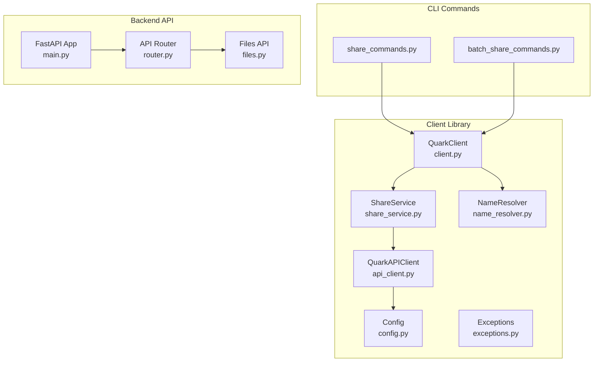
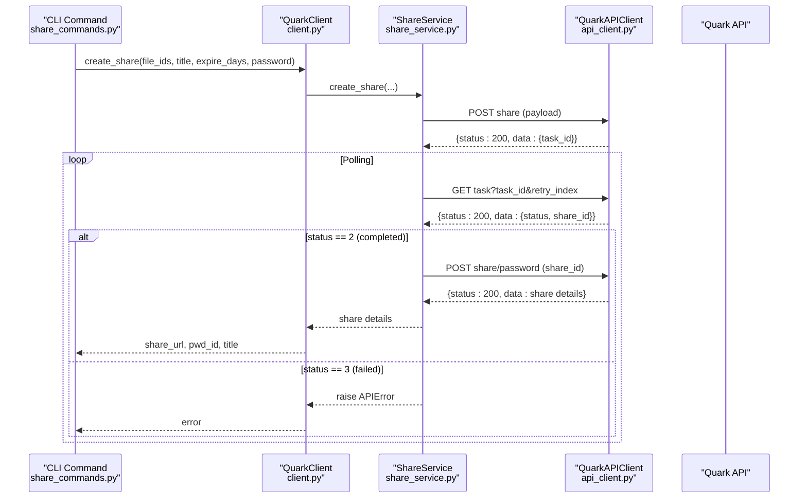
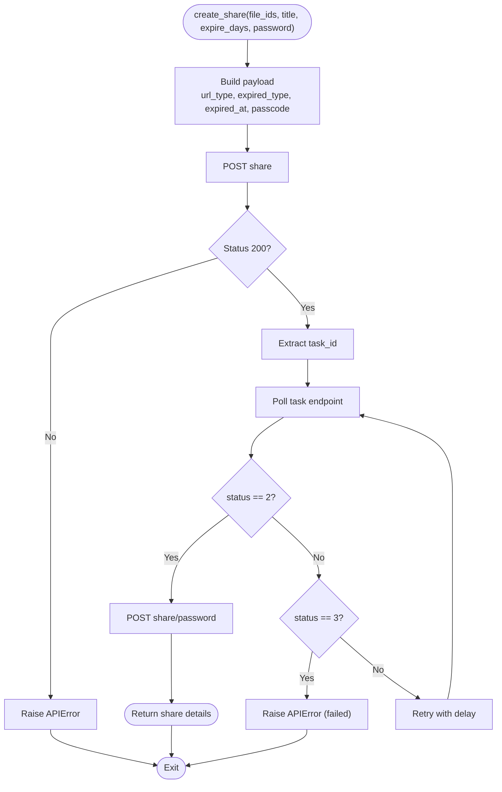
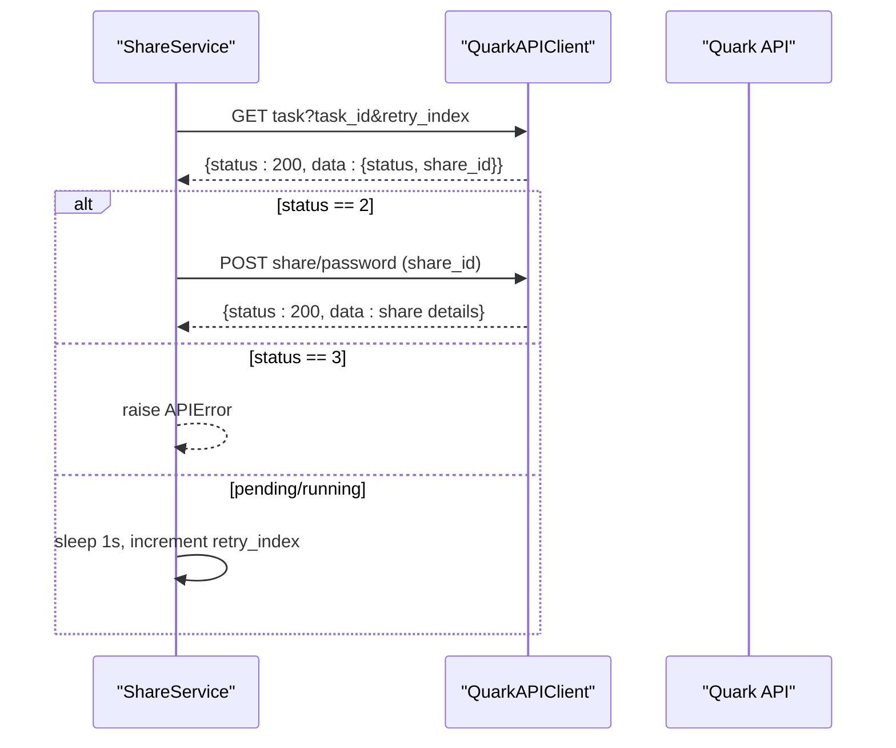
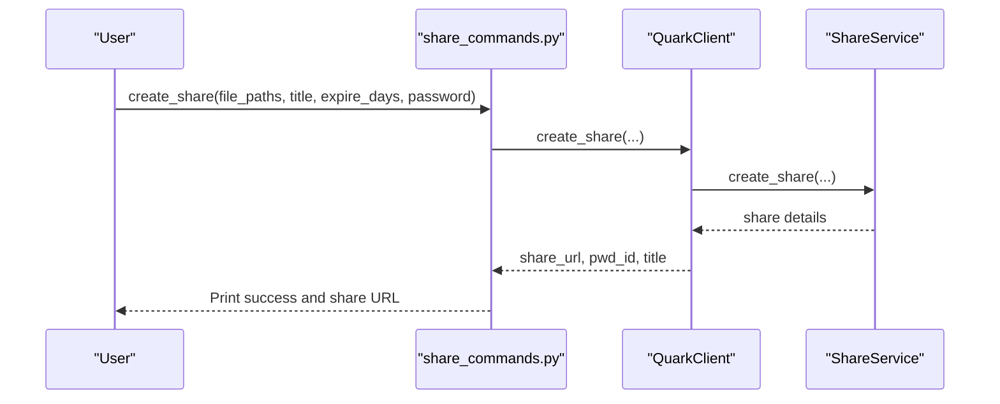
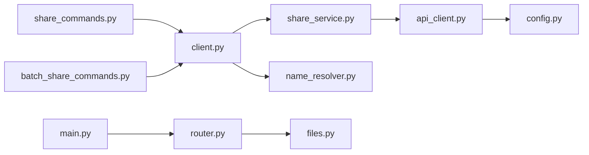

# Individual Share Creation

<cite>
**Referenced Files in This Document**
- [share_service.py](file://quark_client/services/share_service.py)
- [api_client.py](file://quark_client/core/api_client.py)
- [config.py](file://quark_client/config.py)
- [client.py](file://quark_client/client.py)
- [exceptions.py](file://quark_client/exceptions.py)
- [batch_share_service.py](file://quark_client/services/batch_share_service.py)
- [batch_share_commands.py](file://quark_client/cli/commands/batch_share_commands.py)
- [share_commands.py](file://quark_client/cli/commands/share_commands.py)
- [name_resolver.py](file://quark_client/services/name_resolver.py)
- [files.py](file://backend/app/api/v1/files.py)
- [router.py](file://backend/app/api/v1/router.py)
- [main.py](file://backend/app/main.py)
</cite>

## Table of Contents
1. [Introduction](#introduction)
2. [Project Structure](#project-structure)
3. [Core Components](#core-components)
4. [Architecture Overview](#architecture-overview)
5. [Detailed Component Analysis](#detailed-component-analysis)
6. [Dependency Analysis](#dependency-analysis)
7. [Performance Considerations](#performance-considerations)
8. [Troubleshooting Guide](#troubleshooting-guide)
9. [Conclusion](#conclusion)
10. [Appendices](#appendices)

## Introduction
This document explains the individual share creation workflow for single file or folder shares. It covers the complete lifecycle from file selection to share parameter configuration, the underlying API interactions, task-based creation with polling, error handling, and timeout management. It also documents the ShareService.create_share method implementation, share parameter validation, URL type determination, expiration date calculation, and practical examples for single file sharing, folder sharing, password-protected shares, and permanent vs time-limited shares. Finally, it provides troubleshooting guidance and performance optimization tips.

## Project Structure
The share creation functionality spans the client-side Python library and the backend FastAPI service. The client exposes a high-level QuarkClient with a ShareService that encapsulates API interactions, while the backend provides file management endpoints used by the client.

**Diagram sources**
- [client.py:18-405](file://quark_client/client.py#L18-L405)
- [share_service.py:13-742](file://quark_client/services/share_service.py#L13-L742)
- [api_client.py:16-209](file://quark_client/core/api_client.py#L16-L209)
- [config.py:34-63](file://quark_client/config.py#L34-L63)
- [name_resolver.py:10-198](file://quark_client/services/name_resolver.py#L10-L198)
- [share_commands.py:121-242](file://quark_client/cli/commands/share_commands.py#L121-L242)
- [batch_share_commands.py:15-221](file://quark_client/cli/commands/batch_share_commands.py#L15-L221)
- [main.py:12-46](file://backend/app/main.py#L12-L46)
- [router.py:1-24](file://backend/app/api/v1/router.py#L1-L24)
- [files.py:19-150](file://backend/app/api/v1/files.py#L19-L150)

**Section sources**
- [client.py:18-405](file://quark_client/client.py#L18-L405)
- [share_service.py:13-742](file://quark_client/services/share_service.py#L13-L742)
- [api_client.py:16-209](file://quark_client/core/api_client.py#L16-L209)
- [config.py:34-63](file://quark_client/config.py#L34-L63)
- [name_resolver.py:10-198](file://quark_client/services/name_resolver.py#L10-L198)
- [share_commands.py:121-242](file://quark_client/cli/commands/share_commands.py#L121-L242)
- [batch_share_commands.py:15-221](file://quark_client/cli/commands/batch_share_commands.py#L15-L221)
- [main.py:12-46](file://backend/app/main.py#L12-L46)
- [router.py:1-24](file://backend/app/api/v1/router.py#L1-L24)
- [files.py:19-150](file://backend/app/api/v1/files.py#L19-L150)

## Core Components
- ShareService: Implements the complete share creation workflow, including request construction, task polling, and share detail retrieval.
- QuarkAPIClient: Handles HTTP requests, authentication, and error translation to domain exceptions.
- QuarkClient: Public facade exposing convenience methods for share creation and related operations.
- NameResolver: Resolves human-readable paths to file/folder IDs for CLI-driven creation.
- CLI Commands: Provide user-facing commands for creating single or batch shares, parsing links, and managing share lists.

Key responsibilities:
- Parameter validation and normalization (title, expire_days, password).
- URL type determination (public vs private) based on password presence.
- Expiration date calculation using millisecond timestamps.
- Task-based creation with retries and timeout management.
- Error handling for network, authentication, and API errors.

**Section sources**
- [share_service.py:75-152](file://quark_client/services/share_service.py#L75-L152)
- [api_client.py:80-183](file://quark_client/core/api_client.py#L80-L183)
- [client.py:294-314](file://quark_client/client.py#L294-L314)
- [name_resolver.py:19-74](file://quark_client/services/name_resolver.py#L19-L74)
- [share_commands.py:121-242](file://quark_client/cli/commands/share_commands.py#L121-L242)

## Architecture Overview
The individual share creation follows a task-based asynchronous pattern:
1. Build request payload with file IDs, title, URL type, expired type, optional password, and optional expiration timestamp.
2. Submit the creation request and extract a task ID.
3. Poll the task endpoint until completion or failure, with bounded retries.
4. On success, fetch the share details to obtain the final share URL and metadata.

**Diagram sources**
- [share_commands.py:121-242](file://quark_client/cli/commands/share_commands.py#L121-L242)
- [client.py:294-314](file://quark_client/client.py#L294-L314)
- [share_service.py:75-152](file://quark_client/services/share_service.py#L75-L152)
- [api_client.py:184-190](file://quark_client/core/api_client.py#L184-L190)

## Detailed Component Analysis

### ShareService.create_share Method
Implements the core workflow:
- Request construction:
  - fid_list: single file or folder ID.
  - title: optional share title.
  - url_type: 1 for public, 2 for private (password present).
  - expired_type: 1 for permanent, 2 for time-limited.
  - expired_at: computed as current UTC milliseconds plus expire_days*24*3600*1000 when expire_days > 0.
  - passcode: included when password is set.
- Task submission:
  - POST share returns task_id.
- Polling:
  - GET task with task_id and retry_index.
  - Retry up to a fixed number of times with 1-second intervals.
  - On status 2: fetch share details via POST share/password.
  - On status 3: raise APIError indicating failure.
  - Timeout: raise APIError if retries exhausted.
- Response processing:
  - Return share details containing share URL and metadata.

**Diagram sources**
- [share_service.py:75-152](file://quark_client/services/share_service.py#L75-L152)

**Section sources**
- [share_service.py:75-152](file://quark_client/services/share_service.py#L75-L152)

### Share Parameter Validation and Type Determination
- URL type:
  - url_type = 2 if password is provided; otherwise 1.
- Expired type and expiration timestamp:
  - expired_type = 1 if expire_days == 0; otherwise 2.
  - expired_at computed as current UTC milliseconds plus expire_days*24*3600*1000.
- Title:
  - Optional; defaults to empty string.
- Password:
  - Optional; omitted when None.

These validations occur during request construction before submission.

**Section sources**
- [share_service.py:96-113](file://quark_client/services/share_service.py#L96-L113)

### Task-Based Creation and Polling Mechanism
- Submission returns a task_id.
- Polling uses GET task with task_id and retry_index.
- Retries capped at a fixed number with 1-second sleep between attempts.
- Completion: status 2 yields share details.
- Failure: status 3 raises APIError.
- Timeout: if retries exhausted without completion, APIError is raised.

**Diagram sources**
- [share_service.py:128-151](file://quark_client/services/share_service.py#L128-L151)

**Section sources**
- [share_service.py:124-151](file://quark_client/services/share_service.py#L124-L151)

### Share Detail Retrieval
After task completion, the service fetches share details via POST share/password using the share_id. The response contains the share URL and related metadata.

**Section sources**
- [share_service.py:154-171](file://quark_client/services/share_service.py#L154-L171)

### CLI Integration and Practical Examples
- Single file sharing:
  - Use CLI command with file paths or IDs, title, expire_days, and optional password.
  - The command resolves paths to IDs (when needed) and invokes QuarkClient.create_share.
- Folder sharing:
  - Pass a folder ID or path; the service treats it as a single shareable entity.
- Password-protected shares:
  - Provide a password; url_type becomes private (2).
- Permanent vs time-limited:
  - expire_days = 0 for permanent; > 0 sets expired_type to time-limited and adds expired_at.

**Diagram sources**
- [share_commands.py:121-242](file://quark_client/cli/commands/share_commands.py#L121-L242)
- [client.py:294-314](file://quark_client/client.py#L294-L314)
- [share_service.py:75-152](file://quark_client/services/share_service.py#L75-L152)

**Section sources**
- [share_commands.py:121-242](file://quark_client/cli/commands/share_commands.py#L121-L242)
- [client.py:294-314](file://quark_client/client.py#L294-L314)

### Backend API Context
While the backend provides file management endpoints, the individual share creation is primarily handled by the client library against the Quark API. The backend’s files endpoints demonstrate typical CRUD operations and can be used by the client’s FileService for path resolution and metadata.

**Section sources**
- [files.py:19-150](file://backend/app/api/v1/files.py#L19-L150)
- [router.py:1-24](file://backend/app/api/v1/router.py#L1-L24)
- [main.py:12-46](file://backend/app/main.py#L12-L46)

## Dependency Analysis
- ShareService depends on QuarkAPIClient for HTTP operations and on Config for base URLs and timeouts.
- QuarkClient composes ShareService and exposes simplified methods for consumers.
- CLI commands depend on QuarkClient and NameResolver for path-to-ID resolution.
- Backend API routes are registered under /api/v1 and provide file management endpoints used by the client.

**Diagram sources**
- [share_commands.py:121-242](file://quark_client/cli/commands/share_commands.py#L121-L242)
- [batch_share_commands.py:15-221](file://quark_client/cli/commands/batch_share_commands.py#L15-L221)
- [client.py:18-405](file://quark_client/client.py#L18-L405)
- [share_service.py:13-742](file://quark_client/services/share_service.py#L13-L742)
- [api_client.py:16-209](file://quark_client/core/api_client.py#L16-L209)
- [config.py:34-63](file://quark_client/config.py#L34-L63)
- [name_resolver.py:10-198](file://quark_client/services/name_resolver.py#L10-L198)
- [main.py:12-46](file://backend/app/main.py#L12-L46)
- [router.py:1-24](file://backend/app/api/v1/router.py#L1-L24)
- [files.py:19-150](file://backend/app/api/v1/files.py#L19-L150)

**Section sources**
- [share_service.py:13-742](file://quark_client/services/share_service.py#L13-L742)
- [api_client.py:16-209](file://quark_client/core/api_client.py#L16-L209)
- [client.py:18-405](file://quark_client/client.py#L18-L405)
- [share_commands.py:121-242](file://quark_client/cli/commands/share_commands.py#L121-L242)
- [batch_share_commands.py:15-221](file://quark_client/cli/commands/batch_share_commands.py#L15-L221)
- [main.py:12-46](file://backend/app/main.py#L12-L46)
- [router.py:1-24](file://backend/app/api/v1/router.py#L1-L24)
- [files.py:19-150](file://backend/app/api/v1/files.py#L19-L150)

## Performance Considerations
- Polling interval: 1 second with bounded retries reduces load on the API and avoids excessive polling.
- Expiration timestamp precision: Millisecond timestamps ensure accurate expiration handling.
- Path resolution caching: NameResolver caches file listings to minimize repeated API calls when resolving multiple paths.
- Batch operations: For multiple files, consider using smart batch creation to reuse existing shares and reduce redundant tasks.
- Timeout tuning: Adjust Config.REQUEST_TIMEOUT and retry delays as needed for network conditions.

[No sources needed since this section provides general guidance]

## Troubleshooting Guide
Common issues and resolutions:
- Network timeouts:
  - Symptom: NetworkError indicating request timeout.
  - Resolution: Increase Config.REQUEST_TIMEOUT or retry later.
- API rate limits:
  - Symptom: HTTP errors or throttling responses.
  - Resolution: Back off and retry with exponential delay; reduce concurrent requests.
- Invalid file IDs:
  - Symptom: APIError indicating invalid or inaccessible file ID.
  - Resolution: Verify file IDs or resolve paths using NameResolver before sharing.
- Authentication failures:
  - Symptom: AuthenticationError indicating cookie issues.
  - Resolution: Re-authenticate and refresh cookies.
- Task timeout:
  - Symptom: APIError stating share creation timeout.
  - Resolution: Check backend task queue; consider reducing batch size or increasing retry window.
- Capacity limits during save operations:
  - Symptom: Immediate failure due to capacity limit.
  - Resolution: Free up storage space before attempting save operations.

**Section sources**
- [api_client.py:179-183](file://quark_client/core/api_client.py#L179-L183)
- [exceptions.py:13-49](file://quark_client/exceptions.py#L13-L49)
- [share_service.py:146-152](file://quark_client/services/share_service.py#L146-L152)

## Conclusion
The individual share creation workflow is robust, task-based, and resilient to transient failures. It supports both single file and folder sharing, password protection, and permanent or time-limited shares. The implementation includes careful parameter validation, precise expiration timestamp computation, and structured error handling. For production use, monitor timeouts, manage rate limits, and leverage caching and batch operations to optimize performance.

[No sources needed since this section summarizes without analyzing specific files]

## Appendices

### Practical Examples Index
- Single file sharing: Use CLI with file paths or IDs; title optional; expire_days 0 for permanent; password None for public.
- Folder sharing: Pass folder ID/path; treated as a single shareable entity.
- Password-protected shares: Provide password; url_type becomes private.
- Permanent vs time-limited: expire_days 0 for permanent; > 0 for time-limited with computed expired_at.

[No sources needed since this section provides general guidance]