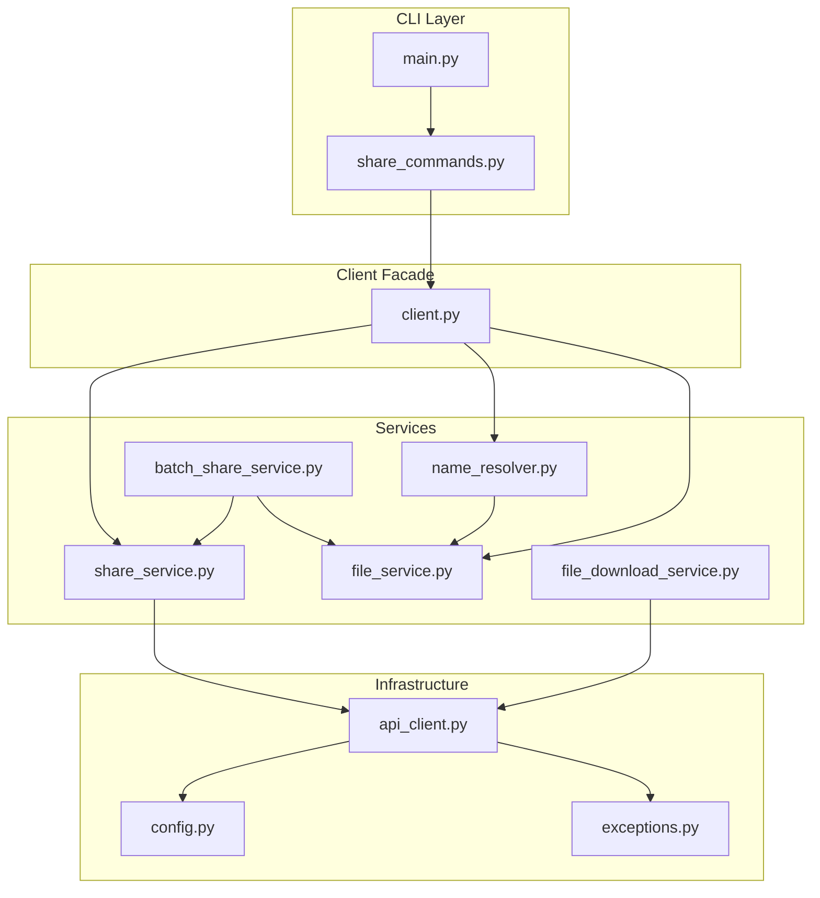
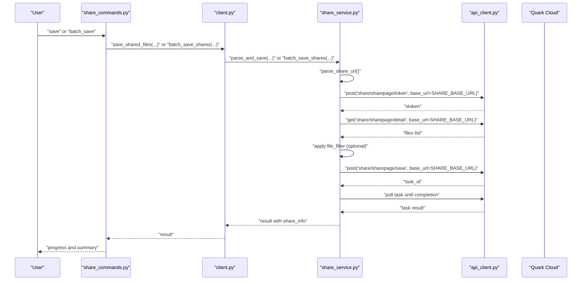
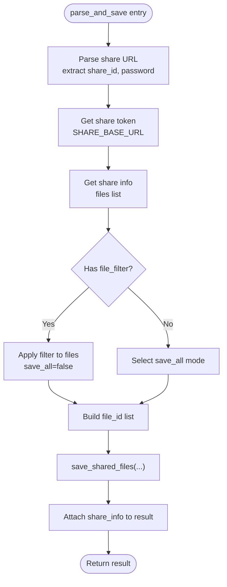
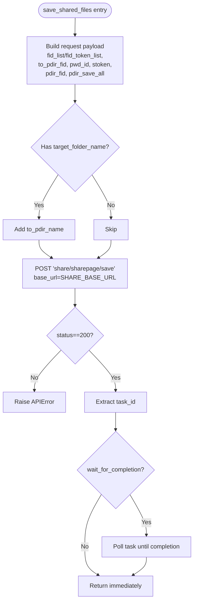
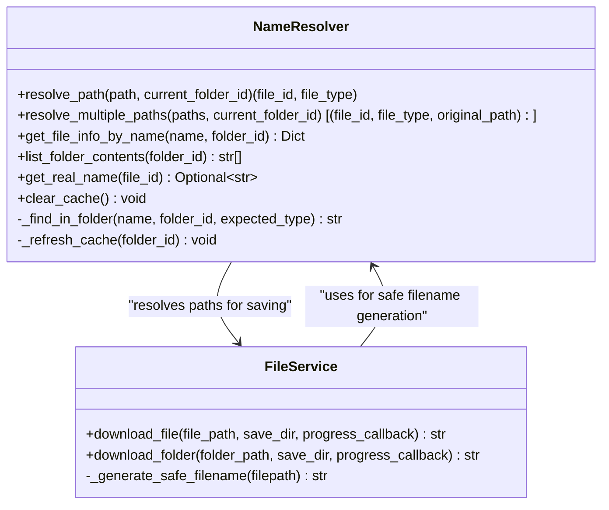
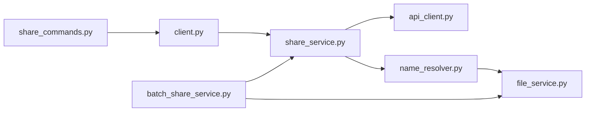

# Share Content Saving

<cite>
**Referenced Files in This Document**
- [share_service.py](file://quark_client/services/share_service.py)
- [client.py](file://quark_client/client.py)
- [api_client.py](file://quark_client/core/api_client.py)
- [config.py](file://quark_client/config.py)
- [exceptions.py](file://quark_client/exceptions.py)
- [share_commands.py](file://quark_client/cli/commands/share_commands.py)
- [batch_share_service.py](file://quark_client/services/batch_share_service.py)
- [name_resolver.py](file://quark_client/services/name_resolver.py)
- [file_service.py](file://quark_client/services/file_service.py)
- [file_download_service.py](file://quark_client/services/file_download_service.py)
- [main.py](file://quark_client/cli/main.py)
</cite>

## Table of Contents
1. [Introduction](#introduction)
2. [Project Structure](#project-structure)
3. [Core Components](#core-components)
4. [Architecture Overview](#architecture-overview)
5. [Detailed Component Analysis](#detailed-component-analysis)
6. [Dependency Analysis](#dependency-analysis)
7. [Performance Considerations](#performance-considerations)
8. [Troubleshooting Guide](#troubleshooting-guide)
9. [Conclusion](#conclusion)
10. [Appendices](#appendices)

## Introduction
This document explains the complete workflow for saving shared content to personal storage, focusing on the unified interface parse_and_save and the underlying save_shared_files implementation. It covers token acquisition, file listing retrieval, transfer operations, target folder configuration, selective vs. save-all modes, progress monitoring, and name resolver integration for filename conflict handling. Practical examples demonstrate single-file saving, batch saving, filtering strategies, and destination configuration. Error handling guidance addresses capacity limitations, permission issues, and network interruptions, along with optimization tips for large files, quota management, and retry logic.

## Project Structure
The share content saving functionality spans several modules:
- Client facade: exposes high-level APIs for users and CLI commands
- Share service: orchestrates token acquisition, listing retrieval, and transfer
- API client: handles HTTP requests and error normalization
- Name resolver: resolves paths to IDs and manages filename conflicts
- CLI commands: provide user-facing entry points and progress reporting
- Supporting services: file service, batch share service, and download service

**Diagram sources**
- [share_service.py:13-742](file://quark_client/services/share_service.py#L13-L742)
- [client.py:18-405](file://quark_client/client.py#L18-L405)
- [api_client.py:16-209](file://quark_client/core/api_client.py#L16-L209)
- [config.py:34-63](file://quark_client/config.py#L34-L63)
- [exceptions.py:8-50](file://quark_client/exceptions.py#L8-L50)
- [share_commands.py:342-537](file://quark_client/cli/commands/share_commands.py#L342-L537)
- [batch_share_service.py:16-572](file://quark_client/services/batch_share_service.py#L16-L572)
- [name_resolver.py:10-198](file://quark_client/services/name_resolver.py#L10-L198)
- [file_service.py:13-893](file://quark_client/services/file_service.py#L13-L893)
- [file_download_service.py:13-301](file://quark_client/services/file_download_service.py#L13-L301)
- [main.py:1-609](file://quark_client/cli/main.py#L1-L609)

**Section sources**
- [share_service.py:13-742](file://quark_client/services/share_service.py#L13-L742)
- [client.py:18-405](file://quark_client/client.py#L18-L405)
- [api_client.py:16-209](file://quark_client/core/api_client.py#L16-L209)
- [config.py:34-63](file://quark_client/config.py#L34-L63)
- [exceptions.py:8-50](file://quark_client/exceptions.py#L8-L50)
- [share_commands.py:342-537](file://quark_client/cli/commands/share_commands.py#L342-L537)
- [batch_share_service.py:16-572](file://quark_client/services/batch_share_service.py#L16-L572)
- [name_resolver.py:10-198](file://quark_client/services/name_resolver.py#L10-L198)
- [file_service.py:13-893](file://quark_client/services/file_service.py#L13-L893)
- [file_download_service.py:13-301](file://quark_client/services/file_download_service.py#L13-L301)
- [main.py:1-609](file://quark_client/cli/main.py#L1-L609)

## Core Components
- ShareService: central orchestrator for share-related operations including token acquisition, file listing retrieval, and transfer initiation. Provides parse_and_save as a unified interface and save_shared_files for targeted saving.
- QuarkClient: facade exposing convenient methods like save_shared_files and batch_save_shares, delegating to ShareService.
- QuarkAPIClient: HTTP client handling requests, timeouts, authentication, and response normalization.
- NameResolver: resolves path strings to IDs and manages filename conflicts during save operations.
- CLI commands: provide user-friendly entry points for single and batch saving, including progress callbacks and destination configuration.

Key responsibilities:
- Token acquisition: get_share_token using SHARE_BASE_URL
- File listing: get_share_info with pagination and sorting
- Transfer: save_shared_files with save-all vs selective modes
- Progress: batch_save_shares and CLI progress callbacks
- Conflict resolution: NameResolver cache and safe filename generation

**Section sources**
- [share_service.py:249-375](file://quark_client/services/share_service.py#L249-L375)
- [share_service.py:313-375](file://quark_client/services/share_service.py#L313-L375)
- [share_service.py:455-523](file://quark_client/services/share_service.py#L455-L523)
- [client.py:170-354](file://quark_client/client.py#L170-L354)
- [api_client.py:80-190](file://quark_client/core/api_client.py#L80-L190)
- [name_resolver.py:19-198](file://quark_client/services/name_resolver.py#L19-L198)

## Architecture Overview
The saving workflow follows a clear pipeline:
1. Parse share URL to extract share ID and optional password
2. Acquire share token via dedicated share endpoint
3. Retrieve share info (files list) with pagination
4. Apply optional file filtering
5. Determine file IDs (save-all vs selective)
6. Initiate transfer with save_shared_files
7. Optionally monitor task completion and report progress

**Diagram sources**
- [share_commands.py:342-537](file://quark_client/cli/commands/share_commands.py#L342-L537)
- [client.py:327-354](file://quark_client/client.py#L327-L354)
- [share_service.py:455-523](file://quark_client/services/share_service.py#L455-L523)
- [share_service.py:313-375](file://quark_client/services/share_service.py#L313-L375)
- [api_client.py:80-190](file://quark_client/core/api_client.py#L80-L190)

## Detailed Component Analysis

### Unified Interface: parse_and_save
The parse_and_save method consolidates the entire saving process:
- URL parsing: extracts share_id and optional password
- Token acquisition: retrieves stoken using SHARE_BASE_URL
- Listing retrieval: fetches share info with pagination and sorting
- Filtering: applies optional file_filter callable to narrow selection
- Save mode: toggles save_all flag and builds file_id list accordingly
- Transfer: invokes save_shared_files with target folder configuration
- Enrichment: attaches share_info (file_count, files) to result

**Diagram sources**
- [share_service.py:455-523](file://quark_client/services/share_service.py#L455-L523)

**Section sources**
- [share_service.py:455-523](file://quark_client/services/share_service.py#L455-L523)

### Target Folder Configuration and Save Modes
Target folder configuration supports two approaches:
- By ID: target_folder_id (e.g., "0" for root)
- By name: target_folder_name (creates a new folder with that name)

Save modes:
- save_all=True: transfers all files without explicit file_id list
- save_all=False: filters files via file_filter and saves selected subset

Progress monitoring:
- CLI batch_save_shares provides progress_callback with (current, total, url, result)
- save_shared_files can wait for task completion and return task_result

**Diagram sources**
- [share_service.py:313-375](file://quark_client/services/share_service.py#L313-L375)

**Section sources**
- [share_service.py:313-375](file://quark_client/services/share_service.py#L313-L375)
- [share_commands.py:420-537](file://quark_client/cli/commands/share_commands.py#L420-L537)

### Name Resolver Integration for Filename Conflicts
The name resolver integrates with path resolution and safe filename generation:
- Path resolution: resolve_path converts human-readable paths to file IDs and types
- Safe filename generation: _generate_safe_filename ensures unique filenames when saving locally
- Cache behavior: NameResolver refreshes caches per folder to reflect latest listings

**Diagram sources**
- [name_resolver.py:10-198](file://quark_client/services/name_resolver.py#L10-L198)
- [file_service.py:610-640](file://quark_client/services/file_service.py#L610-L640)

**Section sources**
- [name_resolver.py:19-198](file://quark_client/services/name_resolver.py#L19-L198)
- [file_service.py:610-640](file://quark_client/services/file_service.py#L610-L640)

### Practical Examples

#### Single File Saving
- Use CLI: quarkpan save <share_url> [--folder <target>] [--save-all/--no-save-all] [--wait/--no-wait]
- Programmatic: client.save_shared_files(share_url, target_folder_id, save_all=True, wait_for_completion=True)

#### Batch Saving Operations
- Use CLI: quarkpan batch-save <urls...> [--folder <target>] [--save-all/--no-save-all] [--wait/--no-wait] [--create-subfolder/--no-subfolder]
- Programmatic: client.batch_save_shares(urls, target_folder_id, save_all=True, wait_for_completion=True, progress_callback=...)

#### File Filtering Strategies
- Define a callable file_filter that accepts a file info dict and returns True to include
- Example strategies:
  - Size threshold: lambda f: f.get('size', 0) > 100 * 1024 * 1024
  - Extension whitelist: lambda f: f.get('file_name', '').lower().endswith(('.pdf', '.epub'))
  - Type filter: lambda f: not f.get('dir', False)

#### Target Destination Configuration
- Root: target_folder_id="0"
- Existing folder: resolve via NameResolver and pass target_folder_id
- New folder: pass target_folder_name (e.g., "My Shared Files")

**Section sources**
- [share_commands.py:342-537](file://quark_client/cli/commands/share_commands.py#L342-L537)
- [client.py:170-354](file://quark_client/client.py#L170-L354)
- [name_resolver.py:19-198](file://quark_client/services/name_resolver.py#L19-L198)

## Dependency Analysis
The share saving pipeline exhibits clear separation of concerns:
- CLI depends on client facade for high-level operations
- Client delegates to ShareService for share-specific logic
- ShareService uses QuarkAPIClient for HTTP operations against SHARE_BASE_URL
- NameResolver depends on FileService for caching and listing
- BatchShareService composes ShareService and FileService for advanced collection and export

**Diagram sources**
- [share_commands.py:342-537](file://quark_client/cli/commands/share_commands.py#L342-L537)
- [client.py:18-405](file://quark_client/client.py#L18-L405)
- [share_service.py:13-742](file://quark_client/services/share_service.py#L13-L742)
- [api_client.py:16-209](file://quark_client/core/api_client.py#L16-L209)
- [name_resolver.py:10-198](file://quark_client/services/name_resolver.py#L10-L198)
- [batch_share_service.py:16-572](file://quark_client/services/batch_share_service.py#L16-L572)
- [file_service.py:13-893](file://quark_client/services/file_service.py#L13-L893)

**Section sources**
- [share_service.py:13-742](file://quark_client/services/share_service.py#L13-L742)
- [client.py:18-405](file://quark_client/client.py#L18-L405)
- [api_client.py:16-209](file://quark_client/core/api_client.py#L16-L209)
- [name_resolver.py:10-198](file://quark_client/services/name_resolver.py#L10-L198)
- [batch_share_service.py:16-572](file://quark_client/services/batch_share_service.py#L16-L572)
- [file_service.py:13-893](file://quark_client/services/file_service.py#L13-L893)

## Performance Considerations
- Pagination and sorting: ShareService uses _page/_size and _sort parameters to efficiently retrieve file lists
- Task polling: save_shared_files waits for task completion with controlled polling intervals
- Chunked downloads: FileDownloadService uses configurable chunk sizes for efficient streaming
- Retry logic: ShareService’s task monitoring includes checks for capacity limits and non-retryable errors
- Large file optimization: Prefer save-all mode when transferring many small files to reduce overhead; use selective mode with filters to minimize unnecessary transfers

[No sources needed since this section provides general guidance]

## Troubleshooting Guide
Common errors and resolutions:
- Capacity limitations: Task monitoring detects capacity limit messages and raises APIError immediately
- Permission issues: Non-retryable errors like permission denied, access denied, forbidden, unauthorized, file not found, share expired, share not found trigger immediate failure
- Network interruptions: APIError and NetworkError propagate from QuarkAPIClient; ensure stable connectivity and consider increasing timeouts
- Storage quotas: Use client.get_storage_info to check available capacity before bulk operations

Operational tips:
- Use wait_for_completion=True to ensure reliable results
- Implement retry logic around transient failures (e.g., network timeouts)
- Monitor progress via progress_callback for long-running batch operations
- Validate share URLs and passwords before initiating transfers

**Section sources**
- [share_service.py:377-453](file://quark_client/services/share_service.py#L377-L453)
- [api_client.py:179-183](file://quark_client/core/api_client.py#L179-L183)
- [client.py:261-273](file://quark_client/client.py#L261-L273)

## Conclusion
The share content saving workflow is robustly implemented through a unified interface that encapsulates URL parsing, token acquisition, file listing, filtering, and transfer operations. The design cleanly separates concerns across CLI, client facade, services, and infrastructure layers, enabling flexible target folder configuration, selective vs. save-all modes, and comprehensive progress monitoring. With integrated name resolver support and careful error handling, the system provides a reliable foundation for saving shared content at scale.

[No sources needed since this section summarizes without analyzing specific files]

## Appendices

### API Definitions and Behavior Summary
- parse_and_save: Unified entry point for share URL processing and saving
- save_shared_files: Core transfer operation with save-all and selective modes
- batch_save_shares: Batch orchestration with progress callbacks
- get_share_token/get_share_info: Share endpoint interactions using SHARE_BASE_URL
- NameResolver: Path-to-ID resolution and safe filename handling

**Section sources**
- [share_service.py:249-375](file://quark_client/services/share_service.py#L249-L375)
- [share_service.py:313-375](file://quark_client/services/share_service.py#L313-L375)
- [share_service.py:455-523](file://quark_client/services/share_service.py#L455-L523)
- [client.py:170-354](file://quark_client/client.py#L170-L354)
- [name_resolver.py:19-198](file://quark_client/services/name_resolver.py#L19-L198)