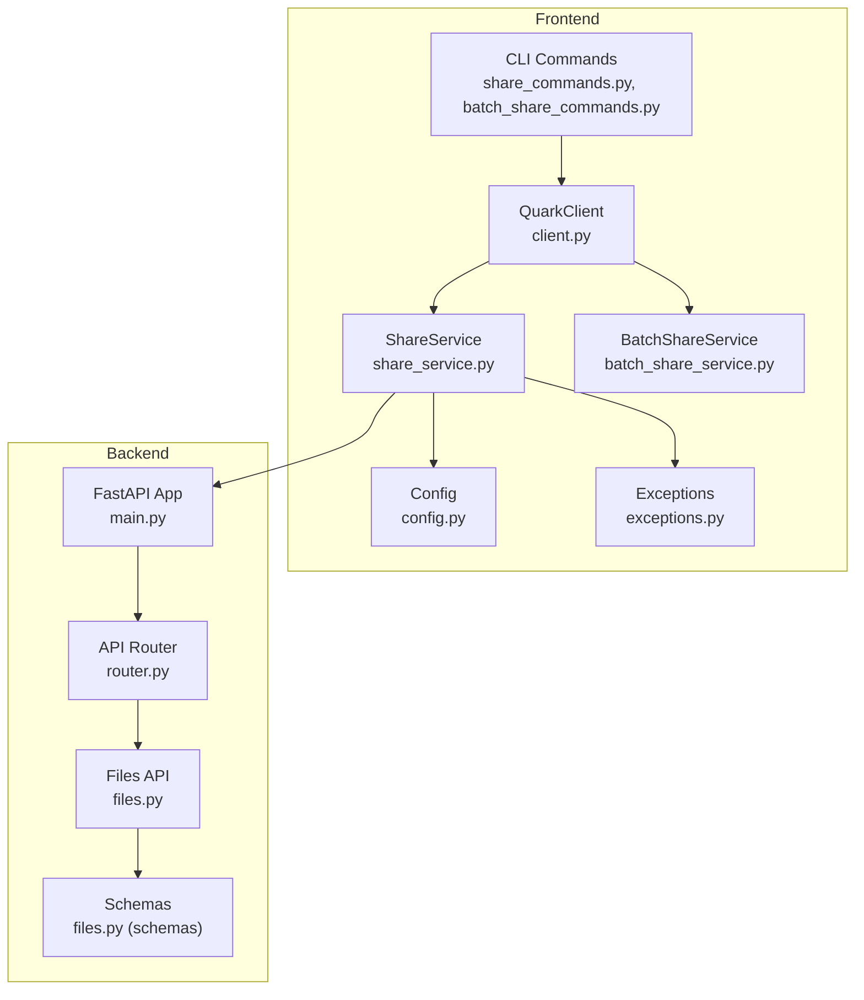
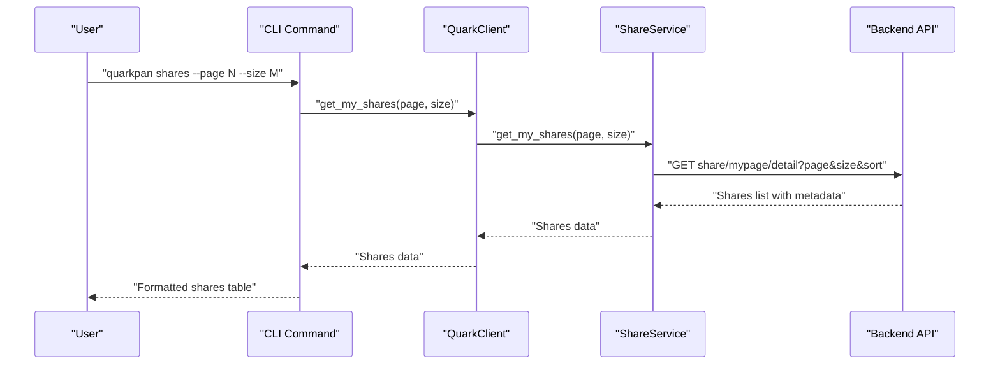
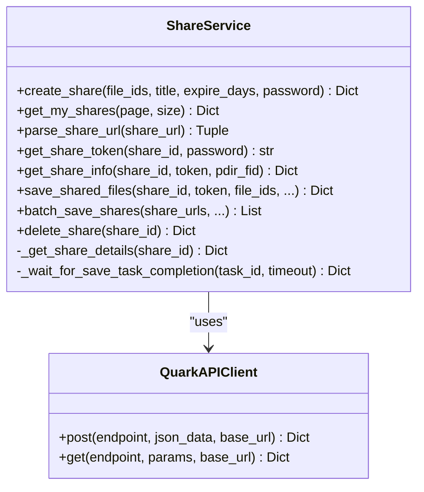
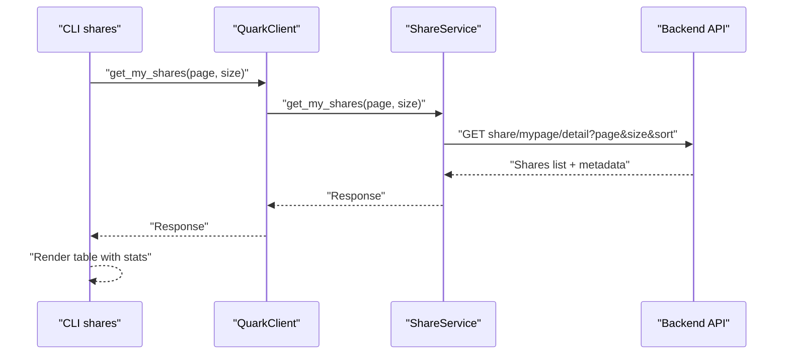
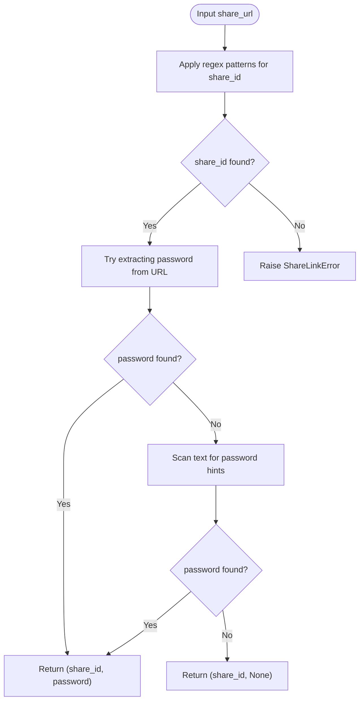
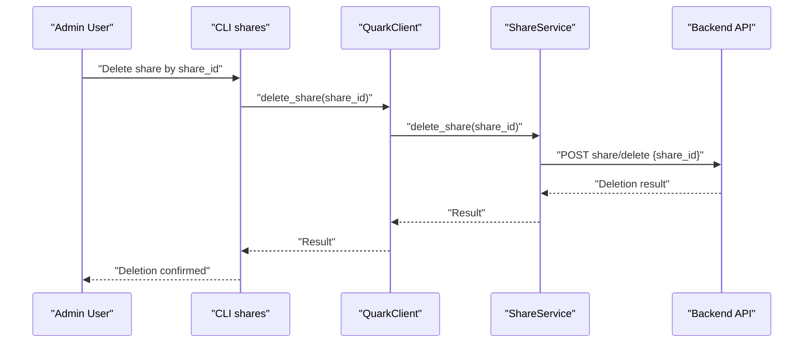
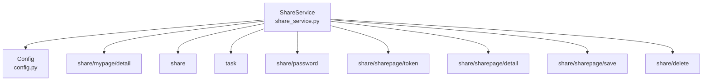
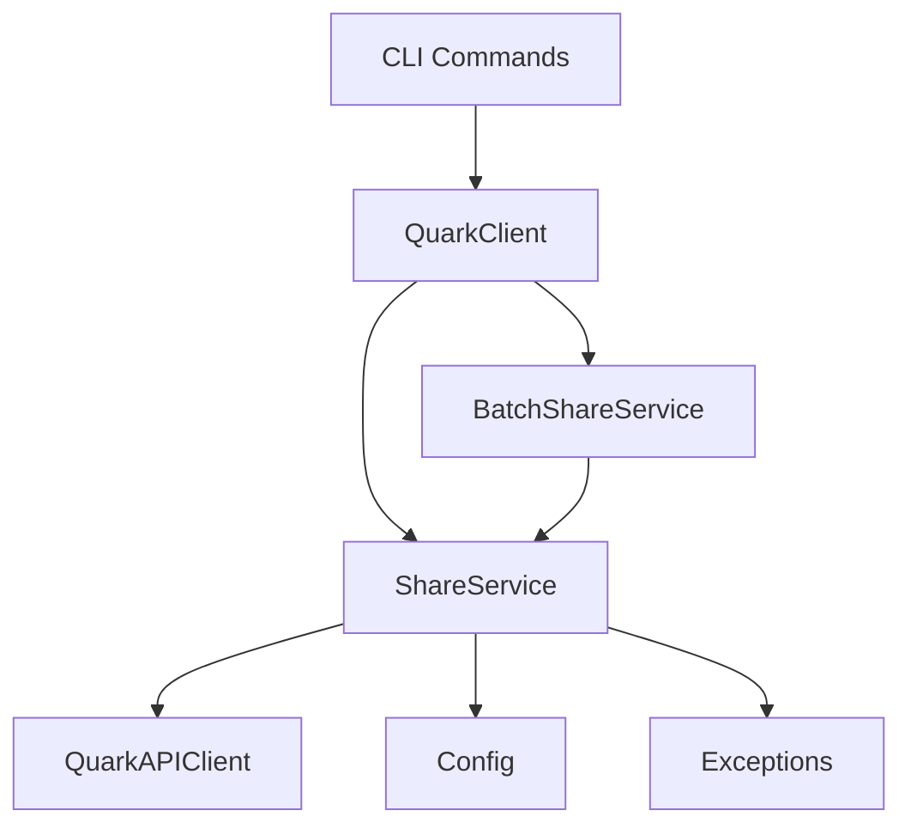

# Share Link Management

<cite>
**Referenced Files in This Document**
- [share_service.py](file://quark_client/services/share_service.py)
- [client.py](file://quark_client/client.py)
- [share_commands.py](file://quark_client/cli/commands/share_commands.py)
- [batch_share_commands.py](file://quark_client/cli/commands/batch_share_commands.py)
- [batch_share_service.py](file://quark_client/services/batch_share_service.py)
- [config.py](file://quark_client/config.py)
- [exceptions.py](file://quark_client/exceptions.py)
- [main.py](file://backend/app/main.py)
- [router.py](file://backend/app/api/v1/router.py)
- [files.py](file://backend/app/api/v1/files.py)
- [files.py (schemas)](file://backend/app/schemas/files.py)
</cite>

## Table of Contents
1. [Introduction](#introduction)
2. [Project Structure](#project-structure)
3. [Core Components](#core-components)
4. [Architecture Overview](#architecture-overview)
5. [Detailed Component Analysis](#detailed-component-analysis)
6. [Dependency Analysis](#dependency-analysis)
7. [Performance Considerations](#performance-considerations)
8. [Troubleshooting Guide](#troubleshooting-guide)
9. [Conclusion](#conclusion)
10. [Appendices](#appendices)

## Introduction
This document provides comprehensive guidance for share link management operations within the QuarkManager ecosystem. It covers the complete lifecycle of share links: creation, retrieval, modification, and deletion. It explains the get_my_shares method for listing active shares with pagination and sorting, details share link parsing supporting multiple URL formats and password extraction, documents the share deletion process and cleanup procedures, and provides practical examples for filtering, link format conversion, and administrative share management. Security considerations, expiration handling, access control, validation, integrity checks, and automated cleanup of expired shares are addressed. Finally, it documents integration with the backend share service for web-based share management and monitoring.

## Project Structure
The share link management capability spans three layers:
- Frontend CLI and Services: The CLI exposes commands for creating, listing, saving, and batch-saving shares. The ShareService encapsulates all backend interactions for share operations.
- Backend API: The backend FastAPI application defines routes for file management and exposes a health endpoint. While the backend currently does not define explicit share endpoints, the CLI integrates with the share service’s endpoints via the configured base URLs.
- Configuration and Exceptions: Configuration centralizes base URLs and defaults; exceptions standardize error handling.

**Diagram sources**
- [share_commands.py:244-340](file://quark_client/cli/commands/share_commands.py#L244-L340)
- [batch_share_commands.py:15-221](file://quark_client/cli/commands/batch_share_commands.py#L15-L221)
- [client.py:18-40](file://quark_client/client.py#L18-L40)
- [share_service.py:13-24](file://quark_client/services/share_service.py#L13-L24)
- [batch_share_service.py:16-30](file://quark_client/services/batch_share_service.py#L16-L30)
- [config.py:34-63](file://quark_client/config.py#L34-L63)
- [exceptions.py:8-50](file://quark_client/exceptions.py#L8-L50)
- [main.py:1-46](file://backend/app/main.py#L1-L46)
- [router.py:1-24](file://backend/app/api/v1/router.py#L1-L24)
- [files.py:1-150](file://backend/app/api/v1/files.py#L1-L150)
- [files.py (schemas):1-54](file://backend/app/schemas/files.py#L1-L54)

**Section sources**
- [share_service.py:13-24](file://quark_client/services/share_service.py#L13-L24)
- [client.py:18-40](file://quark_client/client.py#L18-L40)
- [share_commands.py:244-340](file://quark_client/cli/commands/share_commands.py#L244-L340)
- [batch_share_commands.py:15-221](file://quark_client/cli/commands/batch_share_commands.py#L15-L221)
- [batch_share_service.py:16-30](file://quark_client/services/batch_share_service.py#L16-L30)
- [config.py:34-63](file://quark_client/config.py#L34-L63)
- [exceptions.py:8-50](file://quark_client/exceptions.py#L8-L50)
- [main.py:1-46](file://backend/app/main.py#L1-L46)
- [router.py:1-24](file://backend/app/api/v1/router.py#L1-L24)
- [files.py:1-150](file://backend/app/api/v1/files.py#L1-L150)
- [files.py (schemas):1-54](file://backend/app/schemas/files.py#L1-L54)

## Core Components
- ShareService: Implements share lifecycle operations including creation, retrieval, parsing, token acquisition, share info retrieval, saving shared files, batch save, and deletion. It handles task polling, pagination, and token-based access to share pages.
- QuarkClient: Provides a unified interface exposing ShareService methods and shortcuts for CLI commands.
- CLI Commands: Offer user-friendly commands for creating shares, listing shares, saving shares, and batch-saving shares with validation and progress reporting.
- BatchShareService: Supports bulk directory scanning and share creation, exporting results to CSV, and integrating with ShareService.
- Configuration: Defines base URLs for main and share APIs, timeouts, retries, and pagination defaults.
- Exceptions: Standardized error types for API, network, authentication, and share-link related errors.

Key methods and responsibilities:
- Creation: create_share(file_ids, title, expire_days, password)
- Retrieval: get_my_shares(page, size), get_share_info(share_id, token, pdir_fid)
- Parsing: parse_share_url(share_url) -> (share_id, password)
- Access Token: get_share_token(share_id, password) -> stoken
- Save Shared Files: save_shared_files(...) with optional wait_for_completion and timeout
- Batch Save: batch_save_shares(urls, ...) with progress callback
- Deletion: delete_share(share_id)
- Smart Batch Create: smart_batch_create_shares(file_ids, ...) with duplicate detection and reuse

**Section sources**
- [share_service.py:75-153](file://quark_client/services/share_service.py#L75-L153)
- [share_service.py:173-194](file://quark_client/services/share_service.py#L173-L194)
- [share_service.py:196-247](file://quark_client/services/share_service.py#L196-L247)
- [share_service.py:249-278](file://quark_client/services/share_service.py#L249-L278)
- [share_service.py:280-311](file://quark_client/services/share_service.py#L280-L311)
- [share_service.py:313-375](file://quark_client/services/share_service.py#L313-L375)
- [share_service.py:455-523](file://quark_client/services/share_service.py#L455-L523)
- [share_service.py:525-580](file://quark_client/services/share_service.py#L525-L580)
- [share_service.py:607-620](file://quark_client/services/share_service.py#L607-L620)
- [share_service.py:622-741](file://quark_client/services/share_service.py#L622-L741)
- [client.py:294-367](file://quark_client/client.py#L294-L367)
- [batch_share_service.py:405-478](file://quark_client/services/batch_share_service.py#L405-L478)
- [config.py:34-63](file://quark_client/config.py#L34-L63)
- [exceptions.py:23-44](file://quark_client/exceptions.py#L23-L44)

## Architecture Overview
The share link management architecture integrates CLI commands with the ShareService, which communicates with the backend via configured base URLs. The CLI commands orchestrate user actions, while the ShareService manages task polling, token acquisition, and share operations.

**Diagram sources**
- [share_commands.py:244-340](file://quark_client/cli/commands/share_commands.py#L244-L340)
- [client.py:356-367](file://quark_client/client.py#L356-L367)
- [share_service.py:173-194](file://quark_client/services/share_service.py#L173-L194)

**Section sources**
- [share_commands.py:244-340](file://quark_client/cli/commands/share_commands.py#L244-L340)
- [client.py:356-367](file://quark_client/client.py#L356-L367)
- [share_service.py:173-194](file://quark_client/services/share_service.py#L173-L194)

## Detailed Component Analysis

### ShareService: Lifecycle Operations
ShareService encapsulates the complete share lifecycle:
- Creation: create_share performs a two-phase process—submitting a task and polling until completion—then retrieves share details.
- Retrieval: get_my_shares supports pagination and sorting by creation time descending.
- Parsing: parse_share_url extracts share_id and optional password from multiple URL formats and text.
- Access Token: get_share_token obtains stoken for accessing share pages.
- Share Info: get_share_info fetches share details using stoken.
- Save Shared Files: save_shared_files supports selective or full-file saving with task completion monitoring.
- Batch Save: batch_save_shares orchestrates parsing, token acquisition, info retrieval, filtering, and saving with progress callbacks.
- Deletion: delete_share removes a share by share_id.

**Diagram sources**
- [share_service.py:13-24](file://quark_client/services/share_service.py#L13-L24)
- [share_service.py:75-153](file://quark_client/services/share_service.py#L75-L153)
- [share_service.py:173-194](file://quark_client/services/share_service.py#L173-L194)
- [share_service.py:196-247](file://quark_client/services/share_service.py#L196-L247)
- [share_service.py:249-278](file://quark_client/services/share_service.py#L249-L278)
- [share_service.py:280-311](file://quark_client/services/share_service.py#L280-L311)
- [share_service.py:313-375](file://quark_client/services/share_service.py#L313-L375)
- [share_service.py:455-580](file://quark_client/services/share_service.py#L455-L580)
- [share_service.py:607-620](file://quark_client/services/share_service.py#L607-L620)

**Section sources**
- [share_service.py:75-153](file://quark_client/services/share_service.py#L75-L153)
- [share_service.py:173-194](file://quark_client/services/share_service.py#L173-L194)
- [share_service.py:196-247](file://quark_client/services/share_service.py#L196-L247)
- [share_service.py:249-278](file://quark_client/services/share_service.py#L249-L278)
- [share_service.py:280-311](file://quark_client/services/share_service.py#L280-L311)
- [share_service.py:313-375](file://quark_client/services/share_service.py#L313-L375)
- [share_service.py:455-580](file://quark_client/services/share_service.py#L455-L580)
- [share_service.py:607-620](file://quark_client/services/share_service.py#L607-L620)

### get_my_shares: Listing Active Shares with Pagination and Sorting
- Purpose: Retrieve the user’s share list with configurable pagination and sorting.
- Parameters: page (default 1), size (default 50).
- Sorting: Defaults to order by created_at descending.
- Metadata: Includes total count and notification/follow flags.
- Usage: Called by CLI command shares and by higher-level services.

**Diagram sources**
- [share_commands.py:244-340](file://quark_client/cli/commands/share_commands.py#L244-L340)
- [client.py:356-367](file://quark_client/client.py#L356-L367)
- [share_service.py:173-194](file://quark_client/services/share_service.py#L173-L194)

**Section sources**
- [share_service.py:173-194](file://quark_client/services/share_service.py#L173-L194)
- [share_commands.py:244-340](file://quark_client/cli/commands/share_commands.py#L244-L340)
- [client.py:356-367](file://quark_client/client.py#L356-L367)

### Share Link Parsing: Multiple URL Formats and Password Extraction
- Supported formats: Standard share URLs, password-included variants, and alternative scheme.
- Extraction: Uses regex patterns to capture share_id and optional password.
- Fallback password extraction: Scans text for password hints if not embedded in URL.
- Error handling: Raises ShareLinkError for unrecognized formats.

**Diagram sources**
- [share_service.py:196-247](file://quark_client/services/share_service.py#L196-L247)

**Section sources**
- [share_service.py:196-247](file://quark_client/services/share_service.py#L196-L247)

### Share Deletion and Cleanup Procedures
- Deletion: delete_share(share_id) posts to the delete endpoint and returns the result.
- Cleanup: The CLI command shares provides administrative listing and statistics; deletion complements this by removing unwanted shares.
- Task cleanup: save_shared_files monitors task completion and raises APIError for failures, ensuring cleanup of failed tasks.

**Diagram sources**
- [share_service.py:607-620](file://quark_client/services/share_service.py#L607-L620)
- [share_commands.py:244-340](file://quark_client/cli/commands/share_commands.py#L244-L340)

**Section sources**
- [share_service.py:607-620](file://quark_client/services/share_service.py#L607-L620)
- [share_commands.py:244-340](file://quark_client/cli/commands/share_commands.py#L244-L340)

### Practical Examples

#### Example 1: Listing Shares with Filtering and Pagination
- Use CLI command shares with page and size options to paginate results.
- The underlying get_my_shares call sorts by created_at descending and includes metadata for total counts.

**Section sources**
- [share_commands.py:244-340](file://quark_client/cli/commands/share_commands.py#L244-L340)
- [share_service.py:173-194](file://quark_client/services/share_service.py#L173-L194)

#### Example 2: Link Format Conversion and Validation
- Use parse_share_url to normalize various share link formats and extract passwords.
- Combine with CLI helpers to validate and deduplicate links before processing.

**Section sources**
- [share_service.py:196-247](file://quark_client/services/share_service.py#L196-L247)
- [share_commands.py:16-118](file://quark_client/cli/commands/share_commands.py#L16-L118)

#### Example 3: Administrative Share Management
- Use shares command to list, filter, and manage shares.
- Use delete_share to remove unwanted shares after review.

**Section sources**
- [share_commands.py:244-340](file://quark_client/cli/commands/share_commands.py#L244-L340)
- [share_service.py:607-620](file://quark_client/services/share_service.py#L607-L620)

### Security Considerations, Expiration, and Access Control
- Expiration: create_share supports expire_days; when set, expired_at is computed and included in the task payload.
- Access Control: get_share_token requires pwd_id and optional passcode; token-based access is enforced for share pages.
- Integrity: parse_share_url validates and extracts identifiers; exceptions are raised for malformed links.
- Cleanup: Automated cleanup of expired shares is not implemented in the provided code; administrators should periodically review and delete expired shares using delete_share.

**Section sources**
- [share_service.py:75-153](file://quark_client/services/share_service.py#L75-L153)
- [share_service.py:196-247](file://quark_client/services/share_service.py#L196-L247)
- [share_service.py:249-278](file://quark_client/services/share_service.py#L249-L278)
- [exceptions.py:42-44](file://quark_client/exceptions.py#L42-L44)

### Integration with Backend Share Service
- Base URLs: Config defines SHARE_BASE_URL for share-specific endpoints and BASE_URL for general API calls.
- Endpoints used by ShareService:
  - share/mypage/detail (listing shares)
  - share (create share)
  - task (poll task status)
  - share/password (retrieve share details)
  - share/sharepage/token (get access token)
  - share/sharepage/detail (get share info)
  - share/sharepage/save (save shared files)
  - share/delete (delete share)
- Backend API: The backend FastAPI app exposes general file management endpoints and health checks; explicit share endpoints are invoked via ShareService base URLs.

**Diagram sources**
- [share_service.py:173-194](file://quark_client/services/share_service.py#L173-L194)
- [share_service.py:114-152](file://quark_client/services/share_service.py#L114-L152)
- [share_service.py:166-171](file://quark_client/services/share_service.py#L166-L171)
- [share_service.py:267-278](file://quark_client/services/share_service.py#L267-L278)
- [share_service.py:305-311](file://quark_client/services/share_service.py#L305-L311)
- [share_service.py:357-361](file://quark_client/services/share_service.py#L357-L361)
- [share_service.py](file://quark_client/services/share_service.py#L619)
- [config.py:38-39](file://quark_client/config.py#L38-L39)

**Section sources**
- [config.py:34-63](file://quark_client/config.py#L34-L63)
- [share_service.py:173-194](file://quark_client/services/share_service.py#L173-L194)
- [share_service.py:114-152](file://quark_client/services/share_service.py#L114-L152)
- [share_service.py:166-171](file://quark_client/services/share_service.py#L166-L171)
- [share_service.py:267-278](file://quark_client/services/share_service.py#L267-L278)
- [share_service.py:305-311](file://quark_client/services/share_service.py#L305-L311)
- [share_service.py:357-361](file://quark_client/services/share_service.py#L357-L361)
- [share_service.py](file://quark_client/services/share_service.py#L619)

## Dependency Analysis
- ShareService depends on QuarkAPIClient for HTTP requests and on Config for base URLs.
- QuarkClient composes ShareService and BatchShareService, exposing simplified methods to CLI commands.
- CLI commands depend on ShareService and BatchShareService for business logic.
- Backend API is decoupled from share operations; ShareService invokes endpoints via configured base URLs.

**Diagram sources**
- [client.py:18-40](file://quark_client/client.py#L18-L40)
- [share_service.py:13-24](file://quark_client/services/share_service.py#L13-L24)
- [batch_share_service.py:16-30](file://quark_client/services/batch_share_service.py#L16-L30)
- [config.py:34-63](file://quark_client/config.py#L34-L63)
- [exceptions.py:8-50](file://quark_client/exceptions.py#L8-L50)

**Section sources**
- [client.py:18-40](file://quark_client/client.py#L18-L40)
- [share_service.py:13-24](file://quark_client/services/share_service.py#L13-L24)
- [batch_share_service.py:16-30](file://quark_client/services/batch_share_service.py#L16-L30)
- [config.py:34-63](file://quark_client/config.py#L34-L63)
- [exceptions.py:8-50](file://quark_client/exceptions.py#L8-L50)

## Performance Considerations
- Pagination: Use appropriate page and size parameters to balance responsiveness and data volume.
- Task Polling: Creation and save operations poll tasks; tune timeouts and retry delays to avoid long waits.
- Batch Operations: Use batch_save_shares and batch_share for efficient processing of multiple items.
- Token Reuse: Acquire tokens once per session to minimize repeated token requests.

[No sources needed since this section provides general guidance]

## Troubleshooting Guide
Common issues and resolutions:
- APIError during creation or saving: Inspect status_code and response_data; adjust parameters (e.g., expire_days, password).
- ShareLinkError during parsing: Verify URL format and presence of share_id; ensure password hints are present if not embedded.
- Capacity Limit Errors: Detected during save task monitoring; free up space and retry.
- Expiration Handling: Periodically review and delete expired shares using delete_share.

**Section sources**
- [exceptions.py:23-44](file://quark_client/exceptions.py#L23-L44)
- [share_service.py:377-453](file://quark_client/services/share_service.py#L377-L453)
- [share_service.py:607-620](file://quark_client/services/share_service.py#L607-L620)

## Conclusion
The share link management system provides a robust, extensible framework for creating, retrieving, parsing, saving, and deleting shares. It supports pagination, sorting, token-based access, and batch operations, with clear separation of concerns between CLI, client, and service layers. Administrators can leverage the CLI to list and manage shares, while developers can integrate ShareService into applications requiring programmatic share control. Security, expiration, and cleanup practices should be followed to maintain a healthy share catalog.

[No sources needed since this section summarizes without analyzing specific files]

## Appendices

### Backend API Context
- The backend FastAPI application exposes general file management endpoints and health checks. Explicit share endpoints are not defined in the backend; share operations are handled by ShareService against configured base URLs.

**Section sources**
- [main.py:1-46](file://backend/app/main.py#L1-L46)
- [router.py:1-24](file://backend/app/api/v1/router.py#L1-L24)
- [files.py:1-150](file://backend/app/api/v1/files.py#L1-L150)
- [files.py (schemas):1-54](file://backend/app/schemas/files.py#L1-L54)