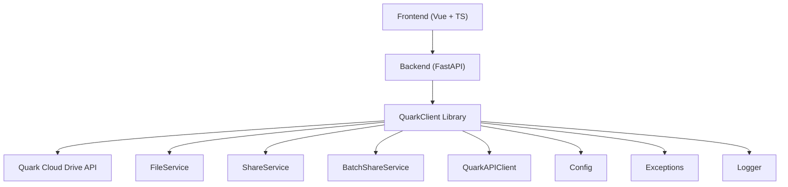
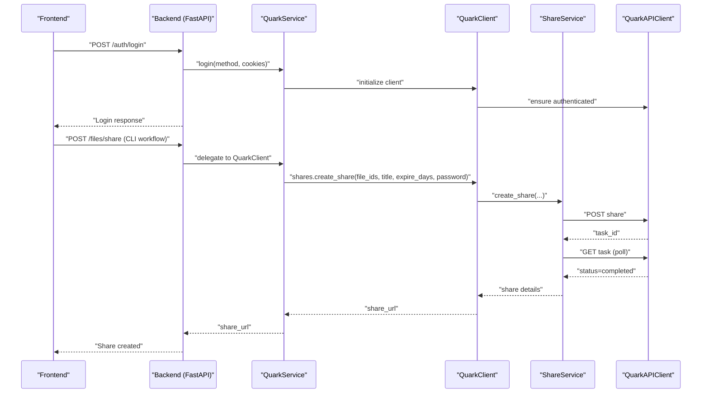
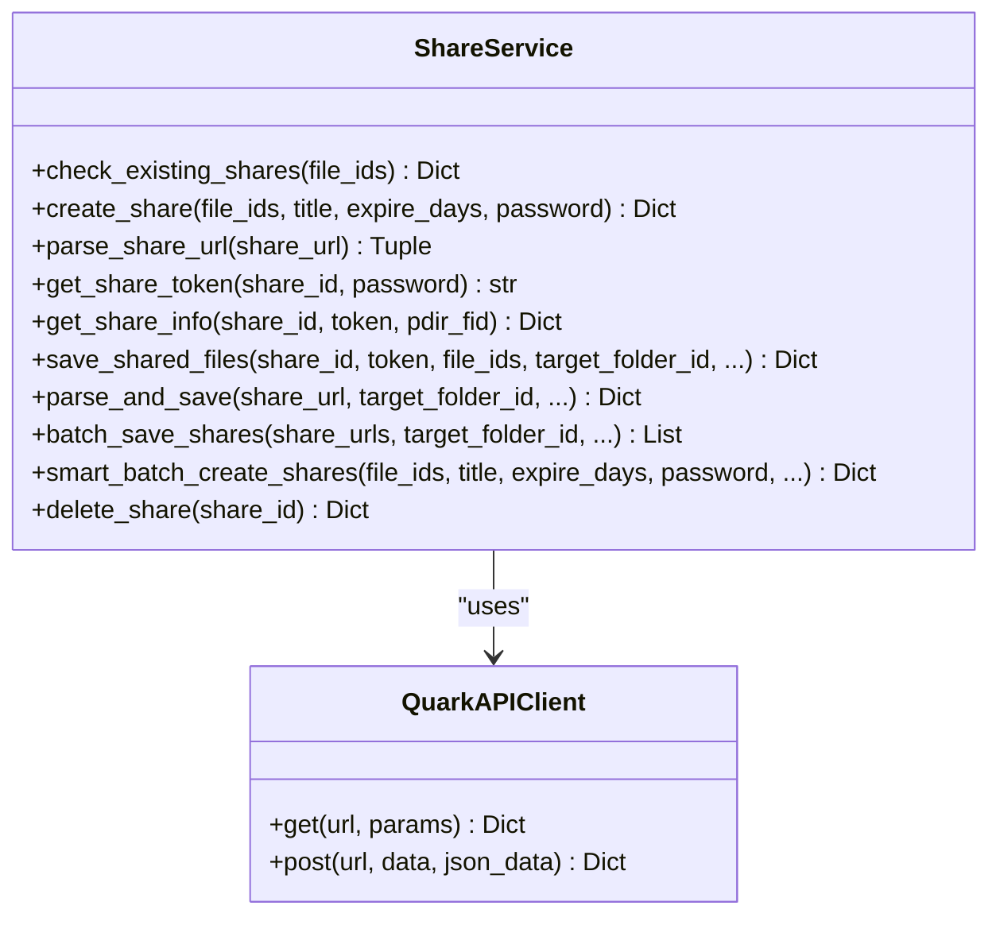
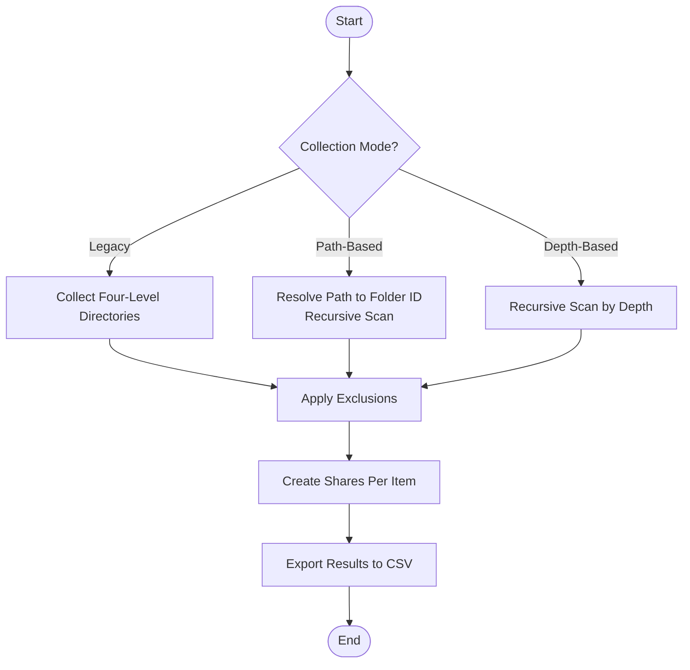
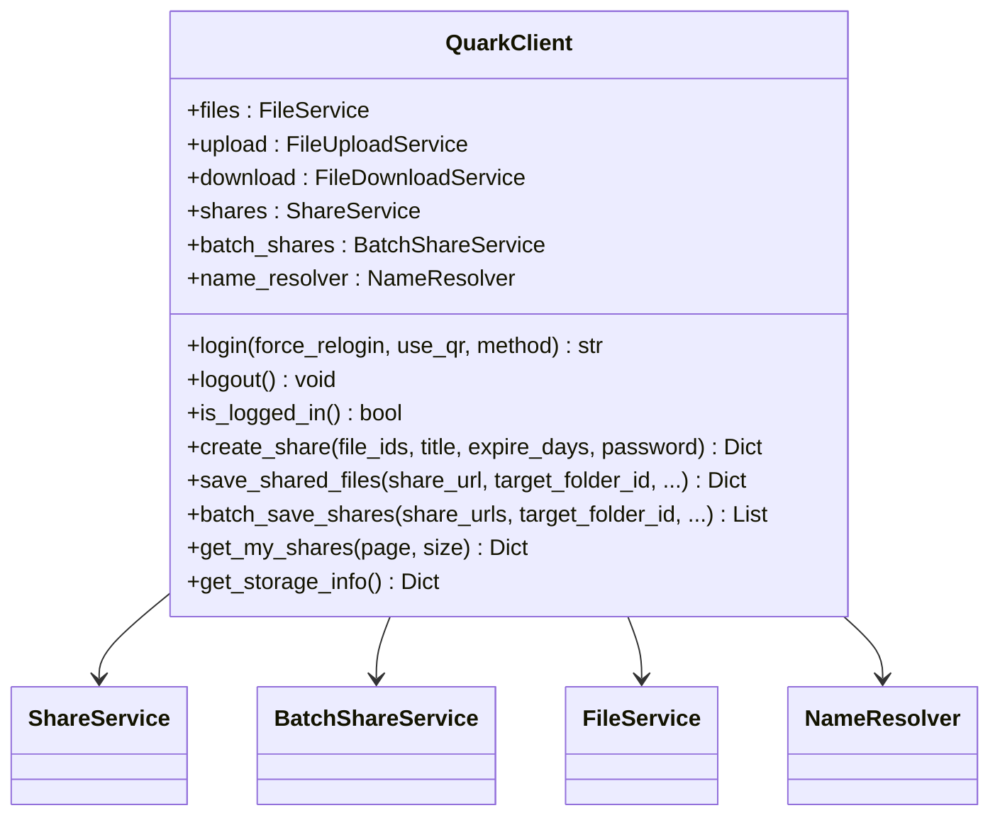
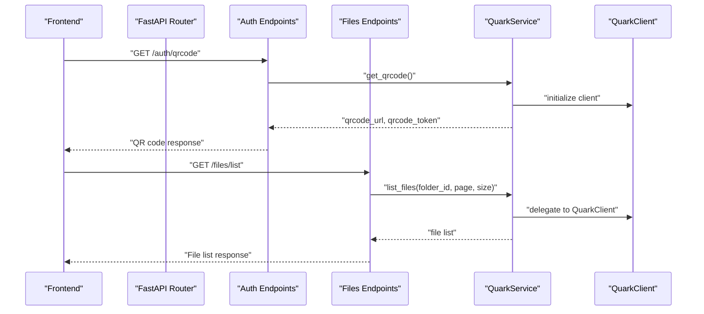
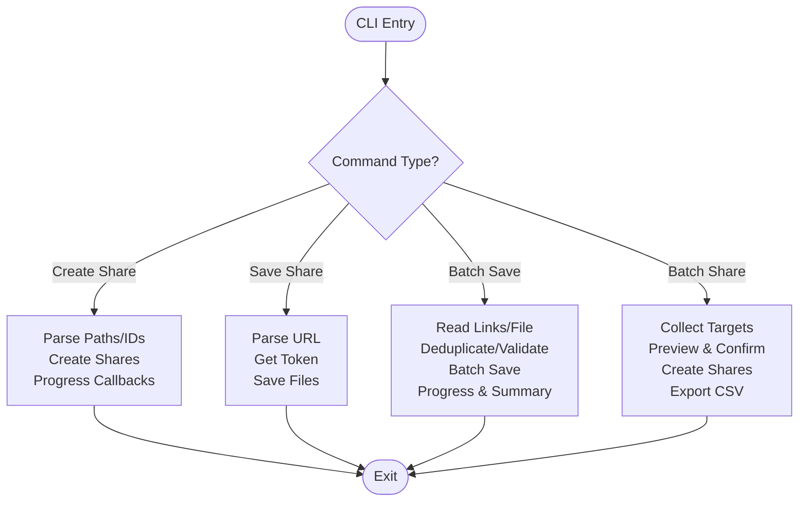
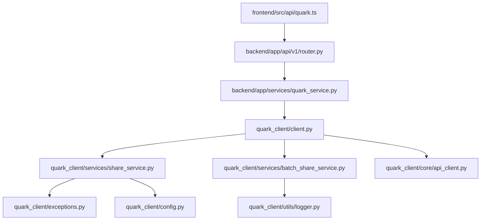

# Share Management System

<cite>
**Referenced Files in This Document**
- [share_service.py](file://quark_client/services/share_service.py)
- [batch_share_service.py](file://quark_client/services/batch_share_service.py)
- [client.py](file://quark_client/client.py)
- [api_client.py](file://quark_client/core/api_client.py)
- [config.py](file://quark_client/config.py)
- [exceptions.py](file://quark_client/exceptions.py)
- [logger.py](file://quark_client/utils/logger.py)
- [share_commands.py](file://quark_client/cli/commands/share_commands.py)
- [batch_share_commands.py](file://quark_client/cli/commands/batch_share_commands.py)
- [quark_service.py](file://backend/app/services/quark_service.py)
- [auth.py](file://backend/app/api/v1/auth.py)
- [files.py](file://backend/app/api/v1/files.py)
- [router.py](file://backend/app/api/v1/router.py)
- [quark.ts](file://frontend/src/api/quark.ts)
- [PROJECT_SUMMARY.md](file://PROJECT_SUMMARY.md)
</cite>

## Table of Contents
1. [Introduction](#introduction)
2. [Project Structure](#project-structure)
3. [Core Components](#core-components)
4. [Architecture Overview](#architecture-overview)
5. [Detailed Component Analysis](#detailed-component-analysis)
6. [Dependency Analysis](#dependency-analysis)
7. [Performance Considerations](#performance-considerations)
8. [Troubleshooting Guide](#troubleshooting-guide)
9. [Conclusion](#conclusion)
10. [Appendices](#appendices)

## Introduction
This document describes the Share Management System for QuarkManager, focusing on the complete sharing workflow and batch processing capabilities. It covers share link creation (including link generation, expiration settings, password protection, and share parameters), background job handling, progress tracking, status monitoring, batch share operations, concurrent operation management, and share content saving (automatic saving to personal storage, file resolution, and naming conflict handling). It also documents the backend share service implementation, API integration, job queue management, error handling strategies, QuarkClient share service architecture (service composition, retry mechanisms, and progress reporting), practical examples, troubleshooting, and performance optimization for large-scale sharing. Integration patterns between the frontend share interface, backend processing services, and QuarkClient share operations are explained.

## Project Structure
The Share Management System spans three layers:
- Frontend: Provides user interface and API integration for authentication and file operations.
- Backend: Exposes REST APIs for authentication and file management, integrating with the QuarkClient library.
- QuarkClient Library: Implements the core share service, batch share service, and supporting utilities for API communication, error handling, and logging.

**Diagram sources**
- [quark.ts:1-125](file://frontend/src/api/quark.ts#L1-L125)
- [router.py:1-24](file://backend/app/api/v1/router.py#L1-L24)
- [quark_service.py:1-388](file://backend/app/services/quark_service.py#L1-L388)
- [client.py:1-405](file://quark_client/client.py#L1-L405)
- [api_client.py:1-209](file://quark_client/core/api_client.py#L1-L209)
- [config.py:1-63](file://quark_client/config.py#L1-L63)
- [exceptions.py:1-50](file://quark_client/exceptions.py#L1-L50)
- [logger.py:1-73](file://quark_client/utils/logger.py#L1-L73)

**Section sources**
- [PROJECT_SUMMARY.md:1-128](file://PROJECT_SUMMARY.md#L1-L128)
- [router.py:1-24](file://backend/app/api/v1/router.py#L1-L24)

## Core Components
- ShareService: Manages share creation, parsing, token retrieval, share info fetching, and saving shared files to personal storage. Includes intelligent batch creation with duplicate detection and progress callbacks.
- BatchShareService: Collects target directories/files, creates shares in bulk, exports results to CSV, and supports flexible scanning modes.
- QuarkClient: Orchestrates services, exposes convenience methods for shares and batch operations, and integrates with the underlying API client.
- QuarkAPIClient: Handles HTTP requests, authentication, error propagation, and request/response normalization.
- Backend Services: Provide REST endpoints for authentication and file operations, delegating to QuarkClient when available.
- CLI Commands: Offer command-line workflows for share creation, listing, saving, and batch sharing with progress reporting.

Key responsibilities:
- Share Creation: Build share tasks, poll completion, and retrieve share details.
- Share Parsing: Extract share IDs and optional passwords from URLs.
- Token Retrieval: Obtain access tokens for protected shares.
- Save Shared Files: Convert shared content to personal storage with optional filtering and progress monitoring.
- Batch Operations: Scan directories, create shares, and export results.
- Error Handling: Normalize API errors, authentication failures, and network issues.

**Section sources**
- [share_service.py:1-742](file://quark_client/services/share_service.py#L1-L742)
- [batch_share_service.py:1-572](file://quark_client/services/batch_share_service.py#L1-L572)
- [client.py:1-405](file://quark_client/client.py#L1-L405)
- [api_client.py:1-209](file://quark_client/core/api_client.py#L1-L209)
- [quark_service.py:1-388](file://backend/app/services/quark_service.py#L1-L388)

## Architecture Overview
The system follows a layered architecture:
- Frontend interacts with Backend via REST APIs.
- Backend delegates to QuarkService, which initializes and uses QuarkClient.
- QuarkClient composes services (FileService, ShareService, BatchShareService) and uses QuarkAPIClient for HTTP operations.
- ShareService orchestrates share lifecycle: creation, polling, token acquisition, and saving shared content.
- BatchShareService coordinates directory/file discovery and bulk share creation/export.

**Diagram sources**
- [auth.py:1-107](file://backend/app/api/v1/auth.py#L1-L107)
- [quark_service.py:1-388](file://backend/app/services/quark_service.py#L1-L388)
- [client.py:1-405](file://quark_client/client.py#L1-L405)
- [share_service.py:1-742](file://quark_client/services/share_service.py#L1-L742)
- [api_client.py:1-209](file://quark_client/core/api_client.py#L1-L209)

## Detailed Component Analysis

### ShareService: Share Link Creation and Content Saving
ShareService encapsulates the complete share lifecycle:
- Duplicate Detection: Checks existing shares for given file IDs and returns reusable share info.
- Share Creation: Builds share tasks with parameters (title, expire_days, password), polls task completion, and retrieves share details.
- Share Parsing: Extracts share_id and optional password from various URL formats.
- Token Retrieval: Obtains stoken for accessing protected shares.
- Share Info Retrieval: Fetches detailed share information for browsing and filtering.
- Save Shared Files: Converts shared content to personal storage with optional filtering and progress monitoring.
- One-Stop Parsing and Save: Parses URL, obtains token, fetches share info, filters files, and saves with optional wait and timeout.
- Batch Save Shares: Iterates over multiple URLs, applies progress callbacks, and aggregates results.
- Smart Batch Create Shares: Creates shares per file ID, checks duplicates, and reports statistics.
- Delete Share: Removes a share by ID.

**Diagram sources**
- [share_service.py:1-742](file://quark_client/services/share_service.py#L1-L742)
- [api_client.py:1-209](file://quark_client/core/api_client.py#L1-L209)

**Section sources**
- [share_service.py:25-742](file://quark_client/services/share_service.py#L25-L742)

### BatchShareService: Directory Collection and Bulk Share Creation
BatchShareService provides flexible directory/file discovery and bulk share creation:
- Target Directory Collection: Supports legacy four-level scanning, path-based scanning, and depth-based scanning with exclusion patterns.
- Recursive Discovery: Traverses directories up to a configurable depth, filtering by folders/files/both and applying exclusion patterns.
- Share Creation: Iterates collected items, creates individual shares, and records results.
- Export to CSV: Writes share results (title, URL, path, timestamp) to CSV with failure handling.
- One-Stop Workflow: Collect directories, create shares, and export CSV with logging.

**Diagram sources**
- [batch_share_service.py:1-572](file://quark_client/services/batch_share_service.py#L1-L572)

**Section sources**
- [batch_share_service.py:16-572](file://quark_client/services/batch_share_service.py#L16-L572)

### QuarkClient: Service Composition and Convenience Methods
QuarkClient composes multiple services and exposes unified methods:
- Service Composition: Initializes FileService, FileUploadService, FileDownloadService, ShareService, BatchShareService, and NameResolver.
- Authentication: Delegates login/logout and login status checks to QuarkAuth.
- File Operations: Provides shortcuts for listing, searching, moving, renaming, and deleting files.
- Share Operations: Exposes create_share, parse_share_url, save_shared_files, get_my_shares, and batch_save_shares.
- Batch Save Shares: Supports two modes—legacy per-share subfolder creation and new unified batch save via ShareService.
- Storage Info: Retrieves capacity information via API client.

**Diagram sources**
- [client.py:1-405](file://quark_client/client.py#L1-L405)

**Section sources**
- [client.py:18-405](file://quark_client/client.py#L18-L405)

### Backend Integration: REST API and Service Layer
Backend provides REST endpoints for authentication and file operations:
- Authentication Endpoints: QR code generation, login status checking, login, status, and logout.
- File Management Endpoints: Listing files, creating folders, deleting files, renaming, moving, searching, storage info, and download URL retrieval.
- Service Layer: QuarkService initializes QuarkClient, handles login flows, and delegates operations to QuarkClient when available.

**Diagram sources**
- [router.py:1-24](file://backend/app/api/v1/router.py#L1-L24)
- [auth.py:1-107](file://backend/app/api/v1/auth.py#L1-L107)
- [files.py:1-150](file://backend/app/api/v1/files.py#L1-L150)
- [quark_service.py:1-388](file://backend/app/services/quark_service.py#L1-L388)

**Section sources**
- [auth.py:1-107](file://backend/app/api/v1/auth.py#L1-L107)
- [files.py:1-150](file://backend/app/api/v1/files.py#L1-L150)
- [quark_service.py:1-388](file://backend/app/services/quark_service.py#L1-L388)

### CLI Workflows: Share Creation and Batch Operations
CLI commands provide robust workflows:
- Share Commands: Extract links from files, deduplicate, validate, create shares with progress, list shares, and save single share with target folder resolution.
- Batch Share Commands: Scan directories with flexible modes, preview results, confirm execution, create shares, export CSV, and show summaries.

**Diagram sources**
- [share_commands.py:1-537](file://quark_client/cli/commands/share_commands.py#L1-L537)
- [batch_share_commands.py:1-275](file://quark_client/cli/commands/batch_share_commands.py#L1-L275)

**Section sources**
- [share_commands.py:16-537](file://quark_client/cli/commands/share_commands.py#L16-L537)
- [batch_share_commands.py:15-275](file://quark_client/cli/commands/batch_share_commands.py#L15-L275)

## Dependency Analysis
The system exhibits clear separation of concerns:
- Frontend depends on Backend REST APIs.
- Backend depends on QuarkService for client initialization and delegation.
- QuarkClient composes multiple services and uses QuarkAPIClient for HTTP operations.
- ShareService depends on QuarkAPIClient for API calls and on ShareLinkError for parsing failures.
- BatchShareService depends on FileService and ShareService for orchestration.
- Logger and Exceptions provide cross-cutting concerns.

**Diagram sources**
- [quark.ts:1-125](file://frontend/src/api/quark.ts#L1-L125)
- [router.py:1-24](file://backend/app/api/v1/router.py#L1-L24)
- [quark_service.py:1-388](file://backend/app/services/quark_service.py#L1-L388)
- [client.py:1-405](file://quark_client/client.py#L1-L405)
- [share_service.py:1-742](file://quark_client/services/share_service.py#L1-L742)
- [batch_share_service.py:1-572](file://quark_client/services/batch_share_service.py#L1-L572)
- [api_client.py:1-209](file://quark_client/core/api_client.py#L1-L209)
- [exceptions.py:1-50](file://quark_client/exceptions.py#L1-L50)
- [logger.py:1-73](file://quark_client/utils/logger.py#L1-L73)
- [config.py:1-63](file://quark_client/config.py#L1-L63)

**Section sources**
- [quark.ts:1-125](file://frontend/src/api/quark.ts#L1-L125)
- [router.py:1-24](file://backend/app/api/v1/router.py#L1-L24)
- [quark_service.py:1-388](file://backend/app/services/quark_service.py#L1-L388)
- [client.py:1-405](file://quark_client/client.py#L1-L405)
- [share_service.py:1-742](file://quark_client/services/share_service.py#L1-L742)
- [batch_share_service.py:1-572](file://quark_client/services/batch_share_service.py#L1-L572)
- [api_client.py:1-209](file://quark_client/core/api_client.py#L1-L209)
- [exceptions.py:1-50](file://quark_client/exceptions.py#L1-L50)
- [logger.py:1-73](file://quark_client/utils/logger.py#L1-L73)
- [config.py:1-63](file://quark_client/config.py#L1-L63)

## Performance Considerations
- Asynchronous Polling: Share creation and save operations poll task status with bounded retries and fixed intervals. Tune retry counts and delays for large batches.
- Concurrency Control: Batch operations iterate sequentially by default. For improved throughput, consider parallelizing with controlled concurrency and rate limiting to avoid API throttling.
- Progress Reporting: Use progress callbacks to provide real-time feedback and enable cancellation strategies.
- Request Throttling: Respect request timeouts and implement exponential backoff for transient failures.
- Memory Efficiency: Stream downloads and avoid loading large file lists entirely into memory when possible.
- Logging: Enable structured logging for diagnostics without impacting performance.

[No sources needed since this section provides general guidance]

## Troubleshooting Guide
Common issues and resolutions:
- Authentication Failures: Verify login status and ensure cookies are valid. Re-generate QR code and re-authenticate if needed.
- Share Parsing Errors: Validate share URLs against supported patterns; ensure passwords are correctly extracted or provided.
- Task Timeout/Failed: Inspect task status polling and adjust timeout values. Check for capacity limits or permission denials.
- Network Errors: Confirm connectivity and retry with backoff. Review request timeouts and base URLs.
- CLI Validation: Ensure input files contain valid share URLs and apply deduplication and validation steps before processing.

**Section sources**
- [api_client.py:179-183](file://quark_client/core/api_client.py#L179-L183)
- [share_service.py:377-454](file://quark_client/services/share_service.py#L377-L454)
- [share_commands.py:16-242](file://quark_client/cli/commands/share_commands.py#L16-L242)
- [batch_share_commands.py:15-221](file://quark_client/cli/commands/batch_share_commands.py#L15-L221)

## Conclusion
The Share Management System provides a robust, modular solution for creating and managing share links, saving shared content, and performing batch operations. It leverages QuarkClient’s service composition, strong error handling, and CLI workflows to support both programmatic and interactive usage. Integration with the backend enables seamless authentication and file management, while the frontend can consume these services through REST APIs. For large-scale operations, adopt concurrency controls, progress reporting, and logging to maintain reliability and observability.

[No sources needed since this section summarizes without analyzing specific files]

## Appendices

### Practical Examples

- Share Creation Workflow
  - Parse file paths or IDs to file IDs.
  - Call intelligent batch creation with duplicate checks and progress callbacks.
  - Example path: [share_commands.py:121-242](file://quark_client/cli/commands/share_commands.py#L121-L242)

- Batch Share Operations
  - Choose scanning mode (legacy, path-based, depth-based).
  - Preview targets, confirm execution, and export CSV.
  - Example path: [batch_share_commands.py:15-221](file://quark_client/cli/commands/batch_share_commands.py#L15-L221)

- Troubleshooting Share-Related Issues
  - Validate URLs, handle parsing errors, and inspect task status.
  - Example path: [share_service.py:377-454](file://quark_client/services/share_service.py#L377-L454)

- Performance Optimization for Large-Scale Sharing
  - Adjust timeouts, implement controlled concurrency, and use progress callbacks.
  - Example path: [share_service.py:124-152](file://quark_client/services/share_service.py#L124-L152), [batch_share_service.py:405-478](file://quark_client/services/batch_share_service.py#L405-L478)

### API Definitions

- Authentication Endpoints
  - GET /auth/qrcode: Non-blocking QR code generation.
  - POST /auth/check-login: Check login status using QR token.
  - POST /auth/login: Login with method and optional cookies.
  - GET /auth/status: Get current login status and user info.
  - POST /auth/logout: Logout.

- File Management Endpoints
  - GET /files/list: List files with pagination.
  - POST /files/folder: Create folder.
  - DELETE /files/delete: Delete files.
  - PUT /files/rename: Rename file.
  - POST /files/move: Move files.
  - GET /files/search: Search files.
  - GET /files/storage: Get storage info.
  - GET /files/download/{file_id}: Get download URL.

**Section sources**
- [auth.py:1-107](file://backend/app/api/v1/auth.py#L1-L107)
- [files.py:1-150](file://backend/app/api/v1/files.py#L1-L150)