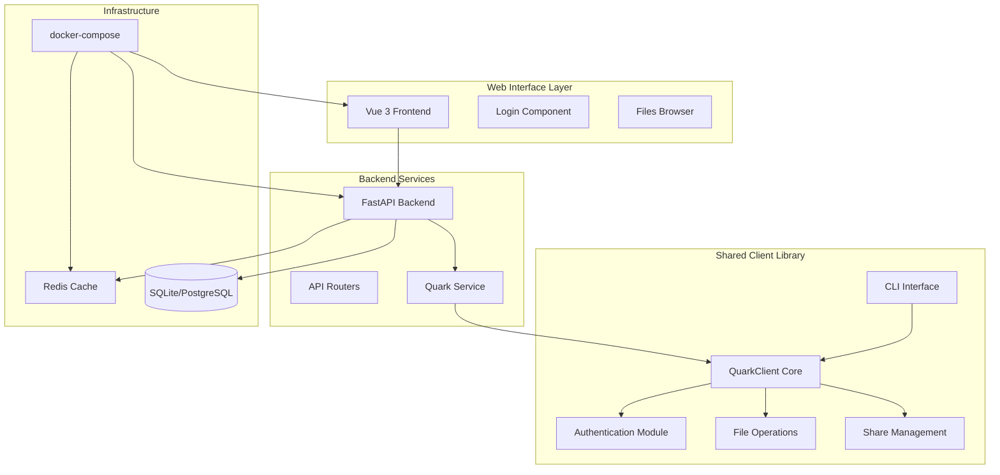
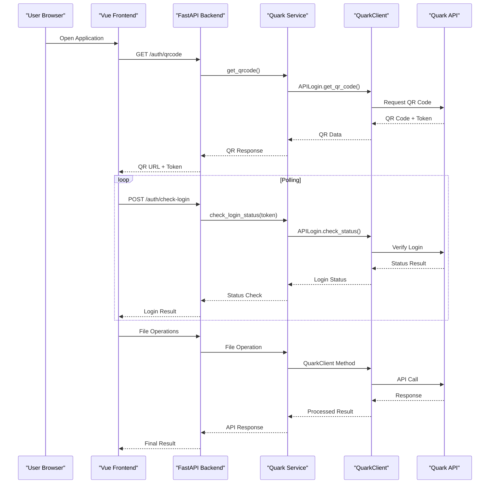
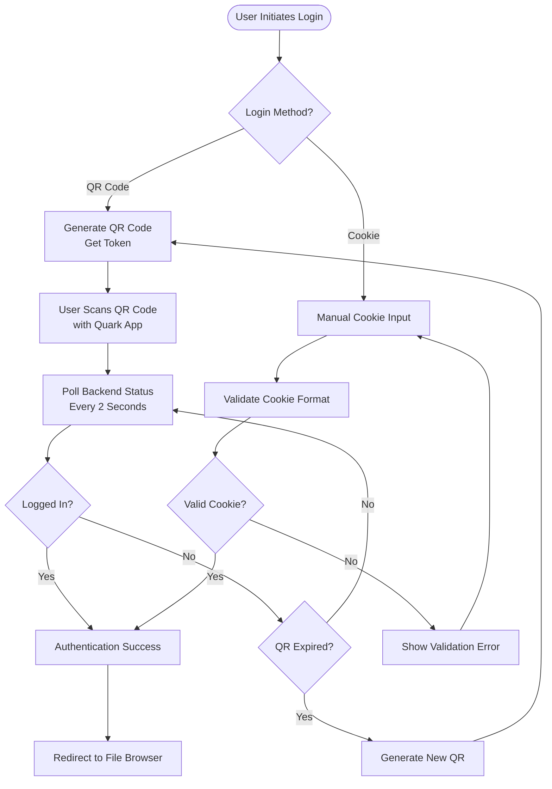
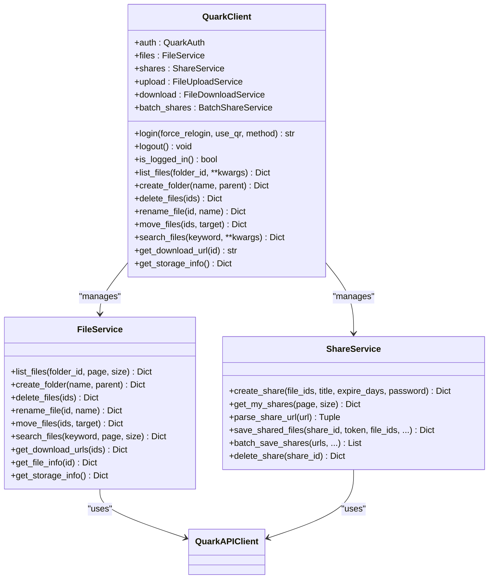
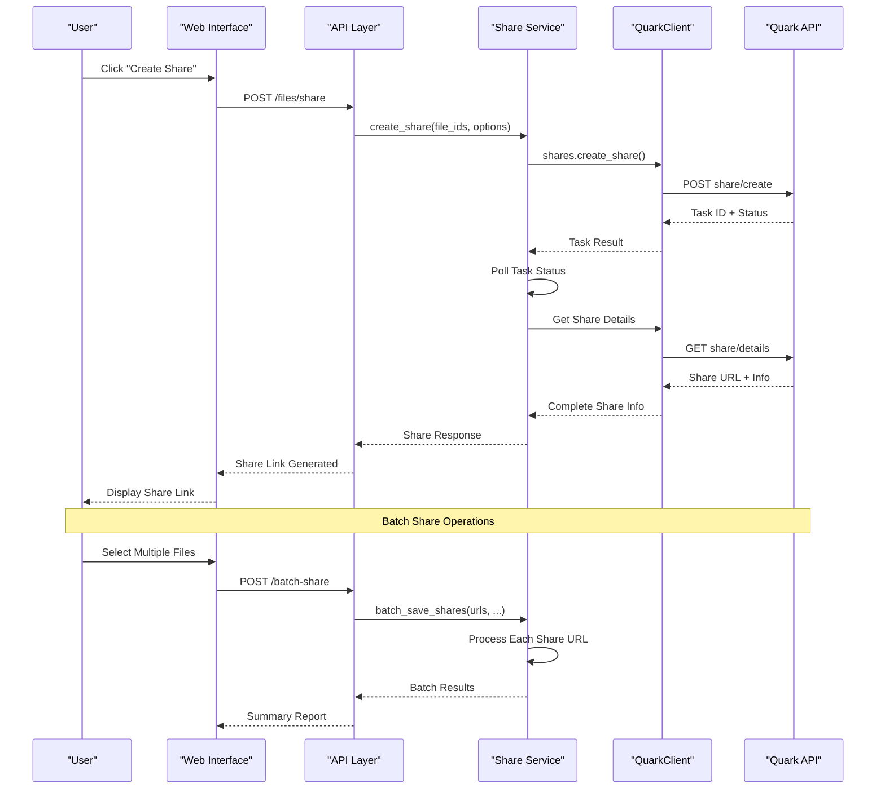
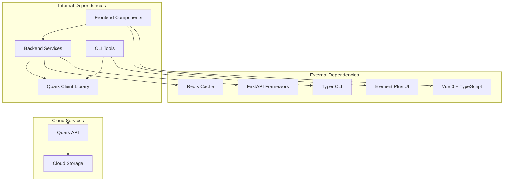

# Project Overview

<cite>
**Referenced Files in This Document**
- [PROJECT_SUMMARY.md](file://PROJECT_SUMMARY.md)
- [docker-compose.yml](file://docker-compose.yml)
- [backend/app/main.py](file://backend/app/main.py)
- [backend/app/api/v1/auth.py](file://backend/app/api/v1/auth.py)
- [backend/app/api/v1/files.py](file://backend/app/api/v1/files.py)
- [backend/app/services/quark_service.py](file://backend/app/services/quark_service.py)
- [frontend/src/main.ts](file://frontend/src/main.ts)
- [frontend/src/views/Login.vue](file://frontend/src/views/Login.vue)
- [frontend/src/views/Files.vue](file://frontend/src/views/Files.vue)
- [frontend/src/api/quark.ts](file://frontend/src/api/quark.ts)
- [quark_client/client.py](file://quark_client/client.py)
- [quark_client/auth/login.py](file://quark_client/auth/login.py)
- [quark_client/services/file_service.py](file://quark_client/services/file_service.py)
- [quark_client/services/share_service.py](file://quark_client/services/share_service.py)
- [quark_client/cli/main.py](file://quark_client/cli/main.py)
- [quark_client/cli/commands/auth.py](file://quark_client/cli/commands/auth.py)
- [quark_client/cli/commands/basic_fileops.py](file://quark_client/cli/commands/basic_fileops.py)
</cite>

## Table of Contents
1. [Introduction](#introduction)
2. [Project Structure](#project-structure)
3. [Core Components](#core-components)
4. [Architecture Overview](#architecture-overview)
5. [Detailed Component Analysis](#detailed-component-analysis)
6. [Dependency Analysis](#dependency-analysis)
7. [Performance Considerations](#performance-considerations)
8. [Troubleshooting Guide](#troubleshooting-guide)
9. [Conclusion](#conclusion)

## Introduction
QuarkManager is a comprehensive web-based cloud storage management system built around the Quark Pan (Pikpak) cloud service. The project combines three complementary components:
- A Vue 3 + TypeScript web interface for intuitive cloud storage management
- A FastAPI backend that serves as the central orchestration layer
- A Python CLI client for advanced automation and command-line operations

The system provides complete cloud storage lifecycle management including authentication, file operations, sharing, and batch processing capabilities. It supports both QR code-based authentication (recommended) and cookie-based login methods, offering flexibility for different user preferences and environments.

## Project Structure
The project follows a clean, modular architecture with distinct boundaries between frontend, backend, and shared client libraries:

**Diagram sources**
- [docker-compose.yml:1-65](file://docker-compose.yml#L1-L65)
- [backend/app/main.py:1-46](file://backend/app/main.py#L1-L46)
- [quark_client/client.py:18-405](file://quark_client/client.py#L18-L405)

**Section sources**
- [PROJECT_SUMMARY.md:10-34](file://PROJECT_SUMMARY.md#L10-L34)
- [docker-compose.yml:1-65](file://docker-compose.yml#L1-L65)

## Core Components
The system consists of three primary components working in harmony:

### Backend Service Layer
The FastAPI backend provides RESTful APIs for cloud storage operations with comprehensive authentication support and service orchestration.

### Frontend Web Interface
A modern Vue 3 application offering intuitive file management with QR code authentication and cookie-based login options.

### Shared Client Library
A reusable Python library containing the core QuarkClient implementation with unified authentication, file operations, and share management capabilities.

**Section sources**
- [PROJECT_SUMMARY.md:36-56](file://PROJECT_SUMMARY.md#L36-L56)
- [backend/app/services/quark_service.py:22-345](file://backend/app/services/quark_service.py#L22-L345)

## Architecture Overview
The system employs a layered architecture with clear separation of concerns:

**Diagram sources**
- [frontend/src/views/Login.vue:84-176](file://frontend/src/views/Login.vue#L84-L176)
- [backend/app/api/v1/auth.py:18-52](file://backend/app/api/v1/auth.py#L18-L52)
- [backend/app/services/quark_service.py:46-121](file://backend/app/services/quark_service.py#L46-L121)

The architecture supports both synchronous and asynchronous operations, with proper error handling and state management throughout the authentication and file operation workflows.

**Section sources**
- [backend/app/main.py:12-29](file://backend/app/main.py#L12-L29)
- [quark_client/client.py:50-74](file://quark_client/client.py#L50-L74)

## Detailed Component Analysis

### Authentication System
The authentication system provides flexible login options supporting both QR code scanning and manual cookie-based authentication.

**Diagram sources**
- [frontend/src/views/Login.vue:84-176](file://frontend/src/views/Login.vue#L84-L176)
- [quark_client/auth/login.py:107-138](file://quark_client/auth/login.py#L107-L138)

The authentication flow implements robust error handling with automatic QR code regeneration and comprehensive validation for both login methods.

**Section sources**
- [backend/app/api/v1/auth.py:18-107](file://backend/app/api/v1/auth.py#L18-L107)
- [quark_client/auth/login.py:15-294](file://quark_client/auth/login.py#L15-L294)

### File Management Operations
The file management system provides comprehensive operations for cloud storage manipulation with support for folders, files, and batch operations.

**Diagram sources**
- [quark_client/client.py:18-405](file://quark_client/client.py#L18-L405)
- [quark_client/services/file_service.py:13-800](file://quark_client/services/file_service.py#L13-L800)
- [quark_client/services/share_service.py:13-742](file://quark_client/services/share_service.py#L13-L742)

The file operations support includes pagination, filtering, sorting, and comprehensive error handling for robust cloud storage management.

**Section sources**
- [backend/app/api/v1/files.py:19-150](file://backend/app/api/v1/files.py#L19-L150)
- [quark_client/services/file_service.py:25-800](file://quark_client/services/file_service.py#L25-L800)

### Share Management System
The share management functionality enables creation, retrieval, and management of public and private file sharing links with advanced filtering and batch operations.

**Diagram sources**
- [quark_client/services/share_service.py:75-153](file://quark_client/services/share_service.py#L75-L153)
- [quark_client/services/share_service.py:525-581](file://quark_client/services/share_service.py#L525-L581)

The share management system handles complex scenarios including password protection, expiration dates, and batch processing with comprehensive error reporting.

**Section sources**
- [quark_client/services/share_service.py:13-742](file://quark_client/services/share_service.py#L13-L742)

### CLI Interface
The command-line interface provides powerful automation capabilities for advanced users and scripting scenarios.

```mermaid
flowchart TD
CLI[quarkpan Command] --> SubCommands["Sub Commands"]
SubCommands --> AuthCmd["auth: Authentication"]
SubCommands --> FileOps["files: File Operations"]
SubCommands --> ShareCmd["share: Share Management"]
SubCommands --> DownloadCmd["download: Download"]
SubCommands --> SearchCmd["search: Search"]
AuthCmd --> Login["login: QR/Cookie Login"]
AuthCmd --> Status["status: Check Login"]
AuthCmd --> Logout["logout: Logout"]
FileOps --> List["ls: List Files"]
FileOps --> Create["mkdir: Create Folder"]
FileOps --> Delete["rm: Delete Files"]
FileOps --> Rename["rename: Rename"]
FileOps --> Upload["upload: Upload Files"]
FileOps --> Move["move/mv: Move Files"]
ShareCmd --> CreateShare["create: Create Share"]
ShareCmd --> ListShares["list: List Shares"]
ShareCmd --> SaveShare["save: Save Share"]
ShareCmd --> BatchShare["batch: Batch Share"]
DownloadCmd --> Single["file: Single File"]
DownloadCmd --> Multi["files: Multiple Files"]
DownloadCmd --> Folder["folder: Entire Folder"]
SearchCmd --> Basic["Basic Search"]
SearchCmd --> Advanced["Advanced Filters"]
```

**Diagram sources**
- [quark_client/cli/main.py:38-609](file://quark_client/cli/main.py#L38-L609)

The CLI provides comprehensive coverage of all major functionality with interactive mode, batch operations, and detailed progress reporting.

**Section sources**
- [quark_client/cli/main.py:1-609](file://quark_client/cli/main.py#L1-L609)
- [quark_client/cli/commands/auth.py:13-188](file://quark_client/cli/commands/auth.py#L13-L188)
- [quark_client/cli/commands/basic_fileops.py:14-406](file://quark_client/cli/commands/basic_fileops.py#L14-L406)

## Dependency Analysis
The project maintains clean dependency boundaries with clear interfaces between components:

**Diagram sources**
- [backend/app/main.py:1-46](file://backend/app/main.py#L1-L46)
- [frontend/src/main.ts:1-23](file://frontend/src/main.ts#L1-L23)
- [quark_client/client.py:18-405](file://quark_client/client.py#L18-L405)

The dependency graph shows minimal coupling between layers, enabling independent development and testing of each component while maintaining cohesive functionality.

**Section sources**
- [docker-compose.yml:34-57](file://docker-compose.yml#L34-L57)
- [PROJECT_SUMMARY.md:5-8](file://PROJECT_SUMMARY.md#L5-L8)

## Performance Considerations
The system is designed with several performance optimization strategies:

- **Asynchronous Operations**: Long-running tasks like file uploads and share processing use non-blocking patterns
- **Caching Strategy**: Redis integration for session management and temporary data storage
- **Pagination Support**: Efficient handling of large file collections with configurable page sizes
- **Connection Pooling**: Reusable connections to minimize overhead
- **Error Caching**: Failed operations cache results to prevent repeated failures

## Troubleshooting Guide
Common issues and their solutions:

### Authentication Problems
- **QR Code Not Working**: Check network connectivity and regenerate QR code after 5-minute expiry
- **Cookie Login Failing**: Verify cookie format and ensure browser compatibility
- **Login State Issues**: Clear browser cookies and restart authentication process

### File Operation Failures
- **Large File Uploads**: Monitor upload progress and check available disk space
- **Batch Operations**: Review individual operation results for specific failure reasons
- **Permission Errors**: Verify user account permissions and storage quotas

### System Integration Issues
- **Docker Deployment**: Ensure all containers are running and ports are properly mapped
- **API Connectivity**: Check backend service availability and network configuration
- **Database Issues**: Verify connection strings and migration status

**Section sources**
- [frontend/src/views/Login.vue:134-176](file://frontend/src/views/Login.vue#L134-L176)
- [backend/app/services/quark_service.py:77-121](file://backend/app/services/quark_service.py#L77-L121)

## Conclusion
QuarkManager represents a comprehensive solution for cloud storage management, combining modern web technologies with robust backend services and flexible CLI tools. The multi-component architecture provides excellent separation of concerns while maintaining seamless integration between web interface, backend services, and command-line tools.

The system's strength lies in its flexibility - users can choose between intuitive web interface, powerful CLI automation, or programmatic integration through the shared client library. The authentication system supports multiple login methods, file operations provide comprehensive cloud storage management, and share management enables easy collaboration workflows.

Future development should focus on completing the frontend implementation, implementing database integration, and expanding the CLI with additional automation capabilities while maintaining the clean architectural boundaries established in the current design.