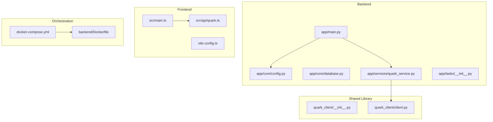
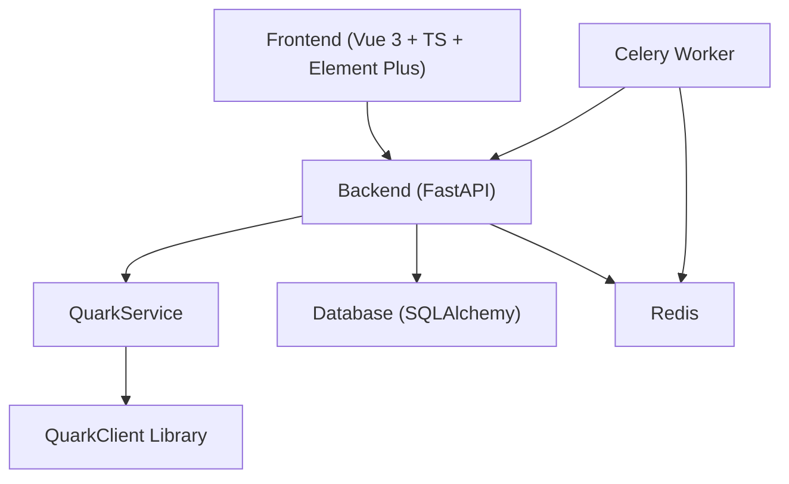
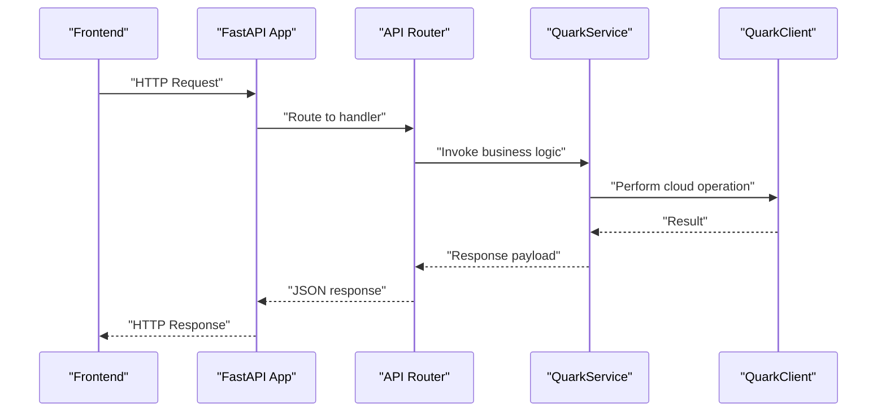
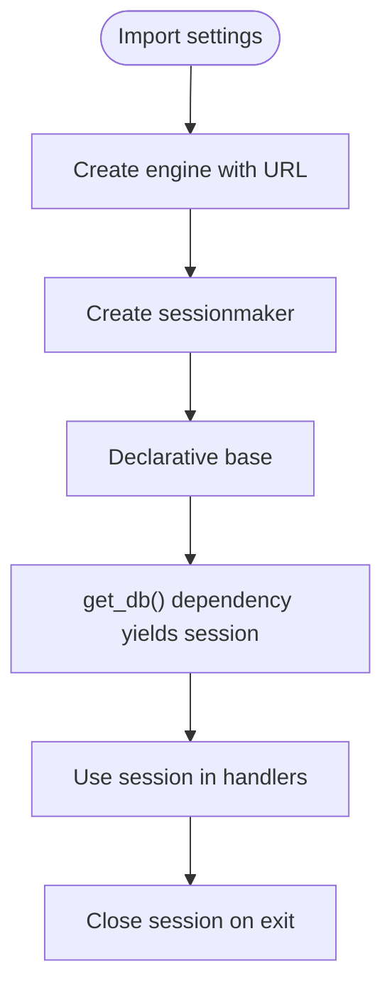
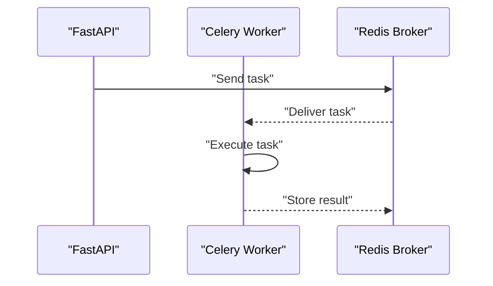
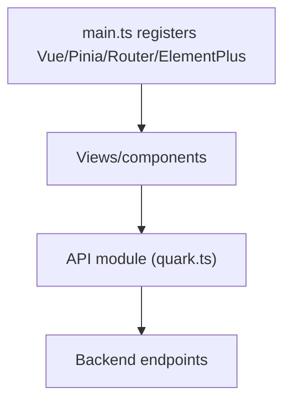
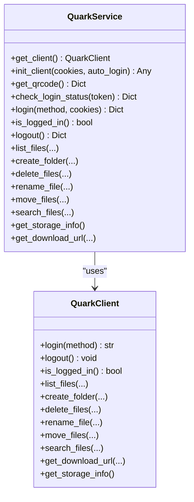
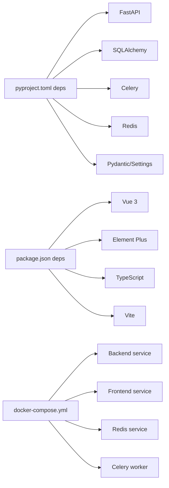

# Technology Stack

<cite>
**Referenced Files in This Document**
- [pyproject.toml](file://backend/pyproject.toml)
- [package.json](file://frontend/package.json)
- [docker-compose.yml](file://docker-compose.yml)
- [PROJECT_SUMMARY.md](file://PROJECT_SUMMARY.md)
- [config.py](file://backend/app/core/config.py)
- [database.py](file://backend/app/core/database.py)
- [main.py](file://backend/app/main.py)
- [Dockerfile](file://backend/Dockerfile)
- [vite.config.ts](file://frontend/vite.config.ts)
- [quark.ts](file://frontend/src/api/quark.ts)
- [main.ts](file://frontend/src/main.ts)
- [__init__.py](file://quark_client/__init__.py)
- [client.py](file://quark_client/client.py)
- [quark_service.py](file://backend/app/services/quark_service.py)
</cite>

## Table of Contents
1. [Introduction](#introduction)
2. [Project Structure](#project-structure)
3. [Core Components](#core-components)
4. [Architecture Overview](#architecture-overview)
5. [Detailed Component Analysis](#detailed-component-analysis)
6. [Dependency Analysis](#dependency-analysis)
7. [Performance Considerations](#performance-considerations)
8. [Troubleshooting Guide](#troubleshooting-guide)
9. [Conclusion](#conclusion)
10. [Appendices](#appendices)

## Introduction
This document provides a comprehensive technology stack overview for QuarkManager, focusing on backend, frontend, database, containerization, and the QuarkClient library integration. It explains the selected technologies, their roles, and the rationale behind each choice, along with version compatibility, upgrade paths, and configuration requirements. The goal is to help both technical and non-technical stakeholders understand how the system is built, why specific choices were made, and how to operate and evolve the stack effectively.

## Project Structure
QuarkManager is organized into three primary areas:
- Backend: FastAPI application with routing, configuration, database abstraction, and Celery-backed asynchronous tasks.
- Frontend: Vue 3 SPA with TypeScript, Element Plus UI components, and Vite build tooling.
- QuarkClient: A reusable Python library that encapsulates cloud storage API interactions and provides a high-level client interface.

**Diagram sources**
- [main.py](file://backend/app/main.py)
- [config.py](file://backend/app/core/config.py)
- [database.py](file://backend/app/core/database.py)
- [quark_service.py](file://backend/app/services/quark_service.py)
- [quark.ts](file://frontend/src/api/quark.ts)
- [main.ts](file://frontend/src/main.ts)
- [__init__.py](file://quark_client/__init__.py)
- [client.py](file://quark_client/client.py)
- [docker-compose.yml](file://docker-compose.yml)
- [Dockerfile](file://backend/Dockerfile)

**Section sources**
- [PROJECT_SUMMARY.md](file://PROJECT_SUMMARY.md)
- [docker-compose.yml](file://docker-compose.yml)

## Core Components
- Backend stack
  - FastAPI 0.109.0+ for high-performance async web framework with automatic OpenAPI docs.
  - SQLAlchemy 2.0.0+ for ORM and database abstraction.
  - Celery 5.3.0+ with Redis 5.0.0+ for background task processing.
  - Pydantic and pydantic-settings for robust configuration and validation.
  - Alembic for database migrations.
  - Uvicorn for ASGI server.
- Frontend stack
  - Vue 3.4.15+ with Composition API.
  - TypeScript 5.3.3+ for type safety.
  - Element Plus 2.5.3+ for UI components.
  - Vite 5.0.0+ for modern build tooling and dev server with proxy.
- Database options
  - SQLite for development simplicity.
  - PostgreSQL for production scalability.
- Containerization
  - Docker multi-stage-like build via slim base image and Docker Compose orchestration.
- QuarkClient integration
  - Centralized client and service layer enabling cloud storage operations and QR-based login.

**Section sources**
- [pyproject.toml](file://backend/pyproject.toml)
- [package.json](file://frontend/package.json)
- [config.py](file://backend/app/core/config.py)
- [database.py](file://backend/app/core/database.py)
- [docker-compose.yml](file://docker-compose.yml)

## Architecture Overview
The system follows a clean separation of concerns:
- Frontend (Vue 3) communicates with Backend (FastAPI) via REST APIs.
- Backend orchestrates business logic and integrates with QuarkClient for cloud storage operations.
- Background tasks are offloaded to Celery workers backed by Redis.
- Database is abstracted via SQLAlchemy; development defaults to SQLite while production targets PostgreSQL.

**Diagram sources**
- [main.py](file://backend/app/main.py)
- [quark_service.py](file://backend/app/services/quark_service.py)
- [client.py](file://quark_client/client.py)
- [database.py](file://backend/app/core/database.py)
- [docker-compose.yml](file://docker-compose.yml)

## Detailed Component Analysis

### Backend: FastAPI Application
- Purpose: Provides REST endpoints, middleware, and routing for authentication and file management.
- Key features:
  - Automatic OpenAPI/Swagger docs.
  - CORS configuration aligned with frontend origin.
  - Health check endpoint.
  - Modular router registration under /api/v1.

**Diagram sources**
- [main.py](file://backend/app/main.py)
- [quark_service.py](file://backend/app/services/quark_service.py)
- [client.py](file://quark_client/client.py)

**Section sources**
- [main.py](file://backend/app/main.py)
- [config.py](file://backend/app/core/config.py)

### Database Layer: SQLAlchemy 2.x
- Purpose: ORM abstraction and session management.
- Implementation highlights:
  - Engine creation with SQLite default and optional PostgreSQL support via environment variable.
  - Session factory and declarative base.
  - Dependency injection for database sessions.

**Diagram sources**
- [database.py](file://backend/app/core/database.py)
- [config.py](file://backend/app/core/config.py)

**Section sources**
- [database.py](file://backend/app/core/database.py)
- [config.py](file://backend/app/core/config.py)

### Background Task Processing: Celery + Redis
- Purpose: Asynchronous task execution for long-running operations.
- Orchestration:
  - Celery worker runs as a separate service in Docker Compose.
  - Redis serves as broker/cache for task queues.
- Configuration:
  - Environment variables for DATABASE_URL and REDIS_URL.
  - Celery command configured to target the application’s Celery app.

**Diagram sources**
- [docker-compose.yml](file://docker-compose.yml)

**Section sources**
- [docker-compose.yml](file://docker-compose.yml)

### Frontend: Vue 3 + TypeScript + Element Plus + Vite
- Purpose: Modern SPA with type-safe API clients and UI components.
- Key elements:
  - Vue 3 Composition API and Pinia for state management.
  - Element Plus for UI primitives.
  - Vite dev server with proxy to backend.
  - Strongly typed API interfaces for auth and file operations.

**Diagram sources**
- [main.ts](file://frontend/src/main.ts)
- [quark.ts](file://frontend/src/api/quark.ts)
- [vite.config.ts](file://frontend/vite.config.ts)

**Section sources**
- [main.ts](file://frontend/src/main.ts)
- [quark.ts](file://frontend/src/api/quark.ts)
- [vite.config.ts](file://frontend/vite.config.ts)

### QuarkClient Library Integration
- Purpose: Encapsulate cloud storage operations and provide a high-level client.
- Integration pattern:
  - Backend service layer imports and uses QuarkClient to perform real operations.
  - Graceful fallback to mock responses when the library is unavailable.
  - QR-based login flow orchestrated via APILogin and stored cookies passed to the client.

**Diagram sources**
- [client.py](file://quark_client/client.py)
- [quark_service.py](file://backend/app/services/quark_service.py)

**Section sources**
- [quark_service.py](file://backend/app/services/quark_service.py)
- [client.py](file://quark_client/client.py)
- [__init__.py](file://quark_client/__init__.py)

## Dependency Analysis
- Backend dependencies pinned in pyproject.toml include FastAPI, SQLAlchemy, Celery, Redis, Pydantic, Alembic, and others.
- Frontend dependencies include Vue 3, Element Plus, TypeScript, Vite, and related tooling.
- Docker Compose defines services for backend, frontend, Redis, and Celery worker, with shared network and volumes.

**Diagram sources**
- [pyproject.toml](file://backend/pyproject.toml)
- [package.json](file://frontend/package.json)
- [docker-compose.yml](file://docker-compose.yml)

**Section sources**
- [pyproject.toml](file://backend/pyproject.toml)
- [package.json](file://frontend/package.json)
- [docker-compose.yml](file://docker-compose.yml)

## Performance Considerations
- FastAPI and Uvicorn deliver high throughput with minimal overhead and excellent async support.
- SQLAlchemy 2.x offers improved performance and clearer semantics; ensure proper connection pooling and avoid N+1 queries.
- Celery with Redis enables horizontal scaling of background jobs; tune concurrency and queue topology per workload.
- SQLite is lightweight but not ideal for concurrent writes; plan migration to PostgreSQL for production write-heavy workloads.
- Vite provides fast cold starts and HMR; keep dev server proxy aligned with backend port to avoid CORS pitfalls.

## Troubleshooting Guide
- CORS errors between frontend and backend:
  - Verify backend CORS origins match frontend origin and credentials policy.
- Database connectivity:
  - Confirm DATABASE_URL format and availability; adjust for SQLite vs PostgreSQL.
- Redis connectivity:
  - Ensure Redis service is reachable and Celery worker can connect.
- QuarkClient unavailability:
  - The service gracefully falls back to mock responses; confirm library installation and environment.
- Docker networking:
  - Services communicate over the same Docker network; verify service names and ports.

**Section sources**
- [config.py](file://backend/app/core/config.py)
- [database.py](file://backend/app/core/database.py)
- [docker-compose.yml](file://docker-compose.yml)
- [quark_service.py](file://backend/app/services/quark_service.py)

## Conclusion
QuarkManager’s technology stack balances developer productivity, performance, and maintainability. The backend leverages FastAPI and Celery for scalable API services, while SQLAlchemy and Redis provide robust data and task infrastructure. The frontend uses Vue 3 and TypeScript to ensure type safety and a modern DX. The QuarkClient library encapsulates cloud storage complexity and enables seamless integration. With Docker Compose, the stack is containerized and easy to deploy locally or in production environments.

## Appendices

### Version Compatibility Matrix
- Backend
  - Python: >= 3.9 (as defined by project metadata)
  - FastAPI: >= 0.109.0
  - SQLAlchemy: >= 2.0.0
  - Celery: >= 5.3.0
  - Redis: >= 5.0.0
  - Alembic: >= 1.13.0
  - Pydantic: >= 2.5.0
  - Pydantic Settings: >= 2.1.0
- Frontend
  - Vue: ^3.4.15
  - TypeScript: ^5.3.3
  - Element Plus: ^2.5.3
  - Vite: ^5.0.0

**Section sources**
- [pyproject.toml](file://backend/pyproject.toml)
- [package.json](file://frontend/package.json)

### Upgrade Paths
- Backend
  - FastAPI: Expect breaking changes in major versions; pin minor versions and test OpenAPI/Swagger after upgrades.
  - SQLAlchemy: Major upgrades require careful migration of models and alembic scripts.
  - Celery: Keep Redis compatible; test task serialization and routing after upgrades.
  - Alembic: Run migrations post-upgrade; backup database before applying.
- Frontend
  - Vue: Use official migration tools; update Composition API usage and component composition.
  - TypeScript: Enable strict mode gradually; fix type errors incrementally.
  - Element Plus: Review component API changes; update deprecated props/classes.
  - Vite: Validate plugin ecosystem; migrate config to supported APIs.

### Technology-Specific Configuration Requirements
- Backend
  - Environment variables: DATABASE_URL, REDIS_URL, SECRET_KEY, ALGORITHM, ACCESS_TOKEN_EXPIRE_MINUTES.
  - CORS: Configure allowed origins for frontend domains.
  - Alembic: Initialize and manage migrations separately from runtime.
- Frontend
  - Vite proxy: Target backend port and origin to avoid CORS during development.
  - TypeScript: Ensure tsconfig aligns with Vue 3 and ESLint rules.
- Containerization
  - Docker Compose: Define services, volumes, and networks; expose appropriate ports.
  - Backend Dockerfile: Install dependencies from requirements.txt; set working directory and CMD.

**Section sources**
- [config.py](file://backend/app/core/config.py)
- [vite.config.ts](file://frontend/vite.config.ts)
- [docker-compose.yml](file://docker-compose.yml)
- [Dockerfile](file://backend/Dockerfile)