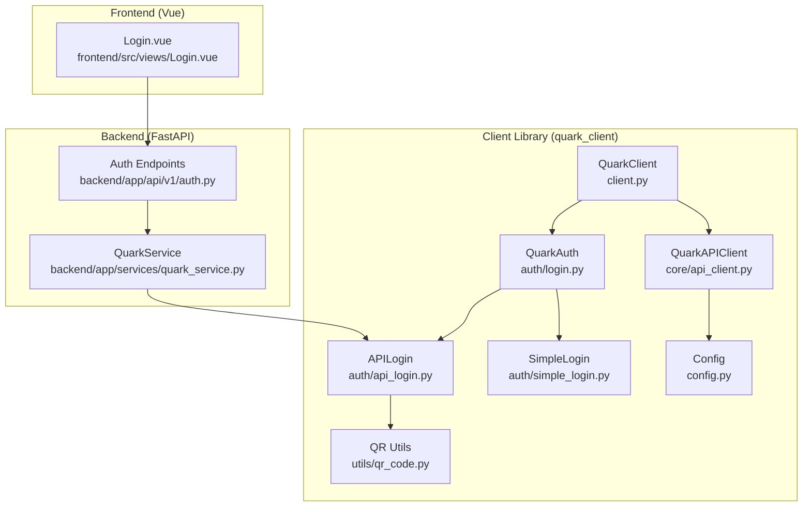
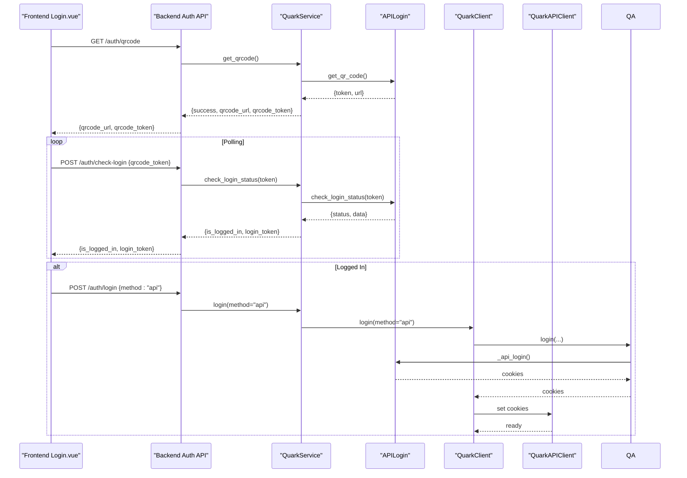
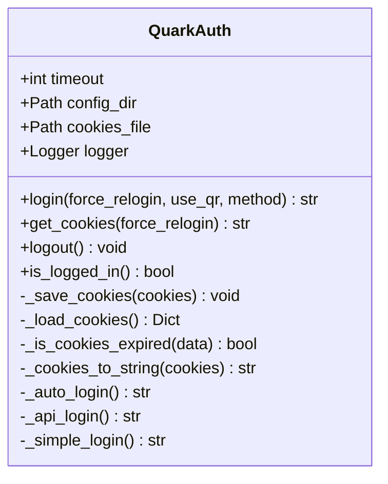
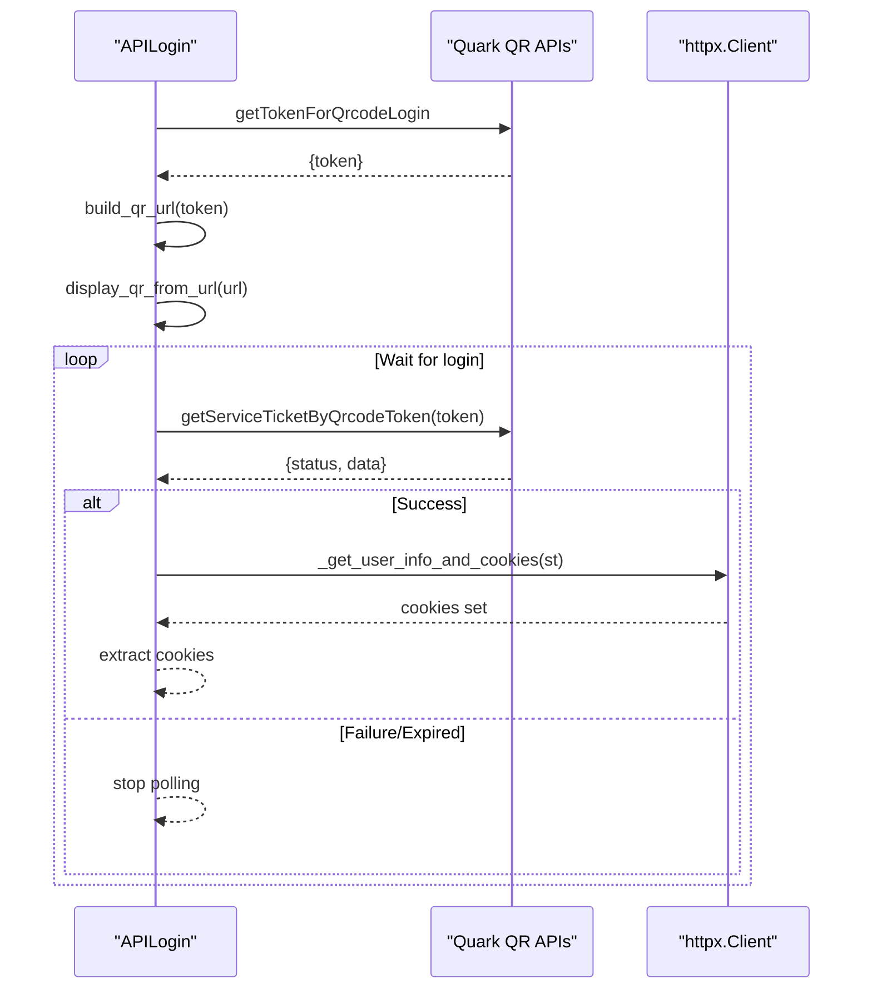
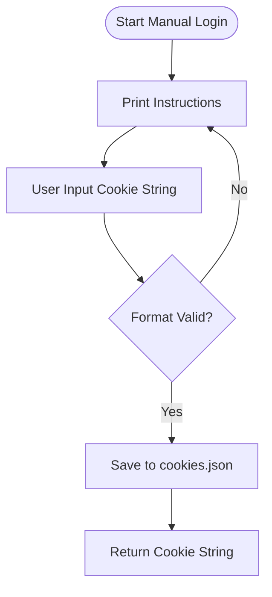
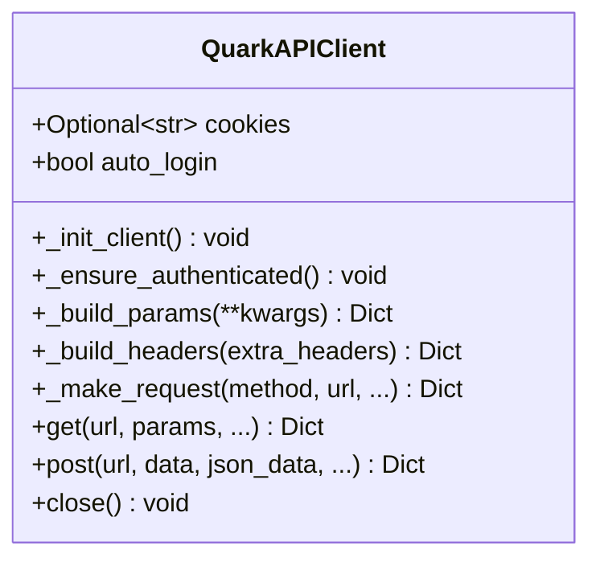
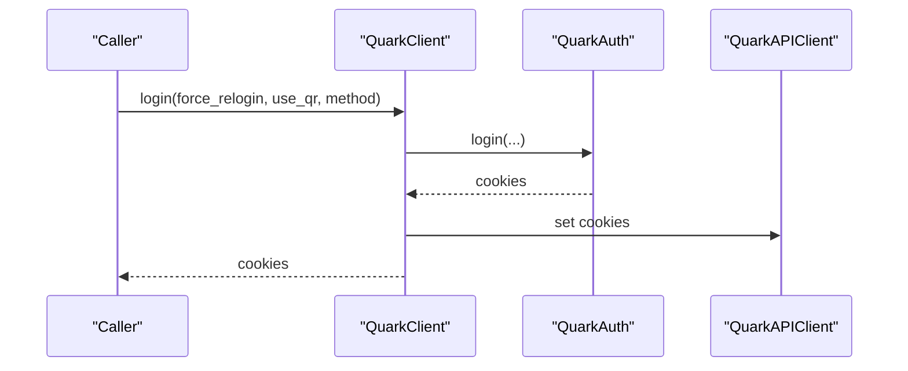
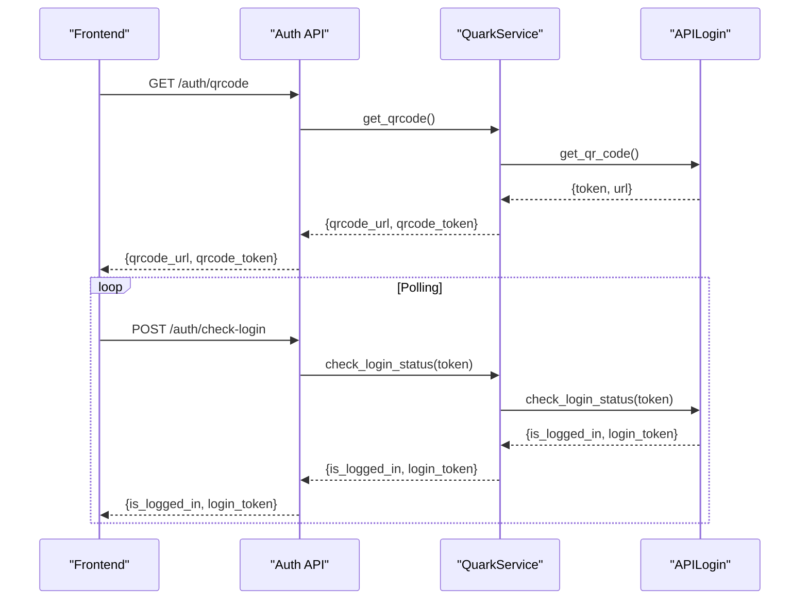
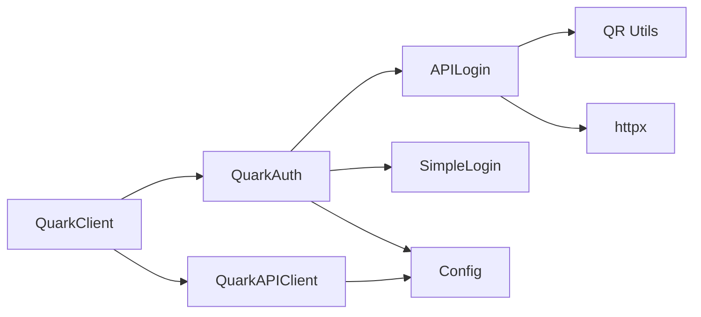

# Authentication Management

<cite>
**Referenced Files in This Document**
- [client.py](file://quark_client/client.py)
- [login.py](file://quark_client/auth/login.py)
- [api_login.py](file://quark_client/auth/api_login.py)
- [simple_login.py](file://quark_client/auth/simple_login.py)
- [api_client.py](file://quark_client/core/api_client.py)
- [config.py](file://quark_client/config.py)
- [qr_code.py](file://quark_client/utils/qr_code.py)
- [auth.py](file://quark_client/cli/commands/auth.py)
- [auth.py](file://backend/app/api/v1/auth.py)
- [quark_service.py](file://backend/app/services/quark_service.py)
- [Login.vue](file://frontend/src/views/Login.vue)
</cite>

## Table of Contents
1. [Introduction](#introduction)
2. [Project Structure](#project-structure)
3. [Core Components](#core-components)
4. [Architecture Overview](#architecture-overview)
5. [Detailed Component Analysis](#detailed-component-analysis)
6. [Dependency Analysis](#dependency-analysis)
7. [Performance Considerations](#performance-considerations)
8. [Troubleshooting Guide](#troubleshooting-guide)
9. [Conclusion](#conclusion)
10. [Appendices](#appendices)

## Introduction
This document explains the authentication management system centered around the QuarkAuth class and the login() method. It covers the authentication flow architecture including QR code login, simplified manual login, and API-based login methods. It documents the login() method parameters (force_relogin, use_qr, and method options), authentication state management, cookie handling, and session persistence. Practical examples demonstrate automatic login, manual QR scanning, and cookie-based authentication. It also details authentication status checking, logout procedures, error handling, retry mechanisms, and security considerations for cookie storage and transmission.

## Project Structure
The authentication system spans multiple layers:
- Client-side Python library (quark_client): exposes QuarkClient and QuarkAuth, manages cookies, and orchestrates login flows.
- Backend FastAPI service (backend): exposes REST endpoints for QR code generation, login polling, and status checks.
- Frontend Vue application (frontend): provides a user interface for QR code login and cookie-based login.
- CLI (quark_client/cli): offers command-line authentication commands.

**Diagram sources**
- [client.py:50-74](file://quark_client/client.py#L50-L74)
- [login.py:107-138](file://quark_client/auth/login.py#L107-L138)
- [api_login.py:467-507](file://quark_client/auth/api_login.py#L467-L507)
- [simple_login.py:205-224](file://quark_client/auth/simple_login.py#L205-L224)
- [api_client.py:19-53](file://quark_client/core/api_client.py#L19-L53)
- [config.py:34-63](file://quark_client/config.py#L34-L63)
- [qr_code.py:40-46](file://quark_client/utils/qr_code.py#L40-L46)
- [auth.py:13-91](file://backend/app/api/v1/auth.py#L13-L91)
- [quark_service.py:54-197](file://backend/app/services/quark_service.py#L54-L197)
- [Login.vue:84-176](file://frontend/src/views/Login.vue#L84-L176)

**Section sources**
- [client.py:18-74](file://quark_client/client.py#L18-L74)
- [login.py:15-301](file://quark_client/auth/login.py#L15-L301)
- [api_login.py:20-521](file://quark_client/auth/api_login.py#L20-L521)
- [simple_login.py:16-249](file://quark_client/auth/simple_login.py#L16-L249)
- [api_client.py:16-209](file://quark_client/core/api_client.py#L16-L209)
- [config.py:10-63](file://quark_client/config.py#L10-L63)
- [qr_code.py:7-46](file://quark_client/utils/qr_code.py#L7-L46)
- [auth.py:13-107](file://backend/app/api/v1/auth.py#L13-L107)
- [quark_service.py:23-388](file://backend/app/services/quark_service.py#L23-L388)
- [Login.vue:1-290](file://frontend/src/views/Login.vue#L1-L290)

## Core Components
- QuarkAuth: Central authentication manager that handles cookie persistence, validation, and selection among login methods.
- APILogin: Implements QR code login using real APIs, displays QR, polls login status, and extracts cookies.
- SimpleLogin: Guides users through manual cookie acquisition and saves them locally.
- QuarkAPIClient: Manages HTTP requests and automatically injects cookies for authenticated endpoints.
- QuarkClient: High-level client exposing convenience methods and delegating authentication to QuarkAuth.

Key responsibilities:
- Cookie persistence: QuarkAuth reads/writes cookies.json and validates expiration and required fields.
- Method selection: QuarkAuth chooses between API login, simple login, or auto-login fallback.
- Session propagation: QuarkClient updates QuarkAPIClient cookies after successful login.

**Section sources**
- [login.py:15-301](file://quark_client/auth/login.py#L15-L301)
- [api_login.py:20-521](file://quark_client/auth/api_login.py#L20-L521)
- [simple_login.py:16-249](file://quark_client/auth/simple_login.py#L16-L249)
- [api_client.py:16-209](file://quark_client/core/api_client.py#L16-L209)
- [client.py:18-74](file://quark_client/client.py#L18-L74)

## Architecture Overview
The authentication system follows a layered approach:
- Frontend triggers QR code generation via backend endpoints.
- Backend uses APILogin to obtain a QR token and URL.
- Frontend polls backend to check login status.
- Backend polls the real API and, upon success, initializes a QuarkClient with extracted cookies.
- Client library persists cookies and exposes authenticated operations.

**Diagram sources**
- [Login.vue:84-176](file://frontend/src/views/Login.vue#L84-L176)
- [auth.py:18-52](file://backend/app/api/v1/auth.py#L18-L52)
- [quark_service.py:54-197](file://backend/app/services/quark_service.py#L54-L197)
- [api_login.py:467-507](file://quark_client/auth/api_login.py#L467-L507)
- [client.py:50-64](file://quark_client/client.py#L50-L64)
- [api_client.py:19-53](file://quark_client/core/api_client.py#L19-L53)

## Detailed Component Analysis

### QuarkAuth: Authentication Manager
QuarkAuth centralizes authentication state and cookie lifecycle:
- Cookie persistence: Stores cookies.json with timestamps and expiry metadata.
- Validation: Checks presence of required cookies and expiry thresholds.
- Method selection: Supports auto, api, and simple login modes.
- Status checks: Provides is_logged_in() and get_cookies() with force_relogin support.

**Diagram sources**
- [login.py:15-301](file://quark_client/auth/login.py#L15-L301)

**Section sources**
- [login.py:15-301](file://quark_client/auth/login.py#L15-L301)

### APILogin: QR Code Login
APILogin implements the QR code login flow:
- Generates QR token and URL via real APIs.
- Displays QR in terminal using ASCII QR rendering.
- Polls login status until success, failure, or timeout.
- Extracts cookies from HTTP client after successful login.

**Diagram sources**
- [api_login.py:94-507](file://quark_client/auth/api_login.py#L94-L507)
- [qr_code.py:40-46](file://quark_client/utils/qr_code.py#L40-L46)

**Section sources**
- [api_login.py:20-521](file://quark_client/auth/api_login.py#L20-L521)
- [qr_code.py:7-46](file://quark_client/utils/qr_code.py#L7-L46)

### SimpleLogin: Manual Cookie-Based Login
SimpleLogin provides a guided manual login process:
- Prints step-by-step instructions to obtain cookies from browser dev tools.
- Validates cookie format and required fields.
- Saves cookies to a local file and loads them on subsequent runs.

**Diagram sources**
- [simple_login.py:28-224](file://quark_client/auth/simple_login.py#L28-L224)

**Section sources**
- [simple_login.py:16-249](file://quark_client/auth/simple_login.py#L16-L249)

### QuarkAPIClient: HTTP Client with Cookies
QuarkAPIClient manages HTTP requests and authentication:
- Builds default headers and attaches cookies when present.
- Handles 401/403 errors and raises AuthenticationError.
- Provides get() and post() helpers for API operations.

**Diagram sources**
- [api_client.py:16-209](file://quark_client/core/api_client.py#L16-L209)

**Section sources**
- [api_client.py:16-209](file://quark_client/core/api_client.py#L16-L209)

### QuarkClient: High-Level Orchestrator
QuarkClient integrates authentication with services:
- Exposes login(), logout(), is_logged_in().
- Delegates to QuarkAuth and updates QuarkAPIClient cookies.

**Diagram sources**
- [client.py:50-74](file://quark_client/client.py#L50-L74)
- [login.py:107-138](file://quark_client/auth/login.py#L107-L138)
- [api_client.py:19-53](file://quark_client/core/api_client.py#L19-L53)

**Section sources**
- [client.py:18-74](file://quark_client/client.py#L18-L74)

### Backend Authentication Endpoints and Service
Backend provides REST endpoints for QR code login and status checks:
- GET /auth/qrcode: returns QR URL and token.
- POST /auth/check-login: polls login status.
- POST /auth/login: performs login with method and cookies.
- GET /auth/status: checks current login status.

**Diagram sources**
- [auth.py:18-52](file://backend/app/api/v1/auth.py#L18-L52)
- [quark_service.py:54-197](file://backend/app/services/quark_service.py#L54-L197)
- [api_login.py:255-308](file://quark_client/auth/api_login.py#L255-L308)

**Section sources**
- [auth.py:13-107](file://backend/app/api/v1/auth.py#L13-L107)
- [quark_service.py:23-388](file://backend/app/services/quark_service.py#L23-L388)

## Dependency Analysis
- QuarkAuth depends on:
  - Config directory resolution and default headers.
  - APILogin and SimpleLogin for login methods.
  - Local JSON file for cookie persistence.
- APILogin depends on:
  - httpx for HTTP requests.
  - QR utilities for terminal display.
  - Real APIs for QR token and login status.
- QuarkAPIClient depends on:
  - Config for base URLs and headers.
  - Exceptions for error propagation.
- QuarkClient depends on:
  - QuarkAuth for authentication.
  - QuarkAPIClient for HTTP operations.

**Diagram sources**
- [login.py:15-301](file://quark_client/auth/login.py#L15-L301)
- [api_login.py:20-521](file://quark_client/auth/api_login.py#L20-L521)
- [api_client.py:16-209](file://quark_client/core/api_client.py#L16-L209)
- [client.py:18-74](file://quark_client/client.py#L18-L74)
- [config.py:10-63](file://quark_client/config.py#L10-L63)
- [qr_code.py:7-46](file://quark_client/utils/qr_code.py#L7-L46)

**Section sources**
- [login.py:15-301](file://quark_client/auth/login.py#L15-L301)
- [api_login.py:20-521](file://quark_client/auth/api_login.py#L20-L521)
- [api_client.py:16-209](file://quark_client/core/api_client.py#L16-L209)
- [client.py:18-74](file://quark_client/client.py#L18-L74)
- [config.py:10-63](file://quark_client/config.py#L10-L63)
- [qr_code.py:7-46](file://quark_client/utils/qr_code.py#L7-L46)

## Performance Considerations
- Timeout tuning: APILogin uses a configurable timeout for QR validity and polling intervals.
- Polling cadence: Backend and frontend poll at fixed intervals; adjust to balance responsiveness and server load.
- Cookie caching: QuarkAuth avoids repeated logins by persisting and validating cookies locally.
- HTTP client reuse: QuarkAPIClient maintains a persistent client with reasonable timeouts.

[No sources needed since this section provides general guidance]

## Troubleshooting Guide
Common issues and resolutions:
- Login fails with timeout/expired QR:
  - Regenerate QR and rescan.
  - Verify network connectivity and API availability.
- 401/403 errors:
  - Re-authenticate using QuarkAuth.get_cookies(force_relogin=True).
  - Clear local cookies.json and re-login.
- Cookie format invalid:
  - Ensure required fields (__kps, __uid) are present.
  - Use SimpleLogin’s guidance to copy cookies correctly.
- Backend endpoint errors:
  - Confirm backend service is running and reachable.
  - Check API responses for detailed messages.

Operational commands:
- CLI login with explicit method and force flag.
- CLI status and logout commands for quick verification and cleanup.

**Section sources**
- [api_client.py:146-182](file://quark_client/core/api_client.py#L146-L182)
- [simple_login.py:133-150](file://quark_client/auth/simple_login.py#L133-L150)
- [auth.py:94-144](file://backend/app/api/v1/auth.py#L94-L144)
- [quark_service.py:161-197](file://backend/app/services/quark_service.py#L161-L197)

## Conclusion
The authentication system combines robust client-side cookie management with backend-driven QR code login orchestration. QuarkAuth provides flexible login method selection and persistence, while APILogin and SimpleLogin cover automated and manual login scenarios. QuarkAPIClient ensures authenticated requests, and QuarkClient unifies the experience. The backend endpoints expose a clean API for frontend integration, enabling responsive QR-based login flows.

[No sources needed since this section summarizes without analyzing specific files]

## Appendices

### Login Method Parameters
- force_relogin: Forces re-authentication and bypasses cached cookies.
- use_qr: Compatibility parameter; QR login is selected by method="api".
- method: Controls login mode:
  - "auto": Attempts API login, falls back to simple login.
  - "api": Uses QR code login via APILogin.
  - "simple": Uses manual cookie input via SimpleLogin.

**Section sources**
- [client.py:50-64](file://quark_client/client.py#L50-L64)
- [login.py:107-138](file://quark_client/auth/login.py#L107-L138)

### Authentication Scenarios
- Automatic login:
  - Call QuarkAuth.get_cookies() or QuarkClient.login(method="auto").
  - If cookies are valid and not expired, returns immediately.
- Manual QR scanning:
  - Use method="api" to generate QR and scan with Quark app.
  - Frontend polls backend; backend polls real API; success sets cookies.
- Cookie-based authentication:
  - Use method="simple" and paste cookies obtained from browser dev tools.
  - SimpleLogin validates and persists cookies for future sessions.

**Section sources**
- [login.py:139-161](file://quark_client/auth/login.py#L139-L161)
- [api_login.py:467-507](file://quark_client/auth/api_login.py#L467-L507)
- [simple_login.py:205-224](file://quark_client/auth/simple_login.py#L205-L224)
- [Login.vue:84-176](file://frontend/src/views/Login.vue#L84-L176)

### Authentication Status and Logout
- Status checking:
  - QuarkAuth.is_logged_in() validates persisted cookies.
  - Backend GET /auth/status returns is_logged_in and user info.
- Logout:
  - QuarkAuth.logout() removes local cookies.
  - Backend POST /auth/logout clears session and resets client.

**Section sources**
- [login.py:261-294](file://quark_client/auth/login.py#L261-L294)
- [auth.py:78-106](file://backend/app/api/v1/auth.py#L78-L106)
- [quark_service.py:208-223](file://backend/app/services/quark_service.py#L208-L223)

### Security Considerations
- Cookie storage:
  - Store cookies in a secure, non-shared location (default config dir).
  - Limit file permissions to reduce exposure risk.
- Transmission:
  - Avoid logging raw cookies.
  - Use HTTPS endpoints for backend communication.
- Expiration:
  - Validate cookie expiry and refresh as needed.
  - Prefer short-lived tokens where possible.

[No sources needed since this section provides general guidance]

### Extending the Authentication System
- Custom login methods:
  - Implement a new login class with a login() method returning a cookie string.
  - Integrate into QuarkAuth._auto_login() or add a new method option.
- Custom cookie validation:
  - Extend QuarkAuth._validate_cookies() to enforce stricter checks.
- Backend integration:
  - Add new endpoints in backend/app/api/v1/auth.py.
  - Implement corresponding logic in backend/app/services/quark_service.py.

**Section sources**
- [login.py:139-161](file://quark_client/auth/login.py#L139-L161)
- [auth.py:18-106](file://backend/app/api/v1/auth.py#L18-L106)
- [quark_service.py:54-197](file://backend/app/services/quark_service.py#L54-L197)