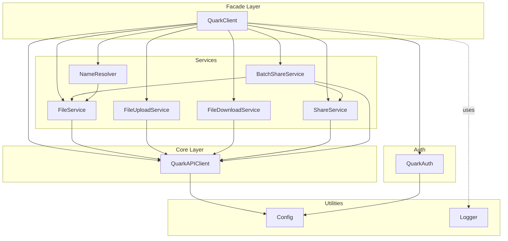
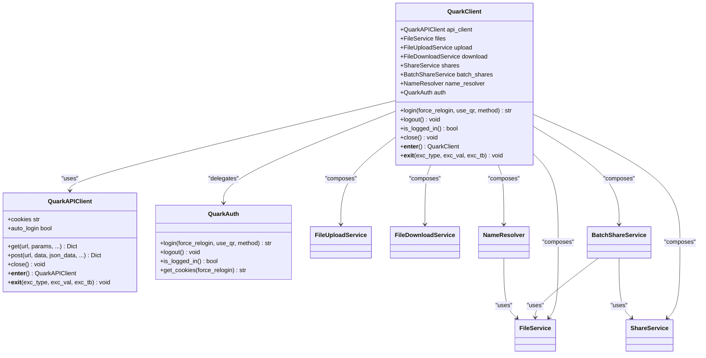
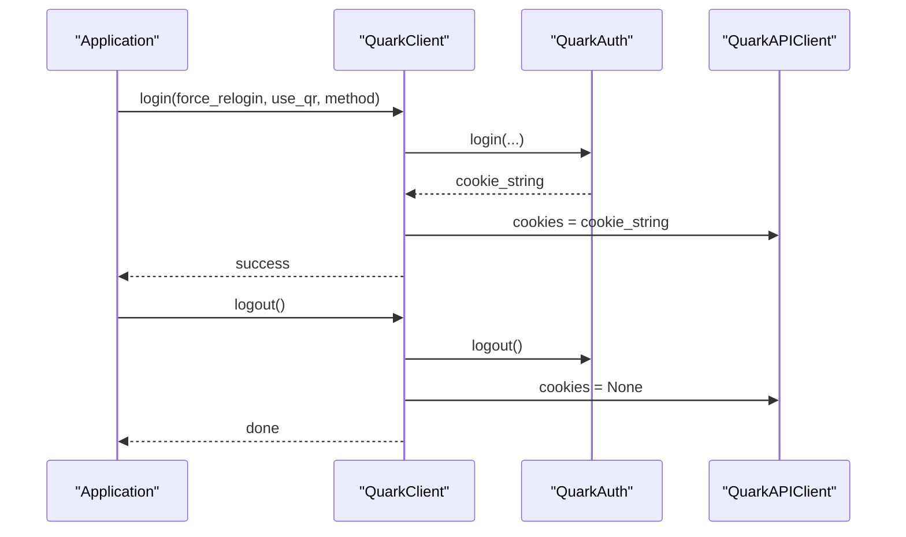
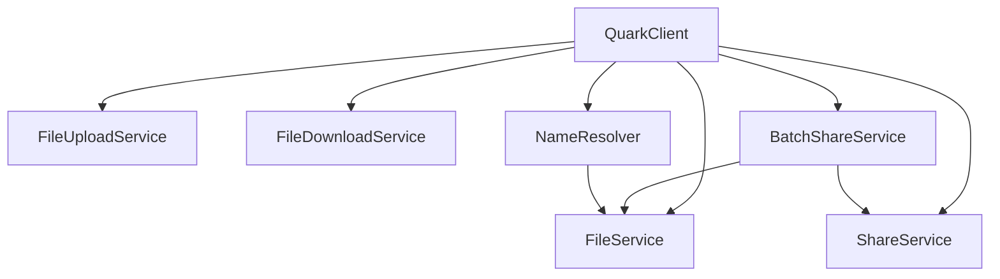
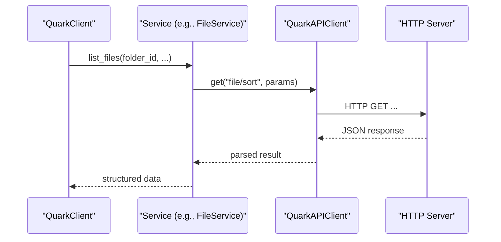
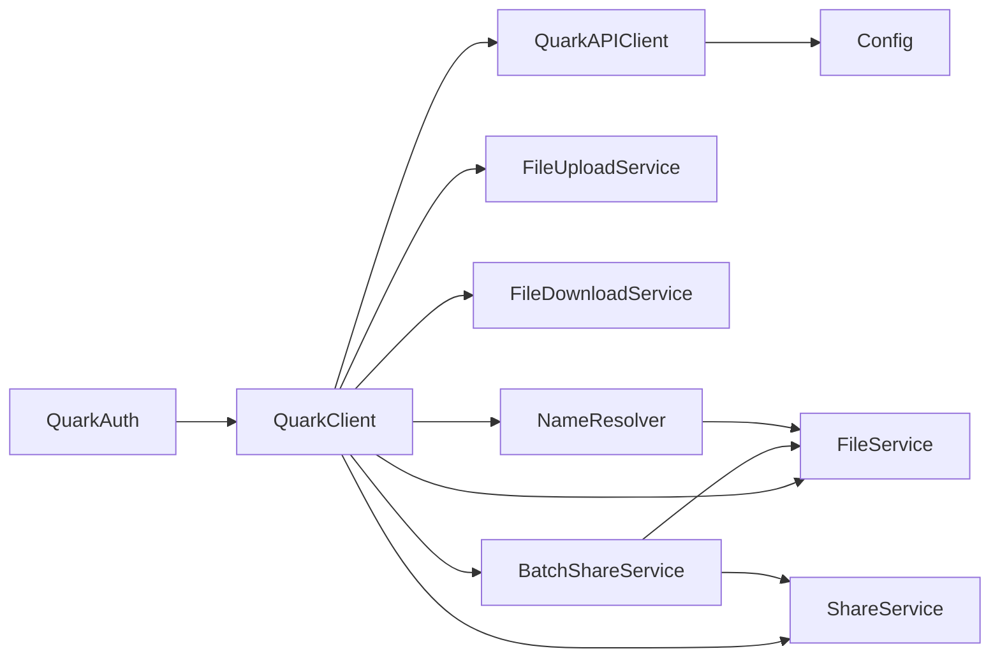

# Client Architecture

<cite>
**Referenced Files in This Document**
- [client.py](file://quark_client/client.py)
- [api_client.py](file://quark_client/core/api_client.py)
- [login.py](file://quark_client/auth/login.py)
- [config.py](file://quark_client/config.py)
- [file_service.py](file://quark_client/services/file_service.py)
- [file_upload_service.py](file://quark_client/services/file_upload_service.py)
- [file_download_service.py](file://quark_client/services/file_download_service.py)
- [share_service.py](file://quark_client/services/share_service.py)
- [batch_share_service.py](file://quark_client/services/batch_share_service.py)
- [name_resolver.py](file://quark_client/services/name_resolver.py)
- [logger.py](file://quark_client/utils/logger.py)
- [__init__.py](file://quark_client/__init__.py)
- [main.py](file://quark_client/cli/main.py)
</cite>

## Table of Contents
1. [Introduction](#introduction)
2. [Project Structure](#project-structure)
3. [Core Components](#core-components)
4. [Architecture Overview](#architecture-overview)
5. [Detailed Component Analysis](#detailed-component-analysis)
6. [Dependency Analysis](#dependency-analysis)
7. [Performance Considerations](#performance-considerations)
8. [Troubleshooting Guide](#troubleshooting-guide)
9. [Conclusion](#conclusion)
10. [Appendices](#appendices)

## Introduction
This document explains the QuarkClient architecture and the service composition pattern used to build a cohesive, layered client around the Quark Cloud Drive API. It covers the QuarkClient class design, constructor parameters, property management, lifecycle methods, and how it delegates authentication to QuarkAuth while managing cookie persistence. It also documents the service composition pattern for FileService, FileUploadService, FileDownloadService, ShareService, BatchShareService, and NameResolver, and clarifies the relationship between QuarkClient and QuarkAPIClient. Practical examples demonstrate client instantiation, context manager usage, and service access patterns. Finally, it outlines the design rationale behind convenience functions like create_client(), guidelines for extending the client with new services, and maintaining backward compatibility.

## Project Structure
The client is organized into distinct layers:
- Core API client: QuarkAPIClient encapsulates HTTP transport, request building, and error handling.
- Authentication: QuarkAuth manages login, cookie persistence, and validation.
- Services: Feature-specific services (file operations, uploads, downloads, sharing, batch operations, name resolution).
- Facade: QuarkClient composes services and exposes a unified interface.
- Utilities and configuration: Logging, configuration, and initialization.
- CLI: A command-line interface that uses the client under the hood.

**Diagram sources**
- [client.py:18-405](file://quark_client/client.py#L18-L405)
- [api_client.py:16-209](file://quark_client/core/api_client.py#L16-L209)
- [login.py:15-301](file://quark_client/auth/login.py#L15-L301)
- [config.py:34-63](file://quark_client/config.py#L34-L63)
- [file_service.py:13-800](file://quark_client/services/file_service.py#L13-L800)
- [file_upload_service.py:16-800](file://quark_client/services/file_upload_service.py#L16-L800)
- [file_download_service.py:13-301](file://quark_client/services/file_download_service.py#L13-L301)
- [share_service.py:13-742](file://quark_client/services/share_service.py#L13-L742)
- [batch_share_service.py:16-572](file://quark_client/services/batch_share_service.py#L16-L572)
- [name_resolver.py:10-198](file://quark_client/services/name_resolver.py#L10-L198)
- [logger.py:12-73](file://quark_client/utils/logger.py#L12-L73)

**Section sources**
- [client.py:18-405](file://quark_client/client.py#L18-L405)
- [api_client.py:16-209](file://quark_client/core/api_client.py#L16-L209)
- [login.py:15-301](file://quark_client/auth/login.py#L15-L301)
- [config.py:34-63](file://quark_client/config.py#L34-L63)
- [file_service.py:13-800](file://quark_client/services/file_service.py#L13-L800)
- [file_upload_service.py:16-800](file://quark_client/services/file_upload_service.py#L16-L800)
- [file_download_service.py:13-301](file://quark_client/services/file_download_service.py#L13-L301)
- [share_service.py:13-742](file://quark_client/services/share_service.py#L13-L742)
- [batch_share_service.py:16-572](file://quark_client/services/batch_share_service.py#L16-L572)
- [name_resolver.py:10-198](file://quark_client/services/name_resolver.py#L10-L198)
- [logger.py:12-73](file://quark_client/utils/logger.py#L12-L73)

## Core Components
This section focuses on the main client class and its composition pattern.

- QuarkClient
  - Constructor parameters: cookies (optional), auto_login (bool).
  - Initialization: Creates QuarkAPIClient, instantiates FileService, FileUploadService, FileDownloadService, ShareService, BatchShareService, and NameResolver.
  - Properties: auth property lazily initializes QuarkAuth.
  - Authentication delegation: login(), logout(), is_logged_in() delegate to QuarkAuth and update cookie state in QuarkAPIClient.
  - Convenience methods: list_files, get_file_info, search_files, download_file(s), upload_file, create_share, save_shared_files, move_files, get_storage_info, and more.
  - Lifecycle: close() closes the underlying API client; context manager support via __enter__/__exit__.
  - Convenience factory: create_client() returns a configured QuarkClient.

- QuarkAPIClient
  - Encapsulates HTTP transport using httpx, default headers, and request building.
  - Manages cookies and auto-login behavior.
  - Provides get() and post() helpers and robust error handling for network/API errors.
  - Supports context manager lifecycle.

- QuarkAuth
  - Handles login via multiple strategies (auto, API, simple).
  - Persists cookies locally and validates expiration and required cookie fields.
  - Exposes get_cookies(), login(), logout(), is_logged_in().

- Service Composition Pattern
  - FileService: file listing, search, metadata, move, rename, delete, tree, storage info.
  - FileUploadService: multipart/single-part upload with hashing, auth, and completion steps.
  - FileDownloadService: single/multiple download with fallback strategies and progress callbacks.
  - ShareService: create share links, parse share URLs, fetch share info, save shared files, batch save, and task polling.
  - BatchShareService: collects target directories, creates shares, exports to CSV, integrates FileService and ShareService.
  - NameResolver: resolves human-friendly paths to file/folder IDs and caches metadata for efficient lookups.

- Relationship to QuarkAPIClient
  - QuarkClient acts as a facade over QuarkAPIClient, delegating raw HTTP calls to services.
  - QuarkAuth manages authentication and cookie persistence; QuarkClient updates its API client’s cookie state after login.

**Section sources**
- [client.py:18-405](file://quark_client/client.py#L18-L405)
- [api_client.py:16-209](file://quark_client/core/api_client.py#L16-L209)
- [login.py:15-301](file://quark_client/auth/login.py#L15-L301)
- [file_service.py:13-800](file://quark_client/services/file_service.py#L13-L800)
- [file_upload_service.py:16-800](file://quark_client/services/file_upload_service.py#L16-L800)
- [file_download_service.py:13-301](file://quark_client/services/file_download_service.py#L13-L301)
- [share_service.py:13-742](file://quark_client/services/share_service.py#L13-L742)
- [batch_share_service.py:16-572](file://quark_client/services/batch_share_service.py#L16-L572)
- [name_resolver.py:10-198](file://quark_client/services/name_resolver.py#L10-L198)

## Architecture Overview
The client follows a layered architecture:
- Facade: QuarkClient orchestrates services and exposes a high-level API.
- Core: QuarkAPIClient centralizes HTTP transport, headers, and error handling.
- Services: Feature-focused services encapsulate domain logic and API interactions.
- Auth: QuarkAuth encapsulates login, cookie persistence, and validation.
- Utilities: Logger and Config provide cross-cutting concerns.

**Diagram sources**
- [client.py:18-405](file://quark_client/client.py#L18-L405)
- [api_client.py:16-209](file://quark_client/core/api_client.py#L16-L209)
- [login.py:15-301](file://quark_client/auth/login.py#L15-L301)
- [file_service.py:13-800](file://quark_client/services/file_service.py#L13-L800)
- [file_upload_service.py:16-800](file://quark_client/services/file_upload_service.py#L16-L800)
- [file_download_service.py:13-301](file://quark_client/services/file_download_service.py#L13-L301)
- [share_service.py:13-742](file://quark_client/services/share_service.py#L13-L742)
- [batch_share_service.py:16-572](file://quark_client/services/batch_share_service.py#L16-L572)
- [name_resolver.py:10-198](file://quark_client/services/name_resolver.py#L10-L198)

## Detailed Component Analysis

### QuarkClient Class Design
- Constructor parameters
  - cookies: optional cookie string; if None, QuarkAPIClient may auto-obtain cookies depending on auto_login.
  - auto_login: controls whether QuarkAPIClient attempts automatic authentication during construction.
- Property management
  - auth: lazy-initialized QuarkAuth instance used for login/logout and cookie retrieval.
- Lifecycle methods
  - login(): delegates to QuarkAuth.login(), then sets QuarkAPIClient.cookies.
  - logout(): delegates to QuarkAuth.logout() and clears QuarkAPIClient.cookies.
  - is_logged_in(): checks QuarkAuth state.
  - close(): closes the underlying QuarkAPIClient session.
  - Context manager: __enter__/__exit__ enable with-statement usage.
- Convenience factory
  - create_client(): returns a new QuarkClient with provided cookies and auto_login settings.

Practical examples
- Instantiation with explicit cookies and auto_login disabled:
  - Construct QuarkClient(cookies="...", auto_login=False).
- Instantiation with auto_login enabled and no cookies:
  - Construct QuarkClient(auto_login=True); QuarkAPIClient will attempt to obtain cookies if allowed.
- Context manager usage:
  - with QuarkClient(...) as client: ...; client.close() is called automatically.
- Service access patterns:
  - client.files.list_files("0") to list root items.
  - client.download.download_file(file_id, save_path) to download a file.
  - client.upload.upload_file(file_path, parent_folder_id) to upload a file.
  - client.create_share([file_id], title, expire_days, password) to create a share.
  - client.batch_shares.batch_share_and_export(...) to batch share directories and export results.

**Section sources**
- [client.py:21-74](file://quark_client/client.py#L21-L74)
- [client.py:393-399](file://quark_client/client.py#L393-L399)
- [client.py:402-405](file://quark_client/client.py#L402-L405)

### Authentication Delegation Pattern
- QuarkAuth manages login/logout and cookie persistence:
  - Persists cookies to a local file with timestamps and expiration checks.
  - Validates presence of required cookie keys before considering a session valid.
- QuarkClient delegates authentication to QuarkAuth:
  - On login(), QuarkClient.auth.login() is invoked, then QuarkAPIClient.cookies is set.
  - On logout(), QuarkClient.auth.logout() is invoked and QuarkAPIClient.cookies is cleared.
- This separation ensures clean responsibility boundaries: QuarkAuth handles identity and persistence; QuarkClient manages session state and service orchestration.

**Diagram sources**
- [client.py:50-70](file://quark_client/client.py#L50-L70)
- [login.py:107-138](file://quark_client/auth/login.py#L107-L138)
- [login.py:261-269](file://quark_client/auth/login.py#L261-L269)

**Section sources**
- [client.py:44-70](file://quark_client/client.py#L44-L70)
- [login.py:107-138](file://quark_client/auth/login.py#L107-L138)
- [login.py:231-269](file://quark_client/auth/login.py#L231-L269)

### Service Composition Pattern
- FileService
  - Provides file listing, search, metadata retrieval, move/rename/delete, tree traversal, and storage info.
  - Relies on QuarkAPIClient for HTTP requests.
- FileUploadService
  - Implements pre-upload, hash calculation, single/multi-part upload, and completion steps.
  - Uses QuarkAPIClient for auth and upload endpoints.
- FileDownloadService
  - Retrieves download URLs and performs streaming downloads with fallback strategies and progress callbacks.
- ShareService
  - Creates share links, parses share URLs, obtains tokens, fetches share info, saves shared files, and polls task completion.
- BatchShareService
  - Collects target directories (legacy and flexible modes), creates shares, and exports results to CSV.
  - Composes FileService and ShareService.
- NameResolver
  - Resolves human-friendly paths to file/folder IDs and caches metadata for efficient lookups.

**Diagram sources**
- [client.py:33-38](file://quark_client/client.py#L33-L38)
- [file_service.py:13-800](file://quark_client/services/file_service.py#L13-L800)
- [file_upload_service.py:16-800](file://quark_client/services/file_upload_service.py#L16-L800)
- [file_download_service.py:13-301](file://quark_client/services/file_download_service.py#L13-L301)
- [share_service.py:13-742](file://quark_client/services/share_service.py#L13-L742)
- [batch_share_service.py:16-572](file://quark_client/services/batch_share_service.py#L16-L572)
- [name_resolver.py:10-198](file://quark_client/services/name_resolver.py#L10-L198)

**Section sources**
- [client.py:33-38](file://quark_client/client.py#L33-L38)
- [file_service.py:13-800](file://quark_client/services/file_service.py#L13-L800)
- [file_upload_service.py:16-800](file://quark_client/services/file_upload_service.py#L16-L800)
- [file_download_service.py:13-301](file://quark_client/services/file_download_service.py#L13-L301)
- [share_service.py:13-742](file://quark_client/services/share_service.py#L13-L742)
- [batch_share_service.py:16-572](file://quark_client/services/batch_share_service.py#L16-L572)
- [name_resolver.py:10-198](file://quark_client/services/name_resolver.py#L10-L198)

### Practical Examples
- Client instantiation
  - With cookies and auto_login disabled: QuarkClient(cookies="...", auto_login=False).
  - With auto_login enabled: QuarkClient(auto_login=True) to auto-obtain cookies if permitted.
- Context manager usage
  - with QuarkClient(...) as client: ...; client.close() is guaranteed.
- Service access patterns
  - Listing files: client.list_files("0").
  - Getting file info: client.get_file_info(file_id).
  - Searching files: client.search_files("keyword").
  - Downloading files: client.download_file(file_id, save_path).
  - Uploading files: client.upload_file(file_path, parent_folder_id).
  - Creating shares: client.create_share([file_id], title, expire_days, password).
  - Batch saving shares: client.batch_save_shares(urls, target_folder_id, ...).

**Section sources**
- [client.py:76-392](file://quark_client/client.py#L76-L392)

### Relationship Between QuarkClient and QuarkAPIClient
- QuarkClient is a facade over QuarkAPIClient. It composes services and delegates raw HTTP calls to them, which in turn use QuarkAPIClient.
- QuarkClient manages authentication state (cookies) and exposes higher-level convenience methods.
- QuarkAPIClient encapsulates HTTP transport, default headers, timeouts, and error handling.

**Diagram sources**
- [client.py:33-38](file://quark_client/client.py#L33-L38)
- [file_service.py:25-56](file://quark_client/services/file_service.py#L25-L56)
- [api_client.py:184-190](file://quark_client/core/api_client.py#L184-L190)

**Section sources**
- [client.py:33-38](file://quark_client/client.py#L33-L38)
- [api_client.py:184-190](file://quark_client/core/api_client.py#L184-L190)

### Design Rationale for create_client()
- Convenience factory functions simplify client creation with sensible defaults.
- create_client() returns a QuarkClient configured with cookies and auto_login flags, reducing boilerplate for typical usage scenarios.

**Section sources**
- [client.py:402-405](file://quark_client/client.py#L402-L405)

### Guidelines for Extending the Client with New Services
- Keep services focused and cohesive (single responsibility).
- Depend on QuarkAPIClient for HTTP operations; avoid duplicating request logic.
- Provide clear error handling and raise domain-specific exceptions when appropriate.
- Integrate new services into QuarkClient’s composition in client.py and expose convenience methods if needed.
- Maintain backward compatibility by adding new methods rather than changing existing signatures.
- Add tests for new services and ensure proper coverage of error paths.

**Section sources**
- [client.py:33-38](file://quark_client/client.py#L33-L38)
- [api_client.py:16-209](file://quark_client/core/api_client.py#L16-L209)

## Dependency Analysis
The client exhibits low coupling and high cohesion:
- QuarkClient depends on QuarkAPIClient and service classes.
- Services depend on QuarkAPIClient and each other minimally (e.g., BatchShareService composes FileService and ShareService).
- QuarkAuth is decoupled and only used by QuarkClient for authentication.

**Diagram sources**
- [client.py:18-405](file://quark_client/client.py#L18-L405)
- [api_client.py:16-209](file://quark_client/core/api_client.py#L16-L209)
- [batch_share_service.py:16-572](file://quark_client/services/batch_share_service.py#L16-L572)
- [name_resolver.py:10-198](file://quark_client/services/name_resolver.py#L10-L198)
- [config.py:34-63](file://quark_client/config.py#L34-L63)

**Section sources**
- [client.py:18-405](file://quark_client/client.py#L18-L405)
- [batch_share_service.py:16-572](file://quark_client/services/batch_share_service.py#L16-L572)
- [name_resolver.py:10-198](file://quark_client/services/name_resolver.py#L10-L198)
- [config.py:34-63](file://quark_client/config.py#L34-L63)

## Performance Considerations
- Caching: NameResolver caches file listings per folder to reduce repeated API calls for path resolution.
- Asynchronous tasks: ShareService and FileService handle long-running tasks via polling; tune polling intervals and timeouts to balance responsiveness and server load.
- Upload strategy: FileUploadService selects single-part vs. multi-part based on file size; ensure progress callbacks are lightweight to avoid UI blocking.
- Logging: Configure logger levels appropriately to minimize overhead in production environments.

[No sources needed since this section provides general guidance]

## Troubleshooting Guide
Common issues and resolutions:
- Authentication failures
  - Symptoms: 401/403 responses or AuthenticationError.
  - Actions: Re-login using client.login(); ensure cookies are persisted and not expired; verify required cookie keys are present.
- Network errors
  - Symptoms: NetworkError exceptions.
  - Actions: Retry with backoff; verify connectivity and proxy settings; increase timeouts if needed.
- API errors
  - Symptoms: APIError with status/code/message.
  - Actions: Inspect returned error data; handle specific cases (e.g., capacity limits) gracefully.
- Download failures
  - Symptoms: Download errors or 403 responses.
  - Actions: Use fallback download strategies; ensure cookies are attached; adjust headers as needed.

**Section sources**
- [api_client.py:146-183](file://quark_client/core/api_client.py#L146-L183)
- [login.py:231-269](file://quark_client/auth/login.py#L231-L269)
- [file_download_service.py:188-257](file://quark_client/services/file_download_service.py#L188-L257)

## Conclusion
QuarkClient provides a clean, layered architecture that separates concerns between authentication, HTTP transport, and feature-specific services. The facade pattern simplifies usage while preserving flexibility and composability. The authentication delegation model keeps identity management centralized in QuarkAuth, while QuarkAPIClient encapsulates transport details. The service composition pattern enables modular extension and maintainable code. Following the provided guidelines ensures backward compatibility and robustness as new capabilities are added.

[No sources needed since this section summarizes without analyzing specific files]

## Appendices

### Practical Usage Patterns
- CLI integration
  - The CLI uses QuarkClient via a context manager to ensure proper cleanup and to check login status and storage info.
- Initialization and exports
  - The package initializer exposes QuarkClient, QuarkAuth, QuarkAPIClient, and services for public consumption.

**Section sources**
- [main.py:295-344](file://quark_client/cli/main.py#L295-L344)
- [__init__.py:13-54](file://quark_client/__init__.py#L13-L54)