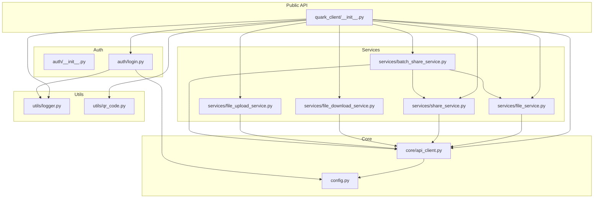
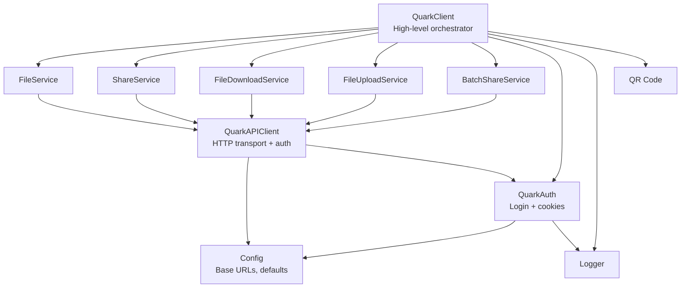
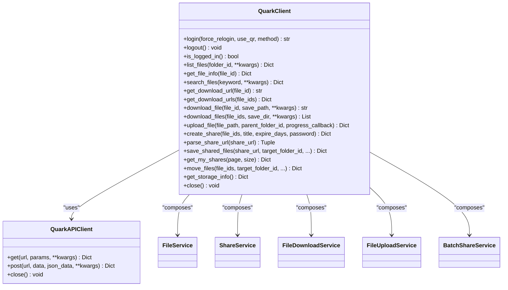
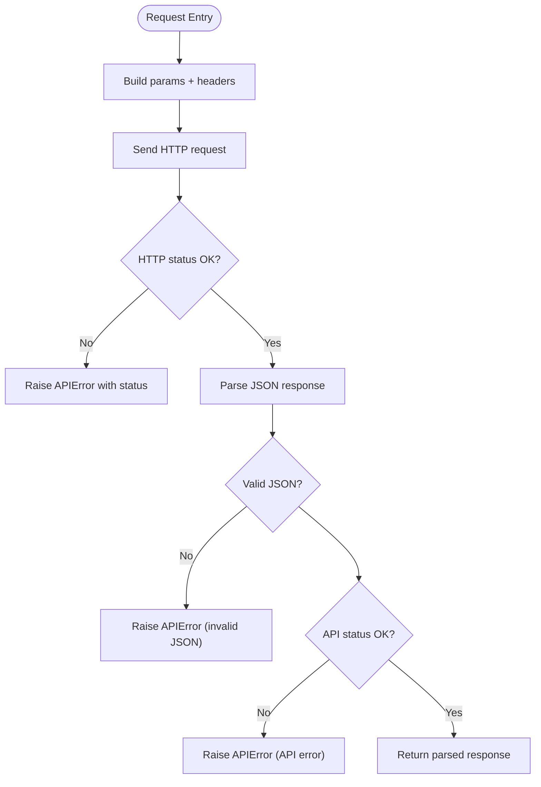
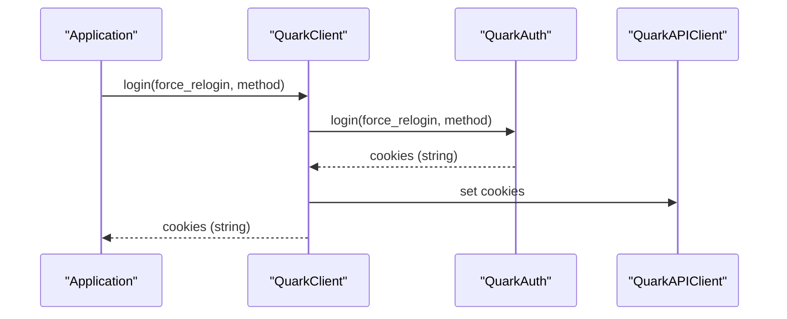
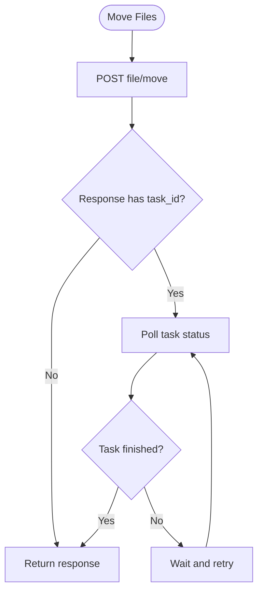
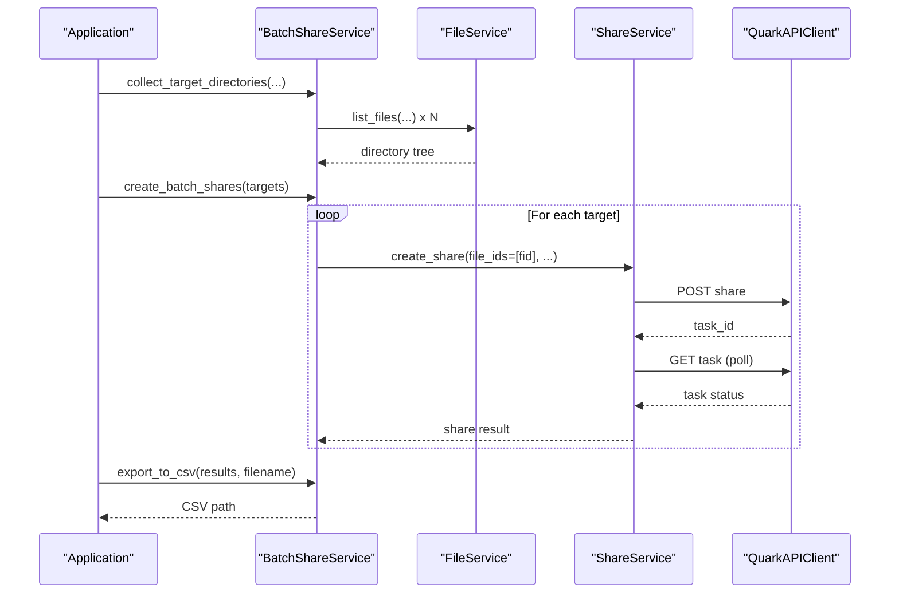
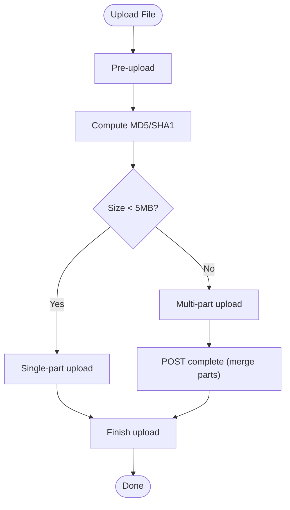
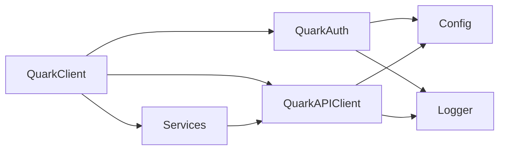

# QuarkClient Library

<cite>
**Referenced Files in This Document**
- [quark_client/__init__.py](file://quark_client/__init__.py)
- [quark_client/client.py](file://quark_client/client.py)
- [quark_client/core/api_client.py](file://quark_client/core/api_client.py)
- [quark_client/config.py](file://quark_client/config.py)
- [quark_client/exceptions.py](file://quark_client/exceptions.py)
- [quark_client/auth/__init__.py](file://quark_client/auth/__init__.py)
- [quark_client/auth/login.py](file://quark_client/auth/login.py)
- [quark_client/services/__init__.py](file://quark_client/services/__init__.py)
- [quark_client/services/file_service.py](file://quark_client/services/file_service.py)
- [quark_client/services/share_service.py](file://quark_client/services/share_service.py)
- [quark_client/services/file_download_service.py](file://quark_client/services/file_download_service.py)
- [quark_client/services/file_upload_service.py](file://quark_client/services/file_upload_service.py)
- [quark_client/services/batch_share_service.py](file://quark_client/services/batch_share_service.py)
- [quark_client/utils/logger.py](file://quark_client/utils/logger.py)
- [quark_client/utils/qr_code.py](file://quark_client/utils/qr_code.py)
</cite>

## Table of Contents
1. [Introduction](#introduction)
2. [Project Structure](#project-structure)
3. [Core Components](#core-components)
4. [Architecture Overview](#architecture-overview)
5. [Detailed Component Analysis](#detailed-component-analysis)
6. [Dependency Analysis](#dependency-analysis)
7. [Performance Considerations](#performance-considerations)
8. [Troubleshooting Guide](#troubleshooting-guide)
9. [Conclusion](#conclusion)
10. [Appendices](#appendices)

## Introduction
QuarkClient is a standalone Python client library that encapsulates interactions with the Quark Pan API. It provides a cohesive, service-oriented interface for file management, sharing, authentication, and utility functions. The library follows a client composition pattern: a high-level QuarkClient composes multiple specialized services (file operations, sharing, downloads, uploads, batch operations) backed by a shared QuarkAPIClient. Authentication is managed centrally via QuarkAuth, which supports multiple login strategies and persists credentials locally. The library exposes a clean public API, robust error handling, and optional utilities for logging and QR code generation.

## Project Structure
The library is organized into distinct modules:
- Core: QuarkAPIClient handles HTTP transport, authentication, and request building.
- Services: Feature-specific services (file, share, download, upload, batch share) encapsulate API interactions.
- Auth: Centralized authentication management with multiple login strategies.
- Utils: Logging and QR code utilities.
- Public API: A single entry point exports the primary classes and exceptions.

**Diagram sources**
- [quark_client/__init__.py:1-55](file://quark_client/__init__.py#L1-L55)
- [quark_client/core/api_client.py:16-209](file://quark_client/core/api_client.py#L16-L209)
- [quark_client/config.py:34-63](file://quark_client/config.py#L34-L63)
- [quark_client/services/file_service.py:13-800](file://quark_client/services/file_service.py#L13-L800)
- [quark_client/services/share_service.py:13-742](file://quark_client/services/share_service.py#L13-L742)
- [quark_client/services/file_download_service.py:13-301](file://quark_client/services/file_download_service.py#L13-L301)
- [quark_client/services/file_upload_service.py:16-800](file://quark_client/services/file_upload_service.py#L16-L800)
- [quark_client/services/batch_share_service.py:16-572](file://quark_client/services/batch_share_service.py#L16-L572)
- [quark_client/auth/__init__.py:1-28](file://quark_client/auth/__init__.py#L1-L28)
- [quark_client/auth/login.py:15-301](file://quark_client/auth/login.py#L15-L301)
- [quark_client/utils/logger.py:12-73](file://quark_client/utils/logger.py#L12-L73)
- [quark_client/utils/qr_code.py:7-46](file://quark_client/utils/qr_code.py#L7-L46)

**Section sources**
- [quark_client/__init__.py:1-55](file://quark_client/__init__.py#L1-L55)

## Core Components
- QuarkClient: High-level client that composes services and exposes convenience methods for file operations, sharing, downloads, uploads, and authentication. It also provides shortcuts for path-based operations via a name resolver.
- QuarkAPIClient: Low-level HTTP client that manages cookies, headers, timeouts, and request construction. It centralizes error handling for network and API errors.
- Services: Specialized modules for file operations, sharing, downloads, uploads, and batch sharing. They depend on QuarkAPIClient and coordinate API calls.
- Authentication: QuarkAuth manages login strategies, cookie persistence, and validation. It integrates with QuarkAPIClient to propagate cookies.
- Utilities: Logger and QR code helpers for diagnostics and interactive flows.

Key responsibilities:
- Composition: QuarkClient aggregates services and authentication.
- Abstraction: Services hide API specifics behind domain-focused methods.
- Reliability: QuarkAPIClient centralizes retries, timeouts, and error translation.
- UX: Convenience methods and path resolution simplify common workflows.

**Section sources**
- [quark_client/client.py:18-405](file://quark_client/client.py#L18-L405)
- [quark_client/core/api_client.py:16-209](file://quark_client/core/api_client.py#L16-L209)
- [quark_client/services/file_service.py:13-800](file://quark_client/services/file_service.py#L13-L800)
- [quark_client/services/share_service.py:13-742](file://quark_client/services/share_service.py#L13-L742)
- [quark_client/services/file_download_service.py:13-301](file://quark_client/services/file_download_service.py#L13-L301)
- [quark_client/services/file_upload_service.py:16-800](file://quark_client/services/file_upload_service.py#L16-L800)
- [quark_client/services/batch_share_service.py:16-572](file://quark_client/services/batch_share_service.py#L16-L572)
- [quark_client/auth/login.py:15-301](file://quark_client/auth/login.py#L15-L301)

## Architecture Overview
The library implements a layered architecture:
- Public API layer: QuarkClient and exported symbols from __init__.
- Service layer: File, Share, Download, Upload, and Batch services.
- Core layer: QuarkAPIClient and configuration.
- Auth layer: QuarkAuth and login strategies.
- Utility layer: Logger and QR code helpers.

**Diagram sources**
- [quark_client/client.py:18-405](file://quark_client/client.py#L18-L405)
- [quark_client/core/api_client.py:16-209](file://quark_client/core/api_client.py#L16-L209)
- [quark_client/config.py:34-63](file://quark_client/config.py#L34-L63)
- [quark_client/auth/login.py:15-301](file://quark_client/auth/login.py#L15-L301)
- [quark_client/utils/logger.py:12-73](file://quark_client/utils/logger.py#L12-L73)
- [quark_client/utils/qr_code.py:7-46](file://quark_client/utils/qr_code.py#L7-L46)

## Detailed Component Analysis

### QuarkClient: Client Composition and Service Orchestration
QuarkClient composes:
- QuarkAPIClient for HTTP operations and authentication propagation.
- FileService, ShareService, FileDownloadService, FileUploadService, BatchShareService for domain operations.
- QuarkAuth for login and cookie management.
- NameResolver (via FileService) for path-based operations.

It exposes:
- Authentication methods (login, logout, is_logged_in).
- File operations (list, search, move, rename, delete, create folder).
- Download operations (single and batch).
- Upload operations (multipart/single-part with hashing).
- Sharing operations (create, parse, save, batch save).
- Storage info retrieval.
- Context manager support for resource cleanup.

**Diagram sources**
- [quark_client/client.py:18-405](file://quark_client/client.py#L18-L405)
- [quark_client/core/api_client.py:16-209](file://quark_client/core/api_client.py#L16-L209)
- [quark_client/services/file_service.py:13-800](file://quark_client/services/file_service.py#L13-L800)
- [quark_client/services/share_service.py:13-742](file://quark_client/services/share_service.py#L13-L742)
- [quark_client/services/file_download_service.py:13-301](file://quark_client/services/file_download_service.py#L13-L301)
- [quark_client/services/file_upload_service.py:16-800](file://quark_client/services/file_upload_service.py#L16-L800)
- [quark_client/services/batch_share_service.py:16-572](file://quark_client/services/batch_share_service.py#L16-L572)

**Section sources**
- [quark_client/client.py:18-405](file://quark_client/client.py#L18-L405)

### QuarkAPIClient: HTTP Transport and Error Handling
Responsibilities:
- Initialize HTTP client with default headers and timeout.
- Manage cookies and build per-request headers.
- Construct URLs and parameters, handle GET/POST requests.
- Translate HTTP and API responses into structured exceptions.
- Provide context manager lifecycle.

Error handling:
- Authentication failures mapped to AuthenticationError.
- Non-2xx HTTP responses mapped to APIError with status code.
- JSON parsing failures mapped to APIError.
- Network timeouts and request errors mapped to NetworkError.

**Diagram sources**
- [quark_client/core/api_client.py:80-183](file://quark_client/core/api_client.py#L80-L183)

**Section sources**
- [quark_client/core/api_client.py:16-209](file://quark_client/core/api_client.py#L16-L209)
- [quark_client/exceptions.py:8-50](file://quark_client/exceptions.py#L8-L50)

### Authentication Management: QuarkAuth and Strategies
QuarkAuth:
- Persists cookies to a local file with expiration checks.
- Supports multiple login strategies (auto-selects among available implementations).
- Validates cookies presence and required fields.
- Provides convenience methods to get or clear cookies.

Integration:
- QuarkClient.auth delegates to QuarkAuth.
- QuarkAPIClient._ensure_authenticated obtains cookies when missing.

**Diagram sources**
- [quark_client/client.py:50-69](file://quark_client/client.py#L50-L69)
- [quark_client/auth/login.py:107-138](file://quark_client/auth/login.py#L107-L138)
- [quark_client/core/api_client.py:47-53](file://quark_client/core/api_client.py#L47-L53)

**Section sources**
- [quark_client/auth/__init__.py:1-28](file://quark_client/auth/__init__.py#L1-L28)
- [quark_client/auth/login.py:15-301](file://quark_client/auth/login.py#L15-L301)

### File Operations: FileService
Capabilities:
- List, search, get info, create folder, delete, rename, move.
- Advanced filtering and pagination.
- Path resolution to file/folder IDs.
- Download URL retrieval and streaming download.
- Recursive folder download and safe filename handling.

Asynchronous operations:
- Move operations may return a task ID; FileService waits for completion with polling.

**Diagram sources**
- [quark_client/services/file_service.py:386-473](file://quark_client/services/file_service.py#L386-L473)

**Section sources**
- [quark_client/services/file_service.py:13-800](file://quark_client/services/file_service.py#L13-L800)

### Sharing Operations: ShareService and BatchShareService
ShareService:
- Create share links with optional password and expiry.
- Parse share URLs and extract share IDs and passwords.
- Obtain share tokens and fetch share details.
- Save shared files to cloud storage with optional filtering and progress callbacks.
- Monitor asynchronous save tasks with timeouts and intelligent error detection.

BatchShareService:
- Collect target directories by depth, path, or legacy four-level scanning.
- Create shares for collected targets.
- Export results to CSV.
- Provide a one-stop workflow for batch share creation and export.

**Diagram sources**
- [quark_client/services/batch_share_service.py:405-478](file://quark_client/services/batch_share_service.py#L405-L478)
- [quark_client/services/share_service.py:75-153](file://quark_client/services/share_service.py#L75-L153)

**Section sources**
- [quark_client/services/share_service.py:13-742](file://quark_client/services/share_service.py#L13-L742)
- [quark_client/services/batch_share_service.py:16-572](file://quark_client/services/batch_share_service.py#L16-L572)

### Downloads and Uploads
FileDownloadService:
- Retrieve download URLs and stream downloads with progress callbacks.
- Fallback strategies for download methods and robust error reporting.

FileUploadService:
- Pre-upload, hash calculation, single/multi-part upload, and completion steps.
- Incremental SHA1 hash computation for multipart uploads.
- Retry logic for failed parts with exponential backoff.

**Diagram sources**
- [quark_client/services/file_upload_service.py:28-149](file://quark_client/services/file_upload_service.py#L28-L149)

**Section sources**
- [quark_client/services/file_download_service.py:13-301](file://quark_client/services/file_download_service.py#L13-L301)
- [quark_client/services/file_upload_service.py:16-800](file://quark_client/services/file_upload_service.py#L16-L800)

### Utilities: Logging and QR Code
Logger:
- Setup and retrieval of loggers with console and file handlers.
- Configurable level and formatting.

QR Code:
- ASCII QR rendering for terminal environments.
- Display helpers for generated QR images or direct URL rendering.

**Section sources**
- [quark_client/utils/logger.py:12-73](file://quark_client/utils/logger.py#L12-L73)
- [quark_client/utils/qr_code.py:7-46](file://quark_client/utils/qr_code.py#L7-L46)

## Dependency Analysis
- Cohesion: Each service module encapsulates a cohesive functional area (files, shares, downloads, uploads, batch).
- Coupling: Services depend on QuarkAPIClient; QuarkClient composes services and auth; auth depends on config and logger.
- External dependencies: httpx for HTTP transport; optional qrcode for QR rendering; standard library modules.

**Diagram sources**
- [quark_client/client.py:18-405](file://quark_client/client.py#L18-L405)
- [quark_client/core/api_client.py:16-209](file://quark_client/core/api_client.py#L16-L209)
- [quark_client/config.py:34-63](file://quark_client/config.py#L34-L63)
- [quark_client/auth/login.py:15-301](file://quark_client/auth/login.py#L15-L301)
- [quark_client/utils/logger.py:12-73](file://quark_client/utils/logger.py#L12-L73)

**Section sources**
- [quark_client/services/__init__.py:1-13](file://quark_client/services/__init__.py#L1-L13)
- [quark_client/auth/__init__.py:1-28](file://quark_client/auth/__init__.py#L1-L28)

## Performance Considerations
- Asynchronous tasks: Move and share operations may return task IDs; polling intervals and timeouts are used to avoid busy-waiting.
- Streaming downloads: Chunked transfer reduces memory overhead during downloads.
- Multipart uploads: Efficiently handles large files with retry and incremental hashing.
- Pagination: Services support configurable page sizes to balance latency and throughput.
- Retries: While QuarkAPIClient does not implement automatic retries, services implement targeted retries for specific failure modes (e.g., upload parts).

[No sources needed since this section provides general guidance]

## Troubleshooting Guide
Common issues and resolutions:
- Authentication failures: Re-login using QuarkClient.login or QuarkAuth.get_cookies; ensure cookies file exists and is valid.
- API errors: Inspect raised APIError for status code and response data; adjust parameters or retry after cooldown.
- Network errors: Verify connectivity and timeouts; consider increasing Config.REQUEST_TIMEOUT.
- Share save failures: Check capacity limits and task status; use progress callbacks to monitor completion.
- Upload failures: Validate file existence and size; inspect multipart upload logs and retry failed parts.

Operational tips:
- Enable logging to capture detailed traces.
- Use context managers (with statements) to ensure resources are closed.
- Export batch share results to CSV for audit and recovery.

**Section sources**
- [quark_client/exceptions.py:8-50](file://quark_client/exceptions.py#L8-L50)
- [quark_client/config.py:34-63](file://quark_client/config.py#L34-L63)
- [quark_client/utils/logger.py:12-73](file://quark_client/utils/logger.py#L12-L73)

## Conclusion
QuarkClient offers a robust, modular Python client for Quark Pan with a clear separation of concerns. Its client composition pattern, service-based design, and centralized authentication provide a scalable foundation for file management, sharing, and batch operations. The library’s error handling, logging, and utility modules improve reliability and developer experience. Extensions can be introduced by adding new services or integrating additional login strategies while maintaining backward compatibility through careful API design and consistent exception handling.

[No sources needed since this section summarizes without analyzing specific files]

## Appendices

### Practical Usage Patterns
- Client instantiation and context usage:
  - Instantiate QuarkClient with optional cookies and auto_login behavior.
  - Use context manager to ensure cleanup.
- Service usage:
  - Access services via QuarkClient attributes (files, shares, download, upload, batch_shares).
  - Use convenience methods for path-based operations (resolve_path, download_file_by_name).
- Integration with applications:
  - Wrap operations in try/except blocks to handle APIError and AuthenticationError.
  - Use progress callbacks for long-running operations (uploads/downloads/batch shares).
  - Export results to CSV for reporting and auditing.

**Section sources**
- [quark_client/client.py:18-405](file://quark_client/client.py#L18-L405)
- [quark_client/services/file_service.py:13-800](file://quark_client/services/file_service.py#L13-L800)
- [quark_client/services/share_service.py:13-742](file://quark_client/services/share_service.py#L13-L742)
- [quark_client/services/batch_share_service.py:16-572](file://quark_client/services/batch_share_service.py#L16-L572)

### Advanced Extension Guidelines
- Adding a new service:
  - Create a new service module under services/.
  - Depend on QuarkAPIClient for HTTP operations.
  - Expose domain-focused methods and translate API responses into clear data structures.
  - Integrate with QuarkClient by composing the service in __init__ and exposing a property.
- Maintaining backward compatibility:
  - Avoid changing method signatures of existing public APIs.
  - Add new parameters with default values.
  - Keep exception types stable; introduce new exception subclasses when appropriate.
  - Update __all__ exports in __init__.py to include new symbols.
- Custom configuration:
  - Adjust Config constants for base URLs, timeouts, and retry parameters.
  - Override default headers via get_default_headers if needed.

**Section sources**
- [quark_client/__init__.py:31-54](file://quark_client/__init__.py#L31-L54)
- [quark_client/config.py:34-63](file://quark_client/config.py#L34-L63)