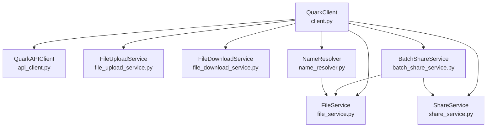
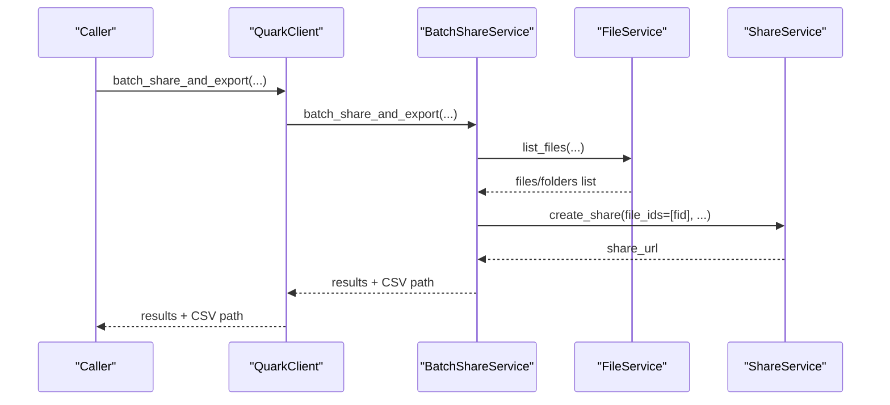
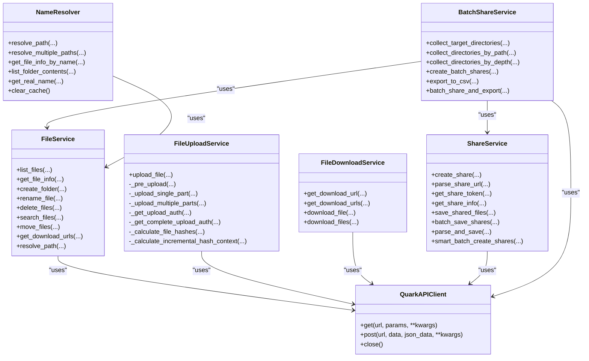

# Service Composition

<cite>
**Referenced Files in This Document**
- [client.py](file://quark_client/client.py)
- [api_client.py](file://quark_client/core/api_client.py)
- [config.py](file://quark_client/config.py)
- [exceptions.py](file://quark_client/exceptions.py)
- [file_service.py](file://quark_client/services/file_service.py)
- [file_upload_service.py](file://quark_client/services/file_upload_service.py)
- [file_download_service.py](file://quark_client/services/file_download_service.py)
- [share_service.py](file://quark_client/services/share_service.py)
- [batch_share_service.py](file://quark_client/services/batch_share_service.py)
- [name_resolver.py](file://quark_client/services/name_resolver.py)
- [share_commands.py](file://quark_client/cli/commands/share_commands.py)
- [batch_share_commands.py](file://quark_client/cli/commands/batch_share_commands.py)
</cite>

## Table of Contents
1. [Introduction](#introduction)
2. [Project Structure](#project-structure)
3. [Core Components](#core-components)
4. [Architecture Overview](#architecture-overview)
5. [Detailed Component Analysis](#detailed-component-analysis)
6. [Dependency Analysis](#dependency-analysis)
7. [Performance Considerations](#performance-considerations)
8. [Troubleshooting Guide](#troubleshooting-guide)
9. [Conclusion](#conclusion)
10. [Appendices](#appendices)

## Introduction
This document describes the service composition layer for Quark Pan operations. It focuses on the specialized service modules that encapsulate distinct aspects of cloud storage interactions: file listing and metadata operations, upload functionality, download operations, individual share management, bulk share processing, and path-to-ID resolution. Each service receives a shared QuarkAPIClient instance, enabling consistent authentication, HTTP transport, and error handling across all operations. The document explains service interfaces, method signatures, parameter handling, error strategies, progress tracking, and coordination patterns among services, especially for batch share processing.

## Project Structure
The service layer resides under quark_client/services and is orchestrated by the top-level client wrapper. The QuarkClient holds a QuarkAPIClient and instantiates all service objects, passing the same client instance to each. Services depend on the API client for HTTP requests and on each other for coordinated workflows (e.g., BatchShareService composes FileService and ShareService).

**Diagram sources**
- [client.py:21-39](file://quark_client/client.py#L21-L39)
- [api_client.py:16-209](file://quark_client/core/api_client.py#L16-L209)
- [file_service.py:13-893](file://quark_client/services/file_service.py#L13-L893)
- [file_upload_service.py:16-891](file://quark_client/services/file_upload_service.py#L16-L891)
- [file_download_service.py:13-301](file://quark_client/services/file_download_service.py#L13-L301)
- [share_service.py:13-742](file://quark_client/services/share_service.py#L13-L742)
- [batch_share_service.py:16-572](file://quark_client/services/batch_share_service.py#L16-L572)
- [name_resolver.py:10-198](file://quark_client/services/name_resolver.py#L10-L198)

**Section sources**
- [client.py:18-42](file://quark_client/client.py#L18-L42)
- [api_client.py:16-209](file://quark_client/core/api_client.py#L16-L209)

## Core Components
- QuarkAPIClient: Centralized HTTP client with authentication, request building, and error handling.
- FileService: File listing, metadata retrieval, folder navigation, advanced search, move operations, and download URL acquisition.
- FileUploadService: Multi-step upload pipeline with pre-upload, hash update, single/multi-part upload, and completion.
- FileDownloadService: Download URL retrieval and streaming download with fallback strategies and progress callbacks.
- ShareService: Individual share creation, token acquisition, share info retrieval, saving shared files, and batch save orchestration.
- BatchShareService: Directory discovery, recursive collection, share creation, CSV export, and progress reporting.
- NameResolver: Path-to-ID resolution with caching and real-name mapping.

Initialization pattern:
- All services accept a QuarkAPIClient instance in their constructor.
- QuarkClient constructs the API client and passes it to each service during instantiation.

**Section sources**
- [client.py:21-39](file://quark_client/client.py#L21-L39)
- [api_client.py:19-38](file://quark_client/core/api_client.py#L19-L38)
- [file_service.py:16-23](file://quark_client/services/file_service.py#L16-L23)
- [file_upload_service.py:19-26](file://quark_client/services/file_upload_service.py#L19-L26)
- [file_download_service.py:16-23](file://quark_client/services/file_download_service.py#L16-L23)
- [share_service.py:16-23](file://quark_client/services/share_service.py#L16-L23)
- [batch_share_service.py:19-29](file://quark_client/services/batch_share_service.py#L19-L29)
- [name_resolver.py:13-17](file://quark_client/services/name_resolver.py#L13-L17)

## Architecture Overview
The service layer follows a layered architecture:
- Transport and authentication: QuarkAPIClient handles HTTP, cookies, headers, timeouts, and error translation.
- Domain services: FileService, ShareService, and Upload/Download services encapsulate domain logic.
- Orchestration: BatchShareService coordinates discovery and share creation; NameResolver bridges human-readable paths to IDs.
- Client facade: QuarkClient exposes convenient methods and delegates to services.

**Diagram sources**
- [client.py:509-571](file://quark_client/client.py#L509-L571)
- [batch_share_service.py:534-571](file://quark_client/services/batch_share_service.py#L534-L571)
- [file_service.py:25-55](file://quark_client/services/file_service.py#L25-L55)
- [share_service.py:75-152](file://quark_client/services/share_service.py#L75-L152)

## Detailed Component Analysis

### FileService
Responsibilities:
- List files with pagination and sorting.
- Retrieve file info and resolve paths to IDs.
- Create, rename, delete, and move files/folders.
- Advanced search with client-side filtering.
- Get download URLs and support downloading via internal helpers.
- Move operations with async task polling.

Key methods and parameters:
- list_files(folder_id, page, size, sort_field, sort_order)
- get_file_info(file_id)
- create_folder(folder_name, parent_id)
- rename_file(file_id, new_name)
- delete_files(file_ids)
- search_files(keyword, folder_id, page, size, sort_field, sort_order)
- search_files_advanced(keyword, folder_id, page, size, file_extensions, min_size, max_size, sort_field, sort_order)
- move_files(file_ids, target_folder_id, exclude_fids)
- get_download_urls(file_ids)
- resolve_path(path, current_dir_id)
- get_file_path(file_id)

Error handling:
- Translates API errors and “not found” conditions into typed exceptions.
- Validates inputs (e.g., non-empty file_id).

Progress tracking:
- Not applicable for pure API calls; used internally by higher-level services.

Performance considerations:
- Uses pagination and server-side sorting to manage large lists.
- Advanced search applies client-side filtering to reduce server load when needed.

Integration patterns:
- Used by BatchShareService for directory discovery and by FileDownloadService for URL retrieval.

**Section sources**
- [file_service.py:25-893](file://quark_client/services/file_service.py#L25-L893)

### FileUploadService
Responsibilities:
- Multi-step upload pipeline: pre-upload, hash update, single/multi-part upload, and completion.
- Supports both small (<5MB) and large files with chunked uploads.
- Generates upload authorizations and performs POST completion steps.

Key methods and parameters:
- upload_file(file_path, parent_folder_id, progress_callback)
- _pre_upload(file_name, file_size, parent_folder_id, mime_type)
- _upload_single_part(...)
- _upload_multiple_parts(...)
- _get_upload_auth(...)
- _get_complete_upload_auth(...)
- _calculate_file_hashes(...)
- _calculate_incremental_hash_context(...)

Error handling:
- Raises APIError on failures; includes detailed messages for missing task IDs, auth failures, and upload completion issues.
- Implements retry logic for multi-part uploads.

Progress tracking:
- Progress callback receives percentage and message for each stage (hashing, pre-upload, single/multi-part, completion).

Performance considerations:
- Uses 4MB chunks for multi-part uploads.
- Implements exponential backoff on retries.
- Calculates MD5/SHA1 hashes incrementally for large files.

Integration patterns:
- Called by QuarkClient.upload_file(...) and indirectly by higher-level workflows.

**Section sources**
- [file_upload_service.py:28-891](file://quark_client/services/file_upload_service.py#L28-L891)

### FileDownloadService
Responsibilities:
- Retrieve download URLs for single or multiple files.
- Stream downloads with configurable chunk sizes and progress callbacks.
- Fallback strategies when initial download attempts fail (e.g., 403 Forbidden).

Key methods and parameters:
- get_download_url(file_id)
- get_download_urls(file_ids)
- download_file(file_id, save_path, chunk_size, progress_callback)
- download_files(file_ids, save_dir, chunk_size, progress_callback)

Error handling:
- Raises APIError when download URLs cannot be obtained.
- Implements fallback download methods using external clients and cookies.

Progress tracking:
- Progress callback receives bytes downloaded and total bytes.

Performance considerations:
- Configurable chunk size for efficient memory usage.
- Uses session reuse and appropriate headers for compatibility.

Integration patterns:
- Used by QuarkClient.download_file(...) and FileService for internal downloads.

**Section sources**
- [file_download_service.py:25-301](file://quark_client/services/file_download_service.py#L25-L301)

### ShareService
Responsibilities:
- Create individual shares with optional expiration and password.
- Parse share URLs and extract share IDs and passwords.
- Obtain share access tokens and retrieve share details.
- Save shared files to user’s drive with optional subfolder creation.
- Batch save shares with progress callbacks and error handling.
- Smart batch creation with duplicate detection and reuse.

Key methods and parameters:
- create_share(file_ids, title, expire_days, password)
- parse_share_url(share_url)
- get_share_token(share_id, password)
- get_share_info(share_id, token, pdir_fid)
- save_shared_files(share_id, token, file_ids, target_folder_id, target_folder_name, pdir_fid, save_all, wait_for_completion, timeout)
- batch_save_shares(share_urls, target_folder_id, target_folder_name, save_all, wait_for_completion, progress_callback)
- parse_and_save(share_url, target_folder_id, target_folder_name, file_filter, save_all, wait_for_completion, timeout)
- smart_batch_create_shares(file_ids, title, expire_days, password, check_duplicates, progress_callback)

Error handling:
- Raises ShareLinkError and APIError for parsing and operation failures.
- Waits for task completion with timeouts and detects capacity-related errors.

Progress tracking:
- Progress callbacks report current/total and per-file progress.

Performance considerations:
- Uses task polling for asynchronous operations.
- Applies filters to reduce payload sizes.

Integration patterns:
- Used by QuarkClient.save_shared_files(...) and BatchShareService for batch operations.

**Section sources**
- [share_service.py:75-742](file://quark_client/services/share_service.py#L75-L742)

### BatchShareService
Responsibilities:
- Collect target directories/paths for sharing based on depth, share level, and exclusion patterns.
- Create shares for collected targets and export results to CSV.
- Coordinate discovery and share creation workflows.

Key methods and parameters:
- collect_target_directories(exclude_patterns, target_dir, depth, share_level)
- collect_directories_by_path(target_dir, depth, share_level, exclude_patterns)
- collect_directories_by_depth(depth, share_level, exclude_patterns)
- create_batch_shares(target_directories)
- export_to_csv(share_results, filename)
- batch_share_and_export(csv_filename, exclude_patterns)

Error handling:
- Logs warnings and continues on partial failures.
- Provides detailed CSV export for success/failure records.

Progress tracking:
- Progress logging via logger for each step.

Performance considerations:
- Recursively traverses directories with controlled depth.
- Efficiently exports results to CSV for downstream processing.

Integration patterns:
- Orchestrates FileService and ShareService for discovery and share creation.
- Exposed via CLI commands for end-to-end workflows.

**Section sources**
- [batch_share_service.py:31-572](file://quark_client/services/batch_share_service.py#L31-L572)

### NameResolver
Responsibilities:
- Resolve human-readable paths to file/folder IDs.
- Maintain caches for file lists and real names to minimize API calls.
- Provide utilities for listing folder contents and retrieving real names.

Key methods and parameters:
- resolve_path(path, current_folder_id)
- resolve_multiple_paths(paths, current_folder_id)
- get_file_info_by_name(name, folder_id)
- list_folder_contents(folder_id)
- get_real_name(file_id)
- clear_cache()

Error handling:
- Raises APIError when paths cannot be resolved or files are not found.

Performance considerations:
- Refreshes cache per folder and maintains name mapping for quick lookups.

Integration patterns:
- Used by QuarkClient convenience methods to operate on names instead of IDs.

**Section sources**
- [name_resolver.py:19-198](file://quark_client/services/name_resolver.py#L19-L198)

### Service Initialization Pattern and Usage
- QuarkClient initializes QuarkAPIClient and injects it into each service.
- Services are exposed as attributes (files, upload, download, shares, batch_shares, name_resolver).
- CLI commands demonstrate usage patterns for batch share creation and share saving.

Practical examples:
- Batch share creation: CLI command collects directories, creates shares, and exports CSV.
- Share saving: CLI parses URLs, obtains tokens, retrieves share info, and saves files with progress.

**Section sources**
- [client.py:21-39](file://quark_client/client.py#L21-L39)
- [share_commands.py:121-242](file://quark_client/cli/commands/share_commands.py#L121-L242)
- [batch_share_commands.py:15-221](file://quark_client/cli/commands/batch_share_commands.py#L15-L221)

## Dependency Analysis
Service dependencies and relationships:
- BatchShareService depends on FileService and ShareService.
- NameResolver depends on FileService for listing and metadata.
- All services depend on QuarkAPIClient for HTTP operations.
- QuarkClient composes all services and exposes unified APIs.

**Diagram sources**
- [api_client.py:16-209](file://quark_client/core/api_client.py#L16-L209)
- [file_service.py:13-893](file://quark_client/services/file_service.py#L13-L893)
- [file_upload_service.py:16-891](file://quark_client/services/file_upload_service.py#L16-L891)
- [file_download_service.py:13-301](file://quark_client/services/file_download_service.py#L13-L301)
- [share_service.py:13-742](file://quark_client/services/share_service.py#L13-L742)
- [batch_share_service.py:16-572](file://quark_client/services/batch_share_service.py#L16-L572)
- [name_resolver.py:10-198](file://quark_client/services/name_resolver.py#L10-L198)

**Section sources**
- [client.py:21-39](file://quark_client/client.py#L21-L39)
- [batch_share_service.py:27-28](file://quark_client/services/batch_share_service.py#L27-L28)
- [name_resolver.py:13-14](file://quark_client/services/name_resolver.py#L13-L14)

## Performance Considerations
- Pagination and sorting: FileService uses server-side pagination and sorting to manage large datasets efficiently.
- Client-side filtering: Advanced search reduces network traffic by applying filters locally after fetching larger result sets.
- Chunked downloads: FileDownloadService supports configurable chunk sizes for memory-efficient streaming.
- Multi-part uploads: FileUploadService uses 4MB chunks and exponential backoff to improve reliability for large files.
- Task polling: Move and save operations use task polling with bounded retries and timeouts to avoid blocking.
- Caching: NameResolver caches folder listings and name mappings to minimize repeated API calls.

[No sources needed since this section provides general guidance]

## Troubleshooting Guide
Common issues and strategies:
- Authentication failures: QuarkAPIClient raises AuthenticationError on 401/403; ensure cookies are valid and refreshed.
- API errors: APIError wraps server responses; inspect status, code, and message for diagnostics.
- Network errors: NetworkError indicates timeouts or request failures; retry with backoff.
- Share creation timeouts: ShareService waits for task completion; adjust timeouts and check capacity limits.
- Download failures: FileDownloadService tries multiple strategies; verify cookies and headers.
- Path resolution errors: NameResolver raises APIError when paths are invalid; ensure correct current folder ID and existence.

**Section sources**
- [api_client.py:146-182](file://quark_client/core/api_client.py#L146-L182)
- [exceptions.py:13-50](file://quark_client/exceptions.py#L13-L50)
- [share_service.py:377-453](file://quark_client/services/share_service.py#L377-L453)
- [file_download_service.py:188-257](file://quark_client/services/file_download_service.py#L188-L257)
- [name_resolver.py:75-104](file://quark_client/services/name_resolver.py#L75-L104)

## Conclusion
The service composition layer cleanly separates concerns across file operations, uploads, downloads, sharing, and path resolution. Each service receives a shared QuarkAPIClient, ensuring consistent authentication and transport. Coordination occurs primarily through BatchShareService, which orchestrates discovery and share creation. The design supports robust error handling, progress tracking, and performance optimizations, enabling reliable automation and CLI-driven workflows.

[No sources needed since this section summarizes without analyzing specific files]

## Appendices

### Service Interfaces and Method Signatures
- FileService: list_files, get_file_info, create_folder, rename_file, delete_files, search_files, search_files_advanced, move_files, get_download_urls, resolve_path, get_file_path.
- FileUploadService: upload_file, _pre_upload, _upload_single_part, _upload_multiple_parts, _get_upload_auth, _get_complete_upload_auth, _calculate_file_hashes, _calculate_incremental_hash_context.
- FileDownloadService: get_download_url, get_download_urls, download_file, download_files.
- ShareService: create_share, parse_share_url, get_share_token, get_share_info, save_shared_files, batch_save_shares, parse_and_save, smart_batch_create_shares.
- BatchShareService: collect_target_directories, collect_directories_by_path, collect_directories_by_depth, create_batch_shares, export_to_csv, batch_share_and_export.
- NameResolver: resolve_path, resolve_multiple_paths, get_file_info_by_name, list_folder_contents, get_real_name, clear_cache.

**Section sources**
- [file_service.py:25-893](file://quark_client/services/file_service.py#L25-L893)
- [file_upload_service.py:28-891](file://quark_client/services/file_upload_service.py#L28-L891)
- [file_download_service.py:25-301](file://quark_client/services/file_download_service.py#L25-L301)
- [share_service.py:75-742](file://quark_client/services/share_service.py#L75-L742)
- [batch_share_service.py:31-572](file://quark_client/services/batch_share_service.py#L31-L572)
- [name_resolver.py:19-198](file://quark_client/services/name_resolver.py#L19-L198)

### Practical Usage Patterns
- Batch share creation: Use BatchShareService to discover targets, create shares, and export CSV.
- Share saving: Use ShareService.parse_and_save to parse URLs, obtain tokens, and save files with optional filtering.
- Name-based operations: Use NameResolver to convert paths to IDs and operate on files/folders by name.

**Section sources**
- [batch_share_service.py:534-571](file://quark_client/services/batch_share_service.py#L534-L571)
- [share_service.py:455-523](file://quark_client/services/share_service.py#L455-L523)
- [client.py:105-148](file://quark_client/client.py#L105-L148)

### Guidelines for Implementing New Services
- Accept a QuarkAPIClient instance in the constructor.
- Encapsulate a single domain concern and delegate cross-cutting concerns (HTTP, auth) to the client.
- Define clear method signatures with explicit parameter names and defaults.
- Use progress callbacks for long-running operations.
- Raise specific exceptions from exceptions.py for consistent error handling.
- Respect configuration from config.py (timeouts, page sizes, chunk sizes).
- Integrate with QuarkClient for unified exposure and CLI commands.

**Section sources**
- [client.py:21-39](file://quark_client/client.py#L21-L39)
- [config.py:34-63](file://quark_client/config.py#L34-L63)
- [exceptions.py:8-50](file://quark_client/exceptions.py#L8-L50)