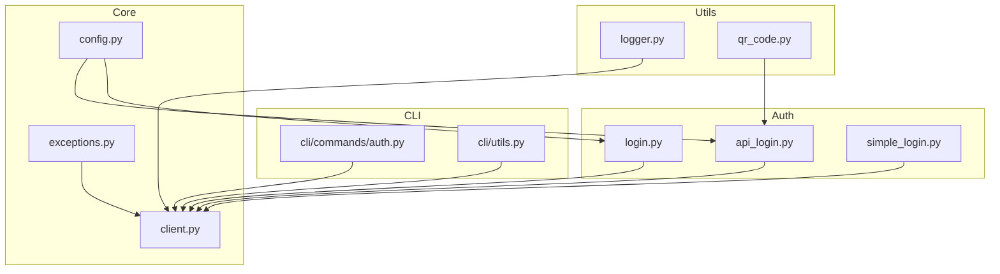
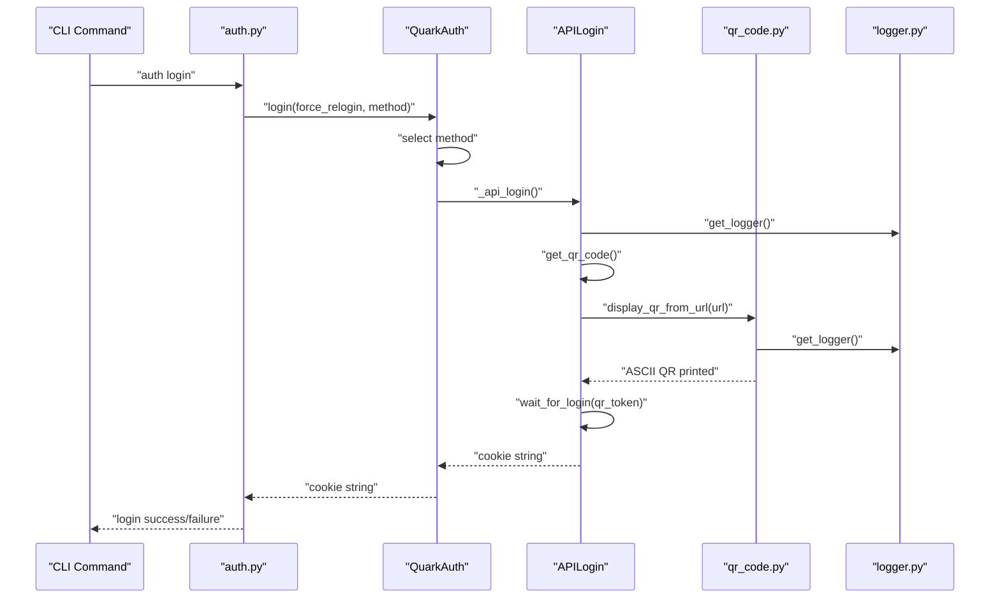
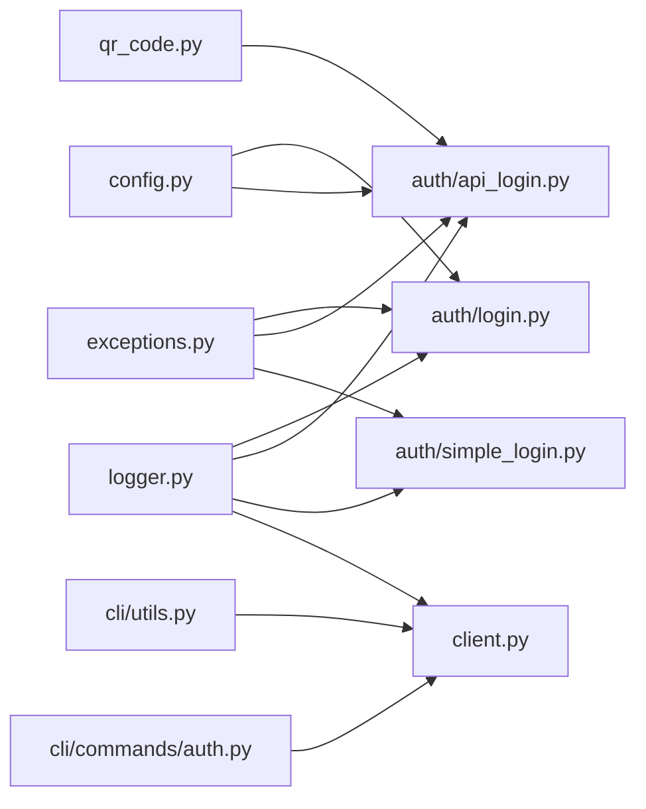

# Utility Functions and Helpers

<cite>
**Referenced Files in This Document**
- [logger.py](file://quark_client/utils/logger.py)
- [qr_code.py](file://quark_client/utils/qr_code.py)
- [exceptions.py](file://quark_client/exceptions.py)
- [utils/__init__.py](file://quark_client/utils/__init__.py)
- [client.py](file://quark_client/client.py)
- [login.py](file://quark_client/auth/login.py)
- [api_login.py](file://quark_client/auth/api_login.py)
- [simple_login.py](file://quark_client/auth/simple_login.py)
- [auth.py](file://quark_client/cli/commands/auth.py)
- [cli_utils.py](file://quark_client/cli/utils.py)
- [config.py](file://quark_client/config.py)
</cite>

## Table of Contents
1. [Introduction](#introduction)
2. [Project Structure](#project-structure)
3. [Core Components](#core-components)
4. [Architecture Overview](#architecture-overview)
5. [Detailed Component Analysis](#detailed-component-analysis)
6. [Dependency Analysis](#dependency-analysis)
7. [Performance Considerations](#performance-considerations)
8. [Troubleshooting Guide](#troubleshooting-guide)
9. [Conclusion](#conclusion)
10. [Appendices](#appendices)

## Introduction
This document focuses on the utility functions and helper modules that support the QuarkClient library. It covers:
- Logging utilities: configuration, formatting, and integration with client operations
- QR code generation utilities: ASCII rendering, display helpers, and integration with authentication flows
- Exception hierarchy and error handling patterns used across the library
- Practical examples and guidelines for extending utilities while maintaining consistent logging and error handling
- Best practices for debugging, monitoring, and troubleshooting

## Project Structure
The utility layer resides under the quark_client/utils package and integrates with authentication, CLI, and core client components.

**Diagram sources**
- [logger.py:1-73](file://quark_client/utils/logger.py#L1-L73)
- [qr_code.py:1-46](file://quark_client/utils/qr_code.py#L1-L46)
- [login.py:1-301](file://quark_client/auth/login.py#L1-L301)
- [api_login.py:1-521](file://quark_client/auth/api_login.py#L1-L521)
- [simple_login.py:1-249](file://quark_client/auth/simple_login.py#L1-L249)
- [auth.py:1-188](file://quark_client/cli/commands/auth.py#L1-L188)
- [cli_utils.py:1-273](file://quark_client/cli/utils.py#L1-L273)
- [client.py:1-405](file://quark_client/client.py#L1-L405)
- [exceptions.py:1-50](file://quark_client/exceptions.py#L1-L50)
- [config.py:1-63](file://quark_client/config.py#L1-L63)

**Section sources**
- [logger.py:1-73](file://quark_client/utils/logger.py#L1-L73)
- [qr_code.py:1-46](file://quark_client/utils/qr_code.py#L1-L46)
- [exceptions.py:1-50](file://quark_client/exceptions.py#L1-L50)
- [utils/__init__.py:1-12](file://quark_client/utils/__init__.py#L1-L12)
- [client.py:1-405](file://quark_client/client.py#L1-L405)
- [login.py:1-301](file://quark_client/auth/login.py#L1-L301)
- [api_login.py:1-521](file://quark_client/auth/api_login.py#L1-L521)
- [simple_login.py:1-249](file://quark_client/auth/simple_login.py#L1-L249)
- [auth.py:1-188](file://quark_client/cli/commands/auth.py#L1-L188)
- [cli_utils.py:1-273](file://quark_client/cli/utils.py#L1-L273)
- [config.py:1-63](file://quark_client/config.py#L1-L63)

## Core Components
- Logger utilities: setup and retrieval of loggers with configurable handlers and formatting
- QR code utilities: ASCII QR rendering and display helpers for terminal environments
- Exception hierarchy: structured error types for authentication, configuration, API, network, file, share, and download errors
- CLI utilities: formatting, user prompts, and error handling helpers for command-line operations
- Integration points: authentication flows, client initialization, and CLI commands

**Section sources**
- [logger.py:12-73](file://quark_client/utils/logger.py#L12-L73)
- [qr_code.py:7-46](file://quark_client/utils/qr_code.py#L7-L46)
- [exceptions.py:8-50](file://quark_client/exceptions.py#L8-L50)
- [cli_utils.py:26-110](file://quark_client/cli/utils.py#L26-L110)

## Architecture Overview
The utilities layer provides foundational capabilities consumed by higher-level components:
- Logger utilities are used across authentication and client modules to emit structured logs
- QR code utilities are used during API-based login to present a QR code in the terminal
- Exception types unify error handling across modules
- CLI utilities enhance UX and error reporting for command-line operations

**Diagram sources**
- [auth.py:13-91](file://quark_client/cli/commands/auth.py#L13-L91)
- [login.py:107-259](file://quark_client/auth/login.py#L107-L259)
- [api_login.py:467-507](file://quark_client/auth/api_login.py#L467-L507)
- [qr_code.py:40-46](file://quark_client/utils/qr_code.py#L40-L46)
- [logger.py:62-73](file://quark_client/utils/logger.py#L62-L73)

## Detailed Component Analysis

### Logging Utilities
The logging utilities provide:
- setup_logger: creates a logger with console and/or file handlers, configurable level and format
- get_logger: retrieves an existing logger by name

Key behaviors:
- Removes existing handlers before adding new ones to allow reconfiguration
- Uses a standard timestamped format with module name, level, and message
- Supports optional file output and console output independently

Practical usage:
- Initialize a named logger in modules that require structured logging
- Configure file logging for persistent audit trails
- Adjust levels for development vs production

Interface summary:
- setup_logger(name, level, log_file, console) -> logging.Logger
- get_logger(name) -> logging.Logger

Integration points:
- Used extensively in authentication modules for debug/info/warning/error messages
- Used in CLI utilities for consistent output formatting

**Section sources**
- [logger.py:12-73](file://quark_client/utils/logger.py#L12-L73)
- [login.py:28](file://quark_client/auth/login.py#L28)
- [api_login.py:33](file://quark_client/auth/api_login.py#L33)
- [simple_login.py:23](file://quark_client/auth/simple_login.py#L23)
- [cli_utils.py:14](file://quark_client/cli/utils.py#L14)

### QR Code Generation Utilities
The QR utilities provide:
- print_ascii_qr: renders a QR code as ASCII art in the terminal using the qrcode library
- display_qr_code: logs a message and prints the QR file path (placeholder for future image decoding)
- display_qr_from_url: convenience wrapper to render a QR from a URL directly

Key behaviors:
- Uses the qrcode library with inverted ASCII rendering for better terminal contrast
- Falls back gracefully with warnings if qrcode is unavailable
- Integrates with the logger to record failures

Integration points:
- APILogin uses display_qr_from_url to show QR codes during API login
- Provides a fallback message when ASCII rendering fails

Interface summary:
- print_ascii_qr(text: str) -> None
- display_qr_code(qr_image_path: str) -> None
- display_qr_from_url(url: str) -> None

Environment considerations:
- Works best in terminals with good ASCII rendering
- Some themes may require disabling inversion
- Fallback to printing the URL is automatic

**Section sources**
- [qr_code.py:7-46](file://quark_client/utils/qr_code.py#L7-L46)
- [api_login.py:480-486](file://quark_client/auth/api_login.py#L480-L486)

### Exception Hierarchy and Error Handling Patterns
The exception hierarchy defines clear categories:
- QuarkClientError: base exception type
- AuthenticationError: authentication-related failures
- ConfigError: configuration-related failures
- APIError: API call failures with optional status_code and response_data
- NetworkError: network-related failures
- FileNotFoundError: file not found
- ShareLinkError: share link related failures
- DownloadError: download related failures

Patterns:
- Modules raise specific exceptions with contextual messages
- Authentication modules catch and re-raise as AuthenticationError
- CLI utilities translate common error conditions into actionable messages

Integration points:
- Authentication managers wrap lower-level failures into AuthenticationError
- CLI commands catch exceptions and print user-friendly messages
- APIError carries status_code and response_data for richer diagnostics

**Section sources**
- [exceptions.py:8-50](file://quark_client/exceptions.py#L8-L50)
- [login.py:137](file://quark_client/auth/login.py#L137)
- [api_login.py:139-141](file://quark_client/auth/api_login.py#L139-L141)
- [cli_utils.py:87-110](file://quark_client/cli/utils.py#L87-L110)

### CLI Utilities
CLI utilities enhance user experience and error handling:
- Formatting helpers: file sizes, timestamps, truncation, icons
- Prompt helpers: confirmation dialogs, colored output
- Error handling: categorization of API errors with suggested actions
- Navigation helpers: breadcrumb navigation for folder traversal

Integration points:
- CLI commands use these helpers for consistent UX
- Error handling translates internal exceptions into actionable guidance

**Section sources**
- [cli_utils.py:26-110](file://quark_client/cli/utils.py#L26-L110)
- [cli_utils.py:178-222](file://quark_client/cli/utils.py#L178-L222)
- [auth.py:13-91](file://quark_client/cli/commands/auth.py#L13-L91)

### Relationship Between Utilities and Main Client Functionality
- Logger utilities are used across client and auth modules for consistent logging
- QR utilities are invoked during API login to guide users
- Exception types unify error handling across modules
- CLI utilities depend on the client for operations and provide user feedback

**Section sources**
- [client.py:50-64](file://quark_client/client.py#L50-L64)
- [login.py:107-137](file://quark_client/auth/login.py#L107-L137)
- [api_login.py:467-507](file://quark_client/auth/api_login.py#L467-L507)

## Dependency Analysis
Utilities are consumed by multiple modules. The following diagram shows key dependencies:

**Diagram sources**
- [logger.py:62-73](file://quark_client/utils/logger.py#L62-L73)
- [login.py:11-12](file://quark_client/auth/login.py#L11-L12)
- [api_login.py:16-17](file://quark_client/auth/api_login.py#L16-L17)
- [simple_login.py:13](file://quark_client/auth/simple_login.py#L13)
- [qr_code.py:4](file://quark_client/utils/qr_code.py#L4)
- [exceptions.py:8-50](file://quark_client/exceptions.py#L8-L50)
- [cli_utils.py:12](file://quark_client/cli/utils.py#L12)
- [auth.py:8](file://quark_client/cli/commands/auth.py#L8)
- [config.py:10-18](file://quark_client/config.py#L10-L18)

**Section sources**
- [logger.py:62-73](file://quark_client/utils/logger.py#L62-L73)
- [qr_code.py:4](file://quark_client/utils/qr_code.py#L4)
- [exceptions.py:8-50](file://quark_client/exceptions.py#L8-L50)
- [cli_utils.py:12](file://quark_client/cli/utils.py#L12)
- [auth.py:8](file://quark_client/cli/commands/auth.py#L8)
- [config.py:10-18](file://quark_client/config.py#L10-L18)

## Performance Considerations
- Logging overhead: Prefer INFO/WARNING levels for normal operations; reserve DEBUG for detailed diagnostics
- QR rendering: ASCII rendering is lightweight; ensure qrcode library availability to avoid fallback costs
- Exception handling: Catch and re-raise specific exceptions to minimize stack trace noise
- CLI formatting: Avoid excessive string formatting in tight loops; cache formatted values when reused

[No sources needed since this section provides general guidance]

## Troubleshooting Guide
Common scenarios and resolutions:
- Authentication failures: Use AuthenticationError to capture and re-raise with context; check network connectivity and API endpoints
- Logging issues: Verify setup_logger configuration; ensure file paths exist and are writable
- QR rendering problems: Confirm qrcode library installation; adjust terminal theme or disable inversion if needed
- CLI error messages: Utilize handle_api_error to provide actionable guidance based on error content

Debugging tips:
- Enable DEBUG logs during development to trace authentication flows
- Capture APIError status_code and response_data for precise diagnostics
- Use CLI utilities to format and present errors in a user-friendly manner

**Section sources**
- [login.py:137](file://quark_client/auth/login.py#L137)
- [api_login.py:139-141](file://quark_client/auth/api_login.py#L139-L141)
- [cli_utils.py:87-110](file://quark_client/cli/utils.py#L87-L110)
- [logger.py:30-59](file://quark_client/utils/logger.py#L30-L59)

## Conclusion
The utility layer provides essential building blocks for consistent logging, QR code display, and robust error handling across the QuarkClient library. By adhering to the established patterns and interfaces, developers can extend functionality while maintaining a cohesive developer and user experience.

[No sources needed since this section summarizes without analyzing specific files]

## Appendices

### Practical Examples and Usage References
- Logging configuration: [setup_logger:12-59](file://quark_client/utils/logger.py#L12-L59)
- Logger retrieval: [get_logger:62-73](file://quark_client/utils/logger.py#L62-L73)
- QR code display from URL: [display_qr_from_url:40-46](file://quark_client/utils/qr_code.py#L40-L46)
- Authentication flow integration: [QuarkAuth.login:107-137](file://quark_client/auth/login.py#L107-L137), [APILogin.login:467-507](file://quark_client/auth/api_login.py#L467-L507)
- CLI error handling: [handle_api_error:87-110](file://quark_client/cli/utils.py#L87-L110)

### Guidelines for Extending Utilities
- Logging
  - Always retrieve a named logger via get_logger for consistency
  - Add file handlers only when needed; prefer console output for CLI tools
  - Use appropriate log levels (DEBUG/INFO/WARNING/ERROR) based on verbosity requirements
- QR Code Utilities
  - Wrap external library calls with try/except and log warnings on failure
  - Provide fallback messages for environments where rendering is not possible
- Exceptions
  - Define new exception types under the existing hierarchy when appropriate
  - Include relevant metadata (status_code, response_data) for APIError
- CLI Utilities
  - Keep formatting helpers focused and reusable
  - Use rich console for consistent colored output
  - Translate technical errors into actionable user guidance

[No sources needed since this section provides general guidance]