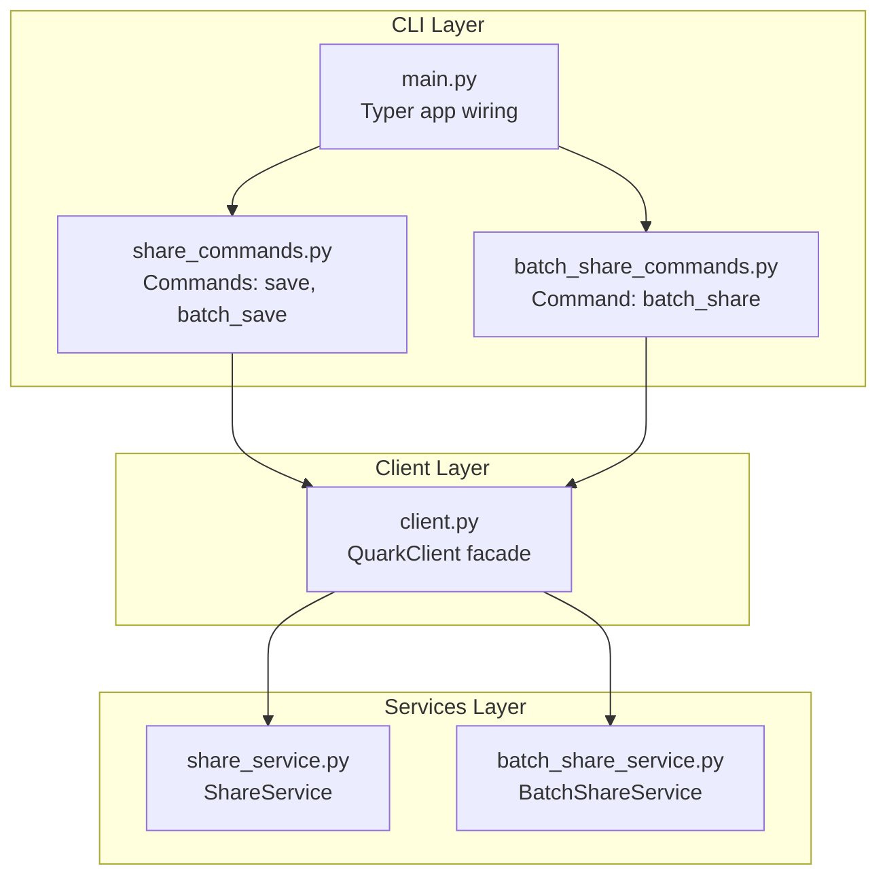
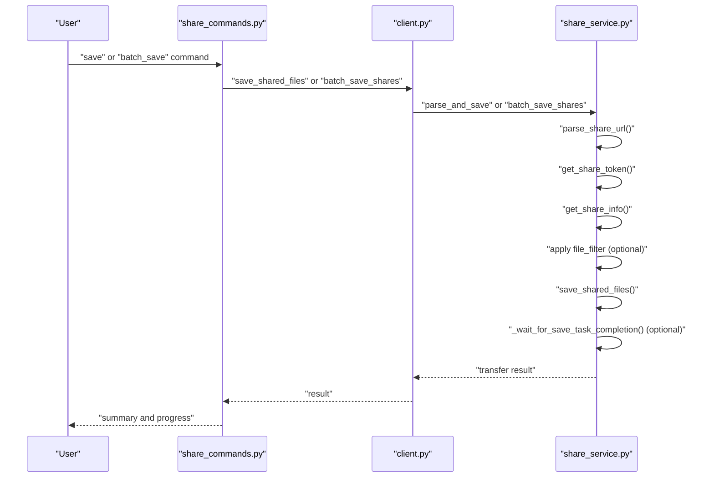
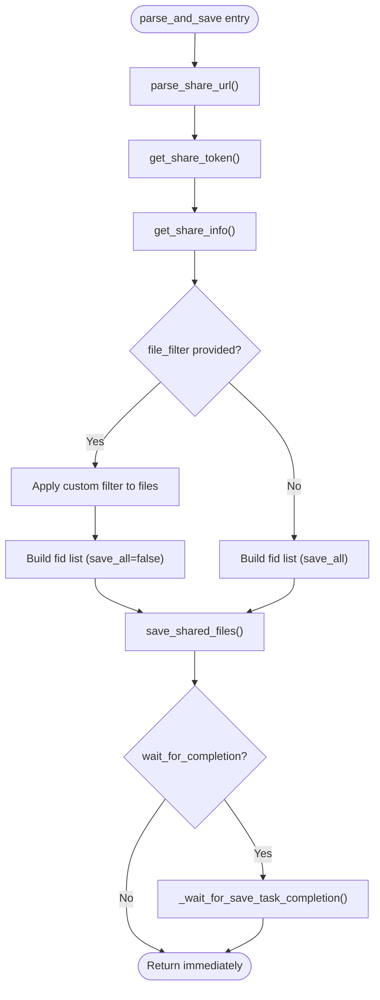
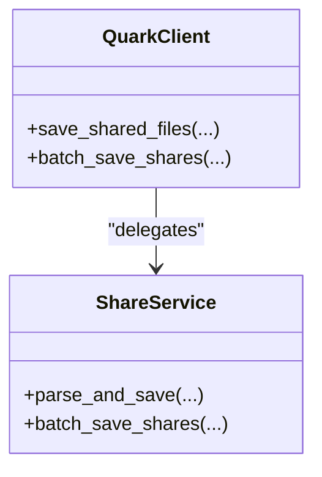
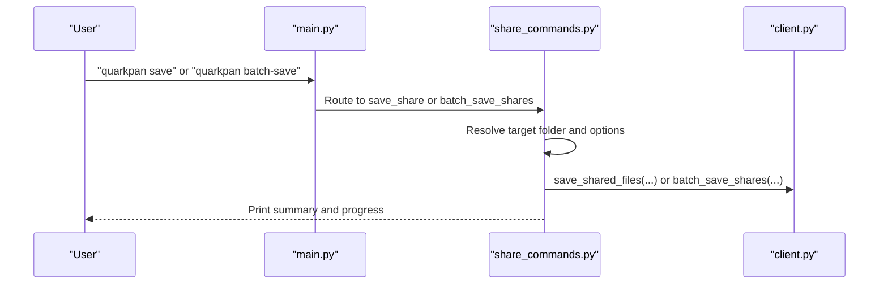
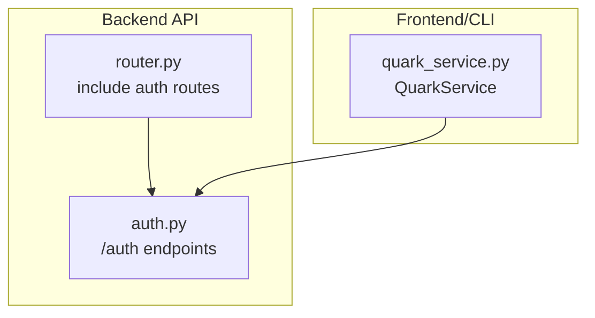
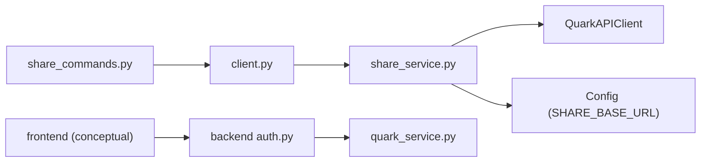

# Share Content Transfer

<cite>
**Referenced Files in This Document**
- [share_service.py](file://quark_client/services/share_service.py)
- [batch_share_service.py](file://quark_client/services/batch_share_service.py)
- [client.py](file://quark_client/client.py)
- [share_commands.py](file://quark_client/cli/commands/share_commands.py)
- [batch_share_commands.py](file://quark_client/cli/commands/batch_share_commands.py)
- [main.py](file://quark_client/cli/main.py)
- [quark_service.py](file://backend/app/services/quark_service.py)
- [auth.py](file://backend/app/api/v1/auth.py)
- [router.py](file://backend/app/api/v1/router.py)
</cite>

## Table of Contents
1. [Introduction](#introduction)
2. [Project Structure](#project-structure)
3. [Core Components](#core-components)
4. [Architecture Overview](#architecture-overview)
5. [Detailed Component Analysis](#detailed-component-analysis)
6. [Dependency Analysis](#dependency-analysis)
7. [Performance Considerations](#performance-considerations)
8. [Troubleshooting Guide](#troubleshooting-guide)
9. [Conclusion](#conclusion)

## Introduction
This document explains the share content transfer functionality within the QuarkManager share management system. It covers the complete file transfer process from share links to personal storage, including the parse_and_save workflow, token-based authentication for share access, and the save_shared_files implementation. It also documents file filtering capabilities with custom filter functions, selective file transfer options, bulk transfer operations, and integration with QuarkClient’s share parsing mechanisms. Practical examples illustrate transferring entire shared folders, selectively transferring specific files based on filters, handling large file transfers with progress monitoring, and managing transfer errors and retries. Finally, it details the relationship between share content discovery, file metadata extraction, and the final transfer to destination folders within the user’s personal storage space.

## Project Structure
The share transfer capability spans three layers:
- CLI layer: user-facing commands for single and batch share transfers
- Client layer: QuarkClient orchestrates share parsing and invokes services
- Services layer: ShareService implements token acquisition, share info retrieval, and save operations; BatchShareService supports directory scanning and batch sharing

**Diagram sources**
- [main.py:33-249](file://quark_client/cli/main.py#L33-L249)
- [share_commands.py:342-524](file://quark_client/cli/commands/share_commands.py#L342-L524)
- [batch_share_commands.py:15-220](file://quark_client/cli/commands/batch_share_commands.py#L15-L220)
- [client.py:18-404](file://quark_client/client.py#L18-L404)
- [share_service.py:13-742](file://quark_client/services/share_service.py#L13-L742)
- [batch_share_service.py:16-572](file://quark_client/services/batch_share_service.py#L16-L572)

**Section sources**
- [main.py:33-249](file://quark_client/cli/main.py#L33-L249)
- [share_commands.py:342-524](file://quark_client/cli/commands/share_commands.py#L342-L524)
- [batch_share_commands.py:15-220](file://quark_client/cli/commands/batch_share_commands.py#L15-L220)
- [client.py:18-404](file://quark_client/client.py#L18-L404)
- [share_service.py:13-742](file://quark_client/services/share_service.py#L13-L742)
- [batch_share_service.py:16-572](file://quark_client/services/batch_share_service.py#L16-L572)

## Core Components
- ShareService: Implements token acquisition, share info retrieval, file filtering, and save operations. Provides parse_and_save and batch_save_shares.
- QuarkClient: Exposes save_shared_files and batch_save_shares as a unified interface to ShareService.
- CLI Commands: save_share and batch_save_shares orchestrate user input, target folder resolution, and progress reporting.
- BatchShareService: Scans directories and creates share links; complements share transfer workflows.

Key responsibilities:
- Token-based authentication: get_share_token uses SHARE_BASE_URL to obtain stoken for protected shares.
- Share discovery: get_share_info lists files under a share with pagination and banner/share metadata.
- Selective transfer: parse_and_save applies a custom file_filter to narrow the set of files to transfer.
- Bulk transfer: batch_save_shares iterates URLs, aggregates results, and reports progress.

**Section sources**
- [share_service.py:249-523](file://quark_client/services/share_service.py#L249-L523)
- [client.py:327-354](file://quark_client/client.py#L327-L354)
- [share_commands.py:342-524](file://quark_client/cli/commands/share_commands.py#L342-L524)
- [batch_share_service.py:16-572](file://quark_client/services/batch_share_service.py#L16-L572)

## Architecture Overview
The share transfer pipeline integrates CLI commands, the client facade, and the share service. It follows a deterministic sequence: parse share URL → acquire token → fetch share info → optionally filter files → save selected files → optionally wait for completion.

**Diagram sources**
- [share_commands.py:342-524](file://quark_client/cli/commands/share_commands.py#L342-L524)
- [client.py:327-354](file://quark_client/client.py#L327-L354)
- [share_service.py:455-523](file://quark_client/services/share_service.py#L455-L523)

## Detailed Component Analysis

### ShareService: Token-based Access and Save Operations
ShareService encapsulates the entire share transfer lifecycle:
- parse_share_url: Extracts share_id and optional password from multiple supported formats.
- get_share_token: Requests stoken via SHARE_BASE_URL with optional passcode.
- get_share_info: Retrieves paginated file listings and metadata for the share.
- save_shared_files: Submits the transfer task with either save_all or explicit fid_list.
- _wait_for_save_task_completion: Polls task status until completion, failure, or timeout.
- parse_and_save: Orchestrates the full workflow end-to-end.
- batch_save_shares: Iterates multiple URLs, aggregates results, and supports progress callbacks.

**Diagram sources**
- [share_service.py:455-523](file://quark_client/services/share_service.py#L455-L523)
- [share_service.py:313-375](file://quark_client/services/share_service.py#L313-L375)
- [share_service.py:249-278](file://quark_client/services/share_service.py#L249-L278)

**Section sources**
- [share_service.py:196-278](file://quark_client/services/share_service.py#L196-L278)
- [share_service.py:280-311](file://quark_client/services/share_service.py#L280-L311)
- [share_service.py:313-375](file://quark_client/services/share_service.py#L313-L375)
- [share_service.py:377-453](file://quark_client/services/share_service.py#L377-L453)
- [share_service.py:455-523](file://quark_client/services/share_service.py#L455-L523)
- [share_service.py:525-580](file://quark_client/services/share_service.py#L525-L580)

### QuarkClient Facade: Unified API for Transfers
QuarkClient exposes convenience methods that delegate to ShareService:
- save_shared_files: Delegates to ShareService.parse_and_save with optional file_filter.
- batch_save_shares: Supports two modes—create subfolders per share or use batch_save_shares from ShareService—and forwards progress callbacks.

**Diagram sources**
- [client.py:327-354](file://quark_client/client.py#L327-L354)
- [client.py:170-236](file://quark_client/client.py#L170-L236)
- [share_service.py:525-580](file://quark_client/services/share_service.py#L525-L580)

**Section sources**
- [client.py:327-354](file://quark_client/client.py#L327-L354)
- [client.py:170-236](file://quark_client/client.py#L170-L236)

### CLI Commands: User Interaction and Progress Reporting
The CLI layer translates user intent into service calls:
- save_share: Resolves target folder, optionally auto-creates it, and calls client.save_shared_files with save_all and wait_for_completion flags.
- batch_save_shares: Reads URLs from stdin or a file, validates and deduplicates them, then calls client.batch_save_shares with a progress callback.

**Diagram sources**
- [main.py:221-249](file://quark_client/cli/main.py#L221-L249)
- [share_commands.py:342-524](file://quark_client/cli/commands/share_commands.py#L342-L524)

**Section sources**
- [main.py:221-249](file://quark_client/cli/main.py#L221-L249)
- [share_commands.py:342-524](file://quark_client/cli/commands/share_commands.py#L342-L524)

### BatchShareService: Directory Discovery and Batch Sharing
While primarily for creating share links, BatchShareService demonstrates directory traversal patterns that complement share transfer:
- collect_target_directories: Collects target directories by legacy mode, path mode, or depth-based recursion.
- _collect_items_recursive: Recursively traverses folders up to a specified depth, applying filters and exclusion patterns.

These utilities help plan share creation and later transfer operations by identifying target locations.

**Section sources**
- [batch_share_service.py:31-344](file://quark_client/services/batch_share_service.py#L31-L344)

### Backend Integration: Authentication and Storage Status
The backend provides authentication endpoints that enable the frontend or CLI to manage login state and storage information. While not directly implementing share transfer, it underpins the user session used by the CLI and client.

**Diagram sources**
- [auth.py:18-106](file://backend/app/api/v1/auth.py#L18-L106)
- [router.py:1-24](file://backend/app/api/v1/router.py#L1-L24)
- [quark_service.py:54-223](file://backend/app/services/quark_service.py#L54-L223)

**Section sources**
- [auth.py:18-106](file://backend/app/api/v1/auth.py#L18-L106)
- [router.py:1-24](file://backend/app/api/v1/router.py#L1-L24)
- [quark_service.py:54-223](file://backend/app/services/quark_service.py#L54-L223)

## Dependency Analysis
High-level dependencies:
- CLI depends on QuarkClient for share operations.
- QuarkClient depends on ShareService for share parsing and saving.
- ShareService depends on QuarkAPIClient and configuration constants for token and endpoint access.
- Backend authentication endpoints support session management for the client.

**Diagram sources**
- [share_commands.py:342-524](file://quark_client/cli/commands/share_commands.py#L342-L524)
- [client.py:18-404](file://quark_client/client.py#L18-L404)
- [share_service.py:13-742](file://quark_client/services/share_service.py#L13-L742)
- [auth.py:18-106](file://backend/app/api/v1/auth.py#L18-L106)
- [quark_service.py:54-223](file://backend/app/services/quark_service.py#L54-L223)

**Section sources**
- [share_service.py:13-742](file://quark_client/services/share_service.py#L13-L742)
- [client.py:18-404](file://quark_client/client.py#L18-L404)
- [share_commands.py:342-524](file://quark_client/cli/commands/share_commands.py#L342-L524)
- [auth.py:18-106](file://backend/app/api/v1/auth.py#L18-L106)
- [quark_service.py:54-223](file://backend/app/services/quark_service.py#L54-L223)

## Performance Considerations
- Pagination and polling: get_share_info and _wait_for_save_task_completion use polling with fixed intervals. For large shares or long-running tasks, consider tuning timeout and retry intervals.
- Filtering cost: Applying a custom file_filter increases CPU usage during selection; keep filters efficient and avoid heavy I/O.
- Batch operations: batch_save_shares aggregates results and supports progress callbacks, enabling responsive feedback for long-running transfers.
- Network reliability: The token acquisition and task polling steps may fail transiently; implement retry with exponential backoff at higher layers if needed.

[No sources needed since this section provides general guidance]

## Troubleshooting Guide
Common issues and remedies:
- Invalid share URL: parse_share_url raises ShareLinkError for unsupported formats; ensure the URL matches supported patterns.
- Missing token: get_share_token requires a valid share_id and optional password; verify the share is accessible and not expired.
- Empty share content: get_share_info may return empty lists; confirm the share contains files and is not private.
- Capacity limits: _wait_for_save_task_completion detects capacity-related failures and raises APIError; free space and retry after cleanup.
- Permission errors: Non-retryable errors (e.g., unauthorized, forbidden) halt polling early; verify credentials and permissions.
- Timeout: Excessive delays trigger a timeout error; increase timeout parameter for large transfers.

**Section sources**
- [share_service.py:249-278](file://quark_client/services/share_service.py#L249-L278)
- [share_service.py:377-453](file://quark_client/services/share_service.py#L377-L453)
- [share_service.py:455-523](file://quark_client/services/share_service.py#L455-L523)

## Conclusion
The QuarkManager share content transfer system provides a robust, layered architecture for moving files from public or private share links into personal storage. ShareService centralizes token-based access, share discovery, and save operations, while QuarkClient offers a concise facade for CLI and higher-level integrations. The CLI commands deliver user-friendly workflows for single and batch transfers, with progress reporting and error handling. By leveraging custom file filters, selective transfer options, and bulk operations, users can efficiently manage large-scale content ingestion. Proper error handling and timeouts ensure reliable operation across diverse network conditions.