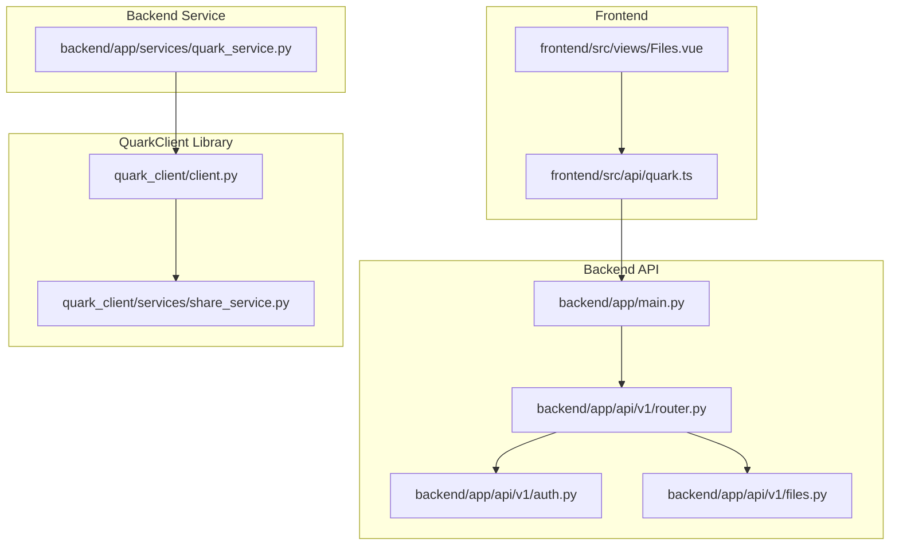
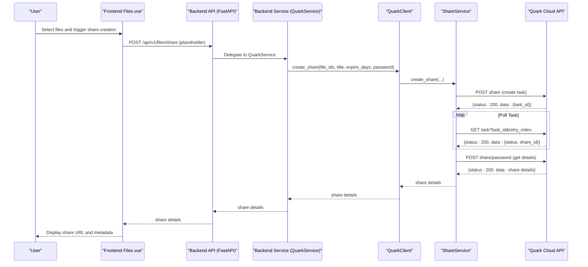
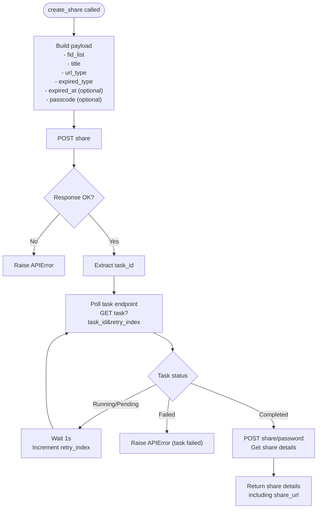
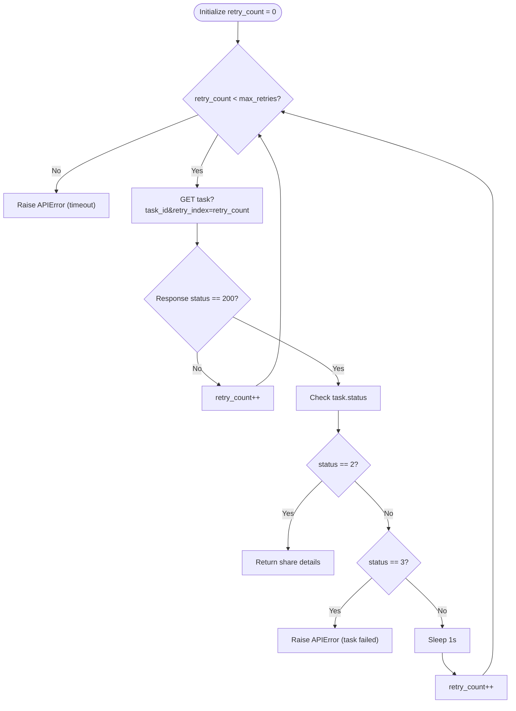
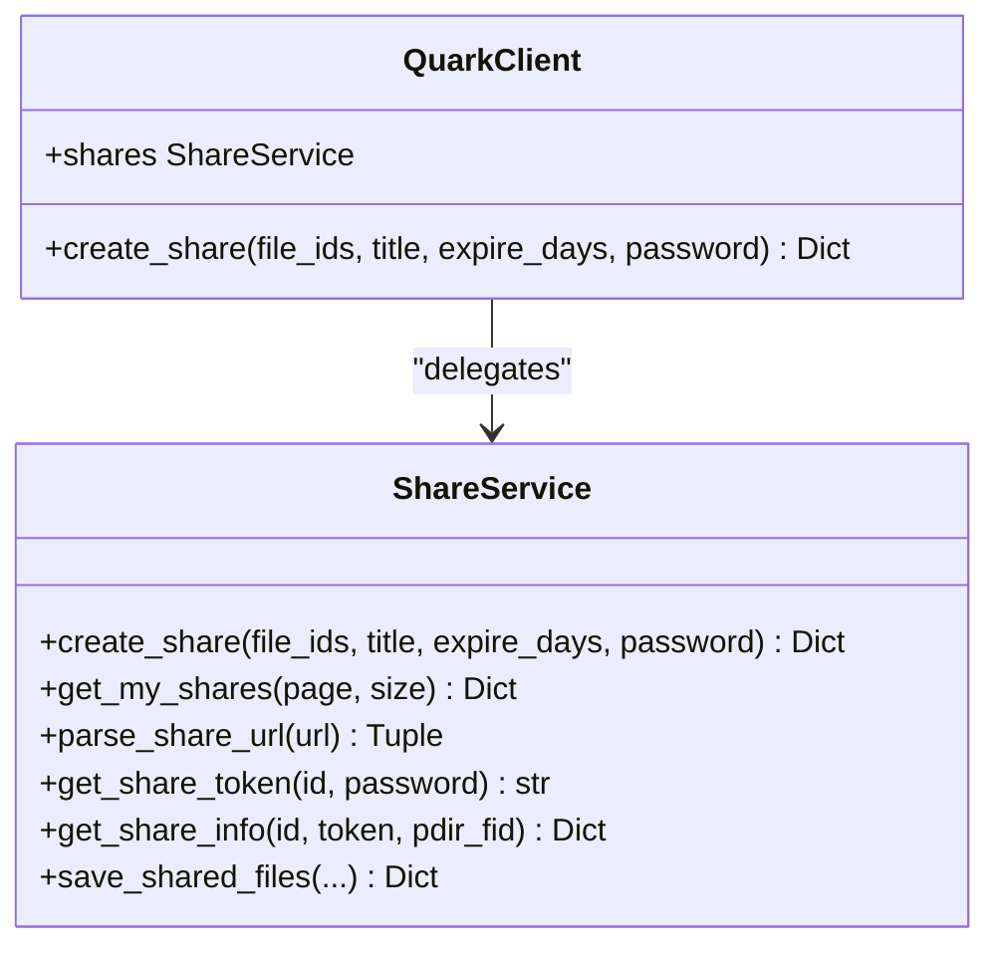
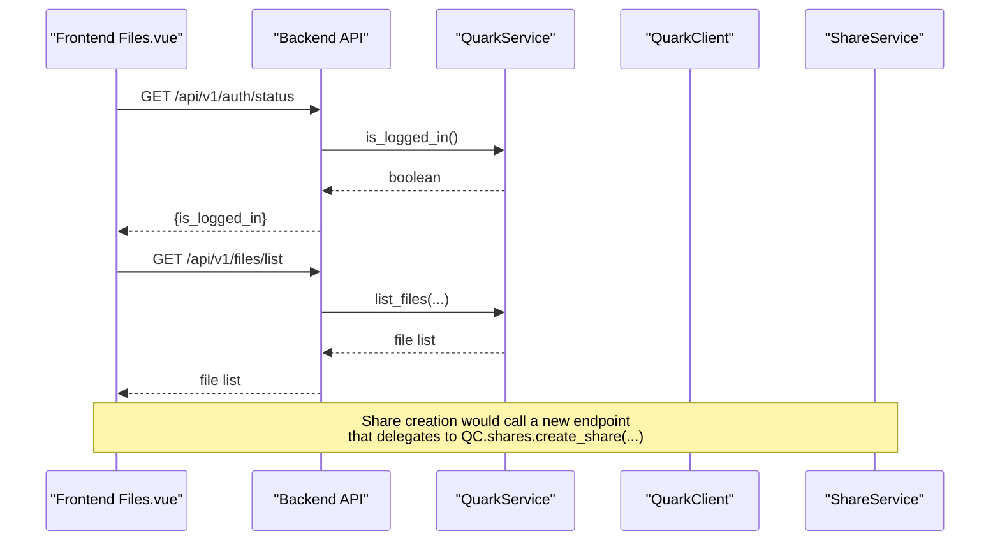

# Share Creation

<cite>
**Referenced Files in This Document**
- [share_service.py](file://quark_client/services/share_service.py)
- [batch_share_commands.py](file://quark_client/cli/commands/batch_share_commands.py)
- [share_commands.py](file://quark_client/cli/commands/share_commands.py)
- [client.py](file://quark_client/client.py)
- [quark.ts](file://frontend/src/api/quark.ts)
- [Files.vue](file://frontend/src/views/Files.vue)
- [quark_service.py](file://backend/app/services/quark_service.py)
- [auth.py](file://backend/app/api/v1/auth.py)
- [files.py](file://backend/app/api/v1/files.py)
- [main.py](file://backend/app/main.py)
- [router.py](file://backend/app/api/v1/router.py)
- [PROJECT_SUMMARY.md](file://PROJECT_SUMMARY.md)
</cite>

## Table of Contents
1. [Introduction](#introduction)
2. [Project Structure](#project-structure)
3. [Core Components](#core-components)
4. [Architecture Overview](#architecture-overview)
5. [Detailed Component Analysis](#detailed-component-analysis)
6. [Dependency Analysis](#dependency-analysis)
7. [Performance Considerations](#performance-considerations)
8. [Troubleshooting Guide](#troubleshooting-guide)
9. [Conclusion](#conclusion)
10. [Appendices](#appendices)

## Introduction
This document explains the share creation functionality within the QuarkManager share management system. It covers the complete workflow for creating share links, including parameter configuration, asynchronous task polling with retry logic and timeout handling, integration with QuarkClient API endpoints, error handling strategies, and the relationship between the frontend interface and backend service implementation. Practical examples demonstrate creating single-file shares, batch file shares, temporary shares with expiration dates, and password-protected shares. It also documents share ID generation, share URL construction, and automatic retrieval of share details after successful creation.

## Project Structure
The share creation feature spans three layers:
- Backend API: exposes endpoints for authentication and file operations (used by the frontend).
- Backend Service: integrates with QuarkClient to perform real operations against the Quark cloud.
- Frontend: provides the user interface for interacting with the backend and invoking share creation.

**Diagram sources**
- [main.py:12-28](file://backend/app/main.py#L12-L28)
- [router.py:1-24](file://backend/app/api/v1/router.py#L1-L24)
- [auth.py:18-52](file://backend/app/api/v1/auth.py#L18-L52)
- [files.py:19-35](file://backend/app/api/v1/files.py#L19-L35)
- [quark_service.py:44-52](file://backend/app/services/quark_service.py#L44-L52)
- [client.py:18-40](file://quark_client/client.py#L18-L40)
- [share_service.py:13-24](file://quark_client/services/share_service.py#L13-L24)

**Section sources**
- [main.py:12-28](file://backend/app/main.py#L12-L28)
- [router.py:1-24](file://backend/app/api/v1/router.py#L1-L24)
- [auth.py:18-52](file://backend/app/api/v1/auth.py#L18-L52)
- [files.py:19-35](file://backend/app/api/v1/files.py#L19-L35)
- [quark_service.py:44-52](file://backend/app/services/quark_service.py#L44-L52)
- [client.py:18-40](file://quark_client/client.py#L18-L40)
- [share_service.py:13-24](file://quark_client/services/share_service.py#L13-L24)

## Core Components
- ShareService: Implements share creation, task polling, and share detail retrieval. Handles parameter mapping, expiration calculation, password protection, and asynchronous task completion verification.
- QuarkClient: Exposes convenience methods for share creation and integrates ShareService.
- CLI Commands: Provide batch and single share creation with duplicate detection and progress reporting.
- Backend Services: Provide authentication and file APIs consumed by the frontend.
- Frontend API: Defines typed interfaces for backend communication.

Key responsibilities:
- Parameter configuration: file_ids, title, expire_days, password.
- Asynchronous task polling: periodic checks until completion or failure.
- Timeout handling: raises errors when tasks exceed retry limits.
- Share detail retrieval: obtains share URL and metadata after task completion.
- Frontend-backend integration: authentication and file listing APIs.

**Section sources**
- [share_service.py:75-152](file://quark_client/services/share_service.py#L75-L152)
- [client.py:294-313](file://quark_client/client.py#L294-L313)
- [share_commands.py:121-241](file://quark_client/cli/commands/share_commands.py#L121-L241)
- [batch_share_commands.py:132-175](file://quark_client/cli/commands/batch_share_commands.py#L132-L175)
- [quark_service.py:161-206](file://backend/app/services/quark_service.py#L161-L206)
- [quark.ts:55-75](file://frontend/src/api/quark.ts#L55-L75)

## Architecture Overview
The share creation workflow connects the frontend, backend, and QuarkClient library:

**Diagram sources**
- [share_service.py:75-171](file://quark_client/services/share_service.py#L75-L171)
- [client.py:294-313](file://quark_client/client.py#L294-L313)
- [quark_service.py:161-206](file://backend/app/services/quark_service.py#L161-L206)
- [files.py:19-35](file://backend/app/api/v1/files.py#L19-L35)

## Detailed Component Analysis

### ShareService.create_share Implementation
The create_share method orchestrates the entire share creation lifecycle:
- Parameter mapping: maps file_ids, title, expire_days, and optional password to the API payload.
- Expiration handling: converts expire_days to a millisecond timestamp when greater than zero.
- Password handling: sets passcode when provided; url_type distinguishes public vs private links.
- Task creation: posts to the share endpoint and extracts task_id.
- Task polling: queries the task endpoint up to a fixed retry count with 1-second intervals.
- Completion verification: checks task status; on completion retrieves share details via share/password.
- Timeout handling: raises an error if retries are exhausted without completion.

**Diagram sources**
- [share_service.py:75-152](file://quark_client/services/share_service.py#L75-L152)

**Section sources**
- [share_service.py:75-152](file://quark_client/services/share_service.py#L75-L152)

### Asynchronous Task Polling Mechanism
The polling loop uses a bounded retry strategy:
- Retries: maximum 10 attempts.
- Interval: 1 second between checks.
- Status interpretation: 2 indicates completion; 3 indicates failure.
- Timeout: raises an error if retries are exhausted.

**Diagram sources**
- [share_service.py:124-151](file://quark_client/services/share_service.py#L124-L151)

**Section sources**
- [share_service.py:124-151](file://quark_client/services/share_service.py#L124-L151)

### Integration with QuarkClient API Endpoints
QuarkClient exposes a create_share method that delegates to ShareService:
- Method signature mirrors ShareService.create_share parameters.
- Delegation ensures consistent behavior across CLI and higher-level integrations.

**Diagram sources**
- [client.py:294-313](file://quark_client/client.py#L294-L313)
- [share_service.py:75-152](file://quark_client/services/share_service.py#L75-L152)

**Section sources**
- [client.py:294-313](file://quark_client/client.py#L294-L313)
- [share_service.py:75-152](file://quark_client/services/share_service.py#L75-L152)

### Frontend Integration and Workflow
The frontend currently consumes authentication and file listing endpoints. While share creation is not yet wired in the frontend, the API surface is defined and ready for integration.

- Authentication endpoints: QR code generation, login, status, and logout.
- File operations: list, search, storage info, and download URL retrieval.
- Share creation: intended to be added as a new endpoint under files or a dedicated route.

**Diagram sources**
- [auth.py:78-95](file://backend/app/api/v1/auth.py#L78-L95)
- [files.py:19-35](file://backend/app/api/v1/files.py#L19-L35)
- [quark_service.py:199-206](file://backend/app/services/quark_service.py#L199-L206)
- [quark.ts:55-75](file://frontend/src/api/quark.ts#L55-L75)

**Section sources**
- [auth.py:78-95](file://backend/app/api/v1/auth.py#L78-L95)
- [files.py:19-35](file://backend/app/api/v1/files.py#L19-L35)
- [quark_service.py:199-206](file://backend/app/services/quark_service.py#L199-L206)
- [quark.ts:55-75](file://frontend/src/api/quark.ts#L55-L75)

### Practical Examples

#### Single File Share
- Parameters: file_ids = [single_fid], title = "Presentation", expire_days = 0, password = None.
- Behavior: Creates a permanent public share; polling completes immediately; returns share details including share_url.

**Section sources**
- [share_service.py:75-152](file://quark_client/services/share_service.py#L75-L152)

#### Batch File Shares
- CLI usage: quarkpan shares creates individual shares for each file with duplicate detection.
- Smart batching: reuse existing shares when available; otherwise create new ones; report statistics.

**Section sources**
- [share_commands.py:121-241](file://quark_client/cli/commands/share_commands.py#L121-L241)
- [share_service.py:622-741](file://quark_client/services/share_service.py#L622-L741)

#### Temporary Share with Expiration
- Parameters: expire_days > 0; internally converted to expired_at timestamp.
- Behavior: share expires after the specified number of days; task polling proceeds normally.

**Section sources**
- [share_service.py:104-108](file://quark_client/services/share_service.py#L104-L108)
- [share_service.py:124-151](file://quark_client/services/share_service.py#L124-L151)

#### Password-Protected Share
- Parameters: password provided; url_type set to private; passcode included in payload.
- Behavior: requires password for access; share details retrieved via share/password endpoint.

**Section sources**
- [share_service.py:97-113](file://quark_client/services/share_service.py#L97-L113)
- [share_service.py:154-171](file://quark_client/services/share_service.py#L154-L171)

### Share ID Generation and URL Construction
- Task completion yields share_id; subsequent call to share/password returns share_url and related metadata.
- The share URL is constructed server-side and returned as part of the share details.

**Section sources**
- [share_service.py:141-145](file://quark_client/services/share_service.py#L141-L145)
- [share_service.py:154-171](file://quark_client/services/share_service.py#L154-L171)

### Automatic Retrieval of Share Details
After task completion, the system calls share/password to fetch:
- share_url: the public share link.
- title, share_id, and other metadata for display and management.

**Section sources**
- [share_service.py:144-171](file://quark_client/services/share_service.py#L144-L171)

## Dependency Analysis
The share creation pipeline depends on:
- QuarkClient initialization and authentication.
- ShareService for orchestration and API interactions.
- Backend service layer for bridging to the client.
- Frontend API module for typed requests.

**Diagram sources**
- [quark.ts:55-75](file://frontend/src/api/quark.ts#L55-L75)
- [auth.py:18-52](file://backend/app/api/v1/auth.py#L18-L52)
- [files.py:19-35](file://backend/app/api/v1/files.py#L19-L35)
- [quark_service.py:44-52](file://backend/app/services/quark_service.py#L44-L52)
- [client.py:18-40](file://quark_client/client.py#L18-L40)
- [share_service.py:13-24](file://quark_client/services/share_service.py#L13-L24)

**Section sources**
- [quark.ts:55-75](file://frontend/src/api/quark.ts#L55-L75)
- [auth.py:18-52](file://backend/app/api/v1/auth.py#L18-L52)
- [files.py:19-35](file://backend/app/api/v1/files.py#L19-L35)
- [quark_service.py:44-52](file://backend/app/services/quark_service.py#L44-L52)
- [client.py:18-40](file://quark_client/client.py#L18-L40)
- [share_service.py:13-24](file://quark_client/services/share_service.py#L13-L24)

## Performance Considerations
- Polling interval: 1 second is conservative; adjust based on expected task duration.
- Retry cap: 10 retries balance responsiveness with reliability; tune for production latency.
- Network overhead: minimize unnecessary polling by verifying task_id presence before loop.
- Concurrency: avoid concurrent creation of the same file to prevent duplicate shares; use duplicate detection.

## Troubleshooting Guide
Common issues and resolutions:
- APIError during task polling: indicates upstream failure; inspect task status and messages.
- Timeout during polling: increase retry count or investigate backend task processing delays.
- Invalid share URL parsing: ensure the URL matches supported formats; use parse_share_url for extraction.
- Capacity or permission errors during save operations: handle capacity limit and forbidden errors distinctly.

**Section sources**
- [share_service.py:146-147](file://quark_client/services/share_service.py#L146-L147)
- [share_service.py:428-444](file://quark_client/services/share_service.py#L428-L444)

## Conclusion
The share creation system provides a robust, asynchronous workflow for generating Quark share links with support for expiration and password protection. The design cleanly separates concerns between the frontend, backend, and QuarkClient library, enabling future expansion to include a dedicated share creation endpoint and frontend UI controls.

## Appendices

### API Definitions (Planned)
- Endpoint: POST /api/v1/files/share
  - Request body: { file_ids: string[], title?: string, expire_days?: number, password?: string }
  - Response: { success: boolean, data?: ShareDetails, message?: string }
- Notes: Integrate with QuarkService.create_share and QuarkClient.shares.create_share.

[No sources needed since this section defines planned API behavior]

### CLI Usage References
- Single share creation with duplicates and progress reporting.
- Batch share creation for directories with CSV export.

**Section sources**
- [share_commands.py:121-241](file://quark_client/cli/commands/share_commands.py#L121-L241)
- [batch_share_commands.py:132-175](file://quark_client/cli/commands/batch_share_commands.py#L132-L175)