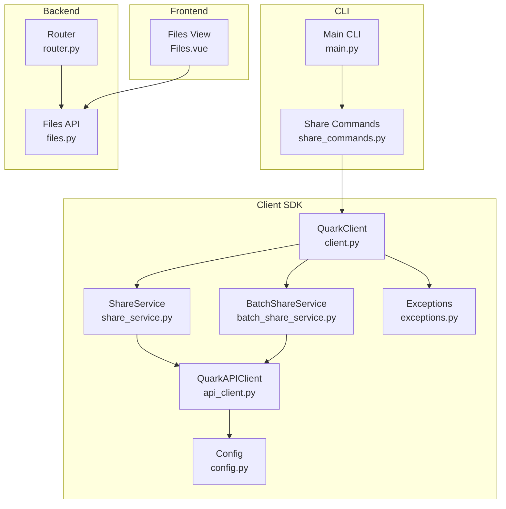
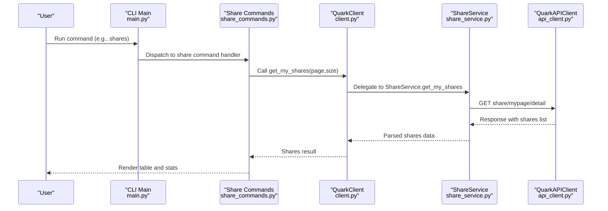
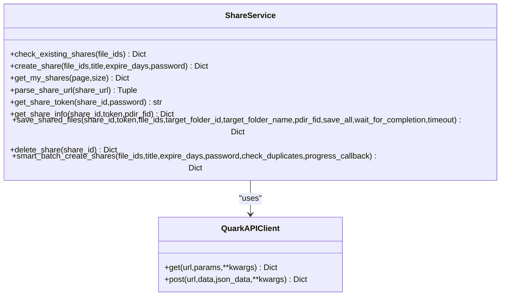
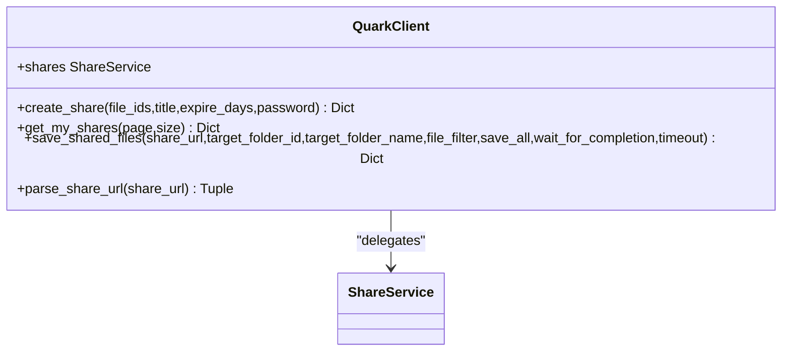
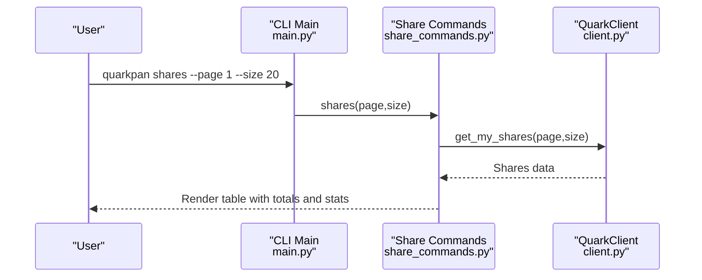
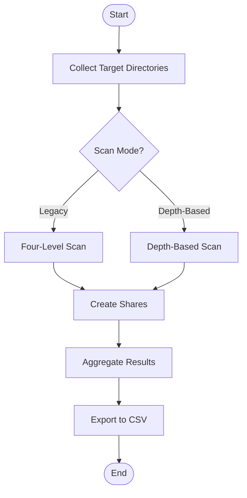
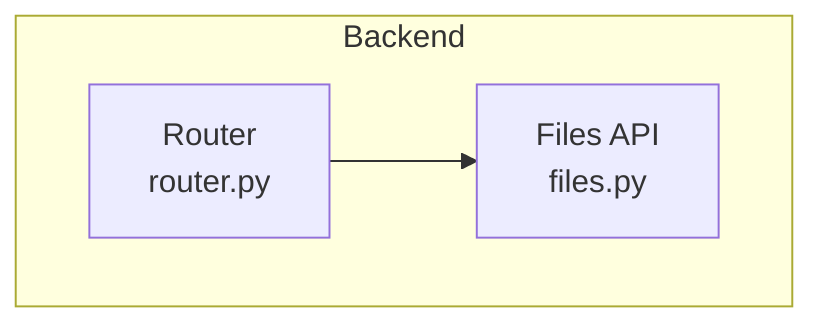
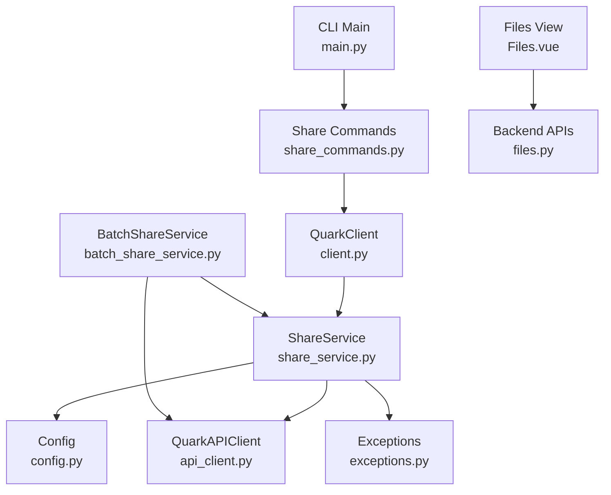

# Share Management Operations

<cite>
**Referenced Files in This Document**
- [share_service.py](file://quark_client/services/share_service.py)
- [share_commands.py](file://quark_client/cli/commands/share_commands.py)
- [batch_share_service.py](file://quark_client/services/batch_share_service.py)
- [client.py](file://quark_client/client.py)
- [api_client.py](file://quark_client/core/api_client.py)
- [config.py](file://quark_client/config.py)
- [exceptions.py](file://quark_client/exceptions.py)
- [main.py](file://quark_client/cli/main.py)
- [files.py](file://backend/app/api/v1/files.py)
- [router.py](file://backend/app/api/v1/router.py)
- [Files.vue](file://frontend/src/views/Files.vue)
</cite>

## Table of Contents
1. [Introduction](#introduction)
2. [Project Structure](#project-structure)
3. [Core Components](#core-components)
4. [Architecture Overview](#architecture-overview)
5. [Detailed Component Analysis](#detailed-component-analysis)
6. [Dependency Analysis](#dependency-analysis)
7. [Performance Considerations](#performance-considerations)
8. [Troubleshooting Guide](#troubleshooting-guide)
9. [Conclusion](#conclusion)

## Introduction
This document provides comprehensive coverage of share management operations within the QuarkManager system. It focuses on the lifecycle of share links, including listing shares, retrieving share details, creating and deleting shares, parsing share URLs, obtaining share tokens, and saving shared files. It also documents share metadata (IDs, URLs, timestamps, expiration, file counts), status monitoring, expiration handling, and integration with the my shares page functionality. Practical examples demonstrate listing active shares, managing share lifecycles, deleting unwanted shares, and monitoring usage statistics. Finally, it explains how share management integrates with the broader QuarkClient service architecture, including error handling and backend service integration.

## Project Structure
The share management functionality spans three primary areas:
- Client-side Python SDK: Services and CLI commands for share operations
- Backend API: FastAPI routes for file management and related services
- Frontend: Vue.js components for user interaction (placeholder for share actions)

Key locations:
- Share service implementation: quark_client/services/share_service.py
- CLI share commands: quark_client/cli/commands/share_commands.py
- Batch share service: quark_client/services/batch_share_service.py
- Client wrapper: quark_client/client.py
- HTTP client and configuration: quark_client/core/api_client.py, quark_client/config.py
- Exceptions: quark_client/exceptions.py
- CLI entrypoint: quark_client/cli/main.py
- Backend file APIs: backend/app/api/v1/files.py, backend/app/api/v1/router.py
- Frontend files view: frontend/src/views/Files.vue

**Diagram sources**
- [client.py:18-405](file://quark_client/client.py#L18-L405)
- [share_service.py:13-742](file://quark_client/services/share_service.py#L13-L742)
- [batch_share_service.py:16-572](file://quark_client/services/batch_share_service.py#L16-L572)
- [api_client.py:16-209](file://quark_client/core/api_client.py#L16-L209)
- [config.py:34-63](file://quark_client/config.py#L34-L63)
- [exceptions.py:8-50](file://quark_client/exceptions.py#L8-L50)
- [main.py:37-609](file://quark_client/cli/main.py#L37-L609)
- [share_commands.py:16-537](file://quark_client/cli/commands/share_commands.py#L16-L537)
- [router.py:1-24](file://backend/app/api/v1/router.py#L1-L24)
- [files.py:1-150](file://backend/app/api/v1/files.py#L1-L150)
- [Files.vue:1-264](file://frontend/src/views/Files.vue#L1-L264)

**Section sources**
- [client.py:18-405](file://quark_client/client.py#L18-L405)
- [share_service.py:13-742](file://quark_client/services/share_service.py#L13-L742)
- [batch_share_service.py:16-572](file://quark_client/services/batch_share_service.py#L16-L572)
- [api_client.py:16-209](file://quark_client/core/api_client.py#L16-L209)
- [config.py:34-63](file://quark_client/config.py#L34-L63)
- [exceptions.py:8-50](file://quark_client/exceptions.py#L8-L50)
- [main.py:37-609](file://quark_client/cli/main.py#L37-L609)
- [share_commands.py:16-537](file://quark_client/cli/commands/share_commands.py#L16-L537)
- [router.py:1-24](file://backend/app/api/v1/router.py#L1-L24)
- [files.py:1-150](file://backend/app/api/v1/files.py#L1-L150)
- [Files.vue:1-264](file://frontend/src/views/Files.vue#L1-L264)

## Core Components
This section outlines the core components involved in share management and their responsibilities.

- ShareService: Implements share lifecycle operations, including creating shares, checking existing shares, retrieving share details, parsing share URLs, obtaining share tokens, fetching share info, saving shared files, and deleting shares. It orchestrates API calls via QuarkAPIClient and handles task polling and error propagation.
- QuarkClient: Provides a high-level facade exposing share operations (create_share, get_my_shares, save_shared_files, parse_share_url) and delegates to ShareService.
- QuarkAPIClient: Encapsulates HTTP communication, request building, authentication headers, and error handling for API calls.
- Config: Centralizes configuration constants such as base URLs, default parameters, timeouts, and pagination limits.
- Exceptions: Defines specialized exceptions for API errors, authentication failures, network issues, and share link parsing errors.
- CLI Share Commands: Implements user-facing commands for listing shares, creating shares, saving shares, and batch operations, integrating with QuarkClient and displaying formatted results.
- BatchShareService: Supports scanning directories and creating shares in bulk, exporting results to CSV, and coordinating with ShareService.
- Backend Router and Files API: Expose endpoints for file listing, storage info, and related operations that complement share management workflows.
- Frontend Files View: Contains UI hooks for sharing actions (placeholder) and integrates with backend APIs.

**Section sources**
- [share_service.py:13-742](file://quark_client/services/share_service.py#L13-L742)
- [client.py:18-405](file://quark_client/client.py#L18-L405)
- [api_client.py:16-209](file://quark_client/core/api_client.py#L16-L209)
- [config.py:34-63](file://quark_client/config.py#L34-L63)
- [exceptions.py:8-50](file://quark_client/exceptions.py#L8-L50)
- [share_commands.py:16-537](file://quark_client/cli/commands/share_commands.py#L16-L537)
- [batch_share_service.py:16-572](file://quark_client/services/batch_share_service.py#L16-L572)
- [router.py:1-24](file://backend/app/api/v1/router.py#L1-L24)
- [files.py:1-150](file://backend/app/api/v1/files.py#L1-L150)
- [Files.vue:178-180](file://frontend/src/views/Files.vue#L178-L180)

## Architecture Overview
The share management architecture follows a layered design:
- CLI layer: Provides user commands for share operations.
- Client SDK layer: Exposes QuarkClient and ShareService for programmatic access.
- HTTP client layer: Handles requests/responses, authentication, and error mapping.
- Backend API layer: Serves file management endpoints and related services.
- Frontend layer: Presents UI components and interacts with backend APIs.

**Diagram sources**
- [main.py:176-182](file://quark_client/cli/main.py#L176-L182)
- [share_commands.py:244-340](file://quark_client/cli/commands/share_commands.py#L244-L340)
- [client.py:356-367](file://quark_client/client.py#L356-L367)
- [share_service.py:173-194](file://quark_client/services/share_service.py#L173-L194)
- [api_client.py:184-190](file://quark_client/core/api_client.py#L184-L190)

**Section sources**
- [main.py:176-182](file://quark_client/cli/main.py#L176-L182)
- [share_commands.py:244-340](file://quark_client/cli/commands/share_commands.py#L244-L340)
- [client.py:356-367](file://quark_client/client.py#L356-L367)
- [share_service.py:173-194](file://quark_client/services/share_service.py#L173-L194)
- [api_client.py:184-190](file://quark_client/core/api_client.py#L184-L190)

## Detailed Component Analysis

### ShareService: Lifecycle and Metadata Management
ShareService encapsulates the complete lifecycle of share links and metadata handling:
- Creating shares: Initiates a share creation task and polls for completion, returning the final share details.
- Checking existing shares: Scans current shares to avoid duplicates by matching file IDs and filtering by status.
- Retrieving share details: Fetches complete share information including share URL, title, creation/expiry timestamps, and file count.
- Parsing share URLs: Extracts share IDs and optional passwords from various supported formats.
- Obtaining share tokens: Requests a session token for accessing share pages.
- Getting share info: Retrieves share content and metadata for rendering and saving.
- Saving shared files: Transfers files from a share into the user's cloud storage, optionally waiting for task completion.
- Deleting shares: Removes a share by ID.

Share metadata managed by ShareService includes:
- Share identifiers: share_id, pwd_id
- Share URLs: share_url
- Creation timestamps: created_at (milliseconds)
- Expiration timestamps: expired_at (milliseconds)
- File counts: file_num
- Status indicators: status (1 for active)
- First file metadata: first_file (including whether it is a directory)

**Diagram sources**
- [share_service.py:13-742](file://quark_client/services/share_service.py#L13-L742)
- [api_client.py:16-209](file://quark_client/core/api_client.py#L16-L209)

**Section sources**
- [share_service.py:25-742](file://quark_client/services/share_service.py#L25-L742)

### QuarkClient: High-Level Facade
QuarkClient exposes convenience methods for share operations and delegates to ShareService:
- create_share, get_my_shares, save_shared_files, parse_share_url
These methods provide a simplified interface for consumers while leveraging ShareService’s robust implementation.

**Diagram sources**
- [client.py:294-367](file://quark_client/client.py#L294-L367)

**Section sources**
- [client.py:294-367](file://quark_client/client.py#L294-L367)

### CLI Share Commands: Listing, Managing, and Monitoring Shares
The CLI layer provides user-friendly commands for share management:
- Listing shares: Displays paginated share lists with titles, URLs, types, file counts, creation times, statuses, and click counts.
- Creating shares: Supports title, expiry days, password, and duplicate checks.
- Saving shares: Downloads and transfers files from a share into a target folder.
- Batch operations: Processes multiple shares with progress reporting and CSV export.

**Diagram sources**
- [main.py:176-182](file://quark_client/cli/main.py#L176-L182)
- [share_commands.py:244-340](file://quark_client/cli/commands/share_commands.py#L244-L340)
- [client.py:356-367](file://quark_client/client.py#L356-L367)

**Section sources**
- [share_commands.py:244-340](file://quark_client/cli/commands/share_commands.py#L244-L340)
- [main.py:176-182](file://quark_client/cli/main.py#L176-L182)

### BatchShareService: Directory Scanning and Bulk Share Creation
BatchShareService supports scanning directories and creating shares in bulk:
- Collecting target directories: Supports legacy four-level scanning and flexible depth-based collection with exclusion patterns.
- Creating shares: Iterates over collected directories, invoking ShareService.create_share and aggregating results.
- Exporting results: Writes share results to CSV with share title, URL, full path, and creation time.

**Diagram sources**
- [batch_share_service.py:31-572](file://quark_client/services/batch_share_service.py#L31-L572)

**Section sources**
- [batch_share_service.py:31-572](file://quark_client/services/batch_share_service.py#L31-L572)

### Backend Integration and Web Interface Functionality
Backend APIs support file management operations that complement share workflows:
- File listing, storage info, search, and download endpoints enable the broader file management ecosystem.
- The backend router aggregates authentication and file management routes, forming the foundation for web interface integration.

**Diagram sources**
- [router.py:1-24](file://backend/app/api/v1/router.py#L1-L24)
- [files.py:1-150](file://backend/app/api/v1/files.py#L1-L150)

**Section sources**
- [router.py:1-24](file://backend/app/api/v1/router.py#L1-L24)
- [files.py:1-150](file://backend/app/api/v1/files.py#L1-L150)

## Dependency Analysis
The following diagram illustrates key dependencies among share-related components:

**Diagram sources**
- [share_service.py:13-742](file://quark_client/services/share_service.py#L13-L742)
- [api_client.py:16-209](file://quark_client/core/api_client.py#L16-L209)
- [config.py:34-63](file://quark_client/config.py#L34-L63)
- [exceptions.py:8-50](file://quark_client/exceptions.py#L8-L50)
- [client.py:18-405](file://quark_client/client.py#L18-L405)
- [main.py:37-609](file://quark_client/cli/main.py#L37-L609)
- [share_commands.py:16-537](file://quark_client/cli/commands/share_commands.py#L16-L537)
- [batch_share_service.py:16-572](file://quark_client/services/batch_share_service.py#L16-L572)
- [Files.vue:1-264](file://frontend/src/views/Files.vue#L1-L264)
- [files.py:1-150](file://backend/app/api/v1/files.py#L1-L150)

**Section sources**
- [share_service.py:13-742](file://quark_client/services/share_service.py#L13-L742)
- [client.py:18-405](file://quark_client/client.py#L18-L405)
- [share_commands.py:16-537](file://quark_client/cli/commands/share_commands.py#L16-L537)
- [batch_share_service.py:16-572](file://quark_client/services/batch_share_service.py#L16-L572)
- [api_client.py:16-209](file://quark_client/core/api_client.py#L16-L209)
- [config.py:34-63](file://quark_client/config.py#L34-L63)
- [exceptions.py:8-50](file://quark_client/exceptions.py#L8-L50)
- [main.py:37-609](file://quark_client/cli/main.py#L37-L609)
- [Files.vue:1-264](file://frontend/src/views/Files.vue#L1-L264)
- [files.py:1-150](file://backend/app/api/v1/files.py#L1-L150)

## Performance Considerations
- Pagination and ordering: Share listing uses descending order by creation time and fetches total counts, enabling efficient browsing and accurate pagination.
- Task polling: Share creation and save operations poll task status with bounded retries and fixed intervals, balancing responsiveness with server load.
- Timeout handling: Save operations include configurable timeouts and explicit error detection for capacity and permission issues.
- Batch operations: Smart batch creation avoids duplicate shares and provides progress callbacks for large-scale workflows.

[No sources needed since this section provides general guidance]

## Troubleshooting Guide
Common issues and resolutions:
- Authentication failures: API calls may return 401/403; ensure valid cookies and re-login if necessary.
- API errors: Responses with non-zero codes trigger APIError; inspect messages for actionable details.
- Network errors: Timeouts and request failures raise NetworkError; retry after verifying connectivity.
- Share link parsing: Invalid or unsupported formats raise ShareLinkError; verify URL structure and password presence.
- Capacity and permissions: Save task monitoring detects capacity limits and forbidden actions, raising descriptive errors immediately.

**Section sources**
- [api_client.py:146-182](file://quark_client/core/api_client.py#L146-L182)
- [exceptions.py:23-50](file://quark_client/exceptions.py#L23-L50)
- [share_service.py:377-453](file://quark_client/services/share_service.py#L377-L453)

## Conclusion
The QuarkManager share management system provides a robust, layered architecture for creating, listing, retrieving, and deleting share links. ShareService centralizes lifecycle operations and metadata handling, while QuarkClient offers a convenient facade. The CLI layer enables practical workflows for individual and batch share management, and the backend APIs support broader file management operations. Error handling is comprehensive, covering authentication, network, and API-specific scenarios. Together, these components deliver a cohesive solution for share lifecycle management integrated with the broader QuarkClient service architecture.