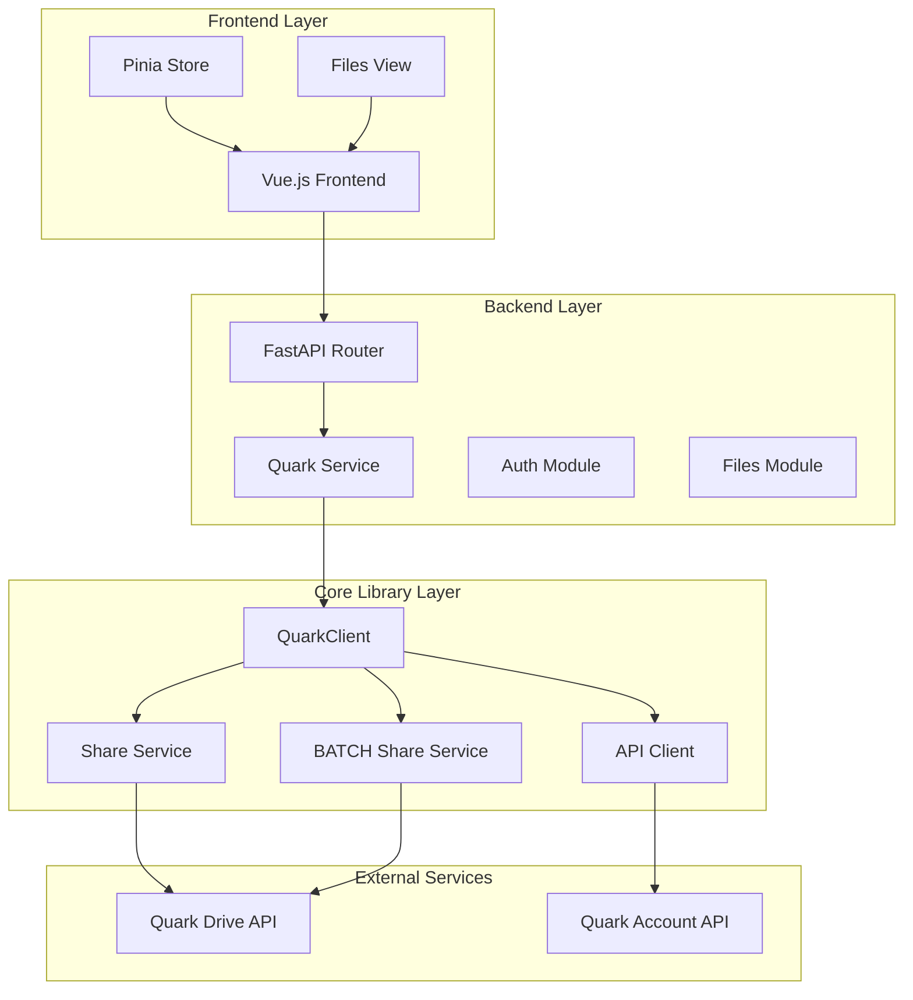
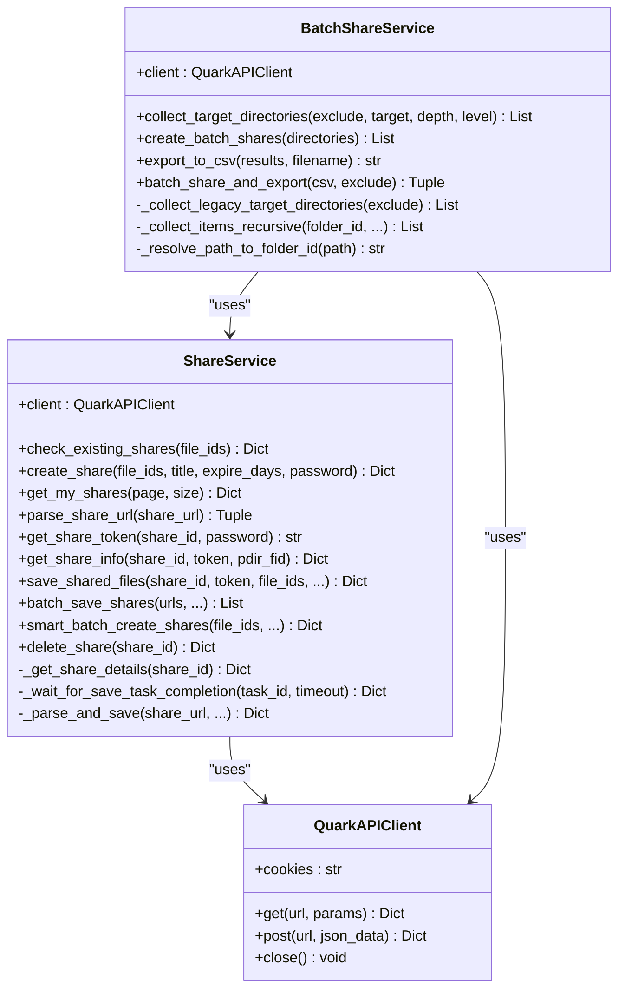
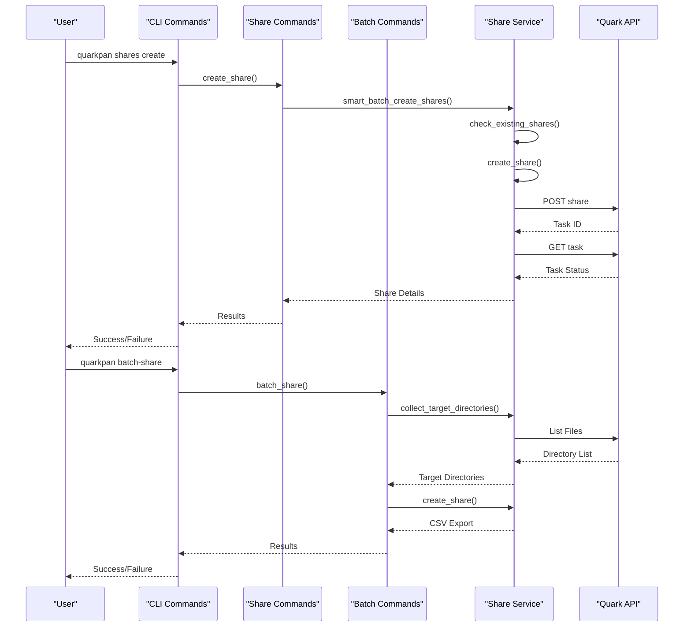
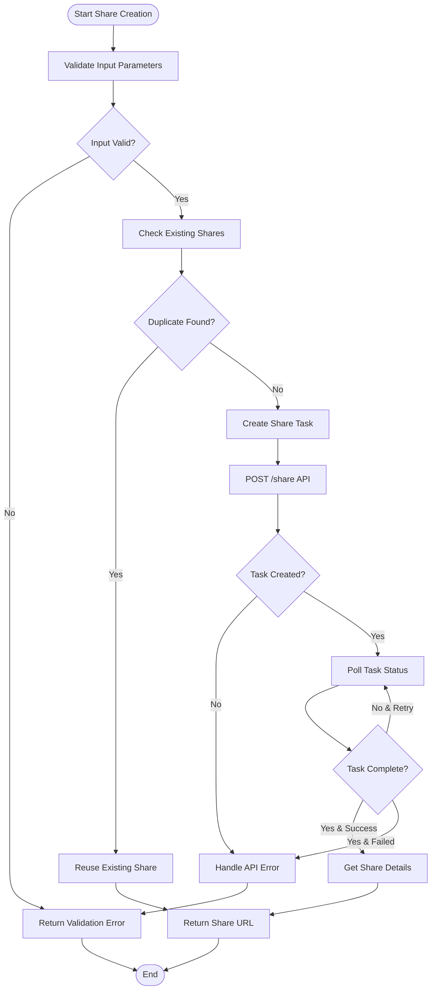
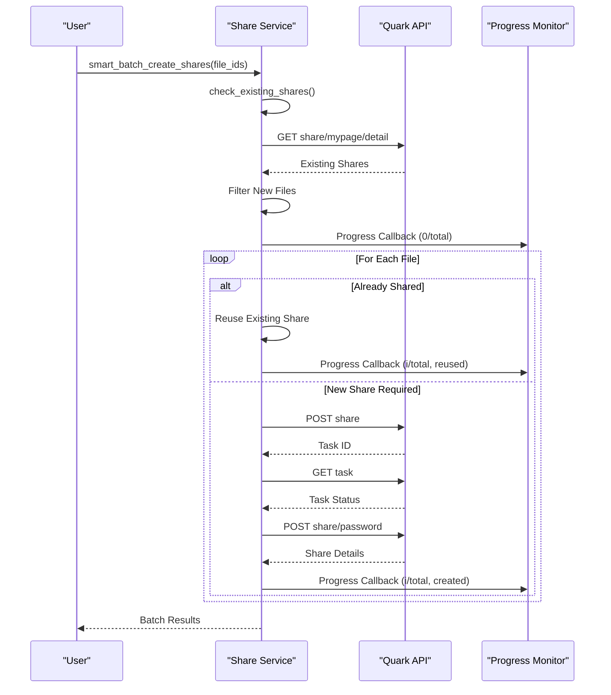
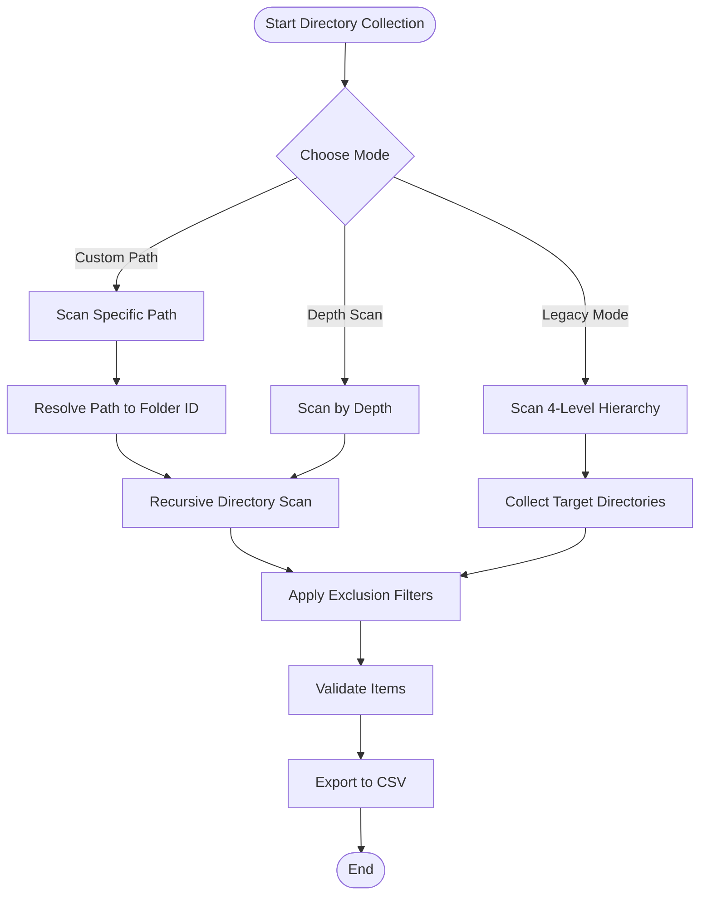
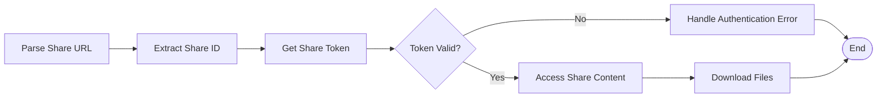
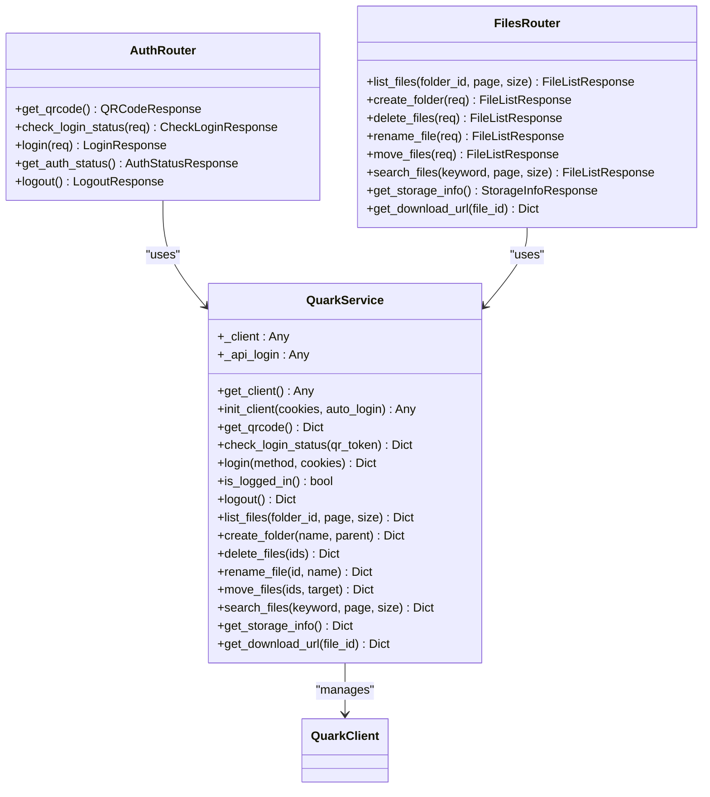
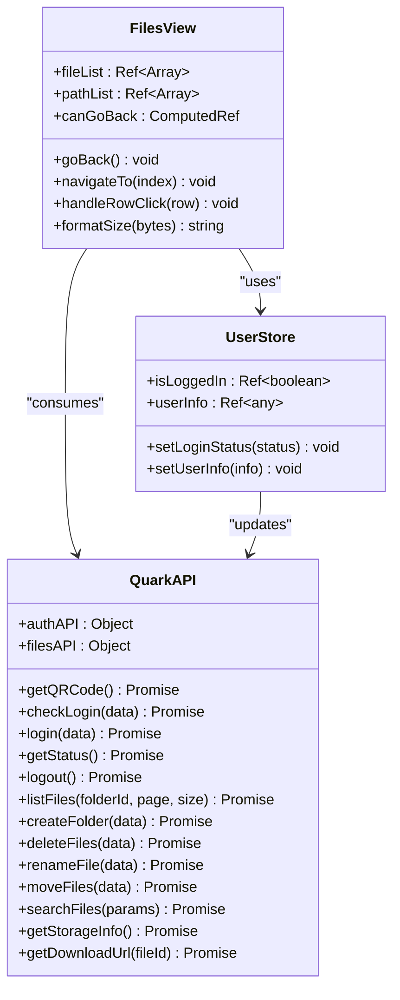
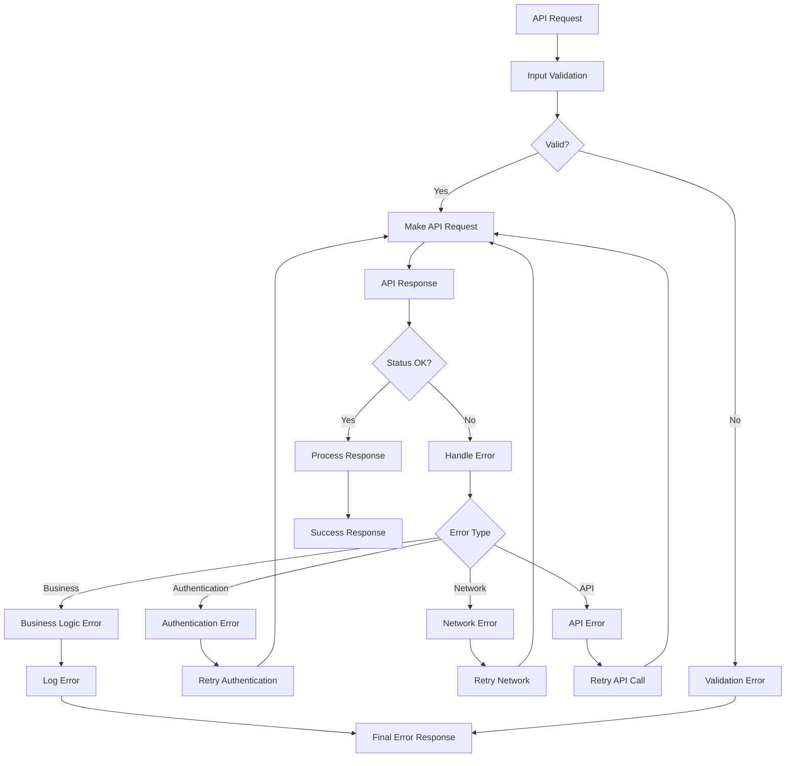

# Share Management System

<cite>
**Referenced Files in This Document**
- [share_service.py](file://quark_client/services/share_service.py)
- [batch_share_service.py](file://quark_client/services/batch_share_service.py)
- [share_commands.py](file://quark_client/cli/commands/share_commands.py)
- [batch_share_commands.py](file://quark_client/cli/commands/batch_share_commands.py)
- [client.py](file://quark_client/client.py)
- [api_client.py](file://quark_client/core/api_client.py)
- [config.py](file://quark_client/config.py)
- [quark_service.py](file://backend/app/services/quark_service.py)
- [auth.py](file://backend/app/api/v1/auth.py)
- [files.py](file://backend/app/api/v1/files.py)
- [router.py](file://backend/app/api/v1/router.py)
- [quark.ts](file://frontend/src/api/quark.ts)
- [Files.vue](file://frontend/src/views/Files.vue)
- [index.ts](file://frontend/src/stores/index.ts)
- [PROJECT_SUMMARY.md](file://PROJECT_SUMMARY.md)
</cite>

## Table of Contents
1. [Introduction](#introduction)
2. [System Architecture](#system-architecture)
3. [Core Components](#core-components)
4. [Share Creation Workflow](#share-creation-workflow)
5. [Batch Share Processing](#batch-share-processing)
6. [Link Generation and Management](#link-generation-and-management)
7. [Backend Integration](#backend-integration)
8. [Frontend Interface](#frontend-interface)
9. [Error Handling and Monitoring](#error-handling-and-monitoring)
10. [Security and Best Practices](#security-and-best-practices)
11. [Performance Considerations](#performance-considerations)
12. [Troubleshooting Guide](#troubleshooting-guide)
13. [Conclusion](#conclusion)

## Introduction

The Share Management System in QuarkManager provides comprehensive functionality for creating, managing, and processing share links within the Quark Cloud Drive ecosystem. This system enables users to generate shareable links for individual files or entire directories, manage sharing permissions, track share statistics, and efficiently transfer shared content to personal storage.

The system consists of three primary layers: the QuarkClient core library handling direct API interactions, the backend FastAPI service providing authentication and proxy functionality, and the frontend Vue.js interface offering user interaction capabilities. Together, these components create a robust share management solution that supports both individual and batch operations.

## System Architecture

The Share Management System follows a layered architecture with clear separation of concerns:

**Diagram sources**
- [client.py:18-40](file://quark_client/client.py#L18-40)
- [quark_service.py:22-45](file://backend/app/services/quark_service.py#L22-45)
- [router.py:1-24](file://backend/app/api/v1/router.py#L1-24)

The architecture ensures scalability, maintainability, and clear separation between presentation, business logic, and data access layers.

## Core Components

### QuarkClient Share Service

The Share Service is the central component responsible for all share-related operations:

**Diagram sources**
- [share_service.py:13-742](file://quark_client/services/share_service.py#L13-742)
- [batch_share_service.py:16-572](file://quark_client/services/batch_share_service.py#L16-572)
- [api_client.py:16-209](file://quark_client/core/api_client.py#L16-209)

**Section sources**
- [share_service.py:13-742](file://quark_client/services/share_service.py#L13-742)
- [batch_share_service.py:16-572](file://quark_client/services/batch_share_service.py#L16-572)

### CLI Command Integration

The system provides comprehensive command-line interface support for advanced users:

**Diagram sources**
- [share_commands.py:121-242](file://quark_client/cli/commands/share_commands.py#L121-242)
- [batch_share_commands.py:15-221](file://quark_client/cli/commands/batch_share_commands.py#L15-221)
- [share_service.py:622-742](file://quark_client/services/share_service.py#L622-742)

**Section sources**
- [share_commands.py:121-242](file://quark_client/cli/commands/share_commands.py#L121-242)
- [batch_share_commands.py:15-221](file://quark_client/cli/commands/batch_share_commands.py#L15-221)

## Share Creation Workflow

The share creation process involves multiple steps with robust error handling and validation:

**Diagram sources**
- [share_service.py:75-152](file://quark_client/services/share_service.py#L75-152)
- [share_service.py:622-742](file://quark_client/services/share_service.py#L622-742)

The workflow includes intelligent duplicate detection, automatic retry mechanisms, and comprehensive error handling to ensure reliable share creation.

**Section sources**
- [share_service.py:75-152](file://quark_client/services/share_service.py#L75-152)
- [share_service.py:25-74](file://quark_client/services/share_service.py#L25-74)

## Batch Share Processing

The system provides sophisticated batch processing capabilities for efficient share management:

### Smart Batch Creation

**Diagram sources**
- [share_service.py:622-742](file://quark_client/services/share_service.py#L622-742)
- [share_service.py:25-74](file://quark_client/services/share_service.py#L25-74)

### Batch Directory Collection

The system can automatically discover and process target directories:

**Diagram sources**
- [batch_share_service.py:31-63](file://quark_client/services/batch_share_service.py#L31-63)
- [batch_share_service.py:170-344](file://quark_client/services/batch_share_service.py#L170-344)

**Section sources**
- [batch_share_service.py:31-63](file://quark_client/services/batch_share_service.py#L31-63)
- [batch_share_service.py:170-344](file://quark_client/services/batch_share_service.py#L170-344)

## Link Generation and Management

### Share URL Parsing and Validation

The system provides robust URL parsing capabilities:

| Feature | Implementation | Supported Formats |
|---------|---------------|-------------------|
| Standard Links | Regex pattern matching | `https://pan.quark.cn/s/{share_id}` |
| Password Links | Multi-pattern extraction | `https://pan.quark.cn/s/{share_id}?pwd={password}` |
| Alternative Formats | Custom protocol support | `quark://share/{share_id}` |
| Password Extraction | Text pattern matching | `密码: {code}`, `提取码: {code}` |

### Token-Based Access Control

**Diagram sources**
- [share_service.py:196-278](file://quark_client/services/share_service.py#L196-278)

**Section sources**
- [share_service.py:196-278](file://quark_client/services/share_service.py#L196-278)
- [share_service.py:280-375](file://quark_client/services/share_service.py#L280-375)

## Backend Integration

### FastAPI Service Layer

The backend provides authentication and proxy functionality:

**Diagram sources**
- [quark_service.py:22-345](file://backend/app/services/quark_service.py#L22-345)
- [auth.py:15-107](file://backend/app/api/v1/auth.py#L15-107)
- [files.py:16-150](file://backend/app/api/v1/files.py#L16-150)

**Section sources**
- [quark_service.py:22-345](file://backend/app/services/quark_service.py#L22-345)
- [auth.py:15-107](file://backend/app/api/v1/auth.py#L15-107)
- [files.py:16-150](file://backend/app/api/v1/files.py#L16-150)

### API Endpoint Mappings

| Endpoint | Method | Description | Authentication |
|----------|--------|-------------|----------------|
| `/auth/qrcode` | GET | Generate login QR code | None |
| `/auth/check-login` | POST | Check login status | None |
| `/auth/login` | POST | Authenticate user | None |
| `/auth/status` | GET | Get current login status | JWT Required |
| `/auth/logout` | POST | Logout user | JWT Required |
| `/files/list` | GET | List files in folder | JWT Required |
| `/files/folder` | POST | Create new folder | JWT Required |
| `/files/delete` | DELETE | Delete files | JWT Required |
| `/files/rename` | PUT | Rename file | JWT Required |
| `/files/move` | POST | Move files | JWT Required |
| `/files/search` | GET | Search files | JWT Required |
| `/files/storage` | GET | Get storage information | JWT Required |
| `/files/download/{file_id}` | GET | Get download URL | JWT Required |

**Section sources**
- [router.py:1-24](file://backend/app/api/v1/router.py#L1-24)
- [auth.py:18-106](file://backend/app/api/v1/auth.py#L18-106)
- [files.py:19-150](file://backend/app/api/v1/files.py#L19-150)

## Frontend Interface

### Vue.js Implementation

The frontend provides an intuitive interface for share management:

**Diagram sources**
- [Files.vue:55-148](file://frontend/src/views/Files.vue#L55-148)
- [index.ts:1-23](file://frontend/src/stores/index.ts#L1-23)
- [quark.ts:55-124](file://frontend/src/api/quark.ts#L55-124)

**Section sources**
- [Files.vue:55-148](file://frontend/src/views/Files.vue#L55-148)
- [index.ts:1-23](file://frontend/src/stores/index.ts#L1-23)
- [quark.ts:55-124](file://frontend/src/api/quark.ts#L55-124)

## Error Handling and Monitoring

### Comprehensive Error Management

The system implements multi-layered error handling:

**Diagram sources**
- [api_client.py:80-183](file://quark_client/core/api_client.py#L80-183)
- [share_service.py:377-453](file://quark_client/services/share_service.py#L377-453)

### Progress Tracking and Monitoring

The system provides comprehensive progress tracking for long-running operations:

| Operation Type | Progress Callback Parameters | Progress Indicators |
|----------------|------------------------------|-------------------|
| Single Share Creation | `(current, total, file_id, result)` | Percentage, Status Icons |
| Batch Share Creation | `(current, total, file_id, result)` | Success/Failure Count |
| Batch Save Operations | `(current, total, url, result)` | URL Display, Result Status |
| Directory Collection | `(description, total)` | Item Count, Progress Bar |

**Section sources**
- [share_service.py:525-580](file://quark_client/services/share_service.py#L525-580)
- [share_service.py:622-742](file://quark_client/services/share_service.py#L622-742)
- [share_commands.py:172-241](file://quark_client/cli/commands/share_commands.py#L172-241)

## Security and Best Practices

### Share Security Features

The system implements several security measures:

| Security Feature | Implementation | Purpose |
|------------------|----------------|---------|
| Password Protection | Optional share passwords | Restrict access to authorized users |
| Expiration Management | Configurable expiration days | Limit share validity period |
| Token-Based Access | Temporary access tokens | Prevent unauthorized access |
| Rate Limiting | Built-in retry controls | Prevent API abuse |
| Input Validation | Comprehensive parameter validation | Prevent injection attacks |

### Best Practices for Share Management

1. **Expiration Settings**: Set appropriate expiration periods based on use case
2. **Password Protection**: Enable passwords for sensitive content
3. **Regular Cleanup**: Monitor and remove expired or unused shares
4. **Access Control**: Limit share distribution to intended recipients
5. **Audit Logging**: Track share creation and access patterns

### Rate Limiting Considerations

The system includes built-in rate limiting mechanisms:

- **Task Polling**: Maximum 10 retries with 1-second intervals
- **Network Retries**: Up to 3 automatic retries with exponential backoff
- **API Throttling**: Respect Quark API rate limits
- **Batch Processing**: Controlled batch sizes to prevent overload

**Section sources**
- [share_service.py:124-152](file://quark_client/services/share_service.py#L124-152)
- [api_client.py:54-66](file://quark_client/core/api_client.py#L54-66)
- [config.py:52-58](file://quark_client/config.py#L52-58)

## Performance Considerations

### Optimizations Implemented

1. **Asynchronous Processing**: Long-running operations use background tasks
2. **Caching Strategies**: Intelligent caching of frequently accessed data
3. **Connection Pooling**: Efficient HTTP connection reuse
4. **Batch Operations**: Minimize API calls through batching
5. **Lazy Loading**: Load data on-demand rather than upfront

### Scalability Features

- **Horizontal Scaling**: Stateless design allows multiple instances
- **Load Balancing**: Session-less architecture supports load balancing
- **Database Independence**: Pluggable storage backend
- **API Gateway**: Centralized API management and monitoring

## Troubleshooting Guide

### Common Issues and Solutions

| Issue | Symptoms | Solution |
|-------|----------|----------|
| Share Creation Fails | API errors during task creation | Check network connectivity and authentication |
| Link Parsing Errors | Unable to extract share ID | Verify URL format and network access |
| Authentication Failures | 401/403 errors | Refresh authentication tokens |
| Rate Limiting | API throttling responses | Implement exponential backoff |
| Timeout Errors | Long operation timeouts | Increase timeout values appropriately |

### Debugging Tools

1. **Logging Configuration**: Enable debug logging for detailed traces
2. **API Monitoring**: Monitor API response times and error rates
3. **Progress Tracking**: Use callback functions to monitor operation status
4. **Error Reporting**: Comprehensive error messages with context information

**Section sources**
- [share_service.py:377-453](file://quark_client/services/share_service.py#L377-453)
- [api_client.py:179-183](file://quark_client/core/api_client.py#L179-183)

## Conclusion

The Share Management System in QuarkManager provides a comprehensive, secure, and scalable solution for managing share links within the Quark Cloud Drive ecosystem. The system's layered architecture ensures maintainability and extensibility, while its robust error handling and monitoring capabilities provide reliability in production environments.

Key strengths of the system include:

- **Comprehensive Functionality**: Supports single and batch share operations
- **Robust Security**: Implements multiple layers of access control and validation
- **Scalable Architecture**: Designed for horizontal scaling and high availability
- **Developer-Friendly**: Provides clear APIs and extensive documentation
- **User Experience**: Offers intuitive interfaces for both technical and non-technical users

The system successfully bridges the gap between the QuarkClient library, backend services, and frontend interfaces, creating a cohesive share management solution that meets modern enterprise requirements while maintaining simplicity and ease of use.

Future enhancements could include advanced analytics, automated cleanup policies, and integration with external collaboration platforms to further expand the system's capabilities.