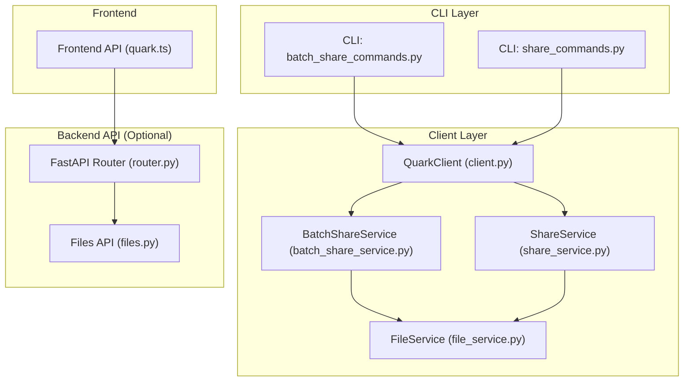
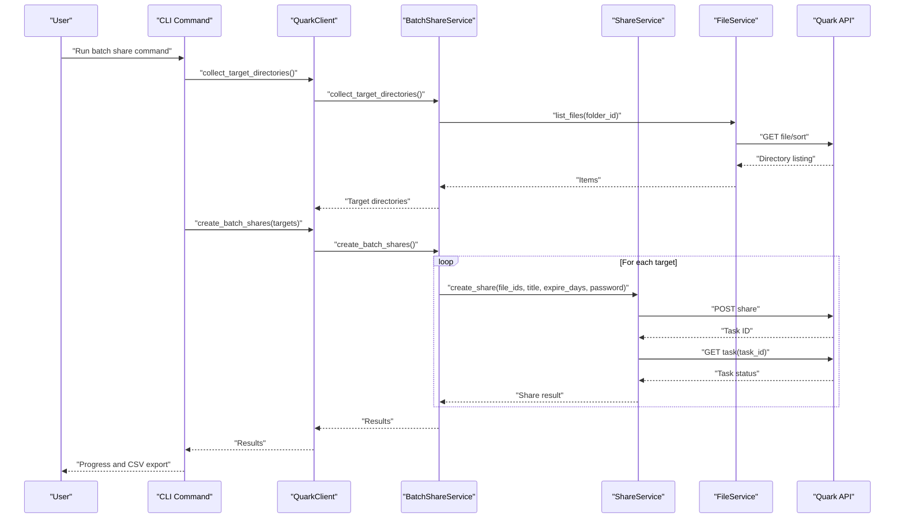
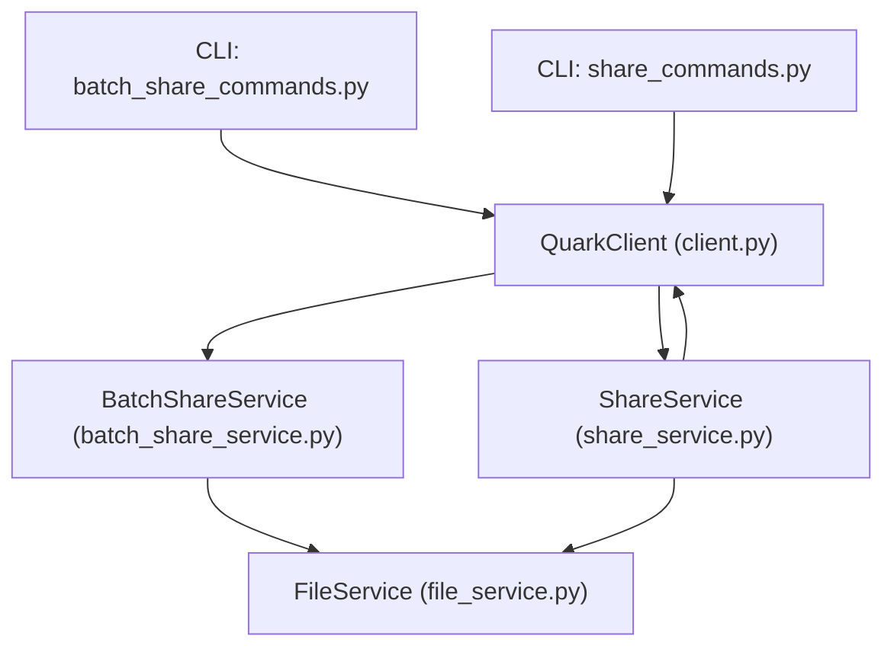
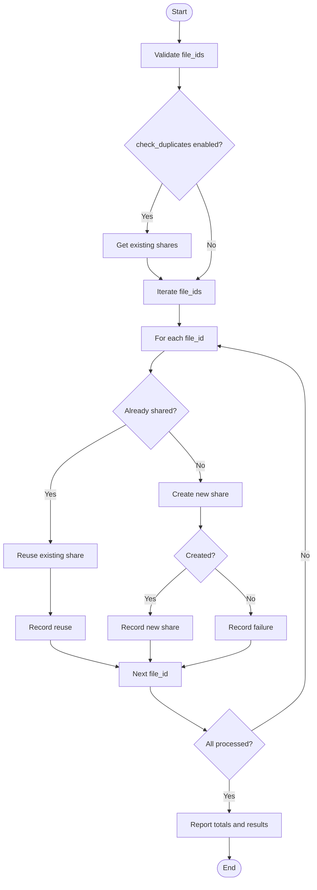

# Share Processing

<cite>
**Referenced Files in This Document**
- [batch_share_service.py](file://quark_client/services/batch_share_service.py)
- [share_service.py](file://quark_client/services/share_service.py)
- [batch_share_commands.py](file://quark_client/cli/commands/batch_share_commands.py)
- [share_commands.py](file://quark_client/cli/commands/share_commands.py)
- [client.py](file://quark_client/client.py)
- [file_service.py](file://quark_client/services/file_service.py)
- [router.py](file://backend/app/api/v1/router.py)
- [files.py](file://backend/app/api/v1/files.py)
- [quark.ts](file://frontend/src/api/quark.ts)
</cite>

## Table of Contents
1. [Introduction](#introduction)
2. [Project Structure](#project-structure)
3. [Core Components](#core-components)
4. [Architecture Overview](#architecture-overview)
5. [Detailed Component Analysis](#detailed-component-analysis)
6. [Dependency Analysis](#dependency-analysis)
7. [Performance Considerations](#performance-considerations)
8. [Troubleshooting Guide](#troubleshooting-guide)
9. [Conclusion](#conclusion)
10. [Appendices](#appendices)

## Introduction
This document explains the share processing capabilities within the QuarkManager share management system. It focuses on:
- Batch share creation and management
- Progress tracking via callback functions
- Concurrent processing strategies
- Smart batch creation with duplicate detection and reuse optimization
- Real-time progress monitoring and error handling for individual share failures
- End-to-end workflow from URL parsing to completion verification
- Practical examples for large batches, custom progress callbacks, mixed success/failure scenarios, and performance optimization
- Integration patterns between the frontend batch processing interface and backend processing services

## Project Structure
The share processing system spans client-side services, CLI commands, and optional backend APIs. The client exposes high-level methods for batch operations and integrates with the underlying services that communicate with the Quark API.

**Diagram sources**
- [batch_share_commands.py:15-275](file://quark_client/cli/commands/batch_share_commands.py#L15-L275)
- [share_commands.py:121-537](file://quark_client/cli/commands/share_commands.py#L121-L537)
- [client.py:18-405](file://quark_client/client.py#L18-L405)
- [batch_share_service.py:16-572](file://quark_client/services/batch_share_service.py#L16-L572)
- [share_service.py:13-742](file://quark_client/services/share_service.py#L13-L742)
- [file_service.py:13-893](file://quark_client/services/file_service.py#L13-L893)
- [router.py:1-24](file://backend/app/api/v1/router.py#L1-L24)
- [files.py:1-150](file://backend/app/api/v1/files.py#L1-L150)
- [quark.ts:1-125](file://frontend/src/api/quark.ts#L1-L125)

**Section sources**
- [batch_share_service.py:16-572](file://quark_client/services/batch_share_service.py#L16-L572)
- [share_service.py:13-742](file://quark_client/services/share_service.py#L13-L742)
- [batch_share_commands.py:15-275](file://quark_client/cli/commands/batch_share_commands.py#L15-L275)
- [share_commands.py:121-537](file://quark_client/cli/commands/share_commands.py#L121-L537)
- [client.py:18-405](file://quark_client/client.py#L18-L405)
- [file_service.py:13-893](file://quark_client/services/file_service.py#L13-L893)
- [router.py:1-24](file://backend/app/api/v1/router.py#L1-L24)
- [files.py:1-150](file://backend/app/api/v1/files.py#L1-L150)
- [quark.ts:1-125](file://frontend/src/api/quark.ts#L1-L125)

## Core Components
- BatchShareService: Collects target directories/files, creates shares in bulk, exports results to CSV, and orchestrates end-to-end batch operations.
- ShareService: Manages share creation, duplicate detection, parsing share URLs, retrieving share tokens, saving shared files, and batch save operations with progress callbacks.
- QuarkClient: Exposes convenience methods and delegates to services; includes a batch save overload that can create subfolders per share or use the optimized batch save.
- CLI Commands: Provide user-facing commands for batch share scanning and creation, and for single-file share creation with smart duplicate reuse.
- Backend API (optional): Provides file management endpoints; not directly used by share processing but part of the broader system.
- Frontend API: Defines typed interfaces for authentication and file operations; not directly used by share processing but part of the broader system.

Key capabilities:
- Batch share creation with progress callbacks
- Duplicate detection and reuse optimization
- Real-time progress reporting
- Error handling per share within batch operations
- Export of results to CSV
- Optional backend integration for file operations

**Section sources**
- [batch_share_service.py:16-572](file://quark_client/services/batch_share_service.py#L16-L572)
- [share_service.py:13-742](file://quark_client/services/share_service.py#L13-L742)
- [client.py:170-236](file://quark_client/client.py#L170-L236)
- [batch_share_commands.py:15-275](file://quark_client/cli/commands/batch_share_commands.py#L15-L275)
- [share_commands.py:121-537](file://quark_client/cli/commands/share_commands.py#L121-L537)
- [router.py:1-24](file://backend/app/api/v1/router.py#L1-L24)
- [files.py:1-150](file://backend/app/api/v1/files.py#L1-L150)
- [quark.ts:1-125](file://frontend/src/api/quark.ts#L1-L125)

## Architecture Overview
The share processing architecture follows a layered design:
- CLI commands accept user input and invoke client methods.
- QuarkClient delegates to BatchShareService or ShareService depending on the operation.
- Services interact with FileService to list directories and with the Quark API via the API client.
- ShareService handles share lifecycle: creation, token retrieval, saving shared files, and batch save with progress callbacks.
- Results are returned to the CLI or caller with progress updates and error handling.

**Diagram sources**
- [batch_share_commands.py:38-221](file://quark_client/cli/commands/batch_share_commands.py#L38-L221)
- [batch_share_service.py:405-478](file://quark_client/services/batch_share_service.py#L405-L478)
- [share_service.py:75-152](file://quark_client/services/share_service.py#L75-L152)
- [file_service.py:25-60](file://quark_client/services/file_service.py#L25-L60)

## Detailed Component Analysis

### BatchShareService
Responsibilities:
- Collect target directories/files via flexible strategies:
  - Legacy four-level scan
  - Depth-based scan from root
  - Path-based scan from a given directory
- Create shares for collected targets
- Export results to CSV
- Orchestrate end-to-end batch share and export

Key methods:
- collect_target_directories: Unified entrypoint selecting collection strategy
- collect_directories_by_depth: Scans from root with configurable depth and share level
- collect_directories_by_path: Resolves path to folder ID and scans recursively
- create_batch_shares: Iterates targets and calls ShareService.create_share per target
- export_to_csv: Writes results to CSV including successes and failures
- batch_share_and_export: Full pipeline orchestration

Concurrency and progress:
- No built-in concurrency; operations are sequential per target.
- Progress is logged and reported via CLI during execution.

Error handling:
- Per-target try/catch captures exceptions and records errors in results.

**Section sources**
- [batch_share_service.py:31-572](file://quark_client/services/batch_share_service.py#L31-L572)

### ShareService
Responsibilities:
- Create share links with task polling
- Parse share URLs and extract share IDs and passwords
- Retrieve share tokens and share details
- Save shared files to target folders
- Batch save shares with progress callbacks
- Smart batch create shares with duplicate detection and reuse optimization

Key methods:
- create_share: Creates a share and polls task until completion
- check_existing_shares: Retrieves existing shares to enable reuse
- parse_share_url: Extracts share ID and optional password
- get_share_token: Obtains access token for share pages
- get_share_info: Fetches share details
- save_shared_files: Saves files to target folder with optional wait for completion
- batch_save_shares: Iterates URLs, parses and saves, invoking progress callbacks
- smart_batch_create_shares: Creates or reuses shares based on duplicates

Progress tracking:
- batch_save_shares: Calls progress_callback(current, total, url, result) for each URL
- smart_batch_create_shares: Calls progress_callback(current, total, file_id, result) for each file ID

Duplicate detection and reuse:
- check_existing_shares: Builds a map of existing shares keyed by file ID
- smart_batch_create_shares: Uses the map to reuse existing shares when available

Error handling:
- create_share: Raises APIError on failure or timeout
- save_shared_files: Raises APIError on failure; waits for task completion with timeout
- batch_save_shares: Catches exceptions and returns error results with error_type
- smart_batch_create_shares: Catches exceptions and records failures

**Section sources**
- [share_service.py:25-742](file://quark_client/services/share_service.py#L25-L742)

### QuarkClient
Responsibilities:
- Exposes convenience methods for batch operations
- Delegates to services for share creation and saving
- Provides batch_save_shares overload:
  - Subfolder mode: creates a subfolder per share
  - Optimized mode: uses ShareService.batch_save_shares

Progress callbacks:
- batch_save_shares: Passes progress_callback through to ShareService.batch_save_shares

Integration:
- Works with ShareService and FileService to implement share workflows

**Section sources**
- [client.py:170-236](file://quark_client/client.py#L170-L236)

### CLI Commands
- batch_share: Orchestrates scanning, preview, confirmation, batch creation, and CSV export
- create_share: Single-file share creation with smart duplicate reuse and progress reporting
- batch_save_shares: Parses URLs from CLI or file, validates and deduplicates, then saves with progress callbacks

Progress monitoring:
- Rich progress bars and tables for user feedback
- Detailed logging of successes and failures

**Section sources**
- [batch_share_commands.py:15-275](file://quark_client/cli/commands/batch_share_commands.py#L15-L275)
- [share_commands.py:121-537](file://quark_client/cli/commands/share_commands.py#L121-L537)

### Backend API and Frontend Integration
- Backend API: Provides file management endpoints (list, create folder, delete, move, search, storage, download)
- Frontend API: Defines typed interfaces for auth and file operations
- These are not directly used by share processing but are part of the broader system architecture

**Section sources**
- [router.py:1-24](file://backend/app/api/v1/router.py#L1-L24)
- [files.py:1-150](file://backend/app/api/v1/files.py#L1-L150)
- [quark.ts:1-125](file://frontend/src/api/quark.ts#L1-L125)

## Dependency Analysis
The following diagram shows the primary dependencies among components involved in share processing:

**Diagram sources**
- [batch_share_commands.py:44-46](file://quark_client/cli/commands/batch_share_commands.py#L44-L46)
- [share_commands.py:195-202](file://quark_client/cli/commands/share_commands.py#L195-L202)
- [client.py:33-38](file://quark_client/client.py#L33-L38)
- [batch_share_service.py:27-29](file://quark_client/services/batch_share_service.py#L27-L29)
- [share_service.py:23-24](file://quark_client/services/share_service.py#L23-L24)
- [file_service.py:23-24](file://quark_client/services/file_service.py#L23-L24)

**Section sources**
- [batch_share_service.py:16-572](file://quark_client/services/batch_share_service.py#L16-L572)
- [share_service.py:13-742](file://quark_client/services/share_service.py#L13-L742)
- [client.py:18-405](file://quark_client/client.py#L18-L405)
- [batch_share_commands.py:15-275](file://quark_client/cli/commands/batch_share_commands.py#L15-L275)
- [share_commands.py:121-537](file://quark_client/cli/commands/share_commands.py#L121-L537)

## Performance Considerations
- Sequential processing: Current implementations iterate targets and URLs sequentially. For large batches, consider:
  - Asynchronous execution with asyncio and aiohttp to parallelize network calls
  - Rate limiting to respect API quotas and avoid throttling
  - Backoff strategies for task polling to reduce load
- Task polling: Share creation and save operations rely on task polling. Optimize by:
  - Reducing polling frequency or batching polling requests
  - Implementing exponential backoff
- Memory usage: Large CSV exports and result lists can be memory-intensive. Consider streaming CSV writes and paginating results.
- Network efficiency: Reuse sessions and keep-alive connections where applicable.

[No sources needed since this section provides general guidance]

## Troubleshooting Guide
Common issues and resolutions:
- Authentication failures:
  - Ensure the client is logged in before invoking share operations
  - Use CLI commands that check login status before proceeding
- API errors during share creation:
  - Inspect raised APIError messages for specific reasons
  - Verify file IDs and permissions
- Task timeouts:
  - Increase timeout values for save operations if needed
  - Monitor task status and handle failures gracefully
- Capacity limits:
  - Save operations may fail due to capacity limits; handle and inform users accordingly
- Progress callbacks:
  - Ensure callbacks are thread-safe if used in asynchronous contexts
- CSV export failures:
  - Validate file paths and permissions; catch and log exceptions

**Section sources**
- [share_service.py:124-152](file://quark_client/services/share_service.py#L124-L152)
- [share_service.py:377-454](file://quark_client/services/share_service.py#L377-L454)
- [batch_share_service.py:480-533](file://quark_client/services/batch_share_service.py#L480-L533)
- [batch_share_commands.py:218-221](file://quark_client/cli/commands/batch_share_commands.py#L218-L221)

## Conclusion
The QuarkManager share processing system provides robust capabilities for batch share creation, progress monitoring, and duplicate reuse. While current implementations are sequential, the architecture supports straightforward enhancements for concurrency and improved performance. The CLI and client abstractions offer clear integration points for building scalable batch processing workflows.

[No sources needed since this section summarizes without analyzing specific files]

## Appendices

### Practical Examples

- Processing large batches of share links:
  - Use batch_save_shares with a progress callback to monitor completion
  - Example invocation pattern is demonstrated in the CLI command for batch saving
  - Reference: [share_commands.py:420-525](file://quark_client/cli/commands/share_commands.py#L420-L525)

- Implementing custom progress callbacks:
  - For batch_save_shares, define a callback receiving (current, total, url, result)
  - For smart_batch_create_shares, define a callback receiving (current, total, file_id, result)
  - Reference: [share_service.py:525-580](file://quark_client/services/share_service.py#L525-L580), [share_service.py:622-741](file://quark_client/services/share_service.py#L622-L741)

- Handling mixed success/failure scenarios:
  - Results include success/failure flags and error details
  - CLI prints summaries and detailed lists of failures
  - Reference: [share_service.py:568-580](file://quark_client/services/share_service.py#L568-L580), [share_commands.py:506-521](file://quark_client/cli/commands/share_commands.py#L506-L521)

- Optimizing batch operations for performance:
  - Consider asynchronous execution and rate limiting
  - Reduce polling frequency and implement backoff
  - Stream CSV exports and paginate results
  - Reference: [share_service.py:124-152](file://quark_client/services/share_service.py#L124-L152), [share_service.py:377-454](file://quark_client/services/share_service.py#L377-L454)

### Integration Patterns

- Frontend to backend:
  - Frontend API defines typed interfaces for auth and file operations
  - Backend API router includes auth and files endpoints
  - Reference: [quark.ts:55-124](file://frontend/src/api/quark.ts#L55-L124), [router.py:1-24](file://backend/app/api/v1/router.py#L1-L24), [files.py:19-150](file://backend/app/api/v1/files.py#L19-L150)

- CLI to client:
  - CLI commands construct QuarkClient instances and call service methods
  - Reference: [batch_share_commands.py:38-46](file://quark_client/cli/commands/batch_share_commands.py#L38-L46), [share_commands.py:134-142](file://quark_client/cli/commands/share_commands.py#L134-L142)

### Smart Batch Creation Workflow

**Diagram sources**
- [share_service.py:622-741](file://quark_client/services/share_service.py#L622-L741)