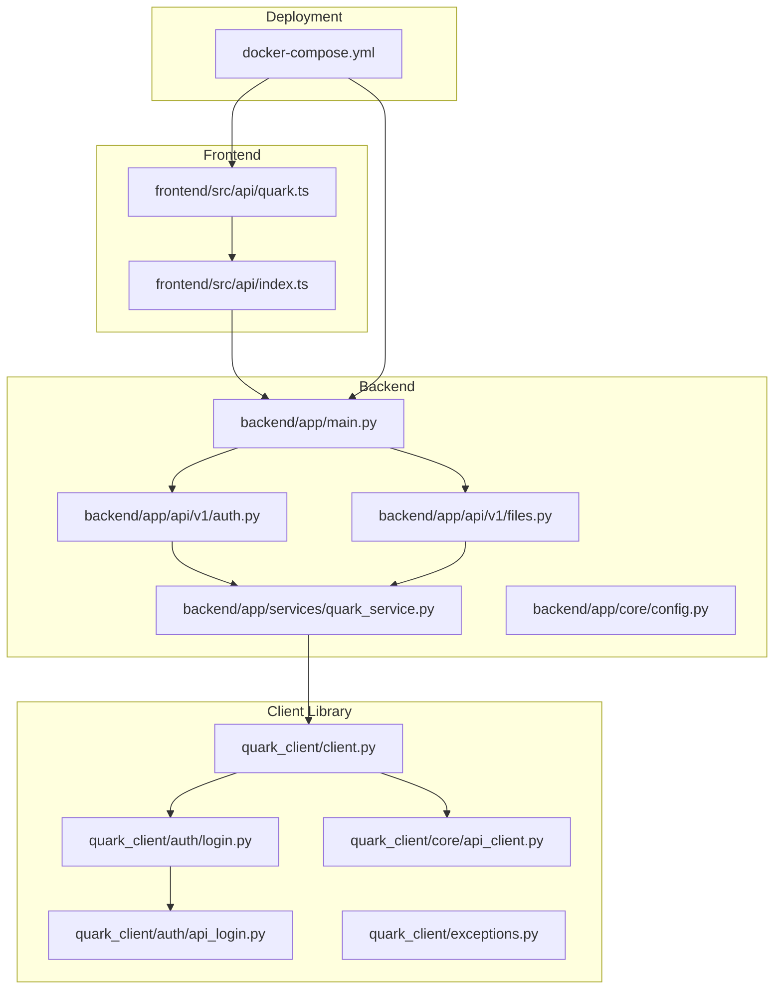
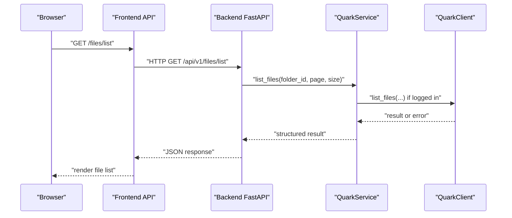
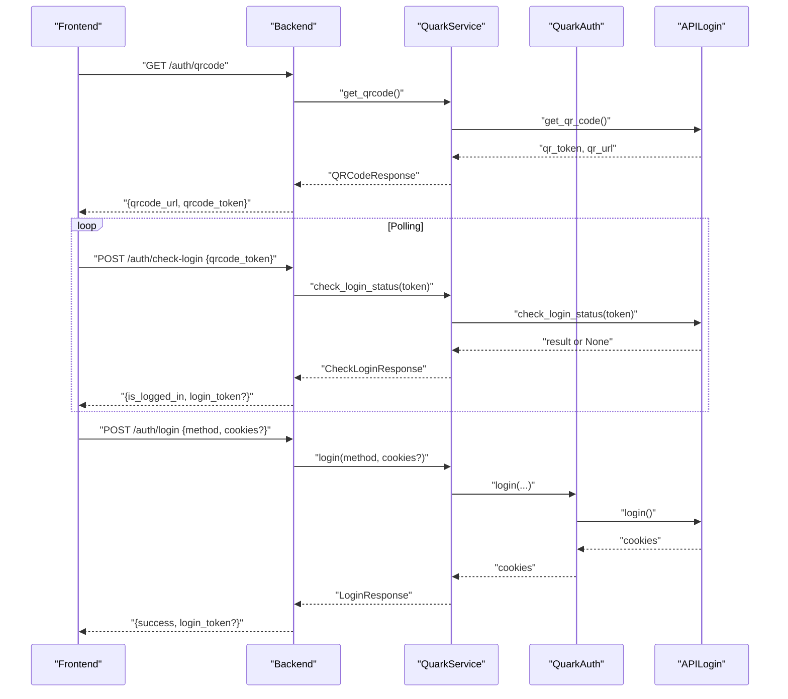
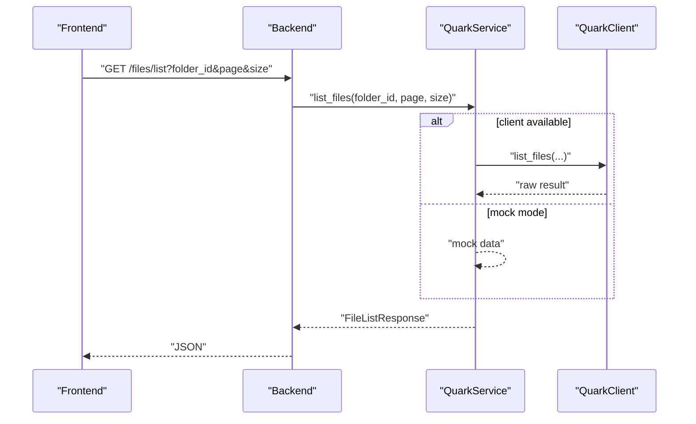
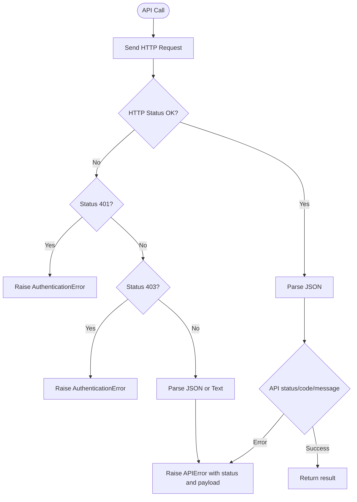
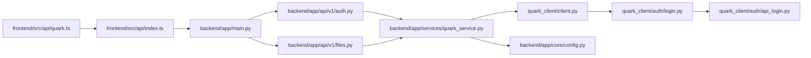

# Troubleshooting and FAQ

<cite>
**Referenced Files in This Document**
- [PROJECT_SUMMARY.md](file://PROJECT_SUMMARY.md)
- [docker-compose.yml](file://docker-compose.yml)
- [backend/app/main.py](file://backend/app/main.py)
- [backend/app/core/config.py](file://backend/app/core/config.py)
- [backend/app/api/v1/auth.py](file://backend/app/api/v1/auth.py)
- [backend/app/api/v1/files.py](file://backend/app/api/v1/files.py)
- [backend/app/services/quark_service.py](file://backend/app/services/quark_service.py)
- [backend/app/schemas/auth.py](file://backend/app/schemas/auth.py)
- [backend/app/schemas/files.py](file://backend/app/schemas/files.py)
- [quark_client/client.py](file://quark_client/client.py)
- [quark_client/auth/api_login.py](file://quark_client/auth/api_login.py)
- [quark_client/auth/login.py](file://quark_client/auth/login.py)
- [quark_client/core/api_client.py](file://quark_client/core/api_client.py)
- [quark_client/exceptions.py](file://quark_client/exceptions.py)
- [quark_client/cli/utils.py](file://quark_client/cli/utils.py)
- [frontend/src/api/quark.ts](file://frontend/src/api/quark.ts)
- [frontend/src/api/index.ts](file://frontend/src/api/index.ts)
- [frontend/package.json](file://frontend/package.json)
</cite>

## Table of Contents
1. [Introduction](#introduction)
2. [Project Structure](#project-structure)
3. [Core Components](#core-components)
4. [Architecture Overview](#architecture-overview)
5. [Detailed Component Analysis](#detailed-component-analysis)
6. [Dependency Analysis](#dependency-analysis)
7. [Performance Considerations](#performance-considerations)
8. [Troubleshooting Guide](#troubleshooting-guide)
9. [Migration and Upgrade Guides](#migration-and-upgrade-guides)
10. [Known Limitations](#known-limitations)
11. [Debugging Tools and Techniques](#debugging-tools-and-techniques)
12. [Community Resources and Support](#community-resources-and-support)
13. [Conclusion](#conclusion)

## Introduction
This document provides a comprehensive troubleshooting guide and FAQ for QuarkManager users and developers. It focuses on diagnosing and resolving common issues related to authentication failures, file operation errors, API connectivity problems, and deployment challenges. It also covers performance optimization, migration guidance, known limitations, debugging techniques, and community resources.

## Project Structure
QuarkManager consists of:
- Backend service built with FastAPI, exposing REST APIs for authentication and file management.
- Frontend built with Vue 3 and TypeScript, consuming the backend APIs.
- A reusable Python client library for interacting with Quark Pan (quark_client) with modular authentication and service layers.
- Docker Compose for containerized deployment.

**Diagram sources**
- [backend/app/main.py:12-40](file://backend/app/main.py#L12-L40)
- [backend/app/api/v1/auth.py:15-107](file://backend/app/api/v1/auth.py#L15-L107)
- [backend/app/api/v1/files.py:16-150](file://backend/app/api/v1/files.py#L16-L150)
- [backend/app/services/quark_service.py:23-377](file://backend/app/services/quark_service.py#L23-L377)
- [quark_client/client.py:18-405](file://quark_client/client.py#L18-L405)
- [quark_client/auth/login.py:15-301](file://quark_client/auth/login.py#L15-L301)
- [quark_client/auth/api_login.py:20-521](file://quark_client/auth/api_login.py#L20-L521)
- [quark_client/core/api_client.py:145-168](file://quark_client/core/api_client.py#L145-L168)
- [frontend/src/api/quark.ts:55-124](file://frontend/src/api/quark.ts#L55-L124)
- [frontend/src/api/index.ts:1-29](file://frontend/src/api/index.ts#L1-L29)
- [docker-compose.yml:1-65](file://docker-compose.yml#L1-L65)

**Section sources**
- [PROJECT_SUMMARY.md:10-34](file://PROJECT_SUMMARY.md#L10-L34)
- [docker-compose.yml:1-65](file://docker-compose.yml#L1-L65)

## Core Components
- Backend entrypoint initializes FastAPI, CORS, and registers API routers.
- Authentication endpoints expose QR code generation, login status polling, explicit login, status retrieval, and logout.
- File management endpoints provide listing, creation, deletion, renaming, moving, searching, storage info, and download URL retrieval.
- QuarkService acts as a façade integrating the quark_client, handling login modes, and returning structured results.
- Frontend API module defines typed interfaces and Axios configuration for backend communication.

Key implementation references:
- Backend main: [backend/app/main.py:12-40](file://backend/app/main.py#L12-L40)
- Auth routes: [backend/app/api/v1/auth.py:15-107](file://backend/app/api/v1/auth.py#L15-L107)
- Files routes: [backend/app/api/v1/files.py:16-150](file://backend/app/api/v1/files.py#L16-L150)
- Service façade: [backend/app/services/quark_service.py:23-377](file://backend/app/services/quark_service.py#L23-L377)
- Frontend API: [frontend/src/api/quark.ts:55-124](file://frontend/src/api/quark.ts#L55-L124), [frontend/src/api/index.ts:1-29](file://frontend/src/api/index.ts#L1-L29)

**Section sources**
- [backend/app/main.py:12-40](file://backend/app/main.py#L12-L40)
- [backend/app/api/v1/auth.py:15-107](file://backend/app/api/v1/auth.py#L15-L107)
- [backend/app/api/v1/files.py:16-150](file://backend/app/api/v1/files.py#L16-L150)
- [backend/app/services/quark_service.py:23-377](file://backend/app/services/quark_service.py#L23-L377)
- [frontend/src/api/quark.ts:55-124](file://frontend/src/api/quark.ts#L55-L124)
- [frontend/src/api/index.ts:1-29](file://frontend/src/api/index.ts#L1-L29)

## Architecture Overview
The system follows a layered architecture:
- Frontend communicates via Axios to backend endpoints.
- Backend routes delegate to QuarkService.
- QuarkService integrates with quark_client for real operations or returns mock data when the client is unavailable.
- Authentication uses either saved cookies or QR-based login flows.

**Diagram sources**
- [frontend/src/api/quark.ts:77-82](file://frontend/src/api/quark.ts#L77-L82)
- [backend/app/api/v1/files.py:19-35](file://backend/app/api/v1/files.py#L19-L35)
- [backend/app/services/quark_service.py:218-242](file://backend/app/services/quark_service.py#L218-L242)
- [quark_client/client.py:76-78](file://quark_client/client.py#L76-L78)

## Detailed Component Analysis

### Authentication Flow (QR and Cookie)

**Diagram sources**
- [backend/app/api/v1/auth.py:18-107](file://backend/app/api/v1/auth.py#L18-L107)
- [backend/app/services/quark_service.py:54-152](file://backend/app/services/quark_service.py#L54-L152)
- [quark_client/auth/api_login.py:94-142](file://quark_client/auth/api_login.py#L94-L142)
- [quark_client/auth/api_login.py:255-307](file://quark_client/auth/api_login.py#L255-L307)
- [quark_client/auth/login.py:107-137](file://quark_client/auth/login.py#L107-L137)

**Section sources**
- [backend/app/api/v1/auth.py:18-107](file://backend/app/api/v1/auth.py#L18-L107)
- [backend/app/services/quark_service.py:54-152](file://backend/app/services/quark_service.py#L54-L152)
- [quark_client/auth/api_login.py:94-142](file://quark_client/auth/api_login.py#L94-L142)
- [quark_client/auth/api_login.py:255-307](file://quark_client/auth/api_login.py#L255-L307)
- [quark_client/auth/login.py:107-137](file://quark_client/auth/login.py#L107-L137)

### File Operations Flow

**Diagram sources**
- [backend/app/api/v1/files.py:19-35](file://backend/app/api/v1/files.py#L19-L35)
- [backend/app/services/quark_service.py:218-242](file://backend/app/services/quark_service.py#L218-L242)
- [quark_client/client.py:76-78](file://quark_client/client.py#L76-L78)

**Section sources**
- [backend/app/api/v1/files.py:19-35](file://backend/app/api/v1/files.py#L19-L35)
- [backend/app/services/quark_service.py:218-242](file://backend/app/services/quark_service.py#L218-L242)
- [quark_client/client.py:76-78](file://quark_client/client.py#L76-L78)

### Error Handling Flow (API Client)

**Diagram sources**
- [quark_client/core/api_client.py:145-168](file://quark_client/core/api_client.py#L145-L168)

**Section sources**
- [quark_client/core/api_client.py:145-168](file://quark_client/core/api_client.py#L145-L168)

## Dependency Analysis
- Backend FastAPI app depends on:
  - Core configuration for CORS and environment.
  - API routers for auth and files.
  - Services for business logic.
- Services depend on quark_client for real operations or simulate behavior when unavailable.
- Frontend depends on Axios and typed interfaces to communicate with backend.

**Diagram sources**
- [frontend/src/api/quark.ts:55-124](file://frontend/src/api/quark.ts#L55-L124)
- [frontend/src/api/index.ts:1-29](file://frontend/src/api/index.ts#L1-L29)
- [backend/app/main.py:12-40](file://backend/app/main.py#L12-L40)
- [backend/app/api/v1/auth.py:15-107](file://backend/app/api/v1/auth.py#L15-L107)
- [backend/app/api/v1/files.py:16-150](file://backend/app/api/v1/files.py#L16-L150)
- [backend/app/services/quark_service.py:23-377](file://backend/app/services/quark_service.py#L23-L377)
- [quark_client/client.py:18-405](file://quark_client/client.py#L18-L405)
- [quark_client/auth/login.py:15-301](file://quark_client/auth/login.py#L15-L301)
- [quark_client/auth/api_login.py:20-521](file://quark_client/auth/api_login.py#L20-L521)
- [backend/app/core/config.py:5-35](file://backend/app/core/config.py#L5-L35)

**Section sources**
- [backend/app/main.py:12-40](file://backend/app/main.py#L12-L40)
- [backend/app/services/quark_service.py:23-377](file://backend/app/services/quark_service.py#L23-L377)
- [quark_client/client.py:18-405](file://quark_client/client.py#L18-L405)

## Performance Considerations
- Pagination and limits:
  - Files endpoints accept page and size parameters with enforced bounds. Tune size per request to balance latency and payload.
  - Reference: [backend/app/api/v1/files.py:21-23](file://backend/app/api/v1/files.py#L21-L23), [backend/app/api/v1/files.py:110-111](file://backend/app/api/v1/files.py#L110-L111)
- Client-side caching:
  - Frontend Axios instance sets a timeout. Consider adding request deduplication and response caching for repeated queries.
  - Reference: [frontend/src/api/index.ts:3-9](file://frontend/src/api/index.ts#L3-L9)
- Logging and monitoring:
  - Enable structured logging in backend and client libraries to track slow operations and bottlenecks.
  - References: [backend/app/services/quark_service.py:35](file://backend/app/services/quark_service.py#L35), [quark_client/auth/api_login.py:33](file://quark_client/auth/api_login.py#L33)
- Network efficiency:
  - Minimize round trips by batching compatible operations where feasible.
- Memory usage:
  - Avoid loading excessively large lists into memory; rely on pagination and streaming where applicable.

[No sources needed since this section provides general guidance]

## Troubleshooting Guide

### Authentication Failures
Common symptoms:
- Login endpoint returns an error.
- QR code polling never resolves to logged-in state.
- Status endpoint reports not logged in despite recent login attempts.

Diagnostic steps:
1. Verify backend health and CORS configuration.
   - Check health endpoint availability and CORS origins.
   - References: [backend/app/main.py:37-40](file://backend/app/main.py#L37-L40), [backend/app/core/config.py:22-25](file://backend/app/core/config.py#L22-L25)
2. Confirm QR code generation and polling.
   - Ensure the QR code endpoint succeeds and returns a token.
   - Poll the check-login endpoint until completion or failure.
   - References: [backend/app/api/v1/auth.py:18-52](file://backend/app/api/v1/auth.py#L18-L52), [quark_client/auth/api_login.py:255-307](file://quark_client/auth/api_login.py#L255-L307)
3. Validate cookie-based login.
   - For simple login mode, ensure cookies are passed correctly.
   - References: [backend/app/api/v1/auth.py:55-75](file://backend/app/api/v1/auth.py#L55-L75), [quark_client/auth/login.py:187-210](file://quark_client/auth/login.py#L187-L210)
4. Inspect client-side credentials persistence.
   - Confirm cookies are saved and not expired.
   - References: [quark_client/auth/login.py:33-106](file://quark_client/auth/login.py#L33-L106), [quark_client/auth/login.py:231-294](file://quark_client/auth/login.py#L231-L294)
5. Review API client error handling.
   - Look for 401/403 responses and raise appropriate exceptions.
   - References: [quark_client/core/api_client.py:145-168](file://quark_client/core/api_client.py#L145-L168)

Resolution strategies:
- Re-generate QR code and restart polling.
- Clear stored cookies and re-authenticate.
- Use explicit cookie login if QR fails.
- Increase timeouts for long-running operations.

**Section sources**
- [backend/app/main.py:37-40](file://backend/app/main.py#L37-L40)
- [backend/app/core/config.py:22-25](file://backend/app/core/config.py#L22-L25)
- [backend/app/api/v1/auth.py:18-75](file://backend/app/api/v1/auth.py#L18-L75)
- [quark_client/auth/api_login.py:255-307](file://quark_client/auth/api_login.py#L255-L307)
- [quark_client/auth/login.py:33-106](file://quark_client/auth/login.py#L33-L106)
- [quark_client/auth/login.py:231-294](file://quark_client/auth/login.py#L231-L294)
- [quark_client/core/api_client.py:145-168](file://quark_client/core/api_client.py#L145-L168)

### File Operation Errors
Common symptoms:
- Listing files returns an error.
- Search or move operations fail.
- Download URL retrieval fails.

Diagnostic steps:
1. Confirm authentication state before file operations.
   - Use status endpoint to verify login.
   - References: [backend/app/api/v1/auth.py:78-95](file://backend/app/api/v1/auth.py#L78-L95), [backend/app/services/quark_service.py:192-200](file://backend/app/services/quark_service.py#L192-L200)
2. Check service façade behavior.
   - If quark_client is unavailable, mock responses are returned; otherwise, real client calls are executed.
   - References: [backend/app/services/quark_service.py:218-242](file://backend/app/services/quark_service.py#L218-L242), [backend/app/services/quark_service.py:353-372](file://backend/app/services/quark_service.py#L353-L372)
3. Validate request parameters.
   - Ensure folder_id, page, size, and filters are within accepted ranges.
   - References: [backend/app/api/v1/files.py:21-23](file://backend/app/api/v1/files.py#L21-L23), [backend/app/api/v1/files.py:110-111](file://backend/app/api/v1/files.py#L110-L111)
4. Inspect client library exceptions.
   - Catch and log APIError, NetworkError, FileNotFoundError, ShareLinkError, DownloadError.
   - References: [quark_client/exceptions.py:8-50](file://quark_client/exceptions.py#L8-L50)

Resolution strategies:
- Retry after successful login.
- Reduce page size or filter results to avoid large payloads.
- Validate file IDs and permissions.

**Section sources**
- [backend/app/api/v1/auth.py:78-95](file://backend/app/api/v1/auth.py#L78-L95)
- [backend/app/services/quark_service.py:192-200](file://backend/app/services/quark_service.py#L192-L200)
- [backend/app/services/quark_service.py:218-242](file://backend/app/services/quark_service.py#L218-L242)
- [backend/app/services/quark_service.py:353-372](file://backend/app/services/quark_service.py#L353-L372)
- [backend/app/api/v1/files.py:21-23](file://backend/app/api/v1/files.py#L21-L23)
- [backend/app/api/v1/files.py:110-111](file://backend/app/api/v1/files.py#L110-L111)
- [quark_client/exceptions.py:8-50](file://quark_client/exceptions.py#L8-L50)

### API Connectivity Issues
Common symptoms:
- Frontend requests fail with network errors.
- Backend returns HTTP 401/403.
- Requests timeout.

Diagnostic steps:
1. Verify backend availability and port exposure.
   - References: [PROJECT_SUMMARY.md:64-71](file://PROJECT_SUMMARY.md#L64-L71), [docker-compose.yml:8-9](file://docker-compose.yml#L8-L9)
2. Check Axios configuration and interceptors.
   - Confirm baseURL and timeout.
   - References: [frontend/src/api/index.ts:3-9](file://frontend/src/api/index.ts#L3-L9)
3. Inspect API client HTTP handling.
   - 401/403 mapped to AuthenticationError; generic errors mapped to APIError.
   - References: [quark_client/core/api_client.py:145-168](file://quark_client/core/api_client.py#L145-L168)
4. Validate environment variables and secrets.
   - References: [backend/app/core/config.py:5-35](file://backend/app/core/config.py#L5-L35)

Resolution strategies:
- Adjust timeout and retry logic in frontend.
- Re-authenticate to refresh tokens.
- Check network policies and proxy configurations.

**Section sources**
- [PROJECT_SUMMARY.md:64-71](file://PROJECT_SUMMARY.md#L64-L71)
- [docker-compose.yml:8-9](file://docker-compose.yml#L8-L9)
- [frontend/src/api/index.ts:3-9](file://frontend/src/api/index.ts#L3-L9)
- [quark_client/core/api_client.py:145-168](file://quark_client/core/api_client.py#L145-L168)
- [backend/app/core/config.py:5-35](file://backend/app/core/config.py#L5-L35)

### Deployment Challenges
Common symptoms:
- Containers fail to start or crash-loop.
- Ports conflict or not exposed.
- CORS errors in browser.

Diagnostic steps:
1. Review Docker Compose services and ports.
   - Backend exposes 8000; frontend 3000; Redis 6379.
   - References: [docker-compose.yml:8-37](file://docker-compose.yml#L8-L37)
2. Check CORS configuration in backend.
   - Ensure frontend origin is included.
   - References: [backend/app/core/config.py:22-25](file://backend/app/core/config.py#L22-L25), [backend/app/main.py:19-25](file://backend/app/main.py#L19-L25)
3. Validate environment variables and mounted volumes.
   - References: [docker-compose.yml:10-15](file://docker-compose.yml#L10-L15)

Resolution strategies:
- Change exposed ports if conflicts exist.
- Use consistent network configuration.
- Persist data volumes for backend and Redis.

**Section sources**
- [docker-compose.yml:8-37](file://docker-compose.yml#L8-L37)
- [backend/app/core/config.py:22-25](file://backend/app/core/config.py#L22-L25)
- [backend/app/main.py:19-25](file://backend/app/main.py#L19-L25)

## Migration and Upgrade Guides

### Version Upgrade Checklist
- Backend:
  - Update dependencies and re-run health checks.
  - Validate API endpoints remain unchanged.
  - References: [PROJECT_SUMMARY.md:100-120](file://PROJECT_SUMMARY.md#L100-L120)
- Frontend:
  - Install dependencies and rebuild.
  - Verify API endpoints and types.
  - References: [frontend/package.json:11-29](file://frontend/package.json#L11-L29), [frontend/src/api/quark.ts:55-124](file://frontend/src/api/quark.ts#L55-L124)
- Client library:
  - Review breaking changes in exceptions and API client behavior.
  - References: [quark_client/exceptions.py:8-50](file://quark_client/exceptions.py#L8-L50), [quark_client/core/api_client.py:145-168](file://quark_client/core/api_client.py#L145-L168)

### Breaking Changes Handling
- Authentication:
  - If login method changes, update client initialization and cookie handling.
  - References: [quark_client/auth/login.py:107-137](file://quark_client/auth/login.py#L107-L137), [quark_client/auth/api_login.py:467-506](file://quark_client/auth/api_login.py#L467-L506)
- File operations:
  - Validate parameter constraints and response shapes.
  - References: [backend/app/api/v1/files.py:19-150](file://backend/app/api/v1/files.py#L19-L150), [backend/app/schemas/files.py:5-54](file://backend/app/schemas/files.py#L5-L54)

### Configuration Updates
- Environment variables:
  - Ensure app_name, debug, database_url, redis_url, secret_key, and CORS origins are set appropriately.
  - References: [backend/app/core/config.py:5-35](file://backend/app/core/config.py#L5-L35)
- Frontend proxy:
  - Confirm Vite proxy targets the backend port.
  - References: [PROJECT_SUMMARY.md:57-60](file://PROJECT_SUMMARY.md#L57-L60)

**Section sources**
- [PROJECT_SUMMARY.md:100-120](file://PROJECT_SUMMARY.md#L100-L120)
- [frontend/package.json:11-29](file://frontend/package.json#L11-L29)
- [frontend/src/api/quark.ts:55-124](file://frontend/src/api/quark.ts#L55-L124)
- [quark_client/exceptions.py:8-50](file://quark_client/exceptions.py#L8-L50)
- [quark_client/core/api_client.py:145-168](file://quark_client/core/api_client.py#L145-L168)
- [quark_client/auth/login.py:107-137](file://quark_client/auth/login.py#L107-L137)
- [quark_client/auth/api_login.py:467-506](file://quark_client/auth/api_login.py#L467-L506)
- [backend/app/api/v1/files.py:19-150](file://backend/app/api/v1/files.py#L19-L150)
- [backend/app/schemas/files.py:5-54](file://backend/app/schemas/files.py#L5-L54)
- [backend/app/core/config.py:5-35](file://backend/app/core/config.py#L5-L35)
- [PROJECT_SUMMARY.md:57-60](file://PROJECT_SUMMARY.md#L57-L60)

## Known Limitations
- Simulated data:
  - When quark_client is unavailable, mock data is returned for file operations.
  - References: [backend/app/services/quark_service.py:220-233](file://backend/app/services/quark_service.py#L220-L233)
- Database integration:
  - Database features are currently disabled; future enhancements planned.
  - References: [PROJECT_SUMMARY.md:86-89](file://PROJECT_SUMMARY.md#L86-L89)
- Frontend readiness:
  - Frontend requires dependency installation and further integration with backend.
  - References: [PROJECT_SUMMARY.md:79-84](file://PROJECT_SUMMARY.md#L79-L84), [PROJECT_SUMMARY.md:126](file://PROJECT_SUMMARY.md#L126)
- API rate limits:
  - Not explicitly configured in the current backend; monitor upstream Quark Pan API rate limits.
  - References: [quark_client/auth/api_login.py:35](file://quark_client/auth/api_login.py#L35)
- Supported file types and filters:
  - Client-side filtering supports extension, min/max size; ensure server-side constraints align.
  - References: [quark_client/services/file_service.py:332-366](file://quark_client/services/file_service.py#L332-L366)
- Concurrent operations:
  - No explicit concurrency controls; coordinate client-side retries and backoff.
  - References: [quark_client/auth/api_login.py:365-406](file://quark_client/auth/api_login.py#L365-L406)

**Section sources**
- [backend/app/services/quark_service.py:220-233](file://backend/app/services/quark_service.py#L220-L233)
- [PROJECT_SUMMARY.md:86-89](file://PROJECT_SUMMARY.md#L86-L89)
- [PROJECT_SUMMARY.md:79-84](file://PROJECT_SUMMARY.md#L79-L84)
- [PROJECT_SUMMARY.md:126](file://PROJECT_SUMMARY.md#L126)
- [quark_client/auth/api_login.py:35](file://quark_client/auth/api_login.py#L35)
- [quark_client/services/file_service.py:332-366](file://quark_client/services/file_service.py#L332-L366)
- [quark_client/auth/api_login.py:365-406](file://quark_client/auth/api_login.py#L365-L406)

## Debugging Tools and Techniques

### Backend Debugging
- Health checks:
  - Use the health endpoint to verify service availability.
  - References: [backend/app/main.py:37-40](file://backend/app/main.py#L37-L40)
- Logging:
  - Configure logging level and handlers in backend and client libraries.
  - References: [backend/app/services/quark_service.py:35](file://backend/app/services/quark_service.py#L35), [quark_client/auth/api_login.py:33](file://quark_client/auth/api_login.py#L33)
- Exceptions:
  - Catch and inspect AuthenticationError, APIError, NetworkError, FileNotFoundError, ShareLinkError, DownloadError.
  - References: [quark_client/exceptions.py:8-50](file://quark_client/exceptions.py#L8-L50)

### Frontend Debugging
- Axios interceptors:
  - Inspect request/response interceptors and error handling.
  - References: [frontend/src/api/index.ts:11-27](file://frontend/src/api/index.ts#L11-L27)
- Typed interfaces:
  - Validate request payloads and response shapes.
  - References: [frontend/src/api/quark.ts:3-53](file://frontend/src/api/quark.ts#L3-L53)

### CLI Utilities
- Error handling helpers:
  - Use CLI utilities to categorize and present actionable messages for common errors.
  - References: [quark_client/cli/utils.py:87-110](file://quark_client/cli/utils.py#L87-L110)

**Section sources**
- [backend/app/main.py:37-40](file://backend/app/main.py#L37-L40)
- [backend/app/services/quark_service.py:35](file://backend/app/services/quark_service.py#L35)
- [quark_client/auth/api_login.py:33](file://quark_client/auth/api_login.py#L33)
- [quark_client/exceptions.py:8-50](file://quark_client/exceptions.py#L8-L50)
- [frontend/src/api/index.ts:11-27](file://frontend/src/api/index.ts#L11-L27)
- [frontend/src/api/quark.ts:3-53](file://frontend/src/api/quark.ts#L3-L53)
- [quark_client/cli/utils.py:87-110](file://quark_client/cli/utils.py#L87-L110)

## Community Resources and Support
- Project summary and quick start references:
  - Backend startup, API testing, and environment notes.
  - References: [PROJECT_SUMMARY.md:100-127](file://PROJECT_SUMMARY.md#L100-L127)
- Docker-based deployment:
  - Use Docker Compose to run backend, frontend, Redis, and Celery worker.
  - References: [docker-compose.yml:1-65](file://docker-compose.yml#L1-L65)
- Frontend dependencies:
  - Vue 3, TypeScript, Element Plus, Vite stack.
  - References: [frontend/package.json:11-29](file://frontend/package.json#L11-L29)

Contribution opportunities:
- Integrate real QuarkClient functionality and fix path imports.
  - References: [PROJECT_SUMMARY.md:75-78](file://PROJECT_SUMMARY.md#L75-L78)
- Enhance frontend integration and state management.
  - References: [PROJECT_SUMMARY.md:80-84](file://PROJECT_SUMMARY.md#L80-L84)
- Implement database integration and task management.
  - References: [PROJECT_SUMMARY.md:86-94](file://PROJECT_SUMMARY.md#L86-L94)

**Section sources**
- [PROJECT_SUMMARY.md:100-127](file://PROJECT_SUMMARY.md#L100-L127)
- [docker-compose.yml:1-65](file://docker-compose.yml#L1-L65)
- [frontend/package.json:11-29](file://frontend/package.json#L11-L29)
- [PROJECT_SUMMARY.md:75-78](file://PROJECT_SUMMARY.md#L75-L78)
- [PROJECT_SUMMARY.md:80-84](file://PROJECT_SUMMARY.md#L80-L84)
- [PROJECT_SUMMARY.md:86-94](file://PROJECT_SUMMARY.md#L86-L94)

## Conclusion
This guide consolidates practical diagnostics and resolutions for QuarkManager’s most common issues, with actionable steps, diagrams, and references to relevant source files. Use the troubleshooting sections to quickly isolate and resolve problems, apply the performance tips to optimize operations, and follow the migration and debugging guidance to maintain stability during upgrades and development.